# 前言

## 笔记/路线设计思路

大家好啊， 我希望设计的这份资料是：**自学入行大模型应用开发**的**最全的记录。**

**为什么是自学路线？**

我是从0开始自学的，自学了200多天，面试了2个月，拿到6个Offer（夸克千问，京东（算法岗），SAP（世界500强外企），网龙，平安证券，华林证券），所有信息小红书可查。

这份资料是按照**我自己学习自学路线**，我希望把我完整的**自学路线**，**心得**，**笔记，面试重点，**&#x90FD;分享给大家，让自学的人少走弯路。

笔记包括：**详细的大模型八股**，**知识点参考资料（视频，文章），讲解视频，项目实战（源代码，设计思路，讲解视频）。**&#x9879;目实战是可以直接写在简历上的。

我的所有笔记的来源，是可以在我的小红书笔记中看到的，都是我根据面试总结出来原创的，而不是随便搬运网上，这个真实可查。

**为什么是最全记录？**

因为我在转行路上，**所以的心得，笔记，复习资料以及所有的面试记录都记录**在这里面。这也是我自己学习的资料，我在面试中**任何**发现面试出现的问题，我都会补充在里面，分析出题频率，复习思路，面试的最真实完整的记录，还包括岗位介绍，面试反思。从0开始到上岸，这份笔记记录了我**所有的学习资料和心得感受.&#x20;**&#x8FD9;份笔记会更新到我真正入职新公司，真正转行完成。到目前为止我也在一直不断地更新这份笔记，一旦发现问题，就会补充迭代，这份文档会越来越完整。但到目前为止，其实内容已经**非常详细和完整**，对于一般的面试都足够了。

**适用人群**

**自学进入这个行业的社招同学和校招同学**。 大家完全可以先按照这个路线和笔记去学习，我后面更多更新的是一些更**高级，更深入**的进阶技巧，支持获得**更高薪资**的岗位的一些技巧和知识。并且整个笔记我都想告诉的你是，哪部分最重要，这部分为什么要学，这部分怎么学，除了知识部分，我更想告诉你的是**学习的思路和方法。**

**为什么要从应用入手？**

对于转行或者想进入这个赛道的同学，大模型应用相比**大模型算法/Infra, 大模型应用是最好入手的。**&#x5927;模型算法/Infra 技术难度相对更大，需要你对**深度学习/机器学习&#x20;**&#x6709;比较深入的了解， 同时也需要比较高的**硬件资源**来支持你完成相关的实验和项目， 同时很多大厂在算法这一块对背景的要求同样更高，倾向于有**论文/有竞赛的背景。**&#x6240;以，如果你是想入行，从算法/Infra上入行，明显难度更高，从进入这个行业的角度来说，从应用侧切入是更更好的选择？我的项目是面向于应用的，应用的笔记非常详细。但是同时，针对于应用的岗位经常也会问算法，我的整套学习路线包含了一些算法：微调/模型推理/压缩（量化） 的知识。对于大模型应用岗位来说，这个足够了。这样的设计让大家既有广度，又能抓住重点。

**路线/笔记的设计思路**

1.**提供实战项目（可写简历）**

我在做一个RAG-Agent项目，这个项目也是我自己用来学习，准备写在简历的。

我用了很多方法帮助大家理解，掌握这个项目：**提供详细的项目设计文档（看目录的项目实战），**&#x63D0;供讲解视频，将代码分成几十个commit的节点，每个节点完成一个小的事情。这些做法，都是能够帮助大家更好掌握项目的。

另外这个项目有通用性，支持扩展，可以针对于每一个人的具体业务去展开，后面也会给大家参考这个项目如何写在简历等等。 注意这个项目在更新中，预计26年3月份交付，不过这个中间有很多阶段性交付的视频，文档，代码也分阶段交付，现在就可以跟着一起学习，这些所有的设计，进度在我的小红书可以查。

2.**完全面向面试知识**。

这份笔记目标非常明确，分为**知识/八股部分**和**面试实战部分**。这两部分都是完全面向面试的，完全是根据面试的重点来总结的。

知识部分都是面试内容总结的，面试出现就总结，不出现就不总结。知识部分适合自己根据学习路线和**知识/八股&#x20;**&#x53BB;总结，理解，学习，背诵八股。

面试实战部分完全真实的面试题目，**而且都比较新，标记有时间。&#x20;**&#x6211;设计这一部分的思路是：

**1.完整。&#x20;**&#x9762;试部分的记录是我根据我自己面试录音一个字一个字扒的，保证完整真实。

**2.包含岗位jd 和反思。** 每个面试我都收录了岗位jd，因为我希望大家可以通过岗位和知识点去推测和关联出一些重点，体会不同的岗位要求可能会面试什么内容。 反思部分是我自己面试完的一些感受，供大家参考。

另外，我在面试的过程中有深刻的体会，面试官除了基础的知识，还会希望你有关注前沿知识的能力，比如看最新的文章。这里并不看重你一定要知道哪个知识点，而是看你有没有关注到最新的东西，有自己的思考。 所以我在复习的时候，也会总结一下最新知识，比如**美团龙猫对Agent的测评方法论文， Deepseek训练方法， Gemini3.&#x20;**&#x8FD9;些知识就是我为了告诉面试官我有在关注前沿知识，有自己的思考。 事实证明我准备的这些东西也很有效。在这份笔记中，我也会收集一些前沿的东西，告诉你我怎么准备的，看了哪些资料，怎么给面试官讲的，供大家参考。

**3.弄清楚什么是重点**

我特别希望告诉大家的是什么是重点？为什么要复习某一部分，因为我觉得自学的同学最困惑的是抓不住重点，资料那么多，要学哪个，为什么要学。

所以我设计资料的时候，**基本在每个笔记开始前会写一些注释**：告诉大家这个知识点出现的频次，是不是必考的。 有的知识点是针对于我个人情况而问的，我也会告诉你，让你酌情参考。 有些地方我也设计的是一些拔高的，不是面试官问的，但是是我自己准备的一些亮点，是靠我自己引导面试官去问，然后借助这个契机给面试官讲解从而加分的。 每一部份资料是针对于什么情况设计的，我都会告诉你，希望你复习的时候做到心中有数，也结合自己的情况针对性复习。

另外在每一个面试实战的视频讲解和笔记中，我也会告诉你什么是重点，面试官为什么问这个问题？我为什么这么回答。 除了笔记部分，我特别教会大家的是对考察重点有一个自己的判断。

**4.每个面试实战内容都会有视频**

每一份面试实战部分，都会对应视频讲解。视频讲解会讲解知识点，更多的想和你分享面试的技巧和感受，以及对重点的把控。 这个讲解视频我会按照顺序发在我的x站视频账号中，预计一周1\~2更，请大家放心，笔记里出现的面试实战内容x站就会有对应视频讲解。

**5.** **想入行大模型算法/Infra的同学适合这份笔记吗？**

其实也可以参考，因为首先我通过这个学习思路拿到了京东 **算法工程&#x20;**&#x7684;岗位，这个关注我的朋友应该可以知道。 我也不止一次说过，在大模型这个行业，算法和工程分的不是那么紧密。 面试应用岗位会问你一些模型算法（**训练，微调，推理加速。压缩的问题**），面算法岗位，也会问你工程Agent/Rag的知识，所以我的理解是你最好都会，特别是你想要高工资或者校招想冲ssp 的同学。

大家知道我对Offer的要求可能比较高，所以我即使是从应用切入，但是我后都补齐了一套 **训练/微调/加速**的知识和项目，这些东西也都会体现在笔记当中。

不过我想说的是，如果你真的是打定主意要去做算法/Infra， 这份笔记的相关算法和Infra内容，我觉得对你来说不够深入，你需要自己再研究的更深入一些。

**6.配有参考资料**

我自学路上都是通过看书和自己**搜一些资料/笔记/文档/视频来**完成学习的。这份笔记中整理了我在学习的时候看到的好的资料和视频给大家，也会告诉大家推荐这个资料的原因。

当然，大家一定是需要根据这个路线，自己再去搜索一些资料和视频补充学习的！

**7.优化和迭代**

我希望能以最好的笔记，最优质的内容呈现给大家。请大家购买后可以进入这个小红书笔记交流群，可以交流一些笔记的内容，重点，疑问，我会尽量回答，也欢迎大家讨论，我会根据大家的讨论，后续也会补充一些内容和心得，我们一起完善这个笔记。我目前是觉得更新到我入职。如果后面我入职了以后，成了AI 工程师，变成专门的AI工程师，我也很期待能再去优化，让这个质量更好，当然这是后话了，就不给大家画饼了！

## 大模型应用/算法学习路线

这份学习路线的设计完全是面向面试，面试需要的我们就深入复习，不需要的就少复习，这也基本上是我过去探索+面试总结出来的自己的学习历程路线，我来给大家讲一下设计思想。

大的模块分成：**Agent , RAG， 提示词工程，模型基础，SFT/RL，前沿知识，模型推理，项目实战。**

**Agent , RAG， 提示词工程：** 是最重点应用岗位的老本行，先学这个，要深入学习，所以学习路线设计的会深入一些。

**模型基础，SFT/RL，推理**： 理论知识需要掌握，建议也跑一下具体的流程，感受整个过程，这块具体实战不用过于深入，所以学习路线基本上以知道理论知识+一个简单实战串起来来设计的。

**前沿知识：**&#x8FD9;是一种素养，因为AI知识迭代快，面试官会考察你有没有了解前沿AI知识，比如就问你看了哪些论文，最新xx技术了解吗？这块我也总结一些论文，框架，可以用来对付这里，告诉面试官你关注到了前沿知识。

**项目实战：**&#x4F60;需要把你所有所学的设计成一个好的项目，从项目**意义，技术点，深度**三个维度去设计，后面我会具体谈一下我的建议。

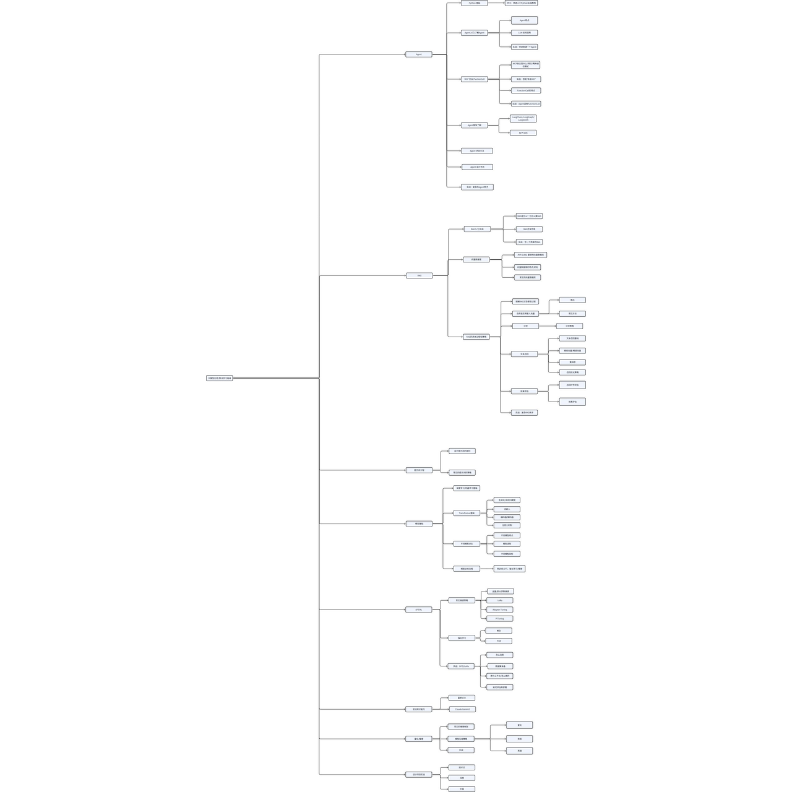

接下来，我结合这个路线来具体给大家解释，并且推荐一些参考资料。

**Agent:&#x20;**

1.**python基础**： 如果完全没有Python 基础，需要先学语言，找一些0基础快速学习Python 视频（x站搜：python入门零基础），不用过于较真语法，会用就好。因为实测 面试上考察python 具体语法的并不多，这里学习是保证你看得懂，改得了代码。

2.**入门了解Agent**：你需要对Agent 特点，怎么做的有一个印象和概念。可以结合一些Agent的入门介绍视频，比如Tina老师的介绍视频：https://www.youtube.com/watch?v=qU3fmidNbJE。

清华大学出版社的《AI Agent开发与应用 - 基于大模型的智能构建》这本书质量不太行，但是好处是特简单，容易读懂上手，也有一些很简单的Agent的例子。也可以通过这个例子去上手。

了解Agent是啥后，可以跑一个100行左右的Agent代码，调用通LLM， 来感受一下这个过程，比如你跑跑这个例子：https://zhuanlan.zhihu.com/p/1922809649868022076

3.MCP/Function call： 了解这俩是啥，常见概念，可以对照我笔记去看。依然推荐Tina老师入门MCP 视频:

https://www.youtube.com/watch?v=kOhLoixrJXo

其实YT有非常多MCP 很好的视频, 讲的很清楚：

爬爬虾老师讲的也很好：

https://www.youtube.com/watch?v=McNRkd5CxFY

里面介绍了一些MCP 的功能，可以上手去试，去感受。

4\. Agent框架。 最常见的试Langchain三件套：LangChain, Langsmith,Langgraph，如果没有倾向，就学这个，用这个面试也会问这个比较多。这个网上视频就很多了。

比如入门视频：

https://www.youtube.com/watch?v=1bUy-1hGZpI

不过这里推荐大家稍微学深入一点，可以在YT里找相关视频。

一些典型低代码平台，扣子，Dify可以去了解下，虽然很出名，但是我面试感受下来没怎么问到，可以知道下概念。

5.Agent评估方法，很重要。我的笔记里有整理，这个常考，所以你要熟练掌握，具体笔记部分和参考资料我都写了，大家直接去看。

6.Agent设计范式。 直接推荐了这本书，把它放在学习路线上，因为他设计很多面试考点，然后有一些知识，比如React，我路线没有，他也都有补充，推荐大家阅读，这个网上可以免费看。

https://github.com/ginobefun/agentic-design-patterns-cn

7\. 复杂的Agent 实战，比如我说的书《AI Agent开发与应用 - 基于大模型的智能构建》，就有很多的实战例子，可能代码会长一些，跟着写，跑一跑。或者自己找个复杂点的Agent项目，去跑一边跑，感受一下。

**RAG:&#x20;**

1.**RAG 入门体会**：还是可以看看视频讲解快速入门。

类似快速入门视频很多，大家去搜搜，用个几个小时去理解一下。

https://www.youtube.com/watch?v=WWdlme1EAGI

我自己也看了清华大学出版社《大模型RAG应用开发 - 构建智能生成系统》 说实话质量依不行，但好处是简单，看下来很快，也有很多例子。不过YT上也有很多人讲解的时候，附带有代码，你可以去找一下，照着它的视频和代码跑一下，入门RAG.

2.**向量数据库**：了解向量数据库是什么，常见的向量数据库，为什么RAG要用向量数据库？

https://www.youtube.com/watch?v=gl1r1XV0SLw

我自己还看了这本书《大模型RAG实战-RAG原理，应用于系统构建》 这本书质量可以，可以买，这本书vx读书好像也能搜到。很多面试内容后面我都从这本书上去查。不过第一次看可能有点难懂。这个书上也有一节讲向量数据库。

**3.RAG的具体过程和策略:**

这个就非常重要了。 整个RAG中涉及的各个步骤，你脑袋里要知道他们是怎么串起来的。 **知识库准备，切块，召回，召回的优化，以及效果评估**。这些每一步都很重要，面试最高频考点。

《大模型RAG实战-RAG原理，应用于系统构建》 这本书都有，我的笔记也照着这个总结的，不过大家可以搜搜RAG深入讲解视频，把这几部分搞清楚，这就是面试最常考的。

最后还是一个实战，找一个RAG的代码，跑一下，感受一下，特别是我说的这些步骤，思考一下这个项目中这些步骤是怎么做的？这个代码很多TY RAG讲解视频就有附带的代码，可以找找。

**提示词工程：**

虽然很重要，所有路线都会讲，但实际上考的不多，甚至很少，不用深入学！看Tina老师这一个视频，把它消化好就行, **思考清楚提示词工程涉及原则和常用策略**，注意应用到你的工程就好

https://www.youtube.com/watch?v=p09yRj47kNM

**SFT/RL**

不用特别深入，面试官好像就是想考的是你做没做过，一般考的都不深。因为面试官是做应用的，它通常对这里也不会有深入了解。但你得有概念，最好有经验。

SFT问最多的是LoRa，

RL准备一个DPO。 然后可以用AI 帮忙写一下代码，用远端平台训练，不会花很多钱。不用担心算力。

这个问题终极的目标能讲清楚：**你是怎么做微调的？**

这里笔记部分我也有专门优化过的答案，给大家参考，总之，这里掌握概念，有相关的经验。展示给面试官你这里也懂，也做过。

**模型基础**

学到这里，是有一些深度学习，Infra的知识了，难度会大一些。

如果完全没有深度学习基础，先学一下入门视频，我有一点点深度学习基础，我还是看了这个深度学习入门视频，我大概用一周看完的。

https://www.bilibili.com/video/BV1eP411w7Re/?spm\_id\_from=333.337.search-card.all.click\&vd\_source=144bec9c3f54e465073138bed788be1b

因为不看一些深度学习的东西，你学Transfomer的结构，后面做LoRa 超参数的设置之类的，没有相关概念很难学。

模型的结构重点：Transformer 结构，词嵌入，怎么生成响应的，注意力机制，这些挺难一下理解的，网上资料很多，建议多看，慢点掌握，而且我们主要是在理论上有概念，又不要真的去和算法同学一样去公式推导之类的。

这个人的视频也很好：https://www.bilibili.com/video/BV1fGeAz6Eie?spm\_id\_from=333.788.player.switch\&vd\_source=144bec9c3f54e465073138bed788be1b\&p=2

https://www.bilibili.com/video/BV1rY81zpEMa/?spm\_id\_from=333.337.search-card.all.click

但这里别想着几个视频就能完全弄懂transformer吧，慢慢来，结合我的笔记，以及笔记总结的面试问题去慢慢消化。

**模型对比:&#x20;**&#x6709;的厂在做项目，用外面的模型，所以会让你对比模型的特点。从功能和架构上比较，这个我笔记总结也有。

**模型训练流程：**

https://baijiahao.baidu.com/s?id=1826882165583568205\&wfr=spider\&for=

我是希望目前为止，你能把模型训练的概念串起来。模型怎么训练出来的，SFT,LORA， 推理，预训练都在哪个阶段，看这个贴子，把知识串起来。

**前沿知识能力：**

面试官还喜欢关注你有没有阅读论文，学习前沿知识的能力。所以这里设计了这个模型。

我自己在这一块准备了几个论文，比如**美团龙猫论文，Deepseek 训练方法, 多Agent架构八股部分的论文**，这些都是可以用来回答这一个问题，美团龙猫的论文是今天9月份写的，多Agent架构这个论文（具体看八股多Agent部分）是25年12月份发布的，都是比较新的，可以直接用来给面试官展示你确实看了一些新的论文。

**推理：**&#x8FD9;块也是一个广度的扩展，不用太深。我们还是做应用的，但是不能一问三不知。

模型推理框架，常见压缩策略：**蒸馏，剪枝，量化**，你需要知道概念。

我这里的思路是，挑了一个技巧（量化）加入到了我的项目中，如果面试官问题来，我经常通过这个项目讲我是怎么做的量化。 至于剪纸，蒸馏，我的理解基本停留在我知道他大概概念是啥，能讲出来。 目前面试来说是够用的。总结所以这块我的思路是，**了解基本概念，抓住一个压缩方法放到项目**，面试官要是问你做过推理压缩的事情没有，你就抓住你专门准备的这个压缩方法，结合你的项目去讲。

**项目：**

大家对这里都比较迷茫，我这里展开讲一下如何设计自己的LLM项目。

通常来说，**如果是社招**，我们通常希望这个项目看上去和工作相关，不要看上去像是一个完全自己做的项目，写在简历上很奇怪。这时我非常建议的是，你在设计项目的时候，就从工作的产品，你的项目组的工作相关内容出发。 比如你们项目做了一个日历功能，所以你就做一个**智能日历助手**。 或者最简单的，做一个内部咨询Agent，**结合自己的产品+RAG技术完成**。有条件的也可以尽可能借助公司资源，比如和老板商量，自己做一个AI项目，帮助内部提效。 这样最大的好处是，你看上去你的项目不是你自己做的，HR和面试官以为你的工作有一部分是AI的，**不像是转行过去的。&#x20;**&#x968F;着你自己的面试技巧深入，你在沟通的时候，和面试官聊技术也可以逐步自信，甚至是包装一下，面试的时候，让他也觉得你这是个真实项目，后面甚至还可以包装一下落地情况之类的。至于如何包装，可以看一下真题部分，面试官是怎么问的项目。特别是在**小红书/字节/阿里&#x20;**&#x8FD9;三家公司的面试问题（正在总结中，别急，都会添加在笔记中），他们问的很细，问了一些落地相关的问题，如果你能回答上来，会显得比较像落地项目。**校招一样的，可以往实验室上的项目靠一靠，**&#x6216;者校招你说自己做个和实验室无关的也没太大问题，你就说是参加哪个比赛，做的项目xx，毕竟校招生大部分本身没有工作经验。

你需要自己设计一个你的项目，有三个经验：

1.**技术点：** 我上面展示了所有面试经常考的点，你的项目最后都做了。RAG/AGENT/LORA/推理加速，是完全可以融入到一个项目中的，包括评测内容也是面试官爱问的，你设计的时候你就应该投其所好，需要让你的项目都触及这些内容。

2.**深度：**&#x5C3D;量深入。比如RAG，你的文档很少 vs 文档是海量文档，有切块策略，召回优化。那么后者就比较深入，你要重视这个点，**尽量深入。&#x20;**&#x5F53;然我知道我们自己做项目，难免会简单，但是你得自己投其所好，创造复杂的场景，把项目做深入。这里我的项目中，我设计项目的时候，我设计了RAG，但是我使用的是sqlite数据库，当时我的理由非常简单，因为我的项目简单嘛，所以用个轻量级数据库。但我后面反思这里就不该这么做，建议用上真正RAG 项目会使用的数据库，比如Weative。 你要知道你设计项目的强烈动机，是为了面试。面试很常考RAG的数据库，优化策略，分块，你就应该应用这些策略，不能像我一样，使用个很简单的文档和数据库，这样面试官会让面试官觉得你项目浅。

3.**和工作/实验室结合：** 把项目和你自己的工作产品/ 实验室项目结合，这样写上看着不是纯个人项目，面试官印象会更好。

最后，大家在做项目的时候，希望大概能够有一些知识上的积累和储备，最重要的是知道面试官侧重考察什么，一定要设计到项目之中去。最后大家做项目的时候其实大部分（最少我是这样）使用的是AI 编程工具，基本上你理论东西掌握了，你让AI帮你去做，你告诉它需要怎么设计，比如**向量数据库用啥，分块怎么分，Agent/RAG 评测指标怎么评**，你给他提需求，一定要用上这些知识点，让他来写代码。这个过程你和它一起把整个系统跑通，知道大体的流程，把功能做出来，重点的地方/代码仔细看看，弄清楚AI是怎么实现的，这样你面试就能讲清楚。 项目这里就差不多了。我就这么做的，目前转行完全够了。

至于项目是什么，我觉得就真的要结合自己的情况/产品去设计了。 需要找到一些你们项目的痛点，或者可以智能化的地方。比如内部文档很多，每次都需要专门去回答，通用的Agent回答不好，这里你可以结合你们公司内部文档做一个RAG Agent，帮助精准快速回复。 或者内部提效的工具，比如智能分析你们企业的简历库，快速筛选简历，根据简历内容回答问题的Agent，帮助内部加速这个简历筛选的流程等等。 这个需要大家自己想一下怎么做，但是我上面说的几个原则，希望大家可以多思考一下，让你的项目在面试中发挥最大的作用。

## 问题说明

此部分总结群友问题。

**1.为什么看上去强化学习这一块内容不多？**

因为所有知识我都是根据面试总结的。面试考的越多，我就总结的越多，越深入。面试考的不多，就几乎不会出现。笔记是面向应用路线的，强化学习部分我自己的复习思路就是带一下，我只是了解了一个皮毛，然后做了一遍流程，加入在了我的项目介绍中：我做了推理优化：量化-微调-DPO 之类的，做到这里就够了，面试官问我，我就讲这一套，并且面试官从没有深入问DPO的细节，所以对于强化学习没有深入笔记。

我希望笔记是面向面试的，是**精而专而不是大而全**。 如果是面向与应用岗位，去学习很深入的强化学习知识，甚至是数理公式，在目前看来（至少在面试的角度上来说），是性价比不高的。从笔记你也可以看出来，笔记篇幅多的一定是常考的，没有笔记或者占比较少的，一定是不常考的。

**2.为什么没有多模态？**

同上。 多模态属于应用部分，但是我面试下来，他不是硬性要求的。除非很少数的岗，本身做多模态，他可能会有点考察。以我的经验，没有多模态经验，不太影响面试，我个人对多模态这块是完全没经验的，如果面试官真要问我，我准备直接说不会。但所以这里确实完全没涉及。所以我不会多模态完全不阻碍拿offer，所以我这里没任何笔记，自己也没学。 当然如果你自己想做多模态方向，那么你需要自己补充下相关知识。

## 更新记录

2025/12/07&#x20;

1\. 学习路线中增加自学转行如何确定项目，设计项目的原则，怎么完成自己的项目？

2\. 补充12月小红书大模型岗位一面内容，更新完了问题部分，反思和知识部分待整理。

2025/12/08

更新完善小红书面试对应问题答案。 答案部分快总结完了，还差一点，明天可以完成小红书的答案部分。

2025/12/09

完成小红书一面笔记的答案部分，开始更新字节面试笔记（字节面了两个部门，两个都会整理）

2025/12/10

整理完字节大模型工程岗， 一面面试问题

2025/12/11

基本完成字节大模型工程岗， 一面面试问题对应答案。根据面试情况完善了MCP笔记八股部分，八股部分新增A2A协议的概念（因为出现过两次了，说明A2A协议也是要准备的）

2025/12/13

更新Multi Agent对应的知识。 在之前的参考资料中，我给大家推荐的《Agentic Desgin Pattern》中的Multi-Agent这一章，但是这一章的讲解不够深入，特别是对于架构设计这一块也比较浅，这是在针对小红书的面试的时候，这些知识显得不够。

我将Multi-Agent相关的知识更新，替换成《Towards a Science of Scaling Agent Systems》这篇论文相关的内容，补充了相关知识，参考材料和思路，让相关内容更加权威，准确，深入。（没总结完，总结更新ing)

2025/12/14

完善了多Agent 八股部分，采用更权威论文作为知识总结来源，也完善了小红书一面对于多Agent架构问题讨论的回答。

添加面试讲解视频：

小红书一面，滴滴一面，安克科技一面，灵动时刻一面，京东一面，京东二面

2025/12/17

完善了下Langgraph的八股，加了一个很全面的Langgraph知识的参考文档，是个很全的Langgraph知识大全，遇到不懂的可以直接查这个文章。具体文章链接看Langgraph八股部分。

添加了多Agent的通信方法和状态管理，也是面试考点。

总结了阿里国际站的问题和反思，答案和解析部分未完成。

优化常见Agent框架知识：按照目前最火的5个架构整理，忽略其它top5之外的框架

2025/12/18

更新完阿里国际站一面答案部分，根据面试情况，更新了Langchain版本相关的八股内容和参考资料。

2025/12/20\~21

重构Agent性能评估八股部分，包括**参考资料**，**常见的问题**，以及**答题思路和准备方法**。

完成**京东三面面**试题答案和面试思路，上传 对应**讲解视频。**

今天我通过京东这个面试复盘，彻底重新梳理了Agent 性能评估这个超重要考点，在京东三面讲解视频中也着重讲这个点如何复习，准备策略，相信通过这一面的知识你能把这个点弄透。

上传了阿里国际站 电话面讲解视频

2025/12/23

整理字节一面面试问题

2025/12/24\~25

整理字节一面面试的答案，并根据面试内容，调整八股内容：

1. 微调方法论部分，加入参考文档，详见八股（你是怎么做微调的）

2. Multi-Agent八股部分，增加Single/Multi agent的对比

3. 添加八股 你在做项目中遇到最困难的问题以及如何解决的 相关问题答案和解决思路。

2025/12/28

总结完了夸克千问一面，二面面试问题

2025/12/29

1. 上传字节（豆包）一面讲解视频。

2. 完成夸克千问一面答案，千问二面反思部分。

3. 完善了问题-你在项目中遇到的最难的问题，如何解决的？

2026/1/4

1.完善多Agent八股部分，设置第四小节，多Agent的架构设计题目，结合笔记给出的参考论文例子和笔记的面试内容，来汇总架构设计题目和答案。

2.总结完成夸克千问二面问题和答案。

2026/1/5

录制并上传夸克千问二面讲解视频。

2026/1/5 \~2026/1/8

主要在做项目的调研，我开始丰富完善项目部分，今天写完了项目实战的介绍部分。

接下来会继续调研，写这个项目的技术选型和具体方案。

因为我后面会花比较大的经历在项目上，可能更新面试实战部分会慢一些，我这周会把所有面试的公司先都加载目录上，如果有个哪个朋友特别需要某一个公司的题目，可以私信我，我先更新。&#x20;

2026/1/10

1.更新完阿里HR面。

2.把所有未整理的面经素材留了个白，后面陆续整理。

3.更新项目实战，技术方案选型。

2026/1/12

更新项目文档：项目概述和核心特点部分

RAG分块内容加入一个讲解参考视频

2026/1/13

更新项目文档：项目概述和核心特点部分 3.1 RAG核心流水线设计。

2026/1/15

更新项目文档：MCP服务设计

2026/1/16

更新项目文档：可插拔架构设计 pro

2026/1/17

新增Skills 的八股部分：概念，和mcp对比，和prompts对比，运行模式，设计理念。

提供参考视频和参考项目

2026/1/21

新增项目Github地址。接下来几天我重心会放在更新面经部分，更新几期面经哈。

2026/1/22

更新完啦Deepwisdom的问题部分

2026/1/23

新增粉丝提问和答疑章节，我把粉丝朋友问我的一些问题和答案汇总在这里，这样大家可以参考，共同进步哈！其中问题部分我已经做了优化，在我的认知里不会有隐私问题，但是如果粉丝朋友觉得这个问题不便于公开，联系我我删除哈。 大家一起进步！

2026/1/24

更新完deepwidsom的问题解析。

优化了八股答案： 你是怎么做Agent评估的，之前有点太AI化了，优化成一个可以直接回答，更口语的答案。

根据面试问题新增八股模型部分：如何判断模型能不能跑，跑的有多快

2026/1/25

更新平安证券一面面经和答案。

八股增加了一个面试技巧环节，更新自我介绍和反问的一些策略。

八股增加模型部分Qwen2.5->3的升级

上传录制视频：项目实战部分skills的使用视频，Deepwisdom 一面讲解视频， 平安证券1面讲解视频

2026/1/26\~2026/1/27

项目进度完成17%, 提交相关代码

2026/2/1

Rag-Agent项目进度45%，目前在写C阶段，C阶段是数据存储阶段，等写完C阶段，就可以有一些可以展示的东西了，他是独立的，对数据处理然后存到数据库中的一个离线模块，也是整个系统比较重要的模块。

更新了平安证券二面相关问题和回答。

Skills 推荐项目部分加了一些链接介绍。

2026/2/7\~2/8

1. Rag-Agent项目进度已经完成84%，目前也录制一些项目相关的视频，放在了小红书上，我会都归档在笔记链接中。

2. 更新一期面经：盛大AI一面

3. 更新八股： 我在笔记中 你的项目遇到的最困难的问题是什么，如何解决的这个问题，又加一个例子。这个例子是结合我们RAG项目写MCP Server总结的。

4. 更新参考视频。在MCP章节，我更新了一个MCP 参考视频，从入门到进阶的视频。这些都是我当时看的。MCP从0基础到精通，把这几个视频看了就差不多了。（另外粉丝朋友说有的人不能科学上网，所以我视频也尽量找的都是中文的视频网站了，虽然这几个推荐视频我当时在油管看的，但还好他们是中国博主，国内也能找到地址，不过还是建议程序员要能科学上网呀，有的资料可能真的必须要要到外网去看了）

# 项目实战

## 1. 项目介绍

朋友们，最近一直在调研这个项目，今天正式给大家介绍一下：

**1.背景：**

其实虽然自学转行AI应用开发，也得到了一些Offer，但之前项目都是以Agent为主，Rag理论知识丰富，但实践甚少，比如面试官经常问这种分块，召回等技巧，RAG评估，这些基本都复习了，但是其实还是停留在理论部分。我的Agent项目其实并没有特别深入做这些步骤。所以我也想着借着这个机会，自己再做一个项目，把这些面试最常考RAG细节真正做一遍，同时我也真正想要把这个项目确实能够有一些实际的产出，解决工作具体问题，能写在简历上。当我在技术选型，确定项目时，我发现我的选型项目完全可以给大家参考。因为有太多小伙伴一直问我项目如何做，怎么找，之前我更多的给的是思路，所以我希望刚好通过这个机会，帮助大家一起做一个都能写在简历的项目。 我做这件事核心动机目标如下：

1\. 将**所有RAG面试问题揉入项目**，深入做一遍，从实践中掌握RAG各流程，掌握RAG的整个步骤。

2\. 项目要可以和工作结合，**能够确实解决某个业务需求，这样可以写在简历上。**

&#x20;     3\. 从文档，代码，视频讲解，思路设计等所有心得汇总，**帮助大家一起实现这两个目标。**

4\. 代码分阶段交付，每个commit做一小件事，你可以随着一个commit感受整个项目完成的过程。

&#x20;     5\. 配有讲解视频。关键地方，项目设计思路，代码配置等配有讲解视频。

&#x20;     6\. 可以结合Client端，完成Agent的调用，让它既是Agent，也是RAG项目。

**2.项目介绍：**

**阶段一：**

以RAG为核心的基础架构， 将RAG封装成一个MCP - Server。这个Server上保存了本地处理过的RAG文本，任何MCP - Client端连接了这个Server后，可以通过自己手写的逻辑（分块，检索，召回），返回相关文本。至此是实现了一个通用的RAG框架，完成了RAG所有的关键步骤。

这里的代码我会完整公布，如果你不想继续做，你只用做数据准备，使用成熟的MCP Client（Cursor, Github Copilot）去连接你的server，就可以实现一个针对于特定文档/业务的Agent。

通过阶段一，你会基本完成了所有面试常考的RAG问题，你能弄透，对RAG也算入门了。并且你要真的不想扩展，你确实可以直接拿来写在简历上。

**阶段二：**

实现自己的业务逻辑和扩展。

如果你想做的更好，那么你就结合你的业务场景去优化，把效果调到最好，去自己写一个Agent连接这个RAG Server处理相关逻辑。去调整分块策略，召回策略，模型，数据库等，适配你自己的业务，结合阶段一完成的RAG系统的评测去提高整体性能，真正是一个可以根据你的业务场景，找到最合适的文本块，产生最准确的回答的项目。这个过程中你会有更深入体会，而且可以用一些Agent开发的技巧，来把Agent的内容也集成到一个项目中。

这块我可能会结合我的工作需求去扩展，这块代码不一定能展示，不过我会展示这个思路，怎么扩展，怎么和自己业务结合，这个可以大家自己去琢磨，讨论。

&#x20;

**3.特点**

&#x20;  1.**覆盖核心RAG模块**： 专业向量数据库，稀疏+稠密向量检索， 重排， 分块， MCP，RAG 性能评估。根据我的面试经验来说，所有的**RAG的常考问题**，完全都涉及。

&#x20;  2.**扩展性强**：是一个RAG的基础架构，以MCP -Server形式实现，这意味着你可以方便地集成到任何支持MCP Client的地方。这个场景真的几乎可以适用于任何业务。你就想目前有没有某些AI产品，没法参考你们内部文档。知识来给出很好的回答，如果有，那你就可以用这一套项目去优化这个场景。适配自己的项目。

或者你可以用这个项目去完成一个面试分析Agent。 将音频mp3丢入，然后总结所有面试的问题，给出你答的好不好的意见，反馈，提供文档参考。这个项目也可以使用这一套框架，而且其实这个也很实用，也确实是我需要的。

总之这个通用性太强了，非常容易在上面针对某一任务继续扩展然后变成你独一无二的项目，后面我也会给大家一些参考的思路，扩展的思路，供大家自己去深入开发。

&#x20;**4.涉及的一些知识**

这块在后面的技术细节我会深入讲，具体一些技术选型如下：

**涉及专业向量数据库**：Chroma。

**多模态能力**：支持图片的解析和召回

**召回**：稠密+稀疏模型检索（BM25) 结合 精筛

**分块：**&#x4F1A;使用 llamaindex 的分块策略对不同格式文件处理。

**MCP：**&#x5305;装成MCP Server

**评估：**&#x91C7;用RAGAS

**可视化：**&#x4F1A;将上述的RAG步骤的结果，评估分数可视化，方便后面大家针对业务场景改进时去调试，也方便大家理解整个RAG系统。

**多模型适配：**&#x8003;虑到大家可能使用不同的远端模型，LLM call这里会做的比较通用，方便大家只给一个endpoint和key就能快速运行

**5.与大家合作的形式**

首先不会再收费哈，购买过笔记的同学可以看到所有项目相关内容。

1.完成**阶段一**以后会开源给大家代码。代码分阶端commit，可供大家更好地感受每个阶段做了什么。

2.提供**完整文档。包括dev spec**（描述了如何选型），**项目设计思路，项目后续扩展方案**，包括这个项目怎么写简历，这么项目面试官问了啥，都会记录。大家在群里也可以讨论项目相关问题，我也会尽量回答。

3.**视频讲解**。等我完成后也会配置一些视频，讲解关键内容比如如何配置环境，启动，关键知识点，代码片段。

4.时间节点的话我预计3月前完成阶段一相关代码，文档，视频讲解。 这个节点找实习的校招朋友可以直接拿来准备准备，找暑期实习，我会尽量提前。我也会小红书，笔记中更新一些进展，大家可以提前了解。比如具体的技术准备方案，这周就准备开始写，大家在这个笔记中都可以参考。

## 2. Dev Spec

（是后面我们整个项目的核心技术方案。如果你用这个项目作为面试项目，这个文档里的很多思路/知识其实就是你回答这个项目问题的基础。我们的代码也会严格按照这个逻辑来写。所以朋友们，如果你想真正掌握这个项目，把这个项目变成自己的，这个文档和代码同样重要，在我写这个spec的过程中，其实你就可以去根据这个Spec去思考，去学习相关知识，去想架构的设计，当然你可以在群里讨论，有意见和建议都以可以提出，这样其实你也一起参与了整个架构的设计，对大家成长来说也是很有帮助的）

### 2.1 项目概述

本项目基于多阶段检索增强生成（RAG, Retrieval-Augmented Generation）与模型组合平台（MCP, Model Context Protocol）设计，目标是搭建一个可扩展、高可观测、易迭代的智能问答与知识检索框架。

**设计理念&#x20;**

> **核心定位：自学与教学同步 (Learning by Teaching)**
>
> 本项目是我个人技术学习、丰富简历、备战面试的实战历程，同时也是一份同步教学的开源资源。我相信"**教是最好的学**"——在整理代码、撰写文档、录制视频的过程中，我自己对 RAG 的理解也在不断深化。希望这份"边学边教"的成果能够帮助到更多同样在求职路上的朋友。
>
>

本项目不仅是一个功能完备的智能问答框架，更是一个专为 **RAG 技术学习与面试求职** 设计的实战平台：

1️&#x20E3;**&#x20;实战驱动学习&#x20;**

项目架构本身就是 RAG 面试题的"**活体答案**"。我们将经典面试考点直接融入代码设计，通过动手实践来巩固理论知识：

* 分层检索&#x20;

* Hybrid Search (BM25 + Dense Embedding)

* Rerank 重排序机制

* Embedding 策略与优化

* RAG 性能评测 (Ragas/DeepEval)

2️⃣ **开箱即用与深度扩展并重** (Plug-and-Play & Extensible)

* **开箱即用**：提供 MCP 标准接口，可直接对接 Copilot/Claude，拿到项目即可运行体验。

* **深度扩展**：保留完全模块化的内部结构，方便开发者替换组件、魔改算法，作为具备深度的个人简历项目。

* **扩展指引**：文档中会明确指出各模块的扩展方向与建议，帮助你在掌握基础后继续深入迭代。

3️⃣ 配套教学资源 (Comprehensive Learning Materials)

我会提供**三位一体**的配套学习资源，帮助你快速吃透项目：

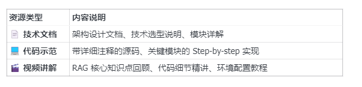

4️⃣ 学习路线与面试指南&#x20;

针对每个模块，我会整理：

* **📚 知识点清单**：这块涉及哪些理论知识需要提前学习（如 BM25 原理、FAISS 索引类型、Cross-Encoder vs Bi-Encoder）

* **❓ 高频面试题**：结合项目代码讲解常见面试问题及参考答案

* **📝 简历撰写建议**：如何将本项目的亮点写进简历，突出技术深度

5️⃣ 社区交流与持续迭代&#x20;

* **经验分享**：我自己的面试经历、大家使用本项目面试的反馈，都会汇总沉淀

* **问题讨论**：一起探讨"如何将本项目写进简历"、"针对本项目的面试题怎么答"

* **持续更新**：从代码 → 八股知识 → 面试技巧，形成完整的求职知识库，帮助大家更好地拿到 Offer 🎯

***

### 2.2 核心特点

#### 2.2.1 RAG 策略与设计亮点

本项目在 RAG 链路的关键环节采用了经典的工程化优化策略，平衡了检索的查准率与查全率，具体思想如下：

* **分块策略&#x20;**：采用智能分块与上下文增强，为高质量检索打下基础。

  * **智能分块**：摒弃机械的定长切分，采用语义感知的切分策略以保留完整语义；

  * **上下文增强**：为 Chunk 注入文档元数据（标题、页码）和图片描述（Image Caption），确保检索时不仅匹配文本，还能感知上下文。

* **粗排召回&#x20;**：采用 **混合检索** 策略作为第一阶段召回，快速筛选候选集。

  * 结合 **稀疏检索&#x20;**&#x5229;用关键词精确匹配，解决专有名词查找问题；

  * 结合 **稠密检索** 利用语义向量，解决同义词与模糊表达问题；

  * 两者互补，通过 RRF (Reciprocal Rank Fusion) 算法融合，确保查全率与查准率的平衡。

* **精排重排**：在粗排召回的基础上进行深度语义排序。

  * 采用 Cross-Encoder（专用重排模型）或 LLM Rerank（可选后端）对候选集进行逐一打分，识别细微的语义差异。

  * 通过 **"粗排(低成本泛召回) -> 精排(高成本精过滤)"** 的两段式架构，在不牺牲整体响应速度的前提下大幅提升 Top-Results 的精准度。

  *

#### 2.2.2 全链路可插拔架构&#x20;

鉴于 AI 技术的快速演进，本项目在架构设计上追求**极致的灵活性**，拒绝与特定模型或供应商强绑定。**整个系统**（不仅是 RAG 链路）的每一个核心环节均定义了抽象接口，支持"乐高积木式"的自由替换与组合：

* **LLM 调用层插拔&#x20;**：

  * 核心推理 LLM 通过统一的抽象接口封装，支持**多协议**无缝切换：

  * 通过配置文件一键切换后端，**零代码修改**即可完成 LLM 迁移，便于成本优化、隐私合规或 A/B 测试。

* **Embedding & Rerank 模型插拔&#x20;**：

  * Embedding 模型与 Rerank 模型同样采用统一接口封装；

  * 支持云端服务（OpenAI Embedding, Cohere Rerank）与本地模型（Sentence-Transformers, BGE）自由切换。

* **RAG Pipeline 组件插拔**：

  * **Loader（解析器）**：支持 PDF、Markdown、Code 等多种文档解析器独立替换；

  * **Smart Splitter（切分策略）**：语义切分、定长切分、递归切分等策略可配置；

  * **Transformation（元数据/图文增强逻辑）**：OCR、Image Captioning 等增强模块可独立配置。

* **检索策略插拔:**

  * 支持动态配置纯向量、纯关键词或混合检索模式；

  * 支持灵活更换向量数据库后端（如从 Chroma 迁移至 Qdrant、Milvus）。

* **评估体系插拔:**

  * 评估模块不锁定单一指标，支持挂载不同的 Evaluator（如 Ragas, DeepEval）以适应不同的业务考核维度。

这种设计确保开发者可以**零代码修改**即可进行 A/B 测试、成本优化或隐私迁移，使系统具备极强的生命力与环境适应性。

#### 2.2.3 MCP 生态集成&#x20;

本项目的核心设计完全遵循 Model Context Protocol (MCP) 标准，这使得它不仅是一个独立的问答服务，更是一个即插即用的知识上下文提供者。

* **工作原理**：

  * 我们的 Server 作为一个 **MCP Server** 运行，暴露一组标准的 `tools` 和 `resources` 接口。

  * **MCP Clients**（如 GitHub Copilot, ReSearch Agent, Claude Desktop 等）可以直接连接到这个 Server。

  * **无缝接入**：当你在 GitHub Copilot 中提问时，Copilot 作为一个 MCP Host，能够自动发现并调用我们的 Server 提供的工具（如 `search_documentation`），获取我们内置的私有文档知识，然后结合这些上下文来回答你的问题。

* **优势**：

  * **零前端开发**：无需为知识库开发专门的 Chat UI，直接复用开发者已有的编辑器（VS Code）和 AI 助手。

  * **上下文互通**：Copilot 可以同时看到你的代码文件和我们的知识库内容，进行更深度的推理。

  * **标准兼容**：任何支持 MCP 的 AI Agent（不仅是 Copilot）都可以即刻接入我们的知识库，一次开发，处处可用。

#### 2.2.4 多模态图像处理&#x20;

本项目采用了经典的 **"Image-to-Text" (图转文)** 策略来处理文档中的图像内容，实现了低成本且高效的多模态检索：

* **图像描述生成&#x20;**：利用 LLM 的视觉能力，自动提取文档中插图的核心信息，并生成详细的文字描述。

* **统一向量空间**：将生成的图像描述文字直接嵌入到文档文本块（Chunk）中进行向量化。

* **优势**：

  * **架构统一**：无需引入复杂的 CLIP 等多模态向量库，复用现有的纯文本 RAG 检索链路即可实现“搜文字出图”。

  * **语义对齐**：通过 LLM 将图像的视觉特征转化为语义理解，使用户能通过自然语言精准检索到图表、流程图等视觉信息。

可观测性与评估体系 (Observability & Evaluation)

针对 RAG 系统常见的“黑盒”问题，本项目致力于让每一次生成过程都**透明可见**且**可量化**：

* **全链路白盒化**：

  * 记录并可视化 RAG 流水线的每一个中间状态：从 `Query` 改写，到 `Hybrid Search` 的初步召回列表，再到 `Reranker` 的打分排序，最后到 `LLM` 的 Prompt 构建。

  * 开发者可以清晰看到“系统为什么选了这个文档”以及“Rerank 起了什么作用”，从而精准定位坏 Case。

* **自动化评估闭环&#x20;**：

  * 集成 Ragas 等评估框架，为每一次检索和生成计算“体检报告”（如召回率 Hit Rate、准确性 Faithfulness 等指标）。

  * 拒绝“凭感觉”调优，建立基于数据的迭代反馈回路，确保每一次策略调整（如修改 Chunk Size 或更换 Reranker）都有量化的分数支撑。

  *

#### 2.2.5 业务可扩展性

本项目采用**通用化架构设计**，不仅是一个开箱即用的知识问答系统，更是一个可以快速适配各类业务场景的**扩展基座**：

* **Agent 客户端扩展&#x20;**：

  * 本项目的 MCP Server 天然支持被各类 Agent 调用，你可以基于此构建属于自己的 Agent 客户端：

* **业务场景快速适配**：

  * **数据层扩展**：只需替换数据源（接入你自己的文档、数据库、API），即可将本系统改造为你的私有知识库；

  * **检索逻辑定制**：基于可插拔架构，轻松调整检索策略以适配不同业务特点（如电商搜索偏重关键词、法律文档偏重语义）；

  * **Prompt 模板定制**：修改系统 Prompt 和输出格式，使其符合你的业务风格与专业术语。

* **学习与实战并重&#x20;**：

  * 通过扩展本项目，你将同步掌握：

这种设计让本项目不仅是"学完即弃"的 Demo，而是可以**持续迭代、真正落地**的工程化模板，帮助你将学到的知识转化为实际项目经验。

## **3. 技术选型**

### **3.1 RAG 核心流水线设计**

#### **3.1.1 数据摄取流水线**

**目标：** 使用 LlamaIndex 的 Ingestion Pipeline 构建统一、可配置且可观测的数据导入与分块（chunking）能力，覆盖文档加载、格式解析、语义切分、多模态增强、嵌入计算、去重与批量上载到向量存储。该能力应是可重用的库模块，便于在 \`ingest.py\`、离线批处理和测试中调用。

\- **为什么选 LlamaIndex：**

&#x20;   \- 提供成熟的 Ingestion / Node parsing 抽象，易于插入自定义 Transform（例如 ImageCaptioning）。

&#x20;   \- 与主流 embedding provider 有良好适配器生态，架构中统一使用 Chroma 作为向量存储。

&#x20;   \- 支持可组合的 Loader -> Splitter -> Transform -> Embed -> Upsert 流程，便于实现可观测的流水线。

**设计要点：**

\- **明确分层职责**：

&#x20;   -**&#x20;Loader**：负责把原始文件解析为统一的 \`Document\` 对象（\`text\` + \`metadata\`）。**在当前阶段，仅实现 PDF 格式的 Loader。**

&#x20;       \- 统一输出格式采用规范化 Markdown作为 `Document.text`：这样可以更好的配合后面的Splitte（Langchain RecursiveCharacterTextSplitte））方法产出高质量切块。

&#x20;       \- Loader 同时抽取/补齐基础 metadata（如 `source_path`, `doc_type=pdf`, `page`, `title/heading_outline`, `images` 引用列表等），为定位、回溯与后续 Transform 提供依据。

\- **Splitter**：基于 Markdown 结构（标题/段落/代码块等）与参数配置把 `Document` 切为若干 Chunk，保留原始位置与上下文引用。

-**&#x20;Transform**：可插入的处理步骤（ImageCaptioning、OCR、code-block normalization、html-to-text cleanup 等），Transform 可以选择把额外信息追加到 chunk.text 或放入 chunk.metadata（推荐默认追加到 text 以保证检索覆盖）。

\- **Embed & Upsert**：按批次计算 embedding，并上载到向量存储；支持向量 + metadata 上载，并提供幂等 upsert 策略（基于 id/hash）。

&#x20;   \- **Dedup & Normalize**：在上载前运行向量/文本去重与哈希过滤，避免重复索引。

**关键实现：**

* **Loader**

&#x20;   \- **前置去重 (Early Exit / File Integrity Check)**：

&#x20;       \- 机制：在解析文件前，计算原始文件的 SHA256 哈希指纹。

&#x20;       \- 动作：检索 \`ingestion\_history\` 表，若发现相同 Hash 且状态为 \`success\` 的记录，则认定该文件未发生变更，直接跳过后续所有处理（解析、切分、LLM重写），实现**零成本 (Zero-Cost)** 的增量更新。

&#x20;   \- **解析与标准化**：

&#x20;       \- 当前范围：**仅实现 PDF -> canonical Markdown 子集** 的转换。

&#x20;   \- **技术选型**（Python PDF -> Markdown）：

&#x20;       \- **首选：MarkItDown**（作为默认 PDF 解析/转换引擎）。优点是直接产出 Markdown 形态文本，便于与后续 \`RecursiveCharacterTextSplitter\` 的 separators 配合。

&#x20;   \- **输出标准 `Document`**：`id|source|text(markdown)|metadata`。metadata 至少包含 `source_path`, `doc_type`, `title/heading_outline`, `page/slide`（如适用）, `images`（图片引用列表）。

&#x20;   \- **Loader 不负责切分**：只做“格式统一 + 结构抽取 + 引用收集”，确保切分策略可独立迭代与度量。

* **Splitter**

&#x20;   \- **实现方案：使用 LangChain 的 \`RecursiveCharacterTextSplitter\` 进行切分。**

&#x20;       \- 优势：该方法对 Markdown 文档的结构（标题、段落、列表、代码块）有天然的适配性，能够通过配置语义断点（Separators）实现高质量、语义完整的切块。

&#x20;   \- Splitter 输入：Loader 产出的 Markdown `Document`。

&#x20;   \- Splitter 输出：若干 `Chunk`（或 Document-like chunks），每个 chunk 必须携带稳定的定位信息与来源信息：`source`, `chunk_index`, `start_offset/end_offset`（或等价定位字段）。

* **Transform & Enrichment**

&#x20; 本阶段是 ETL 管道的核心“智力”环节，负责将 Splitter 产出的非结构化文本块转化为结构化、富语义的智能切片（Smart Chunk）。

\- **结构转换**：将原始的 \`String\` 类型数据转化为强类型的 \`Record/Object\`，为下游检索提供字段级支持。

&#x20;   \- **核心增强策略**：

&#x20;            1\. **智能重组**：

&#x20;           \- 策略：利用 LLM 的语义理解能力，对上一阶段“粗切分”的片段进行二次加工。

&#x20;           \- 动作：合并在逻辑上紧密相关但被物理切断的段落，剔除无意义的页眉页脚或乱码（去噪），确保每个 Chunk 是自包含（Self-contained）的语义单元。

&#x20;           2\. **语义元数据注入&#x20;**：

&#x20;           \- 策略：在基础元数据（路径、页码）之上，利用 LLM 提取高维语义特征。

&#x20;           \- 产出：为每个 Chunk 自动生成 `Title`（精准小标题）、`Summary`（内容摘要）和 `Tags`（主题标签），并将其注入到 Metadata 字段中，支持后续的混合检索与精确过滤。

&#x20;           3\. **多模态增强**：

&#x20;           \- 策略：扫描文档片段中的图像引用，调用 Vision LLM（如 GPT-4o）进行视觉理解。

&#x20;           \- 动作：生成高保真的文本描述（Caption），描述图表逻辑或提取截图文字。

&#x20;           \- 存储：将 Caption 文本“缝合”进 Chunk 的正文或 Metadata 中，打通模态隔阂，实现“搜文出图”。

&#x20;   \- **工程特性**：Transform 步骤设计为原子化与幂等操作，支持针对特定 Chunk 的独立重试与增量更新，避免因 LLM 调用失败导致整个文档处理中断。

\- **Embedding (双路向量化)**

&#x20;   \- **差量计算**：

&#x20;       \- 策略：在调用昂贵的 Embedding API 之前，计算 Chunk 的内容哈希（Content Hash）。仅针对数据库中不存在的新内容哈希执行向量化计算，对于文件名变更但内容未变的片段，直接复用已有向量，显著降低 API 调用成本。

&#x20;   \- **核心策略**：为了支持高精度的混合检索（Hybrid Search），系统对每个 Chunk 并行执行双路编码计算。

&#x20;       \- **Dense Embeddings**：调用 Embedding 模型（如 OpenAI text-embedding-3 或 BGE）生成高维浮点向量，捕捉文本的深层语义关联，解决“词不同意同”的检索难题。

&#x20;       \- **Sparse Embeddings**：利用 BM25 编码器或 SPLADE 模型生成稀疏向量（Keyword Weights），捕捉精确的关键词匹配信息，解决专有名词查找问题。

&#x20;   \- **批处理优化**：所有计算均采用 \`batch\_size\` 驱动的批处理模式，最大化 CPU 利用率并减少网络 RTT。

\- **Upsert & Storage&#x20;**

&#x20;   \- **存储后端**：统一使用向量数据库（如 Chroma/Qdrant）作为存储引擎，同时持久化存储 Dense Vector、Sparse Vector 以及 Transform 阶段生成的富 Metadata。

&#x20;   \- **All-in-One 存储策略**：执行原子化存储，每条记录同时包含：

&#x20;       1\. **Index Data**: 用于计算相似度的 Dense Vector 和 Sparse Vector。

&#x20;       2\. **Payload Data**: 完整的 Chunk 原始文本 (Content) 及 Metadata。

&#x20;            **机制优势**：确保检索命中 ID 后能立即取回对应的正文内容，无需额外的查库操作 (Lookup)，保障了 Retrieve 阶段的毫秒级响应。

&#x20;   \- **幂等性设计 (Idempotency)**：

&#x20;       \- 为每个 Chunk 生成全局唯一的 `chunk_id`，生成算法采用确定的哈希组合：`hash(source_path + section_path + content_hash)`。

&#x20;       \- 写入时采用 "Upsert"（更新或插入）语义，确保同一文档即使被多次处理，数据库中也永远只有一份最新副本，彻底避免重复索引问题。

&#x20;   \- **原子性保证**：以 Batch 为单位进行事务性写入，确保索引状态的一致性。

#### **3.1.2 检索流水线**

本模块实现核心的 RAG 检索引擎，采用 **“多阶段过滤 (Multi-stage Filtering)”** 架构，负责接收已消歧的独立查询，并精准召回 Top-K 最相关片段。

\- **Query Processing (查询预处理)**

&#x20;   \- **核心假设**：输入 Query 已由上游（Client/MCP Host）完成会话上下文补全（De-referencing），不仅如此，还进行了指代消歧。

&#x20;   \- **查询转换与扩张策略&#x20;**：

&#x20;       \- **Keyword Extraction**：利用 NLP 工具提取 Query 中的关键实体与动词（去停用词），生成用于稀疏检索的 Token 列表。

&#x20;       \- **Query Expansion**：

&#x20;           \- 系统可做 Synonym/Alias Expansion（同义词/别名/缩写扩展），默认策略采用“**扩展融入稀疏检索、稠密检索保持单次**”以控制成本与复杂度。

&#x20;           \- **Sparse Route (BM25)**：将“关键词 + 同义词/别名”合并为一个查询表达式（逻辑上按 \`OR\` 扩展），**只执行一次稀疏检索**。原始关键词可赋予更高权重以抑制语义漂移。

&#x20;           \- **Dense Route (Embedding)**：使用原始 query（或轻度改写后的语义 query）生成 embedding，**只执行一次稠密检索**；默认不为每个同义词单独触发额外的向量检索请求。

\- **Hybrid Search Execution&#x20;**

&#x20;   \- **并行召回&#x20;**：

&#x20;       \- **Dense Route**：计算 Query Embedding -> 检索向量库（Cosine Similarity）-> 返回 Top-N 语义候选。

&#x20;       \- **Sparse Route**：使用 BM25 算法 -> 检索倒排索引 -> 返回 Top-N 关键词候选。

&#x20;   \- **结果融合&#x20;**：

&#x20;       \- 采用 **RRF (Reciprocal Rank Fusion)** 算法，不依赖各路分数的绝对值，而是基于排名的倒数进行加权融合。

&#x20;       \- 公式策略：`Score = 1 / (k + Rank_Dense) + 1 / (k + Rank_Sparse)`，平滑因单一模态缺陷导致的漏召回。

\- **Filtering & Reranking**

&#x20;   \- **Metadata Filtering Strategy**：

&#x20;       \- **原则：先解析、能前置则前置、无法前置则后置兜底。**

&#x20;       \- Query Processing 阶段应将结构化约束解析为通用 `filters`（例如 `collection`/`doc_type`/`language`/`time_range`/`access_level` 等）。

&#x20;       \- 若底层索引支持且属于硬约束（Hard Filter），则在 Dense/Sparse 检索阶段做 Pre-filter 以缩小候选集、降低成本。

&#x20;       \- 无法前置的过滤（索引不支持或字段缺失/质量不稳）在 Rerank 前统一做 Post-filter 作为 safety net；对缺失字段默认采取“宽松包含”(missing->include) 以避免误杀召回。

&#x20;       \- 软偏好（Soft Preference，例如“更近期更好”）不应硬过滤，而应作为排序信号在融合/重排阶段加权。

&#x20;   \- **Rerank Backend (可插拔精排后端)**：

&#x20;       \- **目标**：在 Top-M 候选上进行高精度排序/过滤；该模块必须可关闭，并提供稳定回退策略。

&#x20;       \- **后端选项**：

&#x20;           1\. **None**：直接返回融合后的 Top-K（RRF 排名作为最终结果）。

&#x20;           2\. **Cross-Encoder Rerank&#x20;**：输入为 \`\[Query, Chunk]\` 对，输出相关性分数并排序；适合稳定、结构化输出。CPU 环境下建议默认仅对较小的 Top-M 执行（例如 M=10\~30），并提供超时回退。

&#x20;           3\. **LLM Rerank&#x20;**：使用 LLM 对候选集排序/选择；适合需要更强指令理解或无本地模型环境时。为控制成本与稳定性，候选数应更小（例如 M<=20），并要求输出严格结构化格式（如 JSON 的 ranked ids）。

&#x20;     \- **默认与回退&#x20;**：

&#x20;           \- 默认策略面向通用框架与 CPU 环境：优先保证“可用与可控”，Cross-Encoder/LLM 均为可选增强。

&#x20;           \- 当精排不可用/超时/失败时，必须回退到融合阶段的排序，确保系统可用性与结果稳定性。

#### **3.1.3 学习建议和参考资料**

这一小节概括来说就是讲了两个事：1.（3.1.2）数据如何存储（假设一个PDF文件是你的知识库，你如何处理它，把它变成向量存下来） 2.（3.1.3） 当你开始查询时，如何从向量数据中找到最匹配的文档呢？&#x20;

但这一小节几乎整个项目涉及到RAG最核心的部分，里面包含了太多面试的问题，比如我随便列举：

1.你的系统采用的什么分块方法？

2.你做了哪些查询优化？

3.你用的什么向量数据库，怎么存的？

4.你的RAG系统大概是怎么做的，能说一说吗？

这里面也涉及太多的基础知识，比如稠密/稀疏向量， Embedding， 分块策略，LlamaIndex，RRF， 精排(Cross-Encoder）等基础知识，都是需要自己做一些预先储备的。并且这一章几乎是把RAG系统的最核心的部分，以实战的形式串起来了。这一章的内容，几乎就是你后面和面试官聊的一些知识储备。所以如果你没有RAG基础，不要想着能够一下理解，我会给出一些参考资料，大家学习一下RAG的知识，当然这里还依赖于大家自己学思考，扩展一些资料学习。即使你有RAG的基础，这块也不能够预期能够马上都理解，但是请大家在这个阶段，因为我还没有上传代码和录制讲解视频，先去学习知识，尽量理解这个过程。

为什么有的地方会录制视频，因为有的东西光有文字理解成本有点高。这一步部分后期，当我完成了代码，也是我准备上传了讲解视频的地方，我会对照着这个思路和代码去讲解，这样大家会能够有更进一步的理解，所以现在不能完全理解没关系，但是请你先按照我说的尽量去理解和学习。

理解这个东西是需要成本的，按照我说的计划，参考资料和阶段，一步一步来，逐步的理解。我预期大家可能如果找暑期实习，那你4月份开始，把这个放在简历上。但是这个项目的准备，从现在就可以开始了。你如果完全理解了这个设计文档，思路和代码细节，那么这个项目你就可以说是你自己做的。如果你不理解，到时候即使放在了简历上，也经不住面试官的追问，我还是希望大家借助这个机会把RAG相关知识学好，也把他变成一个真正的可以自信说出来是"你自己做的"项目。

一些RAG相关的参考资料，供大家参考学习基础：

&#x20; RAG入门：https://www.youtube.com/watch?v=WWdlme1EAGI 这个视频讲了RAG的各个环节是什么，大概怎么做。

《大模型RAG实战：RAG原理、应用与系统构建》：我自己看的这部书，这一小节涉及的所有知识这里面几乎都有讲，我只是把他串起来了。

分块策略：请看RAG八股部分 **4.1切割** 我分享了一个抖音视频。

Llamaindex: https://www.youtube.com/results?search\_query=LLAMINDEX 项目会用到Llamaindex，可以了解一下是什么。

### **3.2 MCP 服务设计**

**目标：** 设计并实现一个符合 MCP)规范的 Server，使其能够作为知识上下文提供者，无缝对接主流 MCP Clients（如 GitHub Copilot、Claude Desktop 等），让用户通过现有 AI 助手即可查询私有知识库。

#### **3.2.1 核心设计理念**

\- **协议优先**：严格遵循 MCP 官方规范（JSON-RPC 2.0），确保与任何合规 Client 的互操作性。

\- **开箱即用**：Client 端无需任何特殊配置，只需在配置文件中添加 Server 连接信息即可使用全部功能。

\- **引用透明**：所有检索结果必须携带完整的来源信息，支持 Client 端展示"回答依据"，增强用户对 AI 输出的信任。

\- **多模态友好**：返回格式应支持文本与图像等多种内容类型，为未来的富媒体展示预留扩展空间。

#### **3.2.2 传输协议：Stdio 本地通信**

本项目采用 **Stdio Transport** 作为唯一通信模式。

\- **工作方式**：Client（VS Code Copilot、Claude Desktop）以子进程方式启动我们的 Server，双方通过标准输入/输出交换 JSON-RPC 消息。

\- **选型理由**：

&#x20; \- **零配置**：无需网络端口、无需鉴权，用户只需在 Client 配置文件中指定启动命令即可使用。

&#x20; \- **隐私安全**：数据不经过网络，天然适合处理私有知识库与敏感业务数据。

&#x20; \- **契合定位**：Stdio 完美适配开发者本地工作流，满足私有知识管理与快速原型验证需求。

\- **实现约束**：

* `stdout` 仅输出合法 MCP 消息，禁止混入任何日志或调试信息。

* 日志统一输出至 `stderr`，避免污染通信通道。

#### **3.2.3 SDK 与实现库选型**

\- **首选：Python 官方 MCP SDK&#x20;**

&#x20; \- **优势**：

&#x20;   \- 官方维护，与协议规范同步更新，保证最新特性支持（如 `outputSchema`、`annotations` 等）。

&#x20;   \- 提供 `@server.tool()` 等装饰器，声明式定义 Tools/Resources/Prompts，代码简洁。

&#x20;   \- 内置 Stdio 与 HTTP Transport 支持，无需手动处理 JSON-RPC 序列化与生命周期管理。

&#x20; \- **适用**：本项目的默认实现方案。

\- **备选：FastAPI + 自定义协议层**

&#x20; \- **场景**：需要深度定制 HTTP 行为（如自定义中间件、复杂鉴权流程）或希望学习 MCP 协议底层细节时可考虑。

&#x20; \- **权衡**：开发成本更高，需自行实现能力协商 、错误码映射等，且需持续跟进协议版本更新。

\- **协议版本**：跟踪 MCP 最新稳定版本（如 \`2025-06-18\`），在 \`initialize\` 阶段进行版本协商，确保 Client/Server 兼容性。

#### **3.2.4 对外暴露的工具函数设计&#x20;**

Server 通过 `tools/list` 向 Client 注册可调用的工具函数。工具设计应遵循"单一职责、参数明确、输出丰富"原则。

\- **核心工具集**：

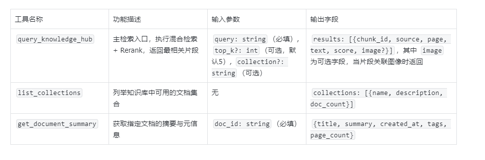

\- **扩展工具（Agentic 演进方向）**：

* `search_by_keyword` / `search_by_semantic`：拆分独立的检索策略，供 Agent 自主选择。

* `verify_answer`：事实核查工具，检测生成内容是否有依据支撑。

* `list_document_sections`：浏览文档目录结构，支持多步导航式检索。

#### **3.2.5 返回内容与引用透明设计&#x20;**

MCP 协议的 Tool 返回格式支持多种内容类型，本项目将充分利用这一特性实现"可溯源"的回答。

\- **各工具返回格式示例**：

&#x20; **1. \`query\_knowledge\_hub\` 返回示例**：

&#x20; **2. \`list\_collections\` 返回示例**：

&#x20;**3. \`get\_document\_summary\` 返回示例**：

\- **多模态图像返回**：

&#x20; \- 当检索结果关联图像时，通过 `image` 字段返回图像内容。

&#x20; \- **格式**：\`{ "type": "image", "data": "\<base64>", "mimeType": "image/png", "caption": "图像描述" }\`

&#x20; \- **工作流程**：数据摄取阶段存储图片本地路径 → 检索命中后 Server 动态读取 → 编码为 Base64 → 嵌入 \`image\` 字段返回。

&#x20; \- **Client 兼容性**：图像展示能力取决于 Client 实现，Server 端统一返回 Base64 格式，由 Client 决定如何渲染。

#### **3.2.6 学习建议和参考资料**

MCP也是一个面试常考的内容。 这里面涉及的面试问题有：

MCP的通信协议：Stdio , SSE(被淘汰）, Websocket.

你的项目用的远端Server还是本地Server，为什么？

MCP 远端Server和 本地Server对比。

消息格式：**JSON-RPC 2.0。**

MCP的基本概念。

给大家一些参考资料：

带你感受MCP， 配置MCP，入门MCP： https://www.youtube.com/watch?v=McNRkd5CxFY

入门视频（Tina老师一直讲的都很好）：https://www.youtube.com/watch?v=kOhLoixrJXo

深入进阶（马克老师的MCP视频，有基础篇，有进阶篇，进阶视频带你去抓了MCP和Client的通信字段，让你深入了解）：https://www.youtube.com/watch?v=yjBUnbRgiNs

就算你0基础，把这几个视频弄清楚，跟着做一下， 结合笔记中的MCP面试问题和项目，MCP这块就差不多了。

### **3.3 可插拔架构设计&#x20;**

**目标：** 定义清晰的抽象层与接口契约，使 RAG 链路的每个核心组件都能够独立替换与升级，避免技术锁定，支持低成本的 A/B 测试与环境迁移。

**术语说明**：本节中的"提供者 (Provider)"、"实现 (Implementation)"指的是完成某项功能的**具体技术方案**，而非传统 Web 架构中的"后端服务器"。例如，LLM 提供者可以是远程的 Azure OpenAI API，也可以是本地运行的 Ollama；向量存储可以是本地嵌入式的 Chroma，也可以是云端托管的 Pinecone。本项目作为本地 MCP Server，通过统一接口对接这些不同的提供者，实现灵活切换。

#### **3.3.1 设计原则**

\- **接口隔离 (Interface Segregation)**：为每类组件定义最小化的抽象接口，上层业务逻辑仅依赖接口而非具体实现。

\- **配置驱动 (Configuration-Driven)**：通过统一配置文件（如 \`settings.yaml\`）指定各组件的具体后端，代码无需修改即可切换实现。

\- **工厂模式 (Factory Pattern)**：使用工厂函数根据配置动态实例化对应的实现类，实现"一处配置，处处生效"。

\- **优雅降级 (Graceful Fallback)**：当首选后端不可用时，系统应自动回退到备选方案或安全默认值，保障可用性。

**通用结构示意（适用于 3.3.2 / 3.3.3 / 3.3.4 等可插拔组件）**：

#### **3.3.2 LLM 与 Embedding 提供者抽象**

这是可插拔设计的核心环节，因为模型提供者的选择直接影响成本、性能与隐私合规。

**统一接口层 (Unified API Abstraction)**：

&#x20; **设计思路**：无论底层使用 Azure OpenAI、OpenAI 原生 API、DeepSeek 还是本地 Ollama，上层调用代码应保持一致。

&#x20; **关键抽象**：

&#x20;   `LLMClient`：暴露 `chat(messages) -> response` 方法，屏蔽不同 Provider 的认证方式与请求格式差异。

&#x20;   `EmbeddingClient`：暴露 `embed(texts) -> vectors` 方法，统一处理批量请求与维度归一化。

\- **提供者选项与切换场景**：

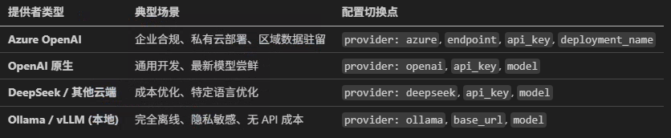

**技术选型建议**：

&#x20; 如 3.1 节所述，本项目以 **LlamaIndex 为主框架**，其内置了对主流 LLM/Embedding Provider 的适配（OpenAI、Azure、Ollama 等）。LlamaIndex 的 \`LLM\` 和 \`Embedding\` 抽象类已封装了统一调用接口。

&#x20; 对于 LlamaIndex 未覆盖的 Provider（如 DeepSeek），可通过其 **OpenAI-Compatible 模式**接入（设置自定义 \`api\_base\`），或引入 LangChain 的对应适配器。

&#x20; 对于企业级需求，可在其基础上增加统一的 **重试、限流、日志** 中间层，提升生产可靠性，但本项目暂不实现，这里仅提供思路。

#### **3.3.3 检索策略抽象**

检索层的可插拔性决定了系统在不同数据规模与查询模式下的适应能力。

**设计模式：抽象工厂模式**

与 3.3.2 节的 LLM 抽象类似，检索层各组件的可插拔性同样依赖两层设计：

1\. **框架提供的统一接口**：本项目采用 **LlamaIndex Ingestion Pipeline** 作为核心框架，其为向量数据库、Embedding 等组件定义了统一的抽象接口，不同实现只需遵循相同接口即可无缝替换。

2\. **我们编写的工厂函数**：对于框架未覆盖的组件（如稀疏检索、融合策略），我们自行定义抽象接口并编写工厂函数，根据配置决定实例化哪个具体实现。

通用的“配置驱动 + 工厂路由”结构示意见 3.3.1 节。

下面分别说明各组件如何应用这一模式：

***

**1. 分块策略 (Chunking Strategy)**

分块是 Ingestion Pipeline 的核心环节之一，决定了文档如何被切分为适合检索的语义单元。LlamaIndex Ingestion Pipeline 的 Splitter 环节支持可插拔设计，不同分块实现只需遵循相同接口即可无缝替换。

常见的分块策略包括：

&#x20;**固定长度切分**：按字符数或 Token 数切分，简单但可能破坏语义完整性。

&#x20;**递归字符切分**：按层级分隔符（段落→句子→字符）递归切分，在长度限制内尽量保持语义边界。

**语义切分**：利用 Embedding 相似度检测语义断点，确保每个 Chunk 是自包含的语义单元。

**结构感知切分**：根据文档结构（Markdown 标题、代码块、列表等）进行切分。

本项目当前采用 **LangChain 的 RecursiveCharacterTextSplitter** 进行切分，该方法对 Markdown 文档的结构（标题、段落、列表、代码块）有天然的适配性，能够通过配置语义断点（Separators）实现高质量、语义完整的切块。

**当前实现说明**：目前系统使用 LangChain RecursiveCharacterTextSplitter。架构设计上预留了切换能力，如需使用 LlamaIndex 的 SentenceSplitter、SemanticSplitter 或自定义切分器，可在 Pipeline 中替换相应组件。

***

**2. 向量数据库**

LlamaIndex 为向量数据库定义了统一的 `VectorStore` 抽象接口，所有主流向量库（Chroma、Qdrant、Pinecone 等）都有对应适配器，暴露相同的 `.add()`、`.query()` 等方法。我们通过 `VectorStoreFactory` 根据配置选择具体实现。

本项目选用 **Chroma** 作为向量数据库。相比 Qdrant、Milvus、Weaviate 等需要 Docker 容器或分布式架构支撑的方案，Chroma 采用嵌入式设计，\`pip install chromadb\` 即可使用，无需额外部署数据库服务，非常适合本地开发与快速原型验证。同时 LlamaIndex 提供了成熟的 \`ChromaVectorStore\` 适配器，与 Ingestion Pipeline 无缝集成。

**当前实现说明**：目前系统仅实现了 Chroma 后端。虽然架构设计上预留了工厂模式以支持未来扩展，但当前版本尚未实现其他向量数据库的适配器。

**3. 向量编码策略**

向量编码是 Ingestion Pipeline 的关键环节，决定了 Chunk 如何被转换为可检索的向量表示。LlamaIndex 提供了 `BaseEmbedding` 抽象接口，支持不同 Embedding 模型的可插拔替换

常见的编码策略包括：

**纯稠密编码（Dense Only）**：仅生成语义向量，适合通用场景。

**纯稀疏编码（Sparse Only）**：仅生成关键词权重向量，适合精确匹配场景。

**双路编码（Dense + Sparse）**：同时生成稠密向量和稀疏向量，为混合检索提供数据基础。

本项目当前采用 **双路编码（Dense + Sparse）** 策略：

**Dense Embeddings（语义向量）**：调用 Embedding 模型（如 OpenAI text-embedding-3）生成高维浮点向量，捕捉文本的深层语义关联。

**Sparse Embeddings（稀疏向量）**：利用 BM25 编码器生成稀疏向量（Keyword Weights），捕捉精确的关键词匹配信息。

存储时，Dense Vector 和 Sparse Vector 与 Chunk 原文、Metadata 一起原子化写入向量数据库，确保检索时可同时利用两种向量。

**当前实现说明**：目前系统实现了 Dense + Sparse 双路编码。架构设计上预留了切换能力，如需使用其他 Embedding 模型（如 BGE、Ollama 本地模型）或调整编码策略，可在 Pipeline 中替换相应组件。

**4. 召回策略**

召回策略决定了查询阶段如何从知识库中检索相关内容。基于 Ingestion 阶段存储的向量类型，可采用不同的召回方案：

**纯稠密召回（Dense Only）**：仅使用语义向量进行相似度匹配。

**纯稀疏召回（Sparse Only）**：仅使用 BM25 进行关键词匹配。

**混合召回（Hybrid）**：并行执行稠密和稀疏两路召回，再通过融合算法合并结果。

**混合召回 + 精排（Hybrid + Rerank）**：在混合召回基础上，增加精排步骤进一步提升相关性。

本项目当前采用 **混合召回 + 精排（Hybrid + Rerank）** 策略：

**稠密召回（Dense Route）**：计算 Query Embedding，在向量库中进行 Cosine Similarity 检索，返回 Top-N 语义候选。

**稀疏召回（Sparse Route）**：使用 BM25 算法检索倒排索引，返回 Top-N 关键词候选。

**融合（Fusion）**：使用 RRF (Reciprocal Rank Fusion) 算法将两路结果合并排序。

**精排（Rerank）**：对融合后的候选集进行重排序，支持 None / Cross-Encoder / LLM Rerank 三种模式。

**当前实现说明**：目前系统实现了 Hybrid + Rerank 策略。架构设计上预留了策略切换能力，如需使用纯稠密或纯稀疏召回，可通过配置切换；融合算法和 Reranker 同样支持替换。

#### **3.3.4 评估框架抽象**

评估体系的可插拔性确保团队可以根据业务目标灵活选择或组合不同的质量度量维度。

\- **设计思路**：

* 定义统一的 `Evaluator` 接口，暴露 `evaluate(query, retrieved_chunks, generated_answer, ground_truth) -> metrics` 方法。

* 各评估框架实现该接口，输出标准化的指标字典。

\- **可选评估框架**：

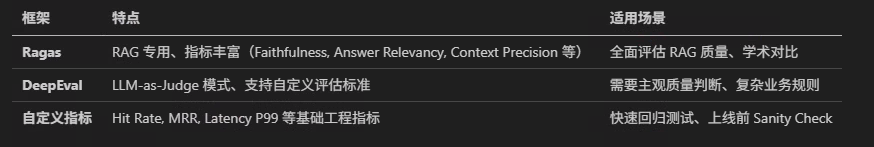

\- **组合与扩展**：

&#x20;评估模块设计为**组合模式**，可同时挂载多个 Evaluator，生成综合报告。

配置示例：`evaluation.backends: [ragas, custom_metrics]`，系统并行执行并汇总结果。

#### **3.3.5 配置管理与切换流程**

\- **配置文件结构示例** (\`config/settings.yaml\`)：

\- **切换流程**：

1. 修改 `settings.yaml` 中对应组件的 `backend` / `provider` 字段。

2. 确保新后端的依赖已安装、凭据已配置。

3) 重启服务，工厂函数自动加载新实现，无需修改业务代码。

#### **3.3.6 学习建议**

本章其实不涉及特别多的AI的知识，但是其实是我们设计整个项目的一个特别核心的思想的一个实现。我们希望将项目变成可插拔的，因为RAG中的各个部分都很灵活，可以使用不同方法，我们希望项目设计的时候，不把方法绑定死，而是做的非常方便扩展。 后面从目录结构的设计上也可以看出来，我们专门使用了一个libs，做可插拔层。 这个设计模式是抽象工厂模式，然后结合yaml配置，能够方便地切换。

这里的学习重点是掌握这种工程思路，抽象工厂设计模式，把这个方法吸收，在和面试官讲的时候，也可以给你的面试官介绍介绍这个特点，以及如何实现的。

另外本章，每一个小节，比如有哪些模型可以选择，召回有哪些方法，向量编码有哪些方法，这个涉及到技术选型和一些基础知识，建议要掌握每个阶段有哪些方法，为什么选哪一个？你的项目用了啥，为啥？这个也是面试喜欢问的。

### **3.4 可观测性与追踪设计&#x20;**

**目标：** 针对 RAG 系统常见的"黑盒"问题，设计全链路可观测的追踪体系，使每一次检索与生成过程都**透明可见**且**可量化**，为调试优化与质量评估提供数据基础。

#### **3.4.1 设计理念**

\- **请求级全链路追踪 (Request-Level Tracing)**：以 \`trace\_id\` 为核心，完整记录单次请求从 Query 输入到 Response 输出的全过程，包括各阶段的输入输出、耗时与评估分数。

\- **透明可回溯 (Transparent & Traceable)**：每个阶段的中间状态都被记录，开发者可以清晰看到"系统为什么召回了这些文档"、"Rerank 前后排名如何变化"，从而精准定位问题。

\- **低侵入性 (Low Intrusiveness)**：追踪逻辑与业务逻辑解耦，通过装饰器或回调机制注入，避免污染核心代码。

\- **轻量本地化 (Lightweight & Local)**：采用结构化日志 + 本地 Dashboard 的方案，零外部依赖，开箱即用。

#### **3.4.2 追踪数据结构**

每次用户请求生成唯一的 `trace_id`，作为日志关联与问题排查的核心标识。一条 Trace 记录包含以下信息：

**基础信息**：

* `trace_id`：请求唯一标识

* `timestamp`：请求时间戳

* `user_query`：用户原始查询

* `collection`：检索的知识库集合

**各阶段详情 (Stages)**：

每个阶段记录其输入、输出、耗时与关键指标：

**汇总指标**：

* `total_latency`：端到端总耗时

* `top_k_results`：最终返回的 Top-K 文档 ID

* `error`：异常信息（若有）

**评估指标 (Evaluation Metrics)**：

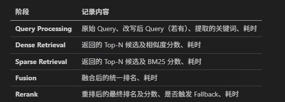

每次请求可选计算轻量级评估分数，直接记录在 Trace 中，便于回溯分析：

* `context_relevance`：召回文档与 Query 的相关性分数

* `answer_faithfulness`：生成答案与召回文档的一致性分数（若有生成环节）

#### **3.4.3 技术方案：结构化日志 + 本地 Web Dashboard**

本项目采用 **"结构化日志 + 本地 Web Dashboard"** 作为可观测性的实现方案。

**选型理由**：

\- **零外部依赖**：不依赖 LangSmith、LangFuse 等第三方平台，无需网络连接与账号注册，完全本地化运行。

\- **轻量易部署**：仅需 Python 标准库 + 一个轻量 Web 框架（如 Streamlit），\`pip install\` 即可使用，无需 Docker 或数据库服务。

\- **学习成本低**：结构化日志是通用技能，调试时可直接用 \`jq\`、\`grep\` 等命令行工具查询；Dashboard 代码简单直观，便于理解与二次开发。

\- **契合项目定位**：本项目面向本地 MCP Server 场景，单用户、单机运行，无需分布式追踪或多租户隔离等企业级能力。

**实现架构**：

**核心组件**：

\- **结构化日志层**：基于 Python \`logging\` + JSON Formatter，将每次请求的 Trace 数据以 JSON Lines 格式追加写入本地文件。每行一条完整的请求记录，包含 \`trace\_id\`、各阶段详情与耗时。

\- **本地 Web Dashboard**：基于 Streamlit 构建的轻量级 Web UI，读取日志文件并提供交互式可视化。核心功能是按 \`trace\_id\` 检索并展示单次请求的完整追踪链路。

#### **3.4.4 追踪机制实现**

为确保各 RAG 阶段（可替换、可自定义）都能输出统一格式的追踪日志，系统采用 **TraceContext（追踪上下文）** 作为核心机制。

**工作原理**：

1\. **请求开始**：Pipeline 入口创建一个 \`TraceContext\` 实例，生成唯一 \`trace\_id\`，记录请求基础信息（Query、Collection 等）。

2\. **阶段记录**：\`TraceContext\` 提供 \`record\_stage()\` 方法，各阶段执行完毕后调用该方法，传入阶段名称、耗时、输入输出等数据。

3\. **请求结束**：调用 \`trace.finish()\`，\`TraceContext\` 将收集的完整数据序列化为 JSON，追加写入日志文件。

**与可插拔组件的配合**：

* 各阶段组件（Retriever、Reranker 等）的接口约定中包含 `TraceContext` 参数。

* 组件实现者在执行核心逻辑后，调用 `trace.record_stage()` 记录本阶段的关键信息。

\- 这是**显式调用**模式：不强制、不会因未调用而报错，但依赖开发者主动记录。好处是代码透明，开发者清楚知道哪些数据被记录；代价是需要开发者自觉遵守约定。

**阶段划分原则**：

\- **Stage 是固定的通用大类**：\`retrieval\`（检索）、\`rerank\`（重排）、\`generation\`（生成）等，不随具体实现方案变化。

\- **具体实现是阶段内部的细节**：在 \`record\_stage()\` 中通过 \`method\` 字段记录采用的具体方法（如 \`bm25\`、\`hybrid\`），通过 \`details\` 字段记录方法相关的细节数据。

* 这样无论底层方案怎么替换，阶段结构保持稳定，Dashboard 展示逻辑无需调整。

#### **3.4.5 Dashboard 功能**

Dashboard 以 `trace_id` 为核心，提供以下视图：

\- **请求列表**：按时间倒序展示历史请求，支持按 Query 关键词筛选。

\- **单请求详情页**：

&#x20; \- **耗时瀑布图**：展示各阶段的时间分布，快速定位性能瓶颈。

&#x20; \- **阶段详情展开**：点击任意阶段，查看该阶段的输入、输出与关键参数。

&#x20; \- **召回结果表**：展示 Top-K 候选文档在各阶段的排名与分数变化。

#### **3.4.6 配置示例**

### 3.5 多模态图片处理设计&#x20;

**目标：** 设计一套完整的图片处理方案，使 RAG 系统能够理解、索引并检索文档中的图片内容，实现"用自然语言搜索图片"的能力，同时保持架构的简洁性与可扩展性。

#### 3.5.1 设计理念与策略选型

多模态 RAG 的核心挑战在于：**如何让纯文本的检索系统"看懂"图片**。业界主要有两种技术路线：

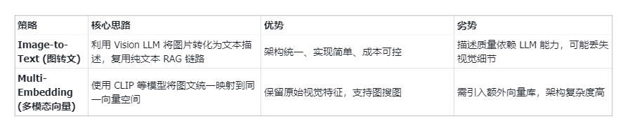

**本项目选型：Image-to-Text策略**

选型理由：

* **架构统一**：无需引入 CLIP 等多模态 Embedding 模型，无需维护独立的图像向量库，完全复用现有的文本 RAG 链路（Ingestion → Hybrid Search → Rerank）。

* **语义对齐**：通过 LLM 将图片的视觉信息转化为自然语言描述，天然与用户的文本查询在同一语义空间，检索效果可预期。

* **成本可控**：仅在数据摄取阶段一次性调用 Vision LLM，检索阶段无额外成本。

* **渐进增强**：未来如需支持"图搜图"等高级能力，可在此基础上叠加 CLIP Embedding，无需重构核心链路。

#### 3.5.2 图片处理全流程设计

图片处理贯穿 Ingestion Pipeline 的多个阶段，整体流程如下：

#### 3.5.3 各阶段技术要点

1. **Loader 阶段：图片提取与引用收集**

* **提取策略**：

  * 解析文档时识别嵌入的图片资源（PDF 中的 XObject、PPT 中的媒体文件、Markdown 中的 `` 引用）。

  * 为每张图片生成全局唯一的 `image_id`（建议格式：`{doc_hash}_{page}_{seq}`）。

  * 将图片二进制数据提取并暂存，记录其在原文档中的位置信息。

* **引用标记**：

  * 在转换后的 Markdown 文本中，于图片原始位置插入占位符（如 `[IMAGE: {image_id}]`）。

  * 在 Document 的 Metadata 中维护 `images` 列表，记录每张图片的 `image_id`、原始路径、页码、尺寸等基础信息。

* **存储原始图片**：

  * 将提取的图片保存至本地文件系统的约定目录（如 `data/images/{collection}/{image_id}.png`）。

  * 仅保存需要的图片格式（推荐统一转换为 PNG/JPEG），控制存储体积。

- **Splitter 阶段：保持图文关联**

* **关联保持原则**：

  * 图片引用标记应与其说明性文字（Caption、前后段落）尽量保持在同一 Chunk 中。

  * 若图片出现在章节开头或结尾，切分时应将其归入语义上最相关的 Chunk。

* **Chunk Metadata 扩展**：

  * 每个 Chunk 的 Metadata 中增加 `image_refs: List[image_id]` 字段，记录该 Chunk 关联的图片列表。

  * 此字段用于后续 Transform 阶段定位需要处理的图片，以及检索命中后定位需要返回的图片。

- **Transform 阶段：图片理解与描述生成**

这是多模态处理的核心环节，负责将视觉信息转化为可检索的文本语义。

* **Vision LLM 选型**：

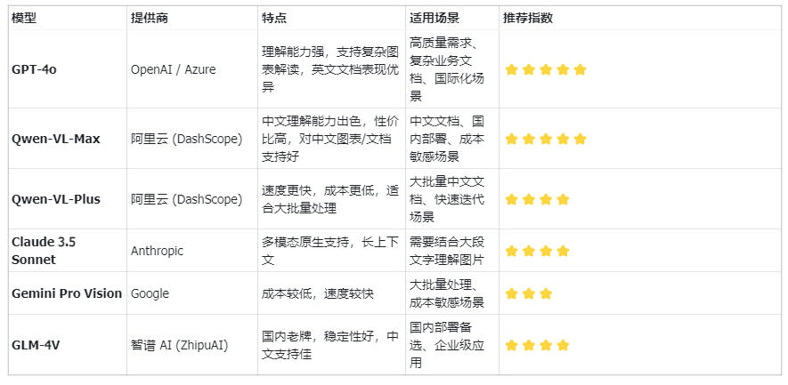

**双模型选型策略（推荐）**：

本项目采用**国内 + 国外双模型**方案，通过配置切换，兼顾不同部署环境和文档类型：

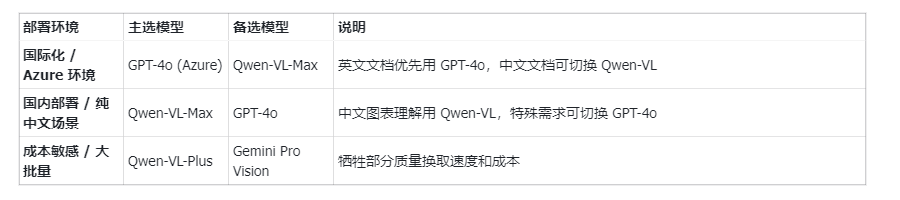

**选型理由**：

1. **GPT-4o (国外首选)**：

   * 视觉理解能力业界领先，复杂图表解读准确率高

   * Azure 部署可满足企业合规要求

   * 英文技术文档理解效果最佳

2. **Qwen-VL-Max (国内首选)**：

   * 中文场景下表现与 GPT-4o 接近，部分中文图表任务甚至更优

   * 通过阿里云 DashScope API 调用，国内访问稳定、延迟低

   * 价格约为 GPT-4o 的 1/3 \~ 1/5，性价比极高

   * 原生支持中文 OCR，对中文截图、表格识别更准确

* **描述生成策略**：

  * **结构化 Prompt**：设计专用的图片理解 Prompt，引导 LLM 输出结构化描述，而非自由发挥。

  * **上下文感知**：将图片的前后文本段落一并传入 Vision LLM，帮助其理解图片在文档中的语境与作用。

  * **分类型处理**：针对不同类型的图片采用差异化的理解策略：

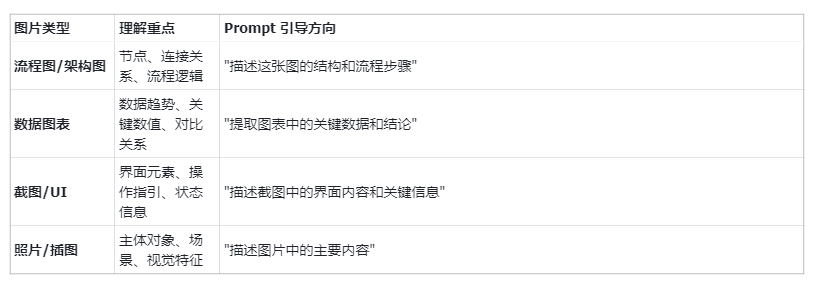

* **推荐：注入正文**：将生成的描述直接替换或追加到 Chunk 正文中的图片占位符位置，格式如 `[图片描述: {caption}]`。这样描述会被 Embedding 覆盖，可被直接检索。

* **备选：注入 Metadata**：将描述存入 `chunk.metadata.image_captions` 字段。需确保检索时该字段也被索引。

* **幂等与增量处理**：

  * 为每张图片的描述计算内容哈希，存入 `processing_cache` 表。

  * 重复处理时，若图片内容未变且 Prompt 版本一致，直接复用缓存的描述，避免重复调用 Vision LLM。

- **Storage 阶段：双轨存储**

* **向量库存储（用于检索）**：

  * 存储增强后的 Chunk，其正文已包含图片描述，Metadata 包含 `image_refs` 列表。

  * 检索时通过文本相似度即可命中包含相关图片描述的 Chunk。

* **原始图片存储（用于返回）**：

  * 图片文件存储于本地文件系统，路径记录在独立的 `images` 索引表中。

  * 索引表字段：`image_id`, `file_path`, `source_doc`, `page`, `width`, `height`, `mime_type`。

  * 检索命中后，根据 Chunk 的 `image_refs` 查询索引表，获取图片文件路径用于返回。

#### 3.5.4 检索与返回流程

当用户查询命中包含图片的 Chunk 时，系统需要将图片与文本一并返回：

**MCP 响应格式**：

#### 3.5.5 质量保障与边界处理

* **描述质量检测**：

  * 对生成的描述进行基础质量检查（长度、是否包含关键信息）。

  * 若描述过短或 LLM 返回"无法识别"，标记该图片为 `low_quality`，可选择人工复核或跳过索引。

* **大尺寸/特殊图片处理**：

  * 超大图片在传入 Vision LLM 前进行压缩（保持宽高比，限制最大边长）。

  * 对于纯装饰性图片（如分隔线、背景图），可通过尺寸或位置规则过滤，不进入描述生成流程。

* **批量处理优化**：

  * 图片描述生成支持批量异步调用，提高吞吐量。

  * 单个文档处理失败时，记录失败的图片 ID，不影响其他图片的处理进度。

* **降级策略**：

  * 当 Vision LLM 不可用时，系统回退到"仅保留图片占位符"模式，图片不参与检索但不阻塞 Ingestion 流程。

  * 在 Chunk 中标记 `has_unprocessed_images: true`，后续可增量补充描述。

#### 3.5.6 学习建议

本节讲述如何处理图片。3.5.1  理解RAG常见的处理图片的方法是：图转文 和用专业模型把图像直接变成嵌入项链。我们采用前者。

3.5.2 \~3.5.4 结合我们的系统架构，理解我们怎么做的。在分块，增强，检索阶段分别做了什么。 为什么你的RAG系统可以处理图像，怎么做的？返回给Client的格式是啥，为啥Client可以在界面中展示检索到的图片，你的数据库存了什么东西。这些都是你要想清楚，也是面试官可能问你的。

期间有一些关于不同模型的选型，这个大家了解一下不同模型对于图像处理的能力就好。 实现上我准备用两种模型测试，也体现系统可以方便切换模型的能力。

3.5.5 就是针对于图像处理效果不好，有哪些改进的地方。提供一个思路扩展，第一阶段不一定用得上。

## **4. Github地址**

GitHub上的Dev\_spec是更完整/更新的版本。推荐Git仓库看整个Spec, Spec甚至是包含了完整的目录结构和项目管理，包括上传了Skills 教大家如何用AI来完成整个项目。有兴趣欢迎尝试呀！

https://github.com/jerry-ai-dev/MODULAR-RAG-MCP-SERVER

## 5.视频讲解

5.1 项目Skills使用：

如何让AI 使用Skill 遵循dev spec 完成代码：

我用夸克网盘分享了「项目skills 技巧.mp4」，点击链接即可保存。打开「夸克APP」，无需下载在线播放视频，畅享原画5倍速，支持电视投屏。

链接：https://pan.quark.cn/s/60d6c9e45662

# LLM模型结构

## LLM模型训练

（模型是怎么训练出来的，其实暂时没有在面试中反映出来，没有面试问这个问题。不过我觉得这是自己需要理解的，通过这个知识点，你可以对大模型有个一个更好的认识，把这个微调，强化学习，预训练分别在哪个阶段串起来，这个知识点我给大家推荐这个链接，他讲的很好，而且还贴心的准备了一些小工具，比如你直观去看大模型分词效果的网站，特别好

https://baijiahao.baidu.com/s?id=1826882165583568205\&wfr=spider\&for=）

### 1.1LLM是如何被训练出来的

**1. 构建基础模型（构建通用大模型）**

* **预训练（Pre-training，非监督）**

  * 使用海量的通用、未标注数据（如网页、书籍、代码等）。

  * 目标是让模型具备**语言理解、推理、世界知识**等通用能力。

* **微调（SFT）**

  * 使用**指令-响应数据**、任务特定数据、人工标注数据。

  * 让模型学会**遵循指令**，更贴近实际应用。

* **对齐（如 RLHF、DPO）**

  * 基于**人类偏好数据**，通过奖励模型或偏好分数进行优化。

  * 目的是让模型输出更符合人类价值观和安全要求。

**2. 微调基础模型（提升指定场景性能）**

* 从通用 LLM/SLM 出发，模型已经具备：     &#x20;

  * **语言能力、推理能力、世界知识、聊天、指令跟随、代码能力**等。

* 再次进行：&#x20;

  * **微调（SFT）**：针对特定领域或任务的数据。

  * **对齐（RLHF、DPO）**：确保输出符合特定用户或行业需求。

* 最终得到**针对特定场景优化的模型**。

### 1.2 Function calling是否如何被训练出来的

Function calling是通过在模型训练的**预训练阶段**使用**自监督学习**，在**微调阶段**使用**SFT技术**，以及在**对齐阶段**使用**RLHF技术**来是模型具有能够理解用户意图并生成函数结构化的函数调用请求的能力。

具体来讲：

预训练阶段的自监督学习使得模型能够理解自然语言。

微调阶段的SFT技术使用标注数据让模型理解何时该调用函数，调用函数的格式是什么。

对齐阶段使用RLHF，使用人类的反馈来优化调用结果，使模型的调用更符合人类的习惯。

&#x20;

## 2. Transformer

(这一块其实不管在任何书籍，课程或者你去上机构给你的学习路线上，Tranformer都占比很大。但是其实我在面试的时候问的确实不多。但还是建议学习一些，特别是想要面一些有点涉及算法的岗位，比如算法工程的同学。另外虽然面试官没有直接问这些问题，但是这些内容时不时在面试中会被提到。比如问你推理加速，提到KV-CACHE的时候，你如果连Transformer的QKV都不知道，肯定KV-CACHE也弄不懂。 比如问你为啥这几年LLM发展这么强大，你就可以提到Transformer的**并行计算**和**长距离依赖&#x20;**&#x6765;谈谈为啥transformer出来之后AI发展如此迅速。 总之这节虽然不会直接考到，但是需要建议理解学习的）

### 2.1 简单介绍Transformer架构

Transformer是最在2017年在论文《Attention is All You Need》提出的深度学习架构，现在的大语言模型，比如GPT系列，Claude等都是基于Transformer架构设计的。

Tranformer的架构由**编码器**和**解码器**组成。它们的基础模块主要由**输入嵌入**，**自注意力机制**，**多头注意力机制**，**前馈神经网络**，**残差连接**与**层归一化**组成。

注意力机制是Transformer最重要的设计，相比于RNN，**解决了并行计算和长距离依赖&#x20;**&#x4E24;方面的问题，有更高效的**并行计算能力**和**语义理解能力。**&#x662F;AI领域的一次重大突破。

&#x20;

### 2.2 编码器和解码器的区别

Transformer 的**编码器和解码器**组成的，都是基于**注意力机制**的**序列建模架构**。

**编码器&#x20;**&#x4E3B;要是**用来处理输入序列**，**提取上下文信息并表示生成表示的**。 **解码器**主要是用**来生成输出序列**。（用途层面）

**编码器**通常处理整个输序列，因此可以**并行计算所有**的位置表示，**因此它的并行性高，推理速度更快**。 **解码器**大多使用**自回归**的方式，每一步生成一个Token, 无法并行生成多个Token，因此在推理时**速度较慢**。

&#x20;

### 2.3 Transformer vs RNN

Transformer相比RNN，主要在**并行计算方面**和**长距离依赖**两方面，具有高效的并行计算能力和语义理解能力。

具体来讲：

1.因为RNN处理是逐步进行的，每一步依赖前一步的输出状态，无法并行，训练速度慢。而Transformer基于自注意力机制，可以同时处理整个序列，充分利用GPU的能力，训练速度大幅提升。

2.RNN网络中，容易出现**梯度消失或者爆炸**，**捕捉长距离依赖困难**。而Transformer通过注意力机制，任意两个位置可以直接建立联系，长距离依赖问题得到了显著的缓解。

&#x20;

### 2.4.大模型分词器是什么？

因为大语言模型无法直接理解自然语言，我们需要先把他转成数字输入。分词器就是将**自然语言拆分成更小的单位**（我们把它叫做token），**并将每一个token映射成一个唯一ID**。为后续的词嵌入做准备。从而连接起人类语言和模型语言的桥梁。

### 2.5.Embedding 是什么？

因为大语言模型无法直接理解自然语言，我们需要先把他转成数字输入。Transformer的做法是通过对自然语言进行**分词&#x20;**+ **embedding**得到最终的输入的。具体来讲，embedding就是将离散的输入：**包括分词的id和位置id**，分别通过**词编码**和**位置编码**转换成稠密向量，最后组合成模型输入的过程。                                                                                                                                                                                                              &#x20;

### 2.6 注意力机制

#### *2.6.1 简单介绍注意力机制*

（概念简述）注意力机制是在处理一个词时，模型可以关注输入序列的其他词，并根据它们的重要性加权融合信息。

（计算公式简述）它的做法时对每一个词生成3个向量，Q, K, V。Q代表当前词要关注什么， K代表当前词是什么 ， V代表当前词能提供什么信息。 使用Q,K点积计算相似度，使用Softmax得到注意力权重，最后对V进行加权，得到Attention矩阵。

（好处，总结）这个向量可以**捕捉词和词之间的长距离依赖**，信息融合灵活，不依赖固定窗口或顺序，**且并行计算的效率相比RNN更高**。

&#x20;

#### *2.6.2 简单介绍多头注意力机制*

多头注意力机制是Transformer架构的核心组件，主要用于增强模型在处理序列数据的表达能力。它的核心思想是：**通过多个注意力头并行计算不同的注意力表示，从而捕捉输入序列和不同位置之间的关系。**

它的主要过程是，生成多组Q,K,V， 对每一组 Q, K, V得到的Attention矩阵进行拼接，得到最终的一个结果。

使用多头注意力机制，可以让模型在**不同的子空间中学习不同的关注模式**，避免单一注意力机制只关注某一个种关系的问题，提升模型捕捉**全局信息的能力**。

&#x20;

#### *2.6.3 多头注意力机制为何可以增强模型？*

1. **有利于捕捉长距离依赖**。传统的模型比如RNN在处理长文本时容易遗忘前面的信息，而注意力机制可以直接关注任意位置的词，无论距离多远。

2. **动态信息融合**。每个词的表示不再是固定的了，而是根据上下文动态生成，从而得到不同的语义表示。

3. **并行计算。** 注意力机制不依赖于序列顺序，可以一次性处理整个序列，从而极大提升了训练效率

4. **可解释性强**。注意力权重可以可视化，帮助我们理解模型是如何‘思考’的。

&#x20;

## 3.Bert vs GPT？

BERT 和 GPT **是两种基于 Transformer&#x20;**&#x7684;自然语言处理模型，但它们的设计理念和应用方向不同。BERT 使用**编码器结构**，采用**双向上下文理解**，**通过遮盖部分词语进行训练，适合文本分类、问答等理解类**任务。而 GPT 则基于**解码器结构**，采用**自回归方式从左到右生成文本**，擅长**写作辅助**、**对话系统等生成类任务**。简单来说，BERT 更擅长“理解”，GPT 更擅长“生成”。

&#x20;

## 4.简单介绍一下千问模型？

（我在面试阿里前，临时准备的这个问题，害怕面试阿里他会问道，最少不会一问三不知）

**1. 基本定位**

* 千问是一个**多语言、多模态的大模型**，支持文本、图像、音频等输入，具备问答、写作、代码生成、翻译、文档处理等能力。

* 最新版本是 **Qwen3 系列**，于 2025 年发布，参数规模从 **0.6B 到 235B**，涵盖稠密模型和 **MoE架构**模型。

**2. 技术亮点**

* **混合推理机制**：支持“快思考”和“慢思考”两种模式，用户可根据任务选择快速响应或深度推理。

* **MoE 架构**：通过稀疏激活专家子网络，在降低计算成本的同时保持高性能。

* **长上下文能力**：旗舰模型支持 **128K\~1M tokens**上下文，适合长文档和复杂对话。

* **多语言支持**：覆盖 **119 种语言**，全球化应用能力强。

* **训练规模**：基于约 **36万亿 tokens**预训练，后训练包括指令微调、强化学习（RLHF）、思维链优化。&#x20;

**3. 应用场景**

* **通用对话与问答**

* **代码生成与编程辅助**（专用模型 Qwen-Coder）

* **多模态任务**：图文理解、OCR、音视频速读（Qwen-Omni、Qwen-VL 系列）

* **企业级智能体**：支持工具调用、Agent框架。

**4. 开源与生态**

* 已在 **魔搭社区、HuggingFace** 等平台开源，支持免费商用，下载量超 6 亿次，形成全球最大开源模型生态之一。

## 5.简单介绍一下Gemini3模型？

（Gemini3 是目前最强模型，也有面试官直接问你对Gemini3 的理解，看你有没有关注前沿技术，所以我们准备一个Gemini3的模型知识，防止面试问了啥也答不上来的尴尬）

**Gemini 3 的真正差异化优势**

1. **推理深度 + 控制能力**

   * 其它模型也能做 CoT，但 Gemini 3 引入了 **可控推理层级（thinking\_level 参数）**，开发者可以动态选择“快思考”还是“慢思考”，而不是固定模式。这意味着它能在延迟和准确率之间灵活权衡，适应不同场景（聊天 vs 科研）。

   * 结合 **Deep Think 模式**，它在博士级推理测试（GPQA Diamond）和 ARC-AGI-2 上刷新纪录，证明不仅能“慢思考”，而且能“正确慢思考”。

2. **原生多模态，不是外挂**

   * 很多模型支持多模态，但大多是“文本为主 + 插件式视觉”。Gemini 3 是 **从架构层面统一文本、图像、视频、音频、代码**，并且在 Video-MMMU、UI理解（ScreenSpot-Pro）测试中大幅领先 GPT-5.1 和 Claude。

   * 这意味着它不仅能“看图回答问题”，还能做 **跨模态推理**，比如结合视频内容和代码逻辑完成任务。

3. **智能体能力的落地**

   * 其它模型也在尝试 Agent，但 Gemini 3 搭配 **Antigravity 平台**，实现了端到端工作流：不仅能调用工具，还能 **自主规划、执行代码、验证结果**，真正从“回答问题”进化到“完成任务”。

   * 这让它更像一个“数字员工”，而不是一个聊天助手。

4. **超长上下文 + 高效架构**

   * 支持 **100 万 tokens 上下文**，并且通过 **MoE（Mixture of Experts）架构 + TPU v6**，在保证性能的同时降低成本。

   * 其它模型即使能处理长上下文，往往会出现性能衰减，而 Gemini 3 在长上下文场景下仍保持高准确率。

5. **安全与透明创新**

   * 引入 **思维签名（Thought Signatures）**，让长链推理过程可验证，适用于金融、法律等高合规场景。这是目前其它模型没有的。

## 6 模型和硬件

这个问题其实做Infra/算法的人需要知道更多，因为他会做推理加速，他会用专业的卡去做一些调整。 但是通常如果是说做应用的岗，可能很多使用的是远端模型，如果你使用的是远端模型而且是应用岗，这个问题被考察到的概率不大。

那么我们为什么要讲这个问题，如果你按照我的思路，去使用了本地模型，然后微调，量化，推理走了个大概的话，重点是你用了本地模型，那么面试官很可能在问你项目的时候，就会涉及到硬件问题。 问：那你的机器能跑的了这个模型吗？ 这个参考夸克千问一面以及Deepwisdom 一面。 在这里我们讲清楚 模**型能不能跑，跑的有多快**和什么相关，有了这个背景，你就比较清楚如何去回答这个面试官问题了。

### 6.1 模型能不能跑

**核心原则**：**模型必须能放进内存/显存**中。&#x20;

你可以这么理解，模型 = 一堆参数。 模型运行，需要把参数加载到**显存/内存**中。

模型内存要求 = 参数量 \* 每参数字节数 \* 1.2 \~1.3（额外开销，用于kv cache，激活值等）

每参数字节数：

├── FP32：4 字节

├── FP16/BF16：2 字节

├── INT8：1 字节

└── INT4：0.5 字节

&#x20;所以：7B-INT8 的模型，需要的内存/显存要求：&#x20;

&#x20;7B \* 1字节   =  7,000,000,000 字节 - 7GB。&#x20;

&#x20;如上面所说，还需要1.2\~1.3 的额外开销。也就是8\~9GB

所以如果说你的电脑 使用cpu 内存大于 9GB， 使用gpu，多卡显存之和大于9GB，你的硬件就能跑这个模型，很简单对吧！

### 6.2 跑的有多快

跑的有多快，相对来说更复杂：取决于你的算力和任务。

**核心原则：**&#x7B97;力越强，并行度越高 -> 越快。

影响因素：

├── 硬件算力（ 每秒浮点运算次数，好的显卡，cpu 算力更强，速度也更快）

├── 内存带宽（数据搬运速度）

├── 并行度（多核/多卡）

└── 软件优化（推理框架）

└── 任务类型（任务复杂，prompt 和 时间复杂度成o(n^2）关系（从Attention结构上来讲））

其实这个问题相对来说就更加复杂，在《大模型工程师面试实战- 算法原理，开发实践与系统部署》（清华大学出版社） 书中是由专门讲解这个推理速度相关的问题，以及如何优化。这个和硬件，Infra的岗位相关，是他们优化的工作。所以具体还是很复杂的，但是作为应用，我们了解到这里就可以啦！

## 7. 不同模型的对比和选择

（这个问题相对来说算是中频吧，建议掌握。在很多公司做Agent项目的时候，其实他们自己没有对应的模型，所以会去常见的模型中选择对应的模型来使用在自己项目，所以他其实会问你你为什么选择这个模型，常见的模型对比有哪些，目前有好几个公司都考到这个知识点，包括**小红书，平安证券。**&#x57FA;本来说这里涉及两个问题：**模型选型原则，常见的模型特点对比**。想清楚这一点，就可以讲最后一点，你的项目为什么选择xx模型，你是如何选型的？）

### **7.1 模型的选型策略**

（ 这个回答不是非常精心准备/迭代过的一个回答，如果所说，还是说面的不多，我先按这个思路答，如果遇到这个回答不够深入全面的地方，我会回来完善的）

一般来说，我会从这几个维度去考虑模型的选型：

**1.思考明确任务类型** → 决定模型规模和能力。

**2.确定部署方式** → 权衡隐私、延迟、硬件条件。

**3.结合成本模型** → 远端 vs 本地长期投入。

**4.参考榜单** → 初步筛选候选模型。

**5.** **数据驱动测试** → 用 Playground 或数据集验证。

具体来讲：

**部署方式：远端 vs 本地**

* **远端（API 调用）**

  * **优点**：无需维护硬件，快速接入，模型更新及时。

  * **缺点**：依赖网络，存在延迟；隐私和合规风险；成本按调用量计费。

  * **适用场景**：原型验证、低频调用、对隐私要求不高的任务。

* **本地部署**

  * **优点**：数据安全可控，低延迟，长期成本可控。

  * **缺点**：硬件投入大，维护复杂，模型更新滞后。

  * **适用场景**：高频调用、敏感数据处理、对延迟要求极高的场景。

***

**成本考量（结合部署方式）**

* **远端成本**：按 Token 或调用次数计费，适合小规模或弹性需求。

* **本地成本**：一次性硬件投入 + 运维成本，适合长期、大规模使用。

* **策略**：&#x20;

  * 如果任务量小且迭代快 → 远端更划算。

  * 如果任务量大且长期稳定 → 本地更经济。

***

**任务性质**

* **简单任务**（分类、摘要、问答）：可选轻量模型（如 GPT-3.5、Qwen-1.8B）。

* **复杂任务**（多轮推理、代码生成、长文本处理）：需选大模型（如 GPT-4、Claude、Qwen-MoE）。

* **多模态任务**：选择支持图像/音频的模型（如 GPT-4V、Gemini、Qwen-VL）。

* **策略**：任务复杂度越高，模型参数量和推理能力要求越高。

***

**看测评榜单**

* **参考榜单**：&#x20;

  * **OpenLLM Leaderboard**（HuggingFace）

  * **Chatbot Arena**（LMSYS）

  * **中文榜单**：SuperCLUE、C-Eval

* **策略**：榜单可作为初筛，但需结合实际场景验证，避免只看排名。

***

**数据驱动验证**

* **快速验证方法**：&#x20;

  * 用 Playground（如 OpenAI、阿里通义）做小样本测试。

* **系统验证方法**：&#x20;

  * 准备任务相关数据集（如问答、代码、对话），跑 Benchmark。

  * 关注指标：准确率、鲁棒性、推理速度、成本。

* **策略**：榜单只是参考，最终要用自己的数据验证。

### **7.2 不同模型对比**

（这个题主要是面试官会问你的项目是如何选择模型的，这个时候你需要对不同的模型特点有一些了解，从大的系列（OpenAI系，千问系） 到一个系列下面的具体模型（OpenAI 系列下面的具体不同版本的特点），然后你要挑几个重点熟练掌握，比如你使用了OpenAI，知道OpenAI系列下的不同模型特点，建议深入了解的系列：**GPT系列（远端）和阿里（本地）**，这两个分别是两个类型，也是比较有名模型系列。有了这些知识，需要能结合你的项目讲清楚，你是如何选择模型的，为什么选择xx个模型）

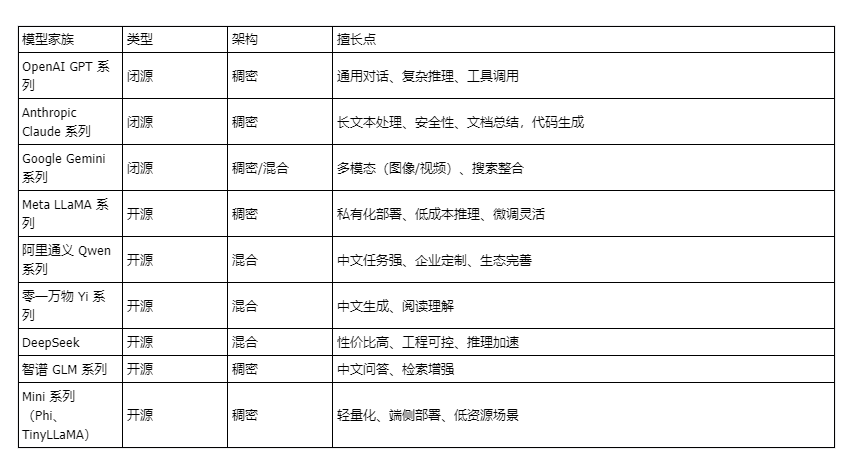

（ps:这个开源和闭源，主要的影响是开源的我们就可以下载到本地，使用本地推理，闭源的只可以使用云API推理。另外既然讲到了架构，希望大家也可以了解一下稠密（Dense), MoE(混合）架构。 ）

**OpenAI 系列模型不同点对比**

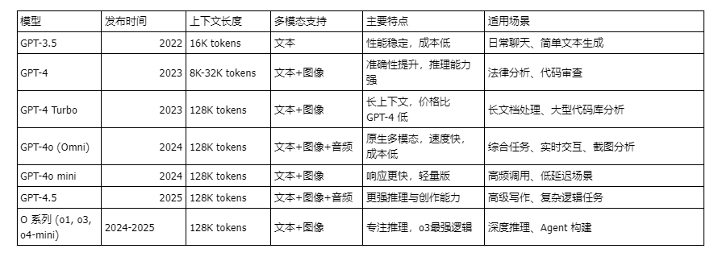

✅ **关键亮点**

* **GPT-4o**：目前最全面的模型，支持多模态（文字、图片、音频），速度快，价格比 GPT-4 Turbo 低约 50%，适合大多数场景。

* **GPT-4 Turbo**：适合处理超长文本（128K tokens），但不支持音频，价格略高。&#x20;

* **GPT-4.5**：研究预览版，推理和创作能力更强，适合技术写作和复杂任务，但成本高。

* **O 系列（o3、o4-mini）**：专注逻辑推理，o3适合复杂多步骤分析，o4-mini性价比高，适合高频调用。&#x20;

✅ **选择建议**

* **日常聊天/轻量任务**：GPT-4o mini 或 GPT-3.5。

* **长文档/代码审查**：GPT-4 Turbo 或 GPT-4.1。

* **多模态任务（图像+音频）**：GPT-4o。

* **深度推理/Agent开发**：o3 或 o4-mini-high。

* **高性价比场景**：o4-mini（成本极低，速度快）。

### **7.3 你的项目是如何选择模型的？为什么？**

（上面的知识积累一定程度上是为了这个题目准备，结合自己项目背景 和模型知识去回答，还是言之有理即可，我的回答供大家参考）

我们项目的模型选型主要考虑任务类型、部署方式和成本。**项目核心任务是分类、信息抽取和工具调用，整体不复杂**，**不需要超大模型**。当前阶段是原型验证，调用量不大，对隐私要求适中，所以选择远端 API 模型，免维护、迭代快。

综合**性能和成本**，我们选用 **GPT-4o mini**，因为它**推理能力足够，速度快，成本低，适合高频调用，同时 API 接入方便**。如果未来进入大规模部署且涉及敏感数据，我们会考虑本地部署开源模型，比如 **Qwen-2.5-1.8B**，它中文能力强，硬件要求低，适合分类和信息抽取。

总结来说，当前阶段选 GPT-4o mini 是因为性能、成本和易用性最优，未来会根据隐私和成本需求迁移到本地开源模型。

### **7.4 千问2.5到3的升级**

（作为应用，我们不要关注千问模型一些升级的原理，但是这个知识点要了解一下。为什么呢？因为你做大模型，很多公司需要用别人的模型，那么国内千问是标杆，所以即使做应用，多少要了解一下千问的特点，升级之类的。 第二个在大模型这个行业，你要关注行业动态，千问，Deepseek是国内标杆。 那么当有重大产品发布升级的时候，多少你要去了解它的特点的。否则人家一问你知道都不知道，显得很井底之蛙。

所以对于这个个问题：应用岗位，我的建议是：要关注，了解大概特点，不用深入。实时更新，当千问4出来，咱么也会把这里问题换成3到4的升级大概特点）

千问3是阿里25年4月发布的模型，相比千问2.5，它的主要升级点是：

1.支持**思考模式和非思考模式**。复杂模式可以用思考模式，内部线推理，在输出答案，而简单任务可以直接用非思考模式，响应快。

2\. 推理能力大幅增加：在数学，代码，逻辑推理上显著提升。

3\. MoE架构优化： Qwen3 提供MoE混合版本，同等效果下推理成本降低。

4\. 支持更多上下文，支持过多语言。

# RAG

### 1.RAG vs 微调&#x20;

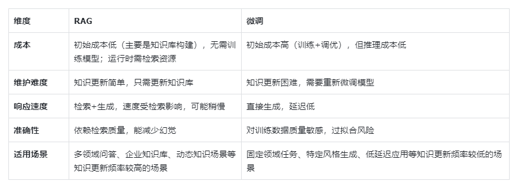

&#x20;

### 2.RAG评价指标

（Reference: 大模型RAG实战 ：4.5小节）

Rag场景下，比较著名的评估模型方法的框架是：**RAGAS**。RAGAS方法在评估过程中主要使用**忠诚度**，**答案相关性**，和**上下文相关性**来评判整个RAG系统中llm生成答案的质量。 RAGAS方法的一个优点是不需要参考答案。

具体来讲，**忠诚度**是指用户判断LLM的输出是否是根据召回文本的内容生成的。

**答案相关性**是衡量生成的答案是否和用户的答案相关的。

**上下文相关性**是用于判断召回文本是否和用户问题相关的。

（下面的可以挑一个具体的指标来展开给面试官讲，都展开讲太长了，而且内容有点抽象，如果讲完面试官不懂，可以给他举具体的例子讲解）

具体来讲：

**忠实度**的计算方式通常包括两个步骤。1：使用LLM生成的问题和答案，让大模型生成多个陈述。 2. 让LLM判断是否可以通过召回的文本，推断出这些陈述。 最后的采用能够推断出来的陈述/总陈述量最为忠诚度的评分。

**答案相关性：**&#x6839;据LLM的回答生成若干个假问题，然后计算假问题和真实问题的相似度，将相似度平均值作为答案相关性的评分。

**上下文相关性**：让LLM挑选出召回文本片段中能够回答用户问题的文本子集，用文本子集占召回文本的比例作为上下文的相关性数值。

&#x20;

### 3. 常见的向量数据库

（参考自RAG书籍）

常见的向量数据库有Milvus, Weaviate, Chroma, Qdrant。具体来讲：

**Milvus&#x20;**&#x5EFA;立在Faiss, Annoy等开源向量搜索库的基础上，能够支持**数十亿级别**甚至万亿级别的向量搜索库，并且**检索速度快**，万亿向量数据集上检索速度的延迟可以控制在毫秒级。

除此之外，Milvus还支持**数据分片**，**数据持久化，流式数据摄取**，**混合搜索**等很多高级功能。具有**高可用性**，**高性能**和**易扩展**的特点，用户还可以将其部署在Kubernetes上。并且可靠性强，具有**数据复制**和**故障恢复**的功能。

&#x20;

**Weaviate** 具有**鲁棒性**，**云原生性**和**可扩展性**的特点。它结合了向量搜索和结构化过滤的能力，同时拥有云原生数据库的容错性和可伸缩性。在百万级的向量数据上，可以实现毫秒级的检索。它可以方便调用OpenAI, Cohere以及Hugging Face平台提供的先进的数据向量化接口和模型。缺点是：目前只支持HNSW这一种检索算法。

&#x20;

**Chroma** 是一款AI原生的开源向量数据库，主要功能和特点围绕AI应用开发而设计。主要针对大模型RAG场景，目前只实现了单机方案。相比Weaviate和Milvus，Chroma更轻量化。 检索上实现了FAISS索引，不支持GPU加速。

&#x20;

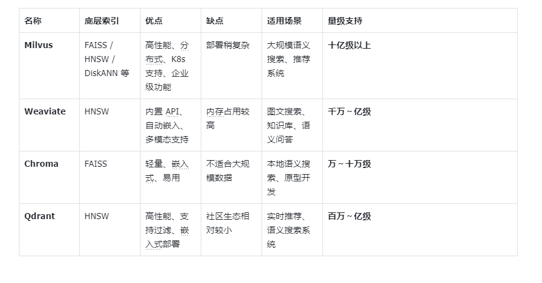

### 4. RAG的重要步骤&#x20;

参考视频

#### *4.1 切割*

这个切割是非常高频的一个考点。一定要掌握。常见的问题包括 介绍一下RAG 中常见的分割策略（4.1.1），如何避免语义被切掉（4.1.2），你的项目中是如何使用分块策略的, 为什么?（4.1.4)

##### 4.1.1切割策略

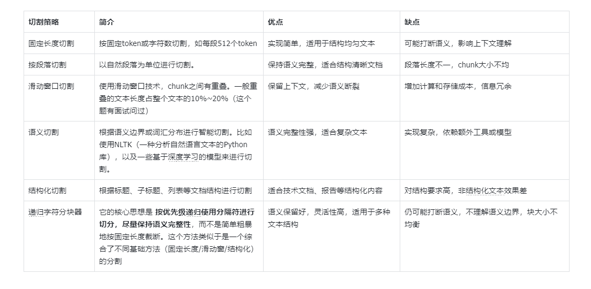

&#x20;

##### 4.1.2 如何避免语义被切掉？

滑动窗口方法中，切割的相邻两块之间都会有一些重叠。按照语义切割的方法，天然也会想语义表达一个意思的块来切割到一个chunk中，这些方法会缓解语义被切掉的问题。

同时，也可以使用一些对切割后的结构进行评估方法，比如使用模型来判断语义是否完整等方法来进行评估，对于语义丢失严重的切块重新分割。

&#x20;

##### 4.1.3 为什么需要切割？

1.**模型输入长度的限制**。大模型的输入都有允许的最大上下文长度，直接输入整篇文档可能会超出限制，因此将切割后的文本输入的llm中可以控制输入llm上下文的大小。

2.**提高检索精度。**&#x68C0;索一般都使用的是向量，如果文档太长，对文本的embedding向量也会稀释关键信息，导致召回不准。

3.**减少噪音，增强相关性。**&#x5982;果chunk太大，里面可能包含多个主题，检索时可能会产生无关信息。小的文本块则更聚焦，更容易让llm关注到相关内容，提高回答准确性。

&#x20;

##### 4.1.4 你的项目是如何分块的？

（这个问题希望大家能够自己思考，其实是要理解了上面的问题，然后结合自己的项目来回答，言之有理即可，我来给大家展示一下我结合自己的项目的回答）

在按摩房预约系统中，我根据不同的场景使用了不同的分块策略

**第一类：针对技师列表、服务菜单等强结构化数据**
我采用了 '不分块'  的策略。

* **具体做法**：将每一个技师的完整介绍（包括姓名、技能、工龄、评价）作为一个独立的 Document 存入向量库，不做任何切分。

* **这么做的原因**：技师信息是一个**不可分割的语义实体**。如果强行按长度切分，很容易导致'张冠李戴'——比如检索到了'擅长针灸'这个片段，但却丢失了'张三'这个名字的上下文。保留整体能确保 LLM 获取到完整的实体画像，保证推荐的准确性。

**第二类：针对用户协议、门店介绍、退改规则等长文本非结构化数据**
我使用了**递归字符分块&#x20;**&#x7B56;略。

* **具体做法**：利用 **LangChain** 提供的标准工具 `RecursiveCharacterTextSplitter` 进行处理。我通常将 `chunk_size` 设定在 400-500 tokens 左右，并设置 50 tokens 的 `chunk_overlap`（重叠）。

* **这么做的原因**：

  1. **语义完整性**：这种方法不是生硬地按字数切割，而是**优先尝试按段落（`\n\n`）切割**，其次按句子（`\n`或`。`）切割。这最大程度地保留了文本的自然语义逻辑。

  2. **上下文连贯**：通过设置重叠区域（Overlap），解决了'滑动窗口'的问题，防止关键信息（如电话号码）刚好被切断在两个块中间，导致检索失效。

  3. **适配模型**：切分后的长度非常适合 Embedding 模型的输入窗口，也避免了将数千字的长文直接塞给 LLM 导致'Lost in the Middle'现象或 Token 浪费。

&#x20;

#### *4.2 召回*

##### 4.2.1 召回的常用策略

RAG系统可以使用**粗排** + **重排**两个阶段来完成召回。 粗排通常使用**稠密向量检索模型**来做**语义匹配，召回语义相关文档。**&#x5F53;然也可以再结合**稀疏向量检索模型**来补充使用，因为**稀疏向量检索模型**更擅长**捕捉关键信息**来提高召回效果。

粗排后，可以使用**交叉编码器**，比如BERT来对候选文档进行**深入语义排序**，提高召回质量。

&#x20;

##### 4.2.2 稠密向量和稀疏向量

参考书籍《大模型RAG实战》 第三章文本召回模型

RAG系统中的文本向量检索模型大致分成两类：一类是基于**BERT， GPT等深度学习模型**的**稠密向量检索模型**，另一类是以**TF-IDF, BM 25 为代表的稀疏向量检索模型。 稠密向量检索模型更擅长提取文本中语义信息**，**稀疏向量检索模型更擅长提取关键信息**。

&#x20;

##### 4.2.4 对称检索和非对称检索

参考书籍《大模型RAG实战》 第三章文本召回模型

**对称检索是找到相似的句子**，与向量检索基于计算向量相似度的原理天然匹配，只需要模型具有较强的内容抽象的能力即可。

**非对称搜索是根据问题召回答案**，要求模型能够将问题和答案映射到同一空间，而问题和答案通常具有不同的文本结构。并非所有的向量化模型都支持非对称检索，只有经过大量问答数据的模型才能提供支持。

#### 4.3 召回优化策略

4.3.1 短文本全局信息增强

&#x20;   因为切块的过程难免会造成全局文本信息的丢失，因此我们为切块后的短文补充其所属的长文本信息。

&#x20;   比如以论文《DAPR: A Benchmark on Document-Aware Passage Retrieval》中提到，我们可以将**长文本的前三句话， 长文本的标题，长文本的关键词** 作为全局信息，和切块后的文本一起保存。

4.3.2 召回内容上下文扩充

&#x20;   在RAG切块的时候，对长文本切块后，可能会有较大的信息损失，因为我们从数据库中召回的通常是短文本。这时我们可以采用召回内容上下文补充的方法：**召回的是短文本，但是输入LLM处理的是短文本的父文本（长文本）**。 好处是既**精准**（基于短文本匹配），**又完整**（基于长文本输入）

&#x20;   在Langchain中，我们可以使用**ParentDocumentRetriever** 来完成这一功能，它使用了两个分割器，**Parent\_splitter**和**child\_splitter**。 前者用于确定在RAG场景下输入到大模型的父文本块的大小，后者确定从向量数据库中召回的子文本块的大小。同时还会存储父子文本块的映射关系。 当使用get\_relevant\_documents召回时，返回的实际上是父文本的内容。

4.3.3 文本多向量表示

&#x20;    在构建向量数据库的时候，可以使用多种向量来表示同一段文本。比如有一段文本A，我们不仅可以使用完整的A来生成向量，还可以使用它的**子集**，**总结句**来生成补充向量。当召回任意的补充向量对应的文本后，并不是将其输入大模型中，而是将其对应的文本A输入。

常见的生成补充向量的方法有：

&#x20;  &#x20;**&#x20; 文本切块:&#x20;**&#x5C06;原始文本切块后保存到数据库中，可以在召回时增强对更细粒度的表示。

&#x20;     **文章摘要：**&#x5229;用LLM生成摘要。

&#x20;     **假设性回答：**&#x53EF;以利用大模型的能力，根据文本提出问题，把问题作为补充信息。这种方法的思想是用问题召回问题会比用问题召回答案更容易。

4.3.4 内容查询优化

&#x20;    很多情况下，用户提出的内容有口语化，语义模糊，无关内容多的问题。 因此直接将问题变成向量可能和用户的真实意图不相关，从而影响RAG场景下的召回效果。因此，我们可以对用户的原始问题进行改写和扩充，再进行召回。

常见的对原始问题优化的方法有：

&#x20;      1.使用LLM 改写和扩充，比如LangChain提供的MultiQueryRetriever就能集成了这个功能。

&#x20; 2.对历史问题进行总结，然后再进行召回，这个特别适用于多轮对话中。比如&#x20;

&#x20;   用户：中国的首都在哪里？

&#x20;   LLM：北京

&#x20;   用户：那里有哪些好玩的景点？

&#x20;   这时直接用原来的问题召回显然太模糊，如果用LLM总结后，问题就变成了北京有哪些好玩的景点。

4.3.5 召回文本重排序

&#x20;       在RAG场景下，默认使用的是向量召回，检索效率高。但是由于文本向量化的过程中存在着信息损失，并且在召回过程无法考虑查询用户和候选文本上下文关系，因此召回精度不高。 所以在召回向量后，通常还会进行召回文本的重排序的精筛。

最常用的重排序的模型是基于**Transformer编码器架构的交叉编码器**。将用户查询和一段候选文本同时输入到模型之中，预测它们之间的相关性分布。使用这种方法可以考虑到用户查询和候选文本的上下文关系，因此有更高的精度。

4.3.6 结合元数据召回

在实际场景中，很多情况我们不需要在整个向量数据库中进行召回。如果在存储文本向量的时候同时记录了每个向量相关的标签，就可以在召回时现根据标签信息过滤出所需的向量子集，有利于提高检索速率，避免检索无用的信息。

现在的大模型应用框架，Langchain就基于多种向量数据库，集成了元数据写入和召回过滤的能力。我们可以使用**Langchain的Create\_metadata\_tagger**的接口，借助大模型的能力，自动生成元数据。

&#x20;

### 5.常见文本嵌入的方式

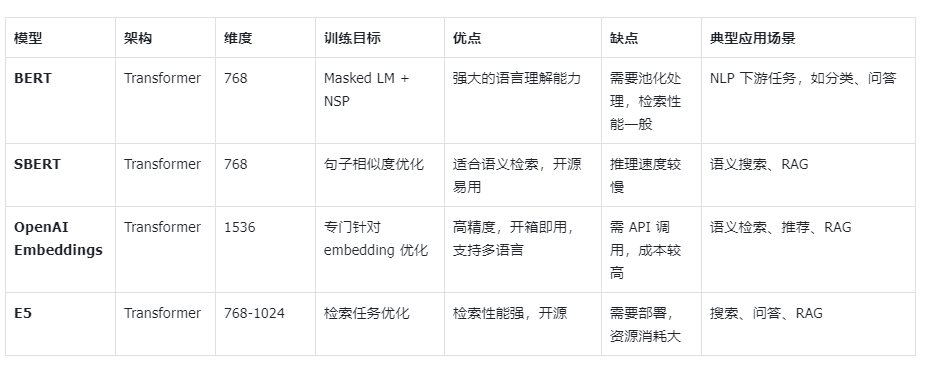

### 6.RAG场景题

4.1. 如果我做 rag 召回的相关内容里，会有人恶意注入了一些错误的信息， 你觉得会影响大模型的生成内容吗？怎么避免？

会影响生成内容。 我认为：

1. 可以限制拿到的数据的来源，只选择可靠的数据源。

2. 可以对拿到的数据进行安全性检验，检验是否包含恶意指令

&#x20;

&#x20;

# Agent

## 1.Agent开发框架&#x20;

（Agent的开发框架是必考的内容，必须要会，最常见的问法就是让你讲解现在主流的框架有什么，他们的区别，然后往深入了问，问的最多的是Langchain/langgraph的区别，他们的组成。 除此之外，如果你自己的项目中比如使用了某个特定框架，你也需要对这个特定框架有更深入的理解）

### 1.1常见的Agent开发框架

&#x20;（参考文章：https://mp.weixin.qq.com/s/qyCLff0WG15bEQvjodF-GQ，为啥总结这5个框架，因为这5个是最火的（参考Github star数量）。通常来说，你项目用到了哪个框架，哪个框架就要继续深入了解知识，我用的是Langchain，所以对于Langchain/Langgraph就要深入。如果你们使用了其它框架，请针对于你使用的框架，自己深入准备相关知识。）

**AutoGPT**

自主型 Agent 框架，通过“思考–执行–反思–再规划”循环自动推进任务，强调高自主性与多步任务拆解能力，但可控度较弱。

**LangGraph**

基于有向图的 Agent 流程框架，用“状态机 + 图结构”确保任务步骤可控、可观测、可解释，适合多步工作流的稳定执行。

**Dify**

面向应用构建的 LLM 平台，提供 UI 化的工作流、工具集成与模型管理，降低 Agent/AI 应用开发门槛，强调易用性与产品化。

**CrewAI**

多 Agent 协作框架，让多个具备角色与技能的 Agent 自主协作完成任务，适合开放式探索和需要团队式分工的复杂任务。

**AutoGen**

微软开源的多 Agent 协作框架，强调“人机协作 + 多 Agent 对话控制”，具备较强的可调试性、可观测性与对话流控制能力。

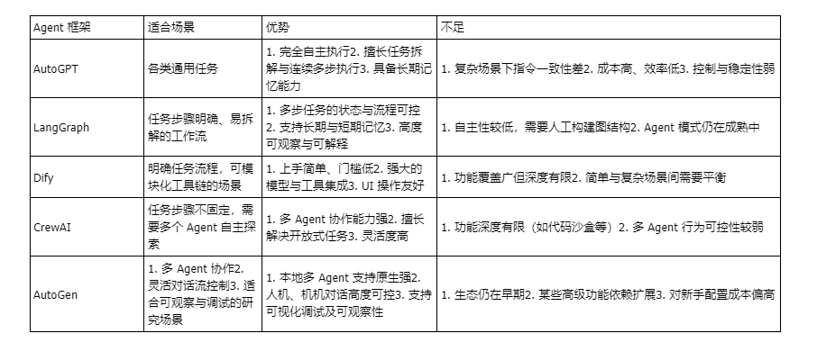

### 1.2 LangChain 核心设计理念和框架

（算是基本概念，得背）

Langchain 的核心思想是 通过模块化组件： **Prompt, Memory, Tool, Chain 将LLM与外部数据源，工具（向量数据库，多种LLM）结合**，形成**可复用的“链式逻辑**“。特点是灵活，生态丰富，适合快速原型开发。

特点是：**以链为核心，逻辑是线性和简单分支**，不擅长复杂状态管理。

#### **1.2.1 LangChain的版本**

（面试官偶尔会问你使用的是哪个Langchain版本，因为Langchain版本更新的确实比较频繁，我知道大家可能有时没太关注版本，我这里整理了一个表格，你需要根据表格里对应Langchain的时间来推断出你当时大概用的哪个版本，要心里有数。从这个表中，大概率可以看出在25年中的时候，我开发的项目，使用的是v0.3.6的Langchain版本，也是在这个时候引入了Graph的概念。弄清楚你用的哪个版本是我们要掌握的）

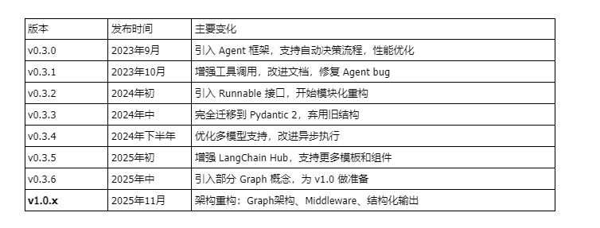

#### **1.2.2 LangChain 1.0新版本**

(LangChain在25年11月份发布了新版本，其实是大的变化。如果你已经做完了项目，并不是说你就要用最新的版本再做一遍，讲起来Langchain的时候，你还是按照我上面设计的答案去回答就行，然后面试官可能会问你新版本你了解吗？你再给讲讲1.0版本的特性。如果你还没做项目，现在开始做，那么推荐你直接用1.0。现在这个还不是硬性要求的，面试很多时候其实并没有一定要考察你新版本，他这个刚刚发布，可能面试官都没太用。暂时我们先粗略了解1.0的新特性就够了，如果后面我发现面试官开始倾向于问1.0的问题，我再来总结更多新版的知识。

我这里的复习思路是**大概理解一下新特性思路和思想就好了，不用太深入研究，**&#x56E0;为目前问的不多，面试官最多问道你知不知道langchain新版本。 如果你想要深入学习一下，可以看https://mp.weixin.qq.com/s/asAiFhl8mWIl01s-LSD9VA）

Langchain v1.0的升级 标志着 LangChain 已经走出“实验阶段”，成为一个稳定、可用于生产的框架。具体来讲，在这次升级，引入了以下新特性：

1. 智能体（Agent）的全新创建方式

   * 之前的 Agent 创建方式比较复杂，需要手动配置多个组件。

   * v1.0 提供更简洁的 API，通过标准化的构建流程，开发者可以快速定义 Agent 的行为、工具调用逻辑，并且支持更复杂的任务编排（比如多步骤推理、条件分支）。

2. 中间件机制（Middleware）

   * 类似 Web 框架的中间件概念，可以在执行链路中插入逻辑。

   * 应用场景：日志记录、性能监控、错误重试、缓存、权限控制。

   * 好处：开发者无需修改核心逻辑，就能在执行过程中添加这些功能，提升可维护性。

3. 结构化输出

   * 之前 LLM 输出是纯文本，容易出现格式错误。

   * v1.0 支持 JSON Schema 和 Pydantic 类型验证，可以强制模型输出符合预期结构。

   * 好处：减少 LLM 不确定性，适合生产环境，尤其是需要严格数据格式的场景（如 API 响应、数据库写入）。

4. 标准内容块

   * 提供标准化的 Prompt 模板、工具接口、链组件。

   * 好处：降低重复开发，开发者可以直接复用官方标准块，减少定制成本。

5. 全新的包结构与模块化设计

   * 命名空间重构：拆分为 `langchain_core`（核心逻辑）、`langchain_community`（社区集成）、`langchain_experimental`（实验功能）。

   * 好处：模块职责更清晰，升级和维护更方便，避免以前版本中“包太大、依赖混乱”的问题。

#### 1.2.3 LangChain 不方便的地方

（ 这个问题相比前面的Langchain的基本问题，肯定没有出现的那么频繁。不过这个题目是我从面试真题截取的来，而且这个问题其实也不止被问到一次，反应了面试官想了解你对Langchain的理解是不是浮于表面，有没有一些更深的理解，建议也需要掌握，即使面试官不主动问，你在和面试官聊Langchain的时候也可以找个时机回答出来这两点，体现你其实对这个框架有一些深入的思考，答出来一定会加分。当然这个问题的反面题，你觉得Langchain有没有一些方便的地方，这个你可以回答它集成了各种方法，比如RAG的召回优化，RAGAS的评测方法等，之前笔记我都写出来了）

**1.依赖过多，复杂度高**

LangChain集成了大量向量数据库，模型提供商和工具，虽然理论是可选，但是实际使用中很多功能需要安装一堆依赖，导致项目臃肿，容易出现"依赖地狱", 对于只需要简单功能的项目，这种设计显得过度。

**2.频繁更新，接口不稳定**

LangChain迭代速度太快，但是带来大量破坏性更新，API接口经常变化，文档之后，导致开发需要不断重构代码，维护成本高。

**3.性能和延迟问题**

LangChain的链式调用每一步都可能涉及外部API， 导致延迟明显，尤其是需要实时响应的场景中表现不佳，链式调用其实也增加了出错概率和调试难度。

**4.不够灵活，定制困难**

高度抽象导致很多底层逻辑无法轻易改变，遇到特殊需求时，开发者往往需要绕过框架，甚至重写部分功能。

### 1.3 LangGraph&#x20;

（LangGraph 相关知识，深入学习可以看这个，很全面 + 有代码示例https://mp.weixin.qq.com/s/XhFbLTLcSjDj0r3KGT9EOg）

#### 1.3.1 LangGraph 介绍/主要模块

（基本概念，肯定得背）

LangGraph 通过将任务组织为 **有向图**，而不是线性链，来解决 LangChain 在复杂任务中的局限。它支持 **条件分支、循环、并行执行和状态共享**，并且能够实现多 Agent 协作和复杂工作流。核心模块包括：

Graph：整体工作流的图结构

Node：图中的计算单元

State：共享状态，用于节点间传递上下文

Edge：连接节点，定义控制流和数据流

这种设计使 LangGraph 在处理动态逻辑和多步骤推理时更灵活、更可扩展。

#### 1.3.2 LangGraph 过程是如何流转的？

**定义图结构**：用 `StateGraph` 添加节点和边，指定入口节点（`set_entry_point()`）和结束条件（`END`）。

**编译图**：调用 `graph.compile()`，生成一个**可执行图对象**（相当于执行器，负责调度和状态管理）。

**启动执行**：通过 `invoke(initial_state)` 或 `stream(initial_state)` 开始运行，传入初始状态。

**执行逻辑**：&#x20;

* 从入口节点开始执行。

* 根据边决定下一个节点，如果多个节点同时满足条件，就**并行执行**。

* 每个节点跑完后，把输出合并到共享状态。

* 重复调度，直到路由到 `END` 或没有后续节点。

**结束**：返回最终状态，或者用 `stream()` 观察每一步的状态变化。

### 1.4 Semantic kernel核心设计理念

(其实Semantic kernel 用的并不多，微软内部的框架，因为我在微软，所以我的项目用的它，面试起来难免问到它，**大家基本可以不用复习**）

Semantic Kernel的核心理念是让AI**能力像插件一样无缝嵌入到企业应用和现有系统**。核心思想是通过插件化技能，结合LLM，传统代码和外部服务，**构建安全，可治理的AI**应用。

&#x20;

## 2.Function Calling

（Function call的能力其实一直都是 Agent非常重要的考点，虽然在实际面试中考察的并不是特别多，以下两个问题是来自于某次面试原题）

### 2.1 Function calling是如何被训练出来的

Function calling是通过在模型训练的**预训练阶段**使用**自监督学习**，在**微调阶段**使用**SFT技术**，以及在**对齐阶段**使用**RLHF技术**来是模型具有能够理解用户意图并生成函数结构化的函数调用请求的能力。

具体来讲：

预训练阶段的自监督学习使得模型能够理解自然语言。

微调阶段的SFT技术使用标注数据让模型理解何时该调用函数，调用函数的格式是什么。

对齐阶段使用RLHF，使用人类的反馈来优化调用结果，使模型的调用更符合人类的习惯。

&#x20;

### 2.2 工具调用失败问题

在使用一些Function call的接口设计的时候，如果参数比较多，实际使用中发现LLM调用失败（可能是没理解调用的时机）或者是缺少了必填的参数（导致调用失败），这个应该如何避免呢？

1.**重构函数设计**：《代码整洁之道》中就写过，函数参数最理想的是0个，其次是1，再次是2，我们应该尽量避免有3个及以上的参数，所以出现这种情况我们可以先考虑是否有必要重构。

2.**可以拆分函数**，让函数满足单一职责地原则，避免有过多地参数。

3.**优化JSON Schema设计**。 在JSON Schema中清晰地标明参数类型，是否必填，默认值，写清楚参数描述。

4.**优化函数/参数命名**。 让命名更具有描述性，便于LLM理解。

4.**优化提示词设计**。可以在提示词中加入一些引导，给出一些调用示例。

6.**可以增加一些验证，反馈，重试机制**。比如在调用前对参数进行验证，判断是否有误，如果调用失败，可以把失败的信息传回给LLM，让他利用这个信息重试。

## 3. Agent 性能评估

（参考资料：第一个资料更多的是理论上的知识，告诉我们评估一个Agent的性能，我们应该如何做？怎么做？

&#x20;  第二个资料是工程实践，具体到某一个任务中，美团针对他们的业务是怎么做评测。

&#x20;  二者结合，刚好从理论到实践，全方面来学习这个知识。

&#x20;  本节是面试高频考点，必须仔细学习。 学完后可以应付以下面试问题：

&#x20; 1\. 如何评价一个Agent的性能？（参考资料1）

&#x20; 2\. 你的项目中如何是对Agent进行评估的？（结合参考资料1和参考资料2，针对自己的项目，设计你的评估方法，用上参考资料1和参考资料2的思想，我下面笔记会展示针对我项目总结回答，你可以参考，你必须要准备一个针对你的项目的自己的回答，**这个知识点很重要**，再次强调。）

&#x20; 3\. 最近看了什么论文，可以讲一下吗？（参考资料2）

**参考资料：**

1. 《Agentic Design Pattern》https://github.com/ginobefun/agentic-design-patterns-cn/blob/main/25-Chapter-19-Evaluation-and-Monitoring.md

2. 美团龙猫论文 ：《VitaBench: Benchmarking LLM Agents with Versatile Interactive Tasks in Real-world Applications》 https://arxiv.org/pdf/2509.26490

&#x20;   ）

### 3.1 如何评价一个Agent的性能？

（Agent性能评估的理论知识，**必考**.&#x20;

&#x20;我下面这个答案的**设计原则**：

**&#x20;第一段是一个总体性的回答**： 点出各个指标对于传统工程和Agent工程的区别，因为有一些指标是Agent特有的，这也是面试可能问的点，我直接在总体性回答中点出这一点，并列举相关评测指标。

**&#x20;第二块对所有的指标具体讲解**： 注意这里我不光讲了这个指标是啥，还讲了怎么做，其实面试官问这一问题的时候，我们可以只一一回答是什么，怎么做可以不讲，要不太多了，但是大家需要知道怎么做，所以我列举了，具体细节也可以看这个参考资料1，3.1的回答都是基于这个总结

**最后一块是总结，告诉面试官这是理论，具体实现要根据工程结合**。这块其实就埋下了伏笔，面试官可能问你那到底怎么落地呢？你就可以接下来根据3.2和3.3 来讲具体的落地实现细节。）

**对于 Agent 性能的评估，既需要对传统工程里本来就有的指标进行评估**（如**延迟、资源/成本、A/B 测试**），**又由于 Agent 的语义生成、概率性与长流程/工具使用等特性**，**需要新增或强化一些特有指标**（如**响应质量，轨迹评估，RAG系统评测**）。&#x20;

一、传统工程通用指标（Agent 也必须做）

1. **延迟**
   **是什么**：请求→输出的耗时，直接影响交互体验与整体效果。
   **怎么实现**：将延迟写入**持久化**系统（结构化日志/JSON、数据仓库 、可观测平台），做趋势分析与阈值告警。&#x20;

2. **资源与成本**
   **是什么**：生产环境下跟踪计算与外部服务消耗；在 LLM 场景，成本与 **Token 数量**强相关。
   **怎么实现**：为每次交互记录**输入/输出 Token**并累计统计，用于预算管理与提示/生成流程优化。

3. **A/B 测试**
   **是什么**：并行比较不同 Agent 版本或策略，系统性识别更优方案。
   **怎么实现**：在生产/灰度环境对两版 Agent 同时运行，持续比较关键 KPI（解决率、响应时间、错误率）。&#x20;

二、Agent 特有/更突出的指标

1. **响应质量**
   **是什么**：判断输出是否**相关、正确、合逻辑、无偏见**且**符合用户意图**
   **怎么实现**：

   * **基线**：**严格匹配**。&#x20;

   * **进阶**：**字符串相似度**、**关键词命中**、**嵌入语义相似度**。&#x20;

   * **主观/细粒度**：**LLM‑as‑a‑Judge** + **Rubric** 产出结构化评分，用于“有用性”等主观维度。&#x20;

2. **轨迹评估**
   **是什么**：不仅看最终答案，还要看**过程是否合理**：工具选择、调用顺序、策略质量、是否遵循理想路径。
   **怎么做**：将**实际步骤**与**理想轨迹**对比，可采用：

   * **精确匹配**（步骤完全一致）、

   * **顺序匹配**（序列一致）、

   * **任意顺序匹配**（集合一致）、

   * **查准率/查全率**（命中该用的工具与必要步骤）。&#x20;

* **RAG 系统评测**

  **是什么**：评估答案是否**只依据检索到的证据**（忠实度）、是否**紧扣用户问题**（相关性），以及**引用是否可追溯**（归因/来源标注）

  **怎么做：**&#x6211;们可以使用RAGAS 这一套评估标准来对RAG系统进行评估。

值得一提的是为 AI 智能体开发一个全面的评估框架是一项具有挑战性的工作，其复杂性可与一门学术学科或一本实质性出版物相媲美。这种困难源于需要考虑的众多因素，例如**模型性能、用户交互、伦理影响和更广泛的社会影响**。具体的工程落地的评估方法还需要根据具体的项目实际情况进行方案定制。

### 3.2 美团龙猫论文的核心思想和方法论

（此问题用来给面试官讲解你看的论文，或者有相关契机，你也可以把话题引到这里讲，我简单的总结了美团龙猫的思想，其实里面还有非常多具体的实现信息，感兴趣的当然是继续深入学习，知道每一个细节知道他到底是怎么做的比较好。当然从面试的角度来说，一般面试官都没有继续追问细节。）

美团龙猫这篇论文在讨论如何制作数据集，如何对Agent的性能进行评测，具体来说他们的做法是：

**数据集的制作：**

将真实本地生活业务抽象成一个"**可交互的工具环境**", 他们将外卖，到店，旅行等场景提炼出一张工具以来图和配套的数据和用户模拟器，组合出**单场景和跨场景任务**，从而制作出一套数据集。

**性能的测评**：

他们将对Agent的测评维度拆分成：**推理，工具，交互**三个维度。具体来讲：

**推理维度**是指Agent是否可以在部分可观测，信息不完备的环境中，将分散线索整合并做出正确抉&#x62E9;**。**

**工具维度是指&#x20;**&#x5728;工具依赖图中，Agent是否可以**正确选择工具，满足前置条件，使用正确的参数。&#x20;**

**交互维度是指**指在多轮对话中，能否识别模糊意图，主动澄清，在用户画像与表达差异中维持上下文一致，确定关键决策点。

基于这三个维度，创建一个评判规则，并且把每个任务拆分成不同的步骤，通过一个**滑动窗来**对这些步骤进行基于这些规则进行评分，最终按条目汇总这些每一步的结构，得到 **任务成败 + 工程命中率 + 失败归因**的多个指标。

### 3.3 你的项目中是如何对Agent进行性能评估的

（其实说实话我的项目没有太做Agent评估，毕竟不是一个企业项目，我自己没做到那一步，但这个问题是必考。结合3.1 和 3.2的理论知识，我准备的回答是这样的。其实是把上面的一些思想结合自己的业务大概想一下是怎么实现评估的。如果你也没做，这里尽量想的细一点知道整个流程大概是怎么做的，然后结合自己业务，你要自己说服自己，以下就是你自己做的。以下是我的答案供大家参考。）

系统中主要使用**离线测试**和**在线追踪**两种方式对Agent进行评估。&#x20;

**离线测试**中，我们会构建  JSON/JSONL 的数据测试集文件。主要从**对应的响应质量**，**轨迹状态&#x20;**&#x548C;**效率&#x20;**&#x4E09;个方面对Agent系统做测评。

**响应质量**主要包括：

分类的结果：比如邮件是否和行程相关。

邮件提取内容：包含主题，地点，人物等。

**轨迹状态：**&#x6570;据集中会指定预期的Agent标准输出路径和工具调用情况。比如第一步是分析邮件->提取信息->发送通知 的路径，会将输出和数据集路径对比，判断Agent是否遵循了标准流程。

**响应质量**和**轨迹状态&#x20;**&#x4F1A;采用LLM Judge的方式，将采集到的输出和数据集Json进行比较，输出评测报告。

**在线追踪**是指：对于过程也会统计整个过程端对端延时，每一步token占用情况，每次系统运行时都会统计并且上传到云端面板，实时分析。制定阈值方案，当发生异常时，也会及时报警。

## 4.MCP

（这章的所有内容都是面试出现过的真题，都是我根据真题来总结的，都建议掌握，这个问题是MCP的概念，肯定是必背的）

MCP 是一种**标准化接口协议，**&#x7EDF;一了AI模型与外部资源的连接方式，用于让LLM能够访问外部的**数据**，**工具**和**提示词**。

MCP采用**客户端-服务端架构**，包含三个关键组件：Host, Client,和Server. 其中Host是运行LLM的应用程序。Client是在Host中运行，负责与MCP Server通信。Server中暴露了**工具**，**数据资源**，**提示模板**等，供LLM使用。

MCP的典型优点是**动态能力更新(**&#x5DE5;具参数变更时无需重写客户端代码)，**接口标准化**(不同工具统一接入，减少开发成本)的特点。

### 4.1 MCP 和 Function calling 的区别

（面试也出现过，挺基础的一个考点）

《Agentic design pattern》第10章专门有对这一问题进行讲解。

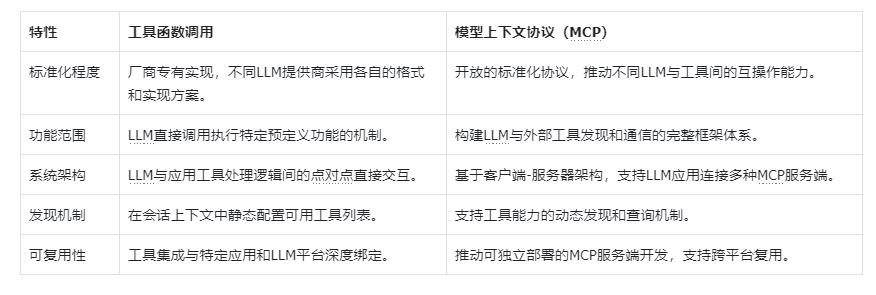

### &#x20;4.2 MCP 本地Server和远端Server 的对比

（我根据这个视频https://www.youtube.com/watch?v=wlerSyHzoCI总结的，但是如果有余力，还是建议自己看一下这个视频，表格的东西不难，重要是你自己能够理解，视频里都有，大家可以更深入理解一下，我在字节跳动一面的讲解视频中应该也会过一下这个表格，大概讲一下）

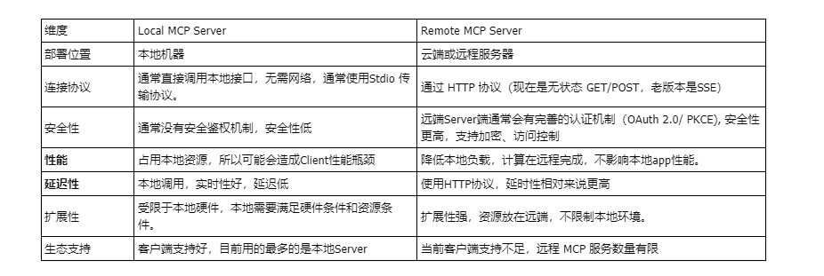

### 4.3 MCP的传输协议

(最开始我复习的时候就是弄清楚了两种协议，本地:Stdio 远端：SSE，这也是有一些视频这么讲的。但我在面试的时候，其实因为这个答案被挑战过，因为现在SSE在MCP里已经被替代了，所以我有了以下答案，相对来说这个答案是比较完整的，这题也是面试会考的题）

MCP的传输协议针对于**本地服务器**和**远端服务器**有明显区别。

对于远端MCP Server, 协议在 2025 年 3 月进行了重大更新：原先采用 **有状态的 HTTP 长连接**，并强制使用 **Server-Sent Events (SSE)** 来实现服务器实时推送，这种方式复杂且对网络稳定性要求高。新版本改为 **无状态协议**，主要通过 **标准的 GET 和 POST HTTP 请求**完成交互，SSE 变为可选增强功能，只有在需要实时推送时才启用。这一改动降低了实现复杂度，提高了兼容性和灵活性，使协议更接近 REST 风格，易于集成和扩展。

对于 **本地 MCP Server**，通常运行在开发者机器上，直接通过本地接口或 STIDO（标准 I/O）进行通信，不涉及网络传输，因此不需要复杂的认证或长连接管理。

### 4.3 MCP的参考资料

基础视频：推荐两个，马克的和爬爬虾的，这两视频可以从你0MCP基础到了解知道MCP是啥，可以动手接一接。

进阶视频：马克老师的进阶视频其实挺好的，特别是讲了抓包，让我们详细了解了中间发生了什么。看完内容对于我们笔记部分 其他问题-你在项目中遇到的最难的问题，如何解决的-MCP偶尔连接失败 的问题理解有很大帮助。 这几个视频就是当时我0 MCP基础去看的，也没有看其他视频。应该来说你把这几个按顺序看懂了，MCP就理解了，自己再动手做做，看看真题就行了。

## 5 Agent的记忆功能？

（属于**必考内容**，熟练掌握

《Agentic design pattern》第八章有对这一问题专门讲解

[agentic-design-patterns-cn/14-Chapter-08-Memory-Management.md at main · ginobefun/agentic-design-patterns-cn · GitHub](https://github.com/ginobefun/agentic-design-patterns-cn/blob/main/14-Chapter-08-Memory-Management.md)）

Agent 的记忆功能通常分为**短期记忆**和**长期记忆。**

**短期记忆**通常存在于**上下文窗口**，包含最近的**对话消息**，**智能体回复**，**工具调用结果**，**以及当前交互的反思内容。** 但是上下文窗口的容量有限，所以当多轮对话时，我们可以通过**总结旧对话片段**，**强调关键细节**等技术来维护这个上下窗口。当会话结束，短期记忆会丢失，所以我们通常也会让Agent支持长期记忆。

我们通常使用一个**知识库**，存储智能体在各种交互场景，任务执行过程中需要长时间保存的信息。数据通常存在智能体运行环境之外，比如**数据库，知识图谱，或者向量数据库中**。当智能体需要使用长期记忆时，**会查询外部存储，检索相关信息和数据并整合到上下文窗口中**然后进行使用。

### 5.1 介绍Langchain中的记忆功能的实现。

(短期记忆）Langchain中通过**ConversationBufferMemory**的接口，可以实现只保存几轮对话，或者使用LLM总结历史对话的短期记忆功能。

（长期记忆）通过**VectorStoreRetrieverMemory**可以将信息变成嵌入向量，存入Chroma, weative, FAISS的数据库中，并且支持语义搜索。

### 5.2 介绍Langgraph中的记忆功能的实现。

(参考https://mp.weixin.qq.com/s/XhFbLTLcSjDj0r3KGT9EOg， 这个文章对Langgraph的各方面写的很详细，想深入学可以仔细阅读，想简单学习可以当字典查。比如这个Langgraph的记忆功能，这里面就有现成答案，我直接照抄，不理解的可以看原文，里面也有讲解，原文里还有代码。）

&#x20;记忆是智能体运行中记住先前交互信息的组件，是能够连贯对话的核心能力，LangGraph中提供了**短期记忆和长期记忆。**

**1、短期记忆：**&#x5B58;储当前对话上下文的信息，作用于单次会话或线程，通过thread\_id（会话id）区分，通过**图状态**（State）和**检查点**（Checkpoint）实现。

**2、长期记忆：**&#x957F;期记忆用于存储那些需要在不同会话间保留的信息。它通过 **存储库（Store）** 接口实现，类似于一个键值数据库，并支持基于向量嵌入的语义检索。与线程范围的短期记忆不同，长期记忆保存在自定义的“命名空间”中。

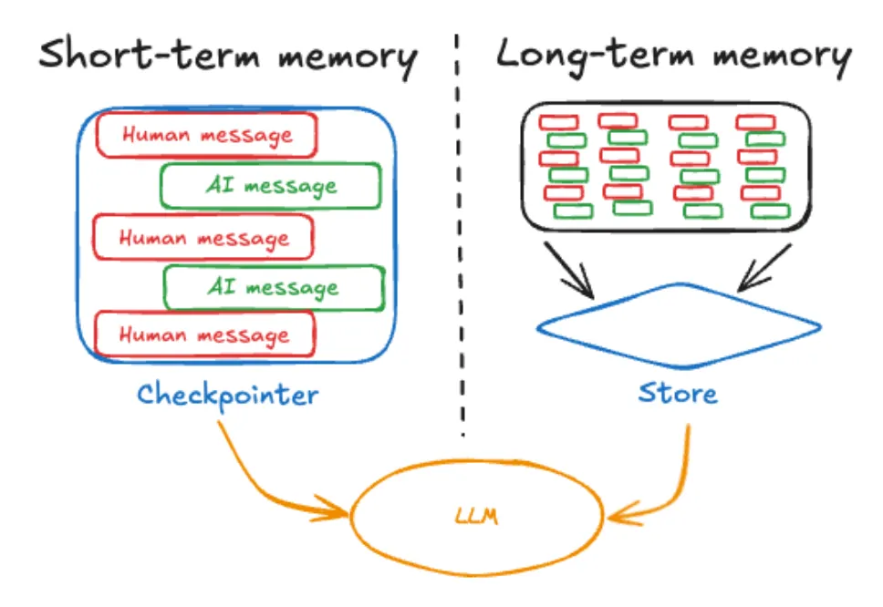

### 5.3 长期记忆的常见应用场景

（依旧是从我推荐的书籍《Agentic design pattern》中给大家总结， 在面试聊到长期记忆的时候，我们可以给面关举一些常见应用场景下具体的长期记忆的例子，这个问题倒是不会直接被问。不过记忆部分是重点，很多场合其实会聊到。聊到了能清晰有条理的列举一些长期记忆典型例子就很好。）

https://github.com/ginobefun/agentic-design-patterns-cn/blob/main/14-Chapter-08-Memory-Management.md

常见的长期记忆的例子是：

1\. 聊天机器人 / 对话式 AI：

**存储内容：**&#x7528;户偏好、过往对话摘要、关键话题记录。

**作用**：提供个性化且连贯的交互体验，避免用户重复自我介绍，让对话更自然流畅。

2.个性化服务AI：

**存储内容：**&#x7528;户偏好、历史行为模式、个人画像信息

**作用**：动态调整响应策略和推荐内容，提供更精准的个性化服务。

3.智能客服 / 售后 AI

**存储内容：**&#x5386;史工单、问题解决记录、用户满意度反馈

**作用**：快速定位老用户的历史问题，避免重复排查，提升服务效率。

>
>
>

## 6 Multi-Agent 架构

（Multi-agent 设计架构应该来说是Agent项目里最常用的设计方法了。面试的时候难免会和面试官讲到。面试是我也不止一次被问到 多Agent 和 单Agent架构的区别。这里的重点就是弄清楚，多Agent 有哪些架构？各个不同架构的优缺点是什么？我们应该怎么设计架构？如果知道了这些，比如小红书面试资料中和你讨论架构设计的时候，其实你就可以比较游刃有余了。 其实这些问题都在这个论文中（https://arxiv.org/pdf/2512.08296v1 ），这个论文不光回答了这些问题，回答的还很深入，从数学，实验数据的角度来回的。本节整理了相关问题，和参考资料）

**参考资料：**

**https://github.com/ginobefun/agentic-design-patterns-cn/blob/main/13-Chapter-07-Multi-Agent-Collaboration.md&#x20;**（这个资料比较浅，对于多Agent架构设计这块显得不够，可以作为多Agent入门参考资料）

https://arxiv.org/pdf/2512.08296v1 （这个论文很权威，对于多Agent问题讲的非常深入，包括架构设计，如何选择Agent架构，非常建议阅读，**说实话你能把整个论文吃透，在Agent架构这里就掌握的差不多了**，但是直接看原文可能比较费力，可以看一些相关对这个论文的总结文章，比如下面推荐的文章。笔记部分也是根据这个论文内容来整理的。另外大家在讲这个Agent架构/多Agent的时候，也可以自信的告诉面试官，你是看了这个google的最新的论文来得到的知识，或者面试官让你分享最近看的论文的时候，也可以讲一篇，这篇是25年12月google刚发布的，具有时效性和权威性。）

以下是一些针对于这个论文的辅助资料，其实你能消化清楚这个论文

，可以不用看辅助资料，如果读论文吃力，可以配合一些辅助资料。

https://mp.weixin.qq.com/s/QD9oYVrD7mHKKZu802vovQ （上面这篇论文的辅助资料，论文原文可能太深奥，这个是对上面论文的总结）

https://zhuanlan.zhihu.com/p/1982756998425632940（辅助资料）

）

### **6.1 典型的Agent架构**

（看着就是几种模式，其实你更要想清楚，这几种模式为什么好/不好，使用什么场景，理解复杂度指标，这个需要一些理解成本的，不要以为这个很简单，请大家结合上面资料理解一下，另外这块确实很重要，也值得我们仔细理解）

1\) **SAS（Single-Agent System）单体架构**

**交互类型**：一个 Agent 顺序地感知→推理/规划→行动→迭代。

**复杂度指标:**

* LLM调用次数:O(T)  (T为推理轮次)

* 顺序深度:T

* 通信开销:0

* 并行化能力:1

**特点**：**最简单、最稳**。当单体基线已经不错（论文里经验阈值≈**45%**），再加协调通常**收益递减或为负**。顺序型长链推理（一步错步步错）用单体更安全

**适用场景**:工具密集型任务、顺序推理任务、单Agent基线性能已经较高的场景。

2\) **MAS（Independent）独立多体**

**交互类型**：多个 Agent **独立并行**做同一任务，最后做**聚合/投票/综合（Synthesis）**。

**复杂度指标:**

* LLM调用次数:O(N·T) + O(1)

* 通信开销:1(仅最终聚合)

* 并行化能力:N

**特点：并行度最高、协调成本最低**，但缺少互相纠错的机制；论文发现这种拓扑的**错误放大**最严重（**17.2×**），因为各自错误会在聚合时被“叠加/扩散”。

**适用场景**：**独立样本批处理**（如并行评审、并行方案生成），且**容错**要求不高的场景。若任务需要大量工具或严格一致性，谨慎使用。

3\) **MAS（Centralized）中心化**

**交互类型**：有一个协调者/主管（Orchestrator）分解任务、分派子任务、收集结果、裁决与收敛。

**复杂度指标:**

* LLM调用次数:O(R·N)  (R为编排轮次)

* 通信开销:R·N

**特点**:**稳健性更好**，论文显示集中式能把错误放大从 17.2× 控到 **4.4×**；在**可并行的金融推理**等任务上，集中式提升可达 **+80.9%**。核心在于**有权威收敛与质量门控**。
**适用场景：**&#x53EF;拆分且需要**统一口径与质量控制**的任务（财务核对、批量报告编制、数据清洗流水线）。注意主管本身可能成为**瓶颈**，需把轮数 r 控制在合理范围。

4\) **MAS（Decentralized）去中心化辩论**

**交互类型**：Agent 之间**点对点交流/辩论（Debate）**，通过多轮互相质询与改进，最终**多数表决或共识**。

**复杂度指标:**

* LLM调用次数:O(D·N)

* 通信开销:D·N²

**特点：**&#x80FD;带来多视角对齐与相互检验，在**动态网页导航**这类需要不断相互纠偏的环境中，论文观测到去中心化略优（+9.2% 相对集中式 +0.2%）。但辩论的通信/时延开销显著。

**适用场景**：信息动态、需要探索与互评的任务（例如复杂检索、策略博弈）；但在**工具密集或预算受限**时，通信税会拖累表现。

5\) **MAS（Hybrid）混合式（层级 + Peer）**

**交互类型**：在集中式的**层级管控**之上，允许**定向的点对点交流（Peer）**——既有 Orchestrator，也允许子 Agent 之间按需互通。

**复杂度指标:**

* LLM调用次数:O(R·N + P·M)  (P为点对点轮次)

* 通信开销:R·N + P·M

**特点：**&#x7ED3;合了**集中式的收敛**与**去中心化的灵活**，适合大型复杂任务，但要小心 **Peer 通信税**与**一致性管理**。设计时通常加**通信限流/白名单**，避免消息爆炸。

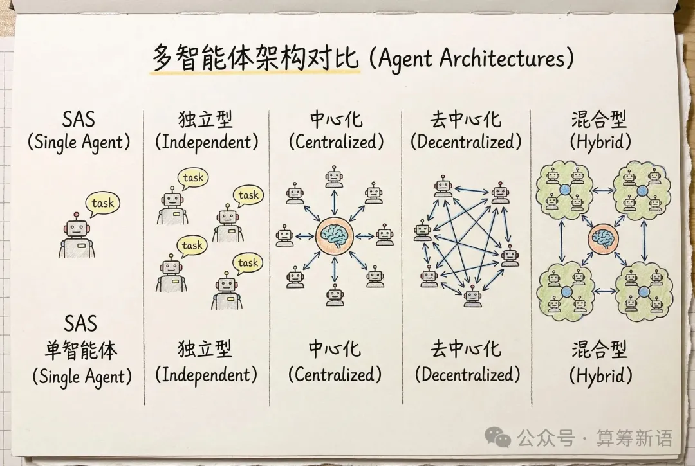

### 6.2 Agent架构设计原则

（在将这个给面试官之前，你可以直接说你是看了Google 《Towards a Science of Scaling Agent Systems》来总结的，也能体现你看论文的能力，而且你这个回答由google背书，足够经典）

我参考了Google 在25年12月发布的《Towards a Science of Scaling Agent Systems》论文，结合这一论文来回答这一问题。

谷歌的这篇论文的**核心思想**，不同架构下Agent性能受到 ： **Agent 数量、Agent架构、模型能力、任务属性 &#x20;**&#x5171;同影响，他在不同的场景下，统一了工具，提示词和预算，配置了180种对照模型，用一组可量化的协调指标 - 效率，开销，错误放大，冗余 - 创造了一个跨任务可泛化的预测指标，通过这个方法和我们可以从 数据的角度，量化衡量和选择使用不同模型Agent性能的好坏。

抛开数据和推导，这项实验得出的原则Agent架构的设计原则是：

**1.首先确认多Agent/单Agent架构**

多Agent 不是一定比单Agent好。特别是在:

1.**强顺序**，长推理链，一步错，步步错的情况下。

2.**单体Agent能力已经比较强**，论文指出单体基线收益（>=45%时)

3.**工具密集且预算固定时**（因为引入多Agent，会协调税，增加沟通成本，吞噬有效Token）

倾向于使用单Agent，盲目引入多Agent 架构反而会导致性能下降。

**2.如果使用多Agent架构，根据特点和场景进行有效选择**

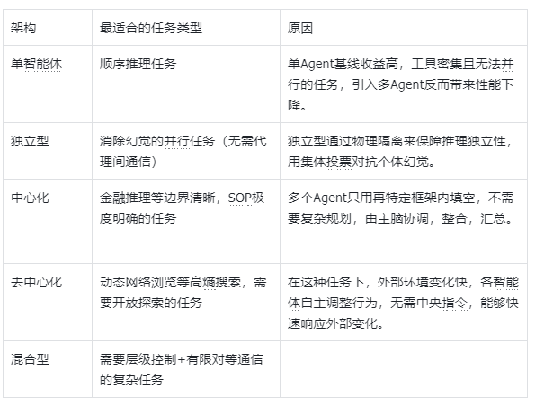

### 6.3 单Agent和多Agent的对比

（如果你对这个知识点理解深入了，你发现下面的答案很多的点，你都知道为什么，可以深入解释，比如Agent适用的顺序调用，工具密集和单Agent基线收益较高的情况，比如选择错误架构方法误差的问题，这些都是我们上面看的论文和参考资料所写的，希望大家不光知道答案，还知道为什么，经得起和面试官深入交流里面的细节）

单Agent系统指的整个系统的决策和上下文都使用一个智能体，多Agent系统指的是系统由多个智能体通过分工和并行来完成。&#x20;

单Agent的优势在于**不需要承担Agent之间的协调**，通信开销和拓扑带来的误差传播，在**顺序调用，工具密集，单Agent的基线收益已经较高**（达到45%的时候）使用单Agent效果会更好，盲目使用多Agent架构反而会性能下降。

多Agent的优势在于在复杂的任务中，特别是**需要分工和并行**的问题上，可以突破单Agent的**能力边界，提高效率和鲁棒性**，但是我们也需要注意在不同的任务系统中，需要选择合适的多Agent 的架构，**错误选择架构可能也会显著放大误差**，降低收益。

**快速测试：**

通过本章学习/论文，请你自测你能否回答清楚以下几个问题：

1.Multi-agent 有哪些架构，他们有什么特点？

2.MAS （独立多体）型架构，为什么会放大错误？如何避免？

3.如何设计一个Agent架构？你是拍脑袋想的吗？

4.中心化架构中，过度于依赖中心Agent，会有什么弊端，怎么避免？

5.哪些场景更适合单Agent，为什么？

6.这篇论文中提到了不同场景：金融分析，网页导航，工作流，游戏规划，他们分别适用于什么架构，为什么？你能不能举一反三，在你的项目场景下，用什么架构最合适？为什么？

### **6.4 Agent之间通信和状态管理**

（这个知识点不是上面提到的论文中的内容，但是这个点和多Agent相关，有了多Agent同样要知道的它们之间是如何交互的，以及传递什么信息？虽然不算特别高频考点，但是也是被问到过的，需要准备。）

**常见的Agent的通信模式：**

**1.通信模式：**&#x5E38;见的两种通讯模式是通过移交（handoffs）和工具调用

* **移交：**&#x4E00;个智能体将其执行上下文和执行权传递给另一个智能体。

* **工具调用：**&#x4E00;个智能体（如主管）将另一个智能体作为工具进行调用。

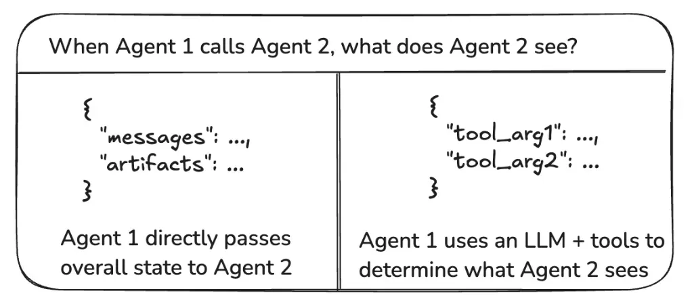

移交更适用于自主协作的场景，而工具调用则提供了更明确的层级控制和接口约束。

**2.消息传递内容：**&#x41;gent与Agent之间应该传递所有的消息还是部分消息，需要根据具体的业务场景权衡。

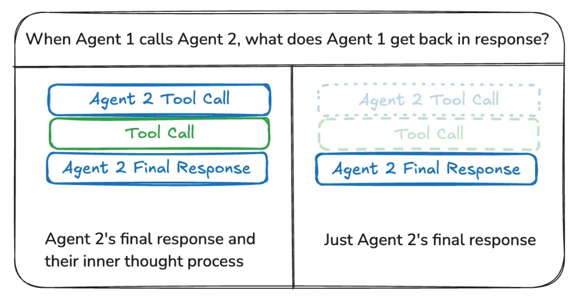

* **共享完整推理数据：**&#x667A;能体将其所有中间步骤（如链式思考、工具调用）写入共享通道。相当于提供了一个共享区，用于其他智能体理解其推理过程，可以提升系统的整体协作与推理能力。但是这种方式的缺点是会导致状态空间快速膨胀，给上下文窗口和内存管理带来挑战。

* **仅共享最终结果：**&#x667A;能体在私有空间内完成其计算，仅将最终结果写入到共享区。它能有效控制状态的复杂度，实现此策略需要为每个智能体定义独立的状态模式。

**快速测试：**&#x5982;果Agent之间通信，某些东西不想给另一个Agent看到，应该怎么做？（面试原题）

（这题就是常见的Agent消息传递方法对吧，上面的仅共享最终结果，就是用来应对这个问题的）

### 6.5 Agent架构设计实战

（这个小节，我从**参考论文的例子**以及**面试真题**中抽取出来几个典型的例子和问题，帮助大家来掌握Agent架构设计相关的内容。现在很多面试都会考察一个小型的场景下的Agent架构设计题目，我会持续将架构设计相关内容汇总于此，这样大家复习更加方便。

在我整理了几个例子后，某种程度上，我觉得这个问题其实可以套模板，大家看一下是不是，如果你认为你的任务应该用去中心化架构，你就参考这个6.5.1,对于架构的好处，通信方式都可以复用，唯一不同的是Agent的设计和功能。）

#### 6.5.1 动态网络浏览问题

（此例子截取自论文）

**问题描述**：我们需要通过网络搜索，找到 **某公司2024年可以持续发展报告中关于碳排放的问题**，请你针对这个问题设计一个Agent架构。

**架构设计：**

因为网页导航是**高熵，路径不唯一**的场景。 不同的来源（官网，媒体，报告）可以被并行搜索更快覆盖。在这种场景下，我会使用去中心化架构设计整个系统，使用去**中心化架构既能够提升并行速度**，可以**减少中心调度的串行瓶颈。**

具体来讲，整个系统各个Agent是平级的，他们自主并行探索。系统里面使用**事件总线/共享黑板**的方式，所有Agent订阅相关话题，他们可以**发布任务，认领任务，提供帮助，提交答案，**&#x6765;实现点对点的协作。

具体来讲，系统里有：

#### 6.5.2 金融推理任务

（此例子截取自论文）

**任务描述：**&#x8BBE;计一个分析某个上市公司的估值的Agent。

**架构设计：**&#x91D1;融估值的**流程通常比较规范**，天然具有**分而治之**的特点，多个子**问题之间相对独立，可以并行。**&#x8FD9;种情况下我会使用**中心化**架构设计整个系统：由一个Orchestrator（中心指挥官）统一拆解，分派和收敛，降低并发协作带来的协调成本和不一致风险，**确保各步骤按既定顺序和策略并发执行。**

具体来讲：

我会先设计一个主管Agent, 他将任务分解成**多个阶段，设计并行窗口，验收，**&#x5C06;任务下发给子Agent去并行完成。

主管Agent下设置多个子Agent，比如**收集官网信息Agent, 收集市场监管信息Agent，收集友商信息做对比的Agent。**

整个过程由主管Agent负责验收，当Orchestrator验收通过，下发停止信号中止整个流程并交付。

#### 6.5.3 中心Agent架构子Agent膨胀问题

在小红书一面中面试官对中心架构下子Agent膨胀问题进行了探讨，这里只做问题汇总，具体内容请转到面试实战，小红书一面

#### 6.5.4 时空冲突检测任务

（选自真题：夸克千问架构设计题目，我就准备直接套用6.5.2的模板）

**任务描述：**&#x8BBE;计一个Agent系统，让它完成当用户创建一个行程后，判断这个行程是否和其它冲突，如果有冲突，给出重新规划的建议。

**架构设计：**&#x884C;程冲突检测 和 规划本质是约束满足 + 顺序调整，**流程比较规范，**&#x9700;要考虑**时间窗口，地点，偏好等特点，**&#x8FD9;些因素也相对独立，可以并行。 这种情况下我会使用**中心化&#x20;**&#x67B6;构设计整个系统，由一个Orchestrator统一拆解，分派和收敛，降低并发协作带来的协调成本和不一致风险，**确保个步骤按既定顺序执行也能够并发。**

具体来讲：我会先设计一个Agent作为总指挥，根据当前阶段来分配下发任务，控制并发窗口，验收，和控制中止。

然后我会设计多个子Agent。 比如行程Agent：负责整理相关的行程，和行程时间相关的数据。 地点Agent：评估各个行程地点相关Agent的 通行时间等，冲突检测Agent, 用户喜好分析Agent 和 生成重新规划的Agent。 他们之间在某些阶段可以并行，某型阶段是串行，由主管Agent统筹规划和管理。

## 7. 大模型参数设置

（这个知识点其实面试官主动考察的并不多，目前只有平安证券的一面面试官问到了，你有没有对模型做一些参数的调整，怎么设置的penalty， temperature. 目前没有其它面试官问到。所以总体来说，这不是一个特别常考的考点。 从面试角度，可以适当放低学习优先级。另外其实如果你学好了本章，其实在一些和面试官讨论的过程，讨论一些发散性的知识的时候，很常用被用到。 比如说夸克千问面试官再和你讨论说：如何避免一些极端情况的输出呀？那这个时候，调整模型参数将会是一个可讨论点。另外从实战角度，其实在你的项目中，去调整参数做适配也挺常用的对吧，从这两个角度，也是可以推荐去学一下的）

### 7.1 常见参数和选择策略

LLM 推理参数详解表

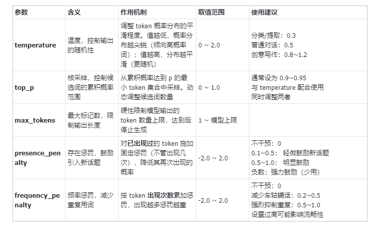

常见场景配置推荐

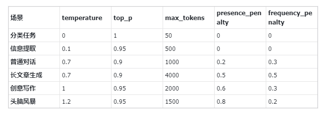

### 7.2 Temperature & Top-p

#### 7.1.1 详细原理

（想深入理解这两个参数的原理，请看这个视频）

在大语言模型生成文本时，通常会用到两个参数：**temperature** 和 **top-p**，它们决定了采样的**随机性**和**多样性**。

首先我说一下大模型生成回答的**大致原理**：

模型先为每个候选 token 计算分数（logits），再通过 softmax 转换成概率分布，然后根据这些概率进行加权采样。

在这个过程中：

**temperature** 会在 **softmax 前调整 logits，温度低时分布更尖锐，模型更确定，输出更保守；温度高时分布更平滑，增加随机性，输出更有创意**。

**top-p** 则通过“核采样”限制采样范围，只在累计概率达到 p 的最小集合中选择 token，p 越小越集中，p 越大越多样。

简单来说，**temperature 控制概率分布的陡峭度，影响确定性；top-p 控制采样范围，平衡质量与多样性，两者结合决定生成结果的稳定性与创造性。**

#### 7.1.2 不同参数组合情况

(进一步补充，以防面试官追问）

### 7.3 你的项目是如何设置参数的？

（这个是真实地面试问题了，平安证券1面问的。大家根据答案也想想自己的项目应该如何回答）

我的项目中，总体是一个分析型的任务。核心需求是稳定，准确。总体设置的温度较低，在0.1\~0.3，然后Top\_p保持默认，让模型在合理参数选择，不用太多调整。惩罚因子设置较低的值，因为形成建议可能会多次提到相同的地点，时间。所以惩罚因子设置在0.1左右。

##

## 8 A2A

（根据最新面试情况，A2A协议的概念，A2A 考的没有MCP那么多，没有那么热，但是还是偶尔会问到。暂时问的不深，我们先记一下概念）

A2A（Agent-to-Agent）协议的核心目标是**让不同智能体之间能够互操作和协作**，即使它们来自不同厂商、框架或运行环境。下面是一个简洁介绍：

***

**A2A 协议的关键特点**

1. **互操作性**

   * 通过标准化的消息格式和通信机制，让不同 Agent 可以发现彼此并交换任务或信息。

   * 常用技术：JSON-RPC、HTTP、SSE 等。

2. **Agent 卡片（描述元数据）**

   * 每个 Agent通过“卡片”描述自己的能力、接口、身份和安全策略，方便其他 Agent发现和调用。

3. **长时协作与异步交互**

   * 支持多轮对话、任务委派、进度更新、流式响应，适合复杂场景（如旅行规划、企业流程自动化）。

4. **内部实现不透明**

   * 调用方只知道对方是一个 Agent，不关心它内部用什么模型或工具，保证封装性。

***

**适用场景**

* **跨团队或跨厂商的 Agent 协作**：例如客服 Agent 与账单 Agent协作处理用户请求。

* **复杂任务编排**：多个专长 Agent分工完成一个大任务（如行程规划、供应链优化）。

* **生态互通**：构建开放的 Agent 网络，而不是单一厂商闭环。

## 9 Skills

（Skills 比较新，是2025年10月16号提出，在12月份左右才慢慢被市场支持，在26年1月份已经变得很火了。所以虽然目前我的面经没有涉及。但是很多朋友在1月份面试已经被问到了，而且这个概念现在很火。学习大模型，特别热门的新技术一定是要学的。从目前（2026年1月）来看，Skills会成为未来一段时间面试高频考点，这里推荐大家掌握）

### 9.1 Skills 概念

Skills 通俗的讲是一种带提示词的说明书，是由指令，脚本和资源组成的文件夹。以一种更工程化的方式打包提示词，让提示词变得可以维护，可以复用和版本管理。

它能够教会Agent如何以可重复的方式完成特定的任务，以提高其再专业任务上的性能。

Client端以渐进式披露的机制，动态加载Skills包含的提示词，相比传统复杂提示词，更节约Token。

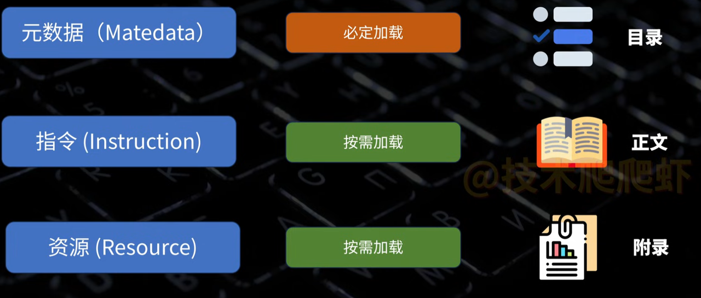

### 9.2 Skills  vs MCP

（面试官特喜欢问的就是差别，你答的不多，还喜欢追问，还有吗？这里尽量给大家总结全面一点）

借用Anthropic 官网文档原话，Skills 和 MCP的核心差别是：MCP 提给给模型数据，而Skills教会模型如何使用这些数据（"MCP connects Calude to data, Skills teach Claude what to do with data)。MCP侧重于提供工具调用，而Skills则侧重于提示词。MCP更像是一个标准的工具箱，提供规范，可复用的工具。而Skills则是一个带目录的说明书。

MCP 的本质是一个独立运行的程序，而Skills 本质是一个文档。他们本质不同，决定了他们性质也不同，Skills更适合处理轻量级的，简单的逻辑，安全性和稳定性都不及MCP。

Skills 采用渐进式披露提示词的机制，Tokens消耗低。而MCP则是一次性塞入所有提示词，Token消耗高。

Skills的开发难度相比于MCP，开发难度低很多。

总结来说，Skills 和MCP 侧重点不同，不是互斥的，二者可以结合使用，优势互补。

### 9.3 Skills vs Prompts

Skills 相比于Prompts的核心差别在于他们的**形态**和**生命周期**。

Prompts 是一次性对话内容，你需要自己保存，复制和粘贴。模型不会知道什么时候用哪一个Prompt，而且你需要把Prompts **全部塞到上下文里面**。这会大量占用你的上下文空间。

Skills 则是将提示词以一种**更加工程化的包装方式打包**，他是一个**文件夹的形式**，里面包含skills.md 和相关的资源文件。他会动**态加载/渐近式披露提示词，**&#x66F4;加节省提示&#x8BCD;**。**&#x5BB9;易复用和版本管理，易于协作和共享。

总结来说，Skills不是一个更复杂的提示词，而是把复杂的提示词，变成了一个**有结构，可复用，可以自动调用**的模块。

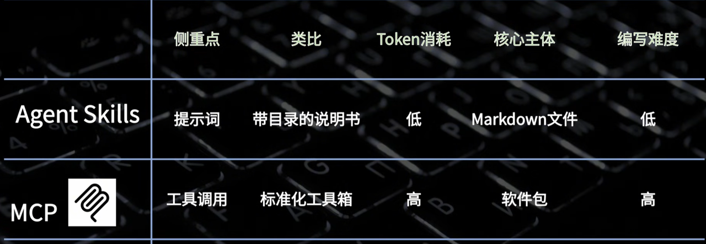

### 9.4 Skills的运行模式

1. **用户发起任务**
   &#x20;用户对 Claude Code 提需求，Claude Code 把这个请求连同当前可用的 Skills列表结合元数据一起交给 AI，让 AI 先基于需求判断该用哪类能力。

2. **AI 选择要用的 Skill**
   &#x20;AI 在可用的Skills里做匹配，然后返回指定的Skills

3. **按需加载 Skill 的指令层**

4. **按需加载 Skill 的资源层→ 读范文/材料 → 生成最终回答**

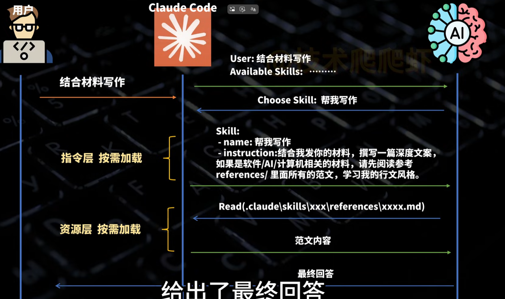

### 9.5 Skills的设计理念

（上面其实是一些Skills的基础知识，相对来说是最基础，或者考到Skills 必问的。 必须准备好。这一节可以理解为一个拔高项，我们不谈Skills 的具体概念，而结合行业的痛点，发展趋势，未来的展望来聊Skills。 如果你能和面试官讲出来，会体现出你其实是有思考，有想法，关注着行业发展和趋势的。把这些答了，是加分项）

&#x20;   发展到现在（2026年初），现在的Agent工程的痛点不再是能不能做，而是能不能交付。目前的行业痛点是：

1.虽然模型能力很强，但是常识很弱，能解决通用问题，却在具体业务问题上频繁踩雷。经常做的是文本不全，而不是业务理解。这通常导致造出来的Agent需要质检，返工，人力成本高。

2.现在经常导致的一个问题是，公司重复造轮子。给财务做一个Agent，法务做一个Agent, 运营做一个Agent，每个Agent都有自己权限，工具，prompt等。就会变成同一个业务规则，在5个Agent里各写一遍，这就导致重复造轮子很严重，难以维护。

3.现在的Agent通常是一个会有复杂的prompts，这导致token太大，模型不能精准执行，另外成本上升。当你用复制粘贴扩展能力，系统就会用维护地狱来还债。

所以行业发展到现在，需要从堆砌提示词，迭代，调试，优化做一个Agent的过程变成做一个 可治理，可迭代，可复用的产品。通过Skills， 行业开发Agent的模式变成去写一个可复用，可管理的技能资产（Reusable skills), 结合通用内核，来解决这些痛点。

### 9.6 参考视频和项目

**入门视频推荐这两个：**&#x4ECE;skills 是什么，组成，核心特点，实践，对比MCP这几个角度都讲了，基本是最基础的内容。这两个视频其实都围绕这几点讲，内容有重复性，可以结合互补着看，适合入门。

**进阶视频：**

这个讲了一些Skills背后的设计理念，行业痛点，学好了和面试官回答可以提现你的行业洞察能力。

https://www.youtube.com/watch?v=xeoWgfkxADI

这个提到了和Prompts的本质区别，以及提了两种skill的使用方式，相比入门视频深入一些。

&#x20;    https://www.youtube.com/watch?v=ZzPoWrlzE1w

**&#x20;    Skills实战：**

&#x20;   如果你想深入学习，实践，我给你总结了几个Skills的开源项目，自己可以去体会。

1. 为 AI Agent（如 Claude Code）提供一组操作 Obsidian 笔记的技能，让 AI 能直接创建、修改 Markdown / Canvas / Bases，实现“AI 管理知识库”。

&#x20;    https://github.com/kepano/obsidian-skills

* 一个给 AI 编程 Agent 用的“工程化技能框架”，强制先澄清需求、写设计、做计划，再用子 Agent 按 TDD / DRY 的方式自动开发代码

&#x20;    https://github.com/obra/superpowers

* 让 AI Agent 把“计划、进度、知识”写进持久化 Markdown 文件中，用文件系统当长期记忆，解决复杂任务中上下文丢失的问题（Manus 风格）。

&#x20;    https://github.com/OthmanAdi/planning-with-files

# 模型微调

（虽然我们的目的是以应用侧入手，不过实际面试下来，微调和推理也会被问到，如果你完全没有经验，面试肯定会吃亏，一般来说SFT:LoRa 以及强化学习，面试官都还挺看重的，希望能你能做过并且可以讲出来）

## 1.  SFT的方案有哪些？

参考《从零构建大模型 – 算法，训练与微调》第5章

从大的方向上可以分为**全量微调**和**部分参数微调**。

**全量微调**是比较传统的方法，对模型所有的参数都进行训练，适应性强，适合复杂任务，但是成本高，计算资源消耗大，容易过拟合。

目前在llm模型领域使用更多的是只需训练部分参数的微调。比如说：

通过在模型结构中**插入新的模块**来实现微调的方法，例如：Adapter tuning, LoRA, QLoRA，他们不改变原始参数，只训练新模块，适用于中大型任务。

通过在**输入前添加可训练的提示**或**前缀来引导模型**的方法，例如Prompt Tuning和 P-Tuning等，他们不改变模型结构，参数极少，适用于轻量任务或快速迭代。

### 1.1 简单介绍Lora技术

Lora原理就像拼图。 整个模型的参数就是一幅完整的拼图，而LoRA微调的目标是只调整几个特定的拼图模块，而不重拼整个模块。

具体来说，LoRA通过低秩分解将大矩阵拆分成两个小矩阵，只微调这两个小矩阵中的参数，不改变整个大的权重矩阵。

这种分解相当于把复杂的工作分配给几个辅助部件来完成，既保持了原模型的稳定性，又能够用较少的参数适应新的任务。

此外，LoRA只需要微调小矩阵中的少量参数，因此减少了计算量和存储需求，适合快速迭代和部署。

&#x20;

### 1.2 **Lora中的常见参数**

**模型参数**

r (秩）：

（概念）控制低秩矩阵的大小，影响训练参数量和模型容器。

（作用）r 越大，模型能学习到更多任务特征，但显存占用也会增加。

（常用范围） 4 \~64，典型配置是r = 16 或 8。简单任务用8，复杂任务用16\~32

alpha(缩放因子）

（概念） 用于缩放LoRA权重的影响。

（作用）调节LoRA插入模块对原始模型的影响速度，通常为r 的 1\~2倍。

（常用范围）16 \~ 128。

target\_modules

（概念）指定在哪些层插入LoRA。

&#x20; (作用）影响训练效率和效果，通常选择注意力层。

**训练参数**

（训练参数放在Lora下似乎不太准确，但是因为问的最多的就是Lora，笔记部分暂时也没涉及别的方法的模型训练，所以我先放在这里）

**learning\_rate（学习率）**

* 控制权重更新速度

* **作用**：太高会导致不收敛，太低训练慢。

* **常用范围**：学习率通常设置在一个较低的范围 （1e-4 \~ 5e-5）。

**batch\_size（批大小）**

* 每次训练处理的样本数。

* **作用**：影响显存占用和训练稳定性。

**epochs（训练轮数）**

* 完整遍历数据集的次数。

* **作用**：轮数太少模型学不够，太多可能过拟合。

* **常用范围**：一般设置在3\~5轮，防止过拟合。

### 1.3 简单介绍Prompt Tuning技术？

Prompt Tuning是一种通过调整输入提示来引导模型更准确地理解任务的微调方式。在Prompt Tuning中，模型的权重保持不变，微调仅设计对输入提示进行优化。通过精心设计Prompt，模型可以在任务上下文中生成更精准的输出，可以提升对特定任务的表现。这种方式不仅高效，还可以适应不同任务，使得大模型不需要大规模微调就能适应新的任务需求。

&#x20;

### 1.4 你是怎么做的微调？

（这也是一个**比较常考**的问题，这个答案也是我参考了一些资料和自己项目总结的一个暂时比较满意的答案）

（首先按照这个4个思路来讲解讲：

（1） 确定目标/做好选型

&#x20;     （2） 数据集的准备

&#x20;     （3） 确定参数，进行微调，部署

&#x20;     （4） 验证和评估

&#x20;  按照这个思路，面试官会觉得你逻辑非常清晰，做法非常规范。 在这个思路下，再添加自己的项目细节。让答案更加丰满，以下以我的项目，按照上述思路进行回答，请大家自己根据实际情况参考。&#x20;

我的答案是根据这个笔记总结的，如果你需要总结自己的答案，强烈建议阅读这个：https://www.xiaohongshu.com/explore/692c36e1000000001b02120e?app\_platform=ios\&app\_version=9.14\&share\_from\_user\_hidden=true\&xsec\_source=app\_share\&type=normal\&xsec\_token=CBab5PFDvzdmqER5g7jT9IzgKArSCJieISSN1BMKyeItI=\&author\_share=1\&xhsshare=WeixinSession\&shareRedId=ODgyNUdJSk42NzUyOTgwNjczOTdINzlO\&apptime=1766553196\&share\_id=fdf3b8becd2a40908cd8d8e93e5f7779

）

我认为做微调是一个非常严谨的，数据驱动的科学实验过程。 在微调的过程中，我们通常有五个步骤：1.确定目标/做好选型。 2.数据集准备。 3. 确定参数，平台，进行微调。 4.验证和评估。

**1.** **首先是确定好目标，做好选型**，比如是否可以通过 提示词工程 或者 RAG 技术来解决，这样成本更低。同时考虑一些硬件是否支持，比如16GB显存，可以使用LoRA 微调，如果是13B模型，可能就要使用QLoRA。在我的系统中，核心目标是将模型压缩，同时保留模型的精度，使用的远端Azure AI Foundry， 训练的是Qwen2.5-7B-Instruct，使用的是LoRA技术。

**2.** **数据集的准备。**&#x9879;目采用**真实用户邮件标注样本**、**GPT-4生成的合成数据**，以及**Enron Email Dataset公开数据**集，共500条样本。在准备好数据后，做了一些文本标准化，敏感信息去除的数据前处理。

**3.确定LoRa的参数， r(秩），alpha 缩放因子 以及一些超参数**，比如**学习率**，**Batch Size**, **训练轮数**，我们的任务比较简单r，就设置较小值8， 相应的的alpha就是r的两倍16.**。&#x20;**&#x4C;oRa只训练部分参数，因此可以稍微设高学习率，这里采用的2^e-4.

除此之外，在训练中密切监测训练集和验证集的损失曲线。如果验证集损失持续上升而训练集损失持续下降，说明可能出现了一些过拟合，可以采取**早停&#x20;**&#x589E;加数据正则化等。 在训练结束后使用Perf库将适配器权重和基础模型合并。

**4.**&#x5BF9;于不同的任务，可以使用不同的评估方法。比如分类任务 可以用：**F1-Score方法**， 文本生成任务可以用：**BLEU/ROUGE。** 通用对话任务，可以使用业内公认的基准比如：**MT-Bench** 来获得一个可以比较的分数。在我的项目中，由于该任务属于**结构化信息提取**任务，需要从自然语言邮件中准确提取并转换为JSON格式的事件信息，采用的是**字段级别F1-Score结合精确匹配**的评估方法。简单来说是采用的是字段级别F1-Score结合精确匹配的评估方法。简单来说即对每个字段（如title、时间、地点）分别计算准确率，既保证整体结构正确，又允许语义相同但表达不同的情况。

## 2.强化学习的方案有哪些？

（先背一下基本概念，实际中考察的并不多，所以不深入学习）

**1. 基于人类偏好的 RL**

* **RLHF（Reinforcement Learning with Human Feedback）**

  * **奖励来源**：人类排序数据 → 奖励模型。

  * **优化方式**：PPO（Proximal Policy Optimization）+ KL Penalty。

  * **目标**：对齐人类偏好、安全和价值观。

  * **代表模型**：ChatGPT、Claude。

**2. 基于 AI 偏好的 RL**

* **RLAIF（Reinforcement Learning with AI Feedback）**

  * **奖励来源**：强大教师模型（如 GPT-4）生成偏好排序。

  * **优化方式**：同 RLHF（PPO）。

  * **目标**：降低人工标注成本。

  * **代表模型**：Anthropic 的 Constitutional AI。

**3. 基于偏好数据的直接优化**

* **DPO（Direct Preference Optimization）**

  * **奖励来源**：偏好数据（人类或 AI）。

  * **优化方式**：直接优化策略，不训练奖励模型。

  * **目标**：简化 RLHF，避免 PPO 的复杂性。

  * **代表模型**：LLaMA-2-Chat、Mistral-Instruct。

## 3.SFT和RLHF的区别是什么？

（问的并不是特别多，作为强化学习的基础知识先准备着）

**目标上的区别**：SFT的目标是让大模型能**有基本的语言能力和执行任务的能力**，RLHF倾向于让大模型的回答更符合**人类偏好**，**安全**和**价值观**。

**方法上的区别**：SFT使用**有监督**的方式训练，数据集的形式是问题-答案。而RLHF采用**强化学习**的方式，**数据集**是包含多个答案，以及**答案的排序**和**奖惩模型**的。

**步骤上的区别**：RLHF通常是在SFT的基础上进行进一步优化的。

&#x20;

&#x20;

## 4.  数据集的准备

（数据集的准备也是面试官很常考的一个问题，我这里这一节3.1介绍了一些常见的数据集的来源，3.2 介绍了对数据进行前处理的方法。请大家根据3.1和3.2 整理出自己的针对于面试官问 "你的项目/LoRa是如何制作数据集的" 这一问题的回答。另外3.3是DeepSeekR1 的训练方法，里面包含了一些数据集制作思路，如果有什么契机你能把这个流程给面试官讲，一定会很加分）

### 4.1 常见的数据集来源

微调领域常见的数据集的来源：

1.内部数据：从一些内部的文档，或者用户使用的数据来去做标注。

2.公开数据：寻找一些已经存在的数据库，比如Hugging Face Datasets，Enron Email Dataset 。

3.人工标注：费时，但是可以得到高精度的定制化数据。

4.数据合成：数据合成，利用大模型去生成。

### 4.2 数据清洗和前处理

1.文本标准化：将文本统一大小写，去除一些特殊字符，html tags之类的。（虽然现在模型可能对大小写理解的很好，但是你统一大小写会降低模型学习难度）

2\. 敏感信息去除：去除一些敏感信息，比如用户的名字，电话号码。（主要是合规性考虑）

3\. 平衡数据：平衡一些数据集类型的占比，特别是分类任务，避免某一类内容过多。

4\. 标签纠正：避免一些数据集矛盾的问题。（比如同一个输入，有的分类成angry,有的分类成frusatrated, 那么选择一个label或者合并种类）

5\. 统一格式：对于不同的微调任务，需要的输入格式可能会不一样。比如分类任务的格式是{Text->Label}, 问答任务的格式是：{Context, Question -> Answer}

### 4.3 DeepSeek R1 训练方法

（参考资料 https://zhuanlan.zhihu.com/p/24621463668，作为一个**拔高知识点**，这个题大概率不是面试官直接问的，但是如果你能够在某个契机能把这个讲出来，就会比较加分。从DeepSeekR1训练方法去理解 整个模型 SFT + 强化学习 + 训练集的准备的整个过程。理解整个过程，可以给面试官讲清楚 训练过程 + 谈谈自己对这套方法的理解。一定会加分。 大概这么吹牛逼： 我看了DeepSeekR1的训练，它的大概的训练步骤是xx(笔记部分训练过程）。通过这篇论文和训练方法，我的启发是（笔记部分训练背后蕴含的思想）xx）

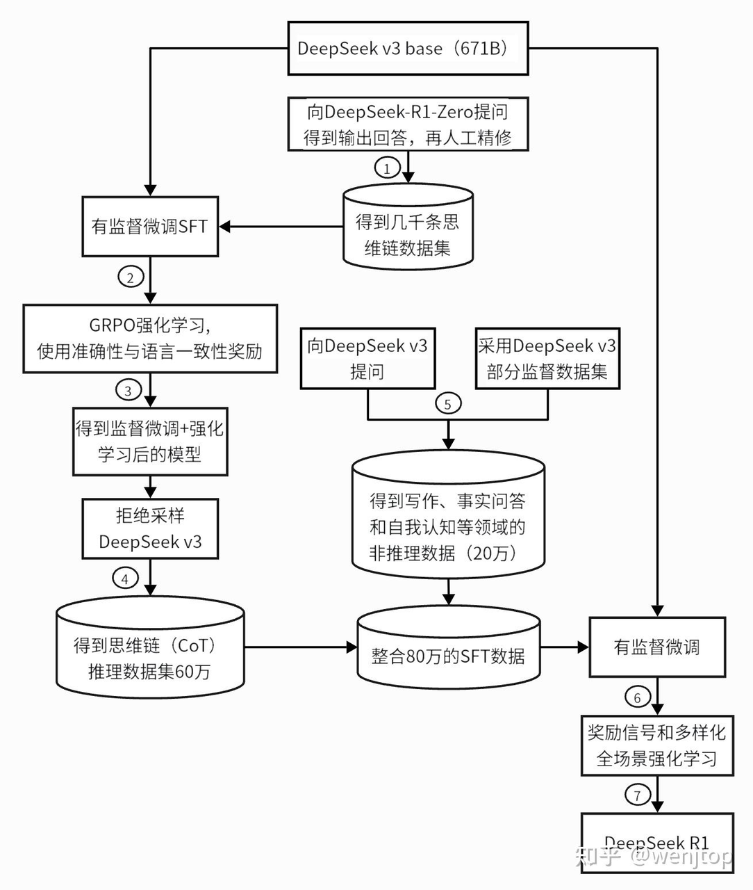

**训练过程：**

1. 通过向DeepSeek-R1-Zero 提问，再通过人工精修，生成几千条思维链监督数据集。

2. 使用生成的几千条思维链监督数据集，训练DeepSeek v3 base模型，得到思维链监督微调后的模型。

3. 使用GRPO强化学习，奖励分数引入准确率和语言一致性分数，得到强化学习训练后的模型。

4. 使用强化学习训练后的模型，采用拒绝采访方法，收集60万条思维链推理数据集，其中拒绝采用的奖励模型使用DeepSeek-v3。

5. 向DeepSeek-v3提问和整理DeepSeek-v3训练数据集，得到20万条写作、事实问答和自我认知等领域的非推理数据，滤掉了混合语言的链式思考、长段落和代码块。并整合60万条思维链推理数据集。得到一个80万监督数据集。

6. 使用80万监督数据集训练DeepSeek v3 base模型，在做多样化强化学习，最终得到DeepSeekR1模型。

**背后的蕴含思想：**

**一：闭环迭代，不是一次性训练：**

&#x20;     不是 "先准备数据 ->一次性训练模型", 而是：训练模型->用更强的模型生成更好的数据-> 再训练->模型更强->再生成数据。 这种闭环让模型和数据共同进化，避免低质量数据拖后腿。

**二：数据质量优先：**

通过拒绝采样，人工精修，模型奖励打分，确保训练集干净，逻辑正确。

**三：分阶段训练：**

阶段1：SFT -> 学会遵循指令

&#x20;     阶段2: GRPO 强化学习->优化推理能力

&#x20;     阶段3：多场景RL-> 提高泛化和安全性

**四：多类型数据集，能力互补**

**指令遵循数据集&#x20;**&#x8BA9;模型可以听懂指令。

**&#x20;      推理链数据集**：让模型逐步推理&#x20;

&#x20;     **非推理任务数据集**：保持通用能力。

**奖励信号数据集**：强化输出质量

# 模型推理加速

## **1.** **常见的推理加速方法**

我们可以从**模型层面**，**硬件层面** 和**系统架构**层面 三个方向入手：

**A 模型层面**

**1.模型量化**： 将FP32 转换成INT8 或更低的精度，减少计算量和内存占用，一般这样推理速度可以提升2\~4倍。

**2.模型剪枝**：删除冗余权重或者不重要的神经元，减少参数。

**3.知识蒸馏：**&#x7528;大模型训练一个小模型，部署时用小模型推理。

**B 硬件层面**

**1.** **GPU/TPU 加速**： 使用高性能GPU 或专用AI 芯片。

**2.** **多卡并行**：将模型分布到多个GPU上进行计算。

**C 系统架构层面**

**KV 缓存**：对Transformer的注意力计算进行缓存，在长文本推理时加速效果显著。

**FleshAttention:&#x20;**&#x20;一种针对Transformer的注意力计算的高效实现方法，可以显著减少内润占用并提升计算速度，特别适用长序列推理场景。

## 2. 蒸馏

模型蒸馏是一种**模型压缩和知识迁移技术**，主要用于将一个复杂、性能强大的模型（通常称为“教师模型”）的知识传递给一个**更小、更高效**的模型（称为“学生模型”）。它的核心目标是**在保持模型精度的同时降低计算成本和存储需求。**

具体做法是把教师模型的**输出作为额外的监督&#x20;**&#x20;和**学生模型的输出**做对比，通过优化损失函数来训练学生模型。

**为什么要做模型蒸馏？**

**部署需求**：大型模型在移动端、嵌入式设备或低算力环境中难以运行。

**推理速度**：小模型推理更快，适合实时应用。

**节省资源**：减少内存占用和能耗。

**具体做法**

在训练过程中，教师模型会输出对每个数据的预测分布，这些分布包含了每个类别的概率，就像老师教学生做选择题的时候，不仅会给出正确答案，也会标注出其它选项为什么不正确。&#x20;

随后通过知识蒸馏，学生模型使用教师模型的软标签来进行学习。这个过程包含两个目标：一是让学生模型学会在分类任务上给出准确的答案，二是模仿教师模型的预测分布，尽量让自己的输出和教师模型相似，这样可以让学生模型在不增加参数的情况下更快，更好的学习到知识，在实际应用中也能更高效运行。

## **3.** 量化

### 3.1 常见量化方法

**训练后量化（PTQ, Post-Training Quantization）**

* **特点**：在模型训练完成后，将浮点权重和激活转换为低精度（如 INT8）。

* **优点**：实现简单，计算成本低。

* **缺点**：没有在训练过程中考虑量化误差，精度可能下降明显，尤其是对复杂模型。

**量化感知训练（QAT, Quantization-Aware Training）**

* **特点**：在训练过程中模拟量化操作（如插入伪量化节点），让模型在训练时“感知”量化带来的误差。

* **优点**：精度接近浮点模型，因为训练过程考虑了量化。

* **缺点**：训练成本高，需要从头训练或至少进行完整的训练周期。

**量化感知微调（QAF, Quantization-Aware Fine-tuning）**

* **特点**：不是从零开始训练，而是基于一个 **预训练模型**，在微调阶段加入量化感知操作。

* **优点**：比 QAT 成本低，因为只需要微调而不是全量训练。

* **缺点**：精度可能略低于完整 QAT，但通常比 PTQ 好很多。

### 3.2 量化的好处和坏处

（小红书面试官问过，算是基本概念题，简单理解背诵下）

**好处**

**降低计算和存储成本**

* 将 FP32 转换为 INT8 或更低精度，可以显著减少**内存占用**和带宽需求，提升推理速度，降低能耗，尤其适用于边缘设备和移动端。

**支持大模型在有限硬件上运行**

* 例如 QLoRA 技术通过 4-bit 量化，使 650 亿参数的大模型可以在单张 48GB GPU 上微调，保持接近原始性能。&#x20;

**降低部署成本**

* 在生产环境中，量化可以减少硬件资源需求，降低整体运营成本，提升模型的可扩展性

**坏处：**

**精度下降**

* 低精度表示范围有限，可能导致**权重和激活值的细微差异被放大。**&#x8FD9;会导致：模型在分类、预测等任务上可能出现轻微性能损失，尤其是对数值敏感的任务，性能下降比较明显。

**累积误差**

* 在深层网络中，量化误差会逐层累积，影响最终输出，尤其在**注意力机制或归一化等算子中表现明显**。这会导致模型在复杂推理任务中表现明显下降。

## 4. 剪枝

去除神经网络里不重要的连接或者神经元。可以减少模型参数，提升推理速度，对于移动和嵌入式设备友好，因为去掉了冗余信息，可以降低过拟合的风险，提高泛化能力。缺点是精度损失问题。不同的模型和硬件对于剪枝的适应程度也不同。

### 4.1 常见的剪枝方法

非结构化剪枝：随机移除单个权重或者连接，压缩比大，但是对于推理速度提升不大。

结构化剪枝：按照一定规则，比如移除整个神经元，滤波器或者层，更加适合硬件加速。

## 5. 二值化

极端的量化技术，它把神经网络的权重和激活值限制在了两个值上，通常是+1, -1。

## 6.模型压缩技术的选择

在极端资源受限的场景下，二值化和量化是优先考虑的技术。

二值化适合精度不高的任务，量化可以调整压缩精度，在压缩效果和模型性能之间找到平衡。

如果更加注重计算效率，希望显著提升模型的推理速度，同时对模型精度还有一定要求，那么量化和结果话剪枝是不错的选择。

如果目标是在保持模型性能的前提下进行压缩，那么知识蒸馏就是理想之选。

## **7.常见的推理框架**

（在说到熟悉推理这块，面试官很可能会问你熟悉哪些推理引擎，最好都有一个了解，结合你用的引擎深入了解）

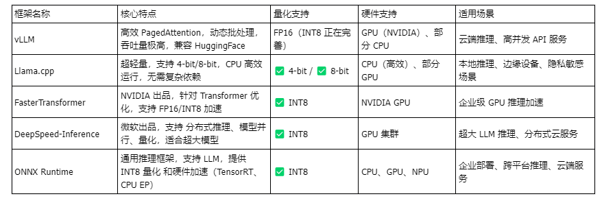

### 7.1 为什么Llama.cpp 的在cpu上效果更好？

（因为我的项目使用了Llama.cpp 替代了 onnx runtime, 在cpu上对于同一模型推理速度提升了1倍以上，所以面试官可能会问我这个问题，这个问题更多是根据我个人情况准备的，供大家参考。大家也可以结合自己的情况，自己用了什么推理加速来准备一些相似问题。）

1. **内核优化**：llama.cpp 针对 LLM 做了高度融合的算子（注意力、RoPE、KV cache），减少框架调度和内存拷贝；ONNX Runtime是通用框架，算子分发和调度开销更大。

2. **线程与缓存策略**：llama.cpp会主动优化线程亲和、NUMA绑定、缓存布局，KV cache访问更高效；ORT默认设置如果没调优，容易出现带宽瓶颈。

3. **指令集利用**：llama.cpp直接用AVX2/AVX-512等SIMD指令，针对矩阵乘法和量化内核做了手工优化；ORT依赖通用库，优化程度不如专用实现。

**一句话总结**：即使模型和量化相同，llama.cpp在CPU上更快，是因为它是专门为LLM推理做极致优化的，而ONNX Runtime是通用框架，调度和内存管理开销更大

**7.2 介绍一下vLLM 框架**

（vLLM 框架在很多岗位的jd 上都写着有要求，今天平安证券也问到了这个，不过亲测这个问题问的不多，倾向于咱们先背个基本概念就好。我从三个方面总结了， 设计**思路，特点，总结，**&#x5982;果问到可以选择性地和面试官介绍）

**&#x20;1. 设计思路**

vLLM 的核心目标是解决 **大语言模型推理的高并发和显存瓶颈问题**。传统推理框架在处理长上下文或多请求时，KV 缓存占用显存过大且容易碎片化，导致性能下降。
&#x20;vLLM 的设计理念是通过 **PagedAttention** 技术，将 KV 缓存分页管理，类似操作系统的虚拟内存分页机制，**显存复用率高**，适合长上下文和多请求场景，从而实现**高效的显存利用和动态批处理**。

**2. 特点**

PagedAttetion技术： 将kv缓存按页管理，避免显存碎片化，支持灵活调度。 **显存复用率高，支持长上下文和多请求场景。**

动态批处理：异步调度器可以将不同请求合并，提高GPU利用率，降低延迟。

高兼容性：支持HuggingFace Transformers模型，几乎无需修改代码即可接入。

&#x20;     分布式推理：支持多GPU，多节点部署，适合大规模服务。

**3.** **总结**

vLLM的核心创新是PagedAttetion + 动态批处理。解决了传统推理框架在显存管理和并发处理上的痛点，显著提升吞吐量和资源利用率。相比于其它框架，vLLM 更适合 **在线高并发推理，**&#x5C24;其在长上下文和显存首先的情况下表现突出。

## 8. 你的项目是如何做推理加速的？

（ 这个问题是我给面试官准备好的，我的项目中是如何使用 **LoRa + 强化学习DPO + 量化 + 推理，来完成将Qwen2.5-7B-Instruct 模型 适配在CPU 电脑上，极大降低推理速度并且提升任务的质量的**。&#x20;

&#x20;   这个问题几乎是所有我所学的关于模型推理加速/微调这两部分的内容 在 我是项目中运用的实际体现。  这个问题答案供大家参考，如果你想要向面试官展示你有 模型微调/推理加速的经验，你也要准备一个你自己对这个问题的回答，讲清楚 在你的项目中，背景是什么，用了什么技术，怎么使用，为什么要使用，最终达到了什么效果。）

我负责优化邮件日历事件提取的模型性能。**背景是**用户需要从邮件快速创建日程，但云端API延迟2-3秒且按调用计费，不适合高频场景。**我的方案是**本地部署微调后的开源模型Qwen2.5-7B-Instruct，通过三步优化实现性能和成本的平衡。

**第一步是LoRA微调，**&#x4F7F;用**PEFT库**实现低秩适应，只训练0.18%参数（1400万 vs 76亿），将任务准确率从基础模型的65%提升到92%。选**择LoRA而非全量微调是基于成本和效率考虑，能够显著降低显存需求和训练时间**，同时保持接近全量微调的效果。训练数据来源包括：**真实用户邮件标注样本、GPT-4生成的合成数据，以及Enron Email Dataset公开数据集**，共500条样本，在Azure AI Foundry的上训练完成。

**第二步是DPO对齐，**&#x4F7F;用**TRL库**的Direct Preference Optimization进一步优化输出质量。构建了200对'chosen-rejected'偏好数据：chosen样本来自人工标注的高质量输出，**rejected样本通过规则扰动（添加冗余字段、格式错误、信息缺失）生成**，**并混合了少量GPT-4生成的负样本**。在LoRA基础上训练1小时，将JSON格式规范性从85%提升到98%，显著减少了解析错误和冗余输&#x51FA;**。**

**第三步是量化部署**，这里做了技术选型：对比了ONNX Runtime、PyTorch Mobile和llama.cpp三个方案。最终选择llama.cpp是因为它CPU推理做了深度优化，包括**SIMD并行计算**和**内存管理优化**，比ONNX快2.5倍。量化使用`torch.ao.quantization` 库，方案采用Q4\_K\_M混合精度Post-Training Quantization：Attention层保持5-bit精度，FFN层压缩到4-bit，输出层用6-bit确保质量。最终模型从14GB压缩到4.3GB，推理速度从154秒降到43.7秒，提升3.5倍，同时准确率只损失2.5%（92%→89.5%），在可接受范围内。

**这个项目的价值**在于：通过参数高效微调（LoRA）和训练后量化（PTQ）的组合，在不牺牲太多精度的前提下，将云端依赖转为本地部署，成本从按次计费降为零边际成本，同时满足了实时响应需求。技术选型上，llama.cpp在CPU推理上的性能优势是关键决策点，使得无GPU环境也能高效运行7B模型。

## 9. 参考资料

模型压缩四大方法概述 | 量化、剪枝、蒸馏和二值化&#x20;

推荐理由：特别适合快速了解这四个技术，是干什么的，怎么做，有哪些常见方法，不深入讲解公式和原理，小白也能听懂。

https://www.youtube.com/watch?v=jW2cmZ-9hLk

# 提示词工程

说实话，提示词工程不管是任何培训，都会作为一个很大的重点和知识模块去讲。谷歌甚至也是专门推出了8小时的提示词工程，但是在实际面试中，真的几乎没有出现，甚至是我总结的这些简单介绍提示词工程最基本的入门八股，都完全没有被考到！

并且提示词工程其实也不难，我的建议是，你好好地把下面这个视频看完，这个视频总结了google 8小时 提示词工程的核心要点，把这个视频消化，并且总结成笔记，运用到实战中，就可以了。不用花过多时间在提示词工程上。

https://www.youtube.com/watch?v=p09yRj47kNM

## 1.简单介绍提示词工程。

（参考谷歌提示词工程课程）

提示词工程是指**设计和优化输入给llm的提示词，**&#x4EE5;便获得更准确、有用或符合预期的输出结果的过程。

设计提示词有五大具体原则：**任务， 上下文， 参考示例， 评估标准，迭代**.

具体来讲：

**任务：**&#x6307;我们要清晰地告诉LLM我们的任务，可以通过让llm角色扮演和规定输出格式的方法提高效果。

**上下文信息：**&#x6211;们要提供足够的背景信息，让AI更好的理解，比如提供项目背景，已知数据，限制条件等。

**参考示例：**&#x53EF;以给出一些标准的输入输出的例子来供模型参考。

**评估：**&#x6BCF;次拿到输出，判断结果是否符合预期。

**迭代：**&#x5982;果不满足要求，我们需要反复进行prompt的优化和迭代。

&#x20;

## 2. 提示词工程技巧

提示词技巧可以分为**单次**和**多阶段**技巧来讲。

**单次技巧**：

1.重新检查提示词框架是否合理，比如是否包含了明确的任务，上下文信息，参考等。

2.将提示词拆分成更短的句子。避免使用冗长复杂的句子，拆分成更短的，有条理的句子。

3.尝试用不同的措辞，或者换成类比任务。

4.引入一些限制条件。&#x20;

**多次技巧**：

1.Prompt Chaining: 将多个提示词串联起来，每一步的输出作为下一步的输入，从而构建一个多阶段的任务流程。

2.Chain of thought prompting : 引导模型逐步思考，通过在提示中加入推理过程，让模型在回答问题时展示中间推理步骤，而不是直接给出答案。

3.Tree of thought prompting : 鼓励模型探索多个可能的路径或者思路，像树状结构一样展开，然后选择最优路径。

&#x20;

# &#x20;面试技巧

## &#x20; 1. 自我介绍

自我介绍是面试的第一流程，也是你给面试官的第一印象。 **请不要**讲流水账，把简历的内容照着说一遍。他并不是要关注你是谁，而是关注你和岗位的一个匹配度。 时间请控制在1分钟\~2分钟， 时间非常短,  切记讲废话，直接灌输他想要的答案。别说什么籍贯，爱好，别说什么 我很努力很认真空话虚话。**在有限的时间内灌输重点**。

参考模板：

1\. **亮身份（学校/公司） + 核心标签**：eg. 我叫xx,我做过5年AI开发，我擅长Agent，RAG系统，熟悉常见的AI应用和框架，对模型前后训练，推理也有一定的实践。

&#x20;2\. **用结果证明能力**：我用xx方法得到了xx提升。 使用我做的RAG系统，相比copilot 通用工具，回答的时间降低xx, 准确度提升xx。

&#x20;3.**体现诚意：&#x20;**&#x6211;了解过贵公司整个项目，我认为我的技术和它非常匹配，我也特别认可贵公司技术发展方向，特别期待加入这个岗位。

## &#x20; 2.  反问

**核心逻辑**：

这个环节是为了

**弄清你是真的想来，还是只是随便看看**

**你的关注点，关注点的高度如何**

**思考能力：是否对岗位有深度思考**

**参考答案：**

针对不同的面试人员问不同的问题：

&#x20; **团队的人员结构，人员组成，看看团队的实力如何，是大团队还是小团队**

&#x20;       **上下游人员结构：**&#x770B;看供需是否合理，哪个团队更有话语权，公司更重视什么。比如你面试测试，公司主要做黑盒测试，结果测试只有10人，却需要面对60\~70个开发，那你可以看出测试工程师可能非常忙，而且公司不重视测试，可能测试也没啥话语权。

**&#x20;  对候选人的期待，来了要完成什么任务**。

# 其它问题

（这里来放一下我在面试中出现过的，但不是那么好归类的问题）

## 1. 如何减少Agent的幻觉问题？

**（先谈一下幻觉的本质和产生原因，让面试官觉得你知道幻觉产生的底层原理，在根据这个产生原因来谈解决方案**）

幻觉这个问题核心的**产生原因**还是**因为模型并不理解事实，只是根据预训练数据预测最可能生成的单词序列**。所以在某些低置信度场景，他会生成一个编造的事实，所以我可以通过：

1.**使用RAG技术**：将Agent的回答和外部的知识库或搜索引擎结合，确保生成内容有真实依据。

2.**可以使用RLHF/DPO进行人类反馈微调**：使用人类标注的反馈数据训练模型，减少幻觉倾向。这个方法的原理，模型被显示处理低置信度的输出，并用预定义的回答来应对，而不是生成一个编造的实时。

3\. **使用一些提示词技巧让Agent多轮验证并对答案反思**，比如使用Chain-of-though + self ask模式，这个核心原理是让LLM 在推理过程分配更多的计算资源，允许LLM更多的处理时间和步骤来处理查询并生成响应，通常能显著**提升准确性，连贯性和稳健性，**&#x51CF;少幻觉的发生。

4.可以使用**融合模型**或者**投票机制**：让多个模型或者Agent协同工作，通过投票或者加权减少单一模型出现的幻觉。

## 2. **Python 的异步方法是如何实现的？**

（其实Python语法在llm 的岗位问的不多，我也没有专门准备，但是这个问题确实是出现在了好几次面试中，所以我把它整理在这里，还是建议掌握这个问题。这个其实涉及到了**协程**以及具体的语法，第一次接触的朋友理解起来应该是会有点费劲的，不要着急寻求一次就能弄懂）

&#x20;Python 中最常见的方法是使用asyncio库，使用async 定义异步函数，然后再异步函数中是使用await 来等待另一个异步操作完成。

### **&#x20;2.1 异步方法如何通知事件完成？**

（作为上一个问题的延伸问题，这个也是京东二面被问的到，我们在这里一起复习了）

**1. 使用await 返回结果**

**2.** **使用Future/Task的set\_result 或 回调**

&#x20;

## **3.** **常见的AI coding工具的对比**

（现在很多公司特别强调程序员要用AI写代码，所以比较看重你使用AI coding的能力，所以相关的AI Coding的对比，使用心得，是我们需要掌握的。这里最好能展示出来你了解各大厂商的AI coding 工具，大概有什么特点，可以结合你看的一些文章来回答，体现你对市场最新产品的关注和思考。这里我给大家推荐腾讯的 AI Coding非共识报告https://zhuanlan.zhihu.com/p/1932943005838443596，相信认真看完以后你回答这个问题就会游刃有余。）

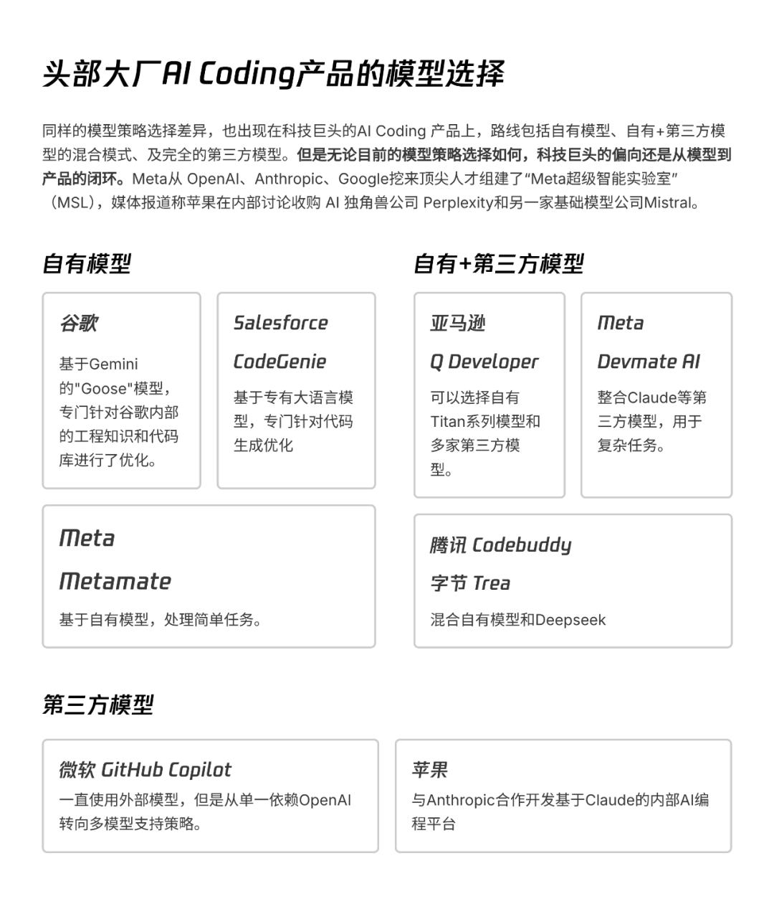

（我下面整理的回答，先概括一下市面上的主流AI Coding的工具，体现我对市面上的产品都有研究，然后从使用的模型和功能趋势两方面进行回答）

当前比较主流一些的AI Coding 主要有：

**自有模型**：谷歌 Gemini（Goose）、Salesforce CodeGenie、Meta Metamate。

**自有 + 第三方模型**：亚马逊 Q Developer、Meta Devmate AI、腾讯 Codebuddy、字节 Trea。

**第三方模型**：微软 GitHub Copilot（基于 OpenAI）、苹果（合作 Anthropic Claude）。

然后我想从两个角度上谈一下他们的差别：

**一、使用模型差异**

* **自有模型厂商**：强调垂直优化（如谷歌绑定 Gemini 生态、结合自己内部公司代码进行优化），适合深度集成。

* **混合模型厂商**：亚马逊、腾讯、字节采用“自研 + 第三方”策略，兼顾性能与隐私，灵活性强，比如字节和腾讯的做法是混合了自由模型 +  Deepseek

* **第三方模型厂商**：微软、苹果完全依赖第三方模型，比如 OpenAI 或 Anthropic，迭代快，但对模型控制力弱。

我认为未来的 **趋势**：混合策略成为主流，企业更看重灵活性和合规。

**二、从“功能交集趋势”看演进**

**MCP标准化**

* MCP 成为事实标准，AI Coding 产品全面接入，支持工具、资源、上下文共享。

* **意义**：模型不再孤立，能调用 IDE、CI/CD、知识库，形成“上下文驱动开发”。

**Agent 模式崛起**

* 从“补全助手”升级为“智能代理”，具备 **Chat → 编辑 → 执行 → 多任务编排**能力。

* GitHub Copilot、Cursor 已全面切换到 Agent 模式，Replit 等也在跟进。

* **趋势**：AI Coding 的“自主化”能力（Agentness）越来越强，未来不仅写代码，还能完成测试、部署。

**多平台 Bot 化**

* Cursor、Claude Code 等也在 GitHub、Slack 中实现任务自动化。

* **趋势**：AI Coding 不再局限于 IDE，而是成为团队工作流的“Bot”，贯穿需求到交付，比如自动去提交PR, 监控CI/CD的结果，响应失败案例，及时做出决策。

## 4. 你在项目中遇到的最难的问题，如何解决的？

（这个问题几乎是非常高频考点，建议必须准备，认真准备一个最好的答案。其实问了这个问题，是把主动权交给你自己，我们需要准备一个自己认为技术难度比较深入的回答和问题，讲出技术深度，把每个问题想透，经得住和面试官反复推敲和追问，那么一旦问到这个问题，就是送分题了。我对于自己这个问题的准备在  **2025.11.字节跳动（豆包）**&#x7684;视频讲解中，讲到了我对于这个问题的准备的方法和一些思路，有需要可以去看视频讲解。我在这一章总结几个我自己挖掘准备的这个问题的回答，大家可以参考，甚至可以照着答，当然你能有自己总结，结合你的项目的版本会更好。）

#### 4.1  模型调用工具失败及排查

（按照STAR 思路总结：Situation, Task, Action,Result)

1.背景与挑战（Situation & Task)

在这个智能日历项目中，为了保证数据隐私和降低延迟，我负责将云端模型迁移到本地部署的 **Qwen 2.5** 模型上。我们的架构依赖于 **Agent 模式**，其中**Function Calling (工具调用)** 是核心，用于触发日历查询和邮件分析等操作。

遇到的最大困难是：虽然 Qwen 2.5 模型本身在权重层面是经过微调支持 Function Calling 的，但在集成到我们的本地推理环境（使用 Foundry Local 作为 Serving 层）时，Agent 总是无法正确触发工具，而是直接输出文本或幻觉代码。

2\. 排查过程（Action & Result)

起初我以为是 Prompt Engineering 的问题，尝试了多次优化 System Prompt，但无效。于是我决定下沉到**协议交互层**进行排查：

* **第一步：抓包与日志分析。** 因为Semantic Kernel 的 Python 版本底层是通过 `openai` 官方库连接模型的，而 `openai` 库底层使用的是 **`httpx`** 库来发送 HTTP 请求。所以我需要在代码中开启 `httpx` 的 **Debug 日志**，就能在控制台看到完整的请求 Header 和响应 Body（Raw JSON），通过这个方式我获取了SK和llm每一轮交互的信息。

* **第二步：协议对比。** 我对比了云端 GPT-4 的成功响应和本地 Qwen 的失败响应。我发现，标准的 OpenAI 兼容协议要求模型返回一个结构化的 `tool_calls` 字段，包含 `function_name` 和 `arguments`。但是结合第一步，我发现llm给到我的结果并没有function\_calls字段，但此时我不确定是llm的问题还是说foundry\_local推理框架的问题，因此我需要进一步看到llm输出的最原始内容。

* **第三步：查找模型原始输出。**&#x56E0;为是Local部署，我可以查看推理服务的后台日志，我在Foundry Local的控制台输出中，开启了Verbose模式，我清晰看到了模型输出了和工具调用相关的\<tool\_call> ...\</tool\_call>相关的字段，这证明模型**本身是有意图进行调用的，**&#x5E76;且qwen2.5 的官方说明文档是完全支持function call的，这也侧面印证了模型本生的调用和输出没有问题。

* **第四步：定位根因。综合以上分析，认定未推理服务层并没有正确解析这些特殊 Token**，导致它没有将其封装进 API 响应的 `tool_calls` 字段，而是作为普通 `content` 字符串返回给了应用层。应用框架（如 LangChain/Semantic Kernel）读不到 `tool_calls`，自然就认为没有工具需要执行。

* **第五步：确认根因后，我采取了“双管齐下”的策略**：

**&#x20;   反馈与修复**：我整理了详细的复现日志和协议对比数据，提交给了 Foundry Local 团队，明确指出了其对 Qwen `tool_calls` 解析支持的缺失，推动他们后续修复。

**&#x20;   架构迁移（关键决策）**：为了不阻塞项目进度，我决定更换推理后端。我调研并切换到了 **`llama.cpp`&#x20;**。

* `llama.cpp` 对各类模型的 Chat Template 支持更加成熟，能够精准识别 Qwen 的特殊 Token。

* 迁移后，我再次查看 `httpx` 日志，发现 `llama.cpp` 成功将模型的 XML 输出转换为了标准的 OpenAI `tool_calls` JSON 格式。

* Semantic Kernel 随即成功识别并执行了本地工具，整个 Agent 链路彻底打通。

#### 4.2  MCP 连接偶尔失败

（我是以这个我们笔记中的RAG项目为例展开的，如果你项目写了一个MCP的Server，使用stdio通信，那么你就可以使用这个例子。你要弄清楚这个例子，你得懂得MCP的原理，特别是如何通信，它的协议是啥样的）

（按照 STAR 思路总结：Situation, Task, Action, Result）

**1. 背景与挑战**

在这个模块化 RAG 项目中，我负责实现 MCP Server 模块，通过 MCP协议将 RAG 检索能力暴露给 AI 客户端（如 Claude Desktop、GitHub Copilot）。我们的传输层采用的是 stdio 模式——Server 作为子进程启动，通过 stdin/stdout 与客户端进行 JSON-RPC 通信。

遇到的最大困难是：Server 独立运行时一切正常，所有 JSON-RPC 消息的构造和处理逻辑都验证通过了，但 AI 客户端（Claude Desktop）连接后，要么在握手阶段直接失败，要么用了几次后突然断连。客户端侧只显示一个通用的"连接失败"错误，Server 端也没有任何异常日志输出。

**2. 排查过程**

起初我以为是 JSON-RPC 消息格式有问题，比如 protocolVersion 字段版本不匹配，或者 initialize → notifications/initialized 的握手顺序不对。我逐一检查了 protocol\_handler.py 中所有消息的构造和分发逻辑，甚至写了单元测试验证每个 Tool Schema 的格式，但没有发现任何问题。

第一步：**跨进程协议流拦截**。 由于问题只在"客户端连接时"出现，单独跑 Server 是无法复现的，打断点也没有意义——Server 端代码逻辑本身是正确的。而现成的 AI 客户端（Claude Desktop）内部是封装好的，它从 stdout 读到数据后直接 json.loads() 解析，失败就报"连接失败"然后断连，不会把 stdout 管道中的原始内容暴露给你，你只能看到一个笼统的错误提示。所以我决定自己写一个最简陋的"客户端"来拦截原始通信内容。具体做法是用 subprocess.Popen 将 MCP Server 作为子进程启动，将它的 stdin/stdout/stderr 都 pipe 出来，然后手动构造 JSON-RPC 消息（如 initialize 请求）发送到 stdin，逐行读取 stdout 返回的原始内容——这样就能看到客户端真正"看到"的是什么。

第二步：**逐行分析协议流**。 通过这个测试框架，我终于看到了客户端视角下的 stdout 原始内容。我发现在合法的 JSON-RPC 响应之前，stdout 里夹杂了非 JSON 的纯文本行，比如 "Modular RAG MCP Server - Starting..." 这样的启动提示信息。客户端把这些内容当 JSON-RPC 消息解析，json.loads() 立刻失败，连接随即断开。

第三步：**定位根因**。 知道了症状后，我排查了这些"脏数据"的来源——项目入口文件中有 print("Modular RAG MCP Server - Starting...")，Python 的 print() 默认写入 sys.stdout。此外，Python 的 logging.basicConfig() 虽然默认绑定 stderr，但代码中没有显式指定 stream=sys.stderr，存在隐患。

第四步：**确认协议规范**。 我回溯查阅了 MCP 官方协议规范（Transports 章节），发现里面用了 RFC 中最强的禁止语气明确写道：

"The server MUST NOT write anything to its stdout that is not a valid MCP message."

"The server MAY write UTF-8 strings to its standard error (stderr) for logging purposes."

这证实了我的判断：stdio 模式下，stdout 是协议专用通道，客户端会将 stdout 的每一个字节都当作 JSON-RPC 协议内容解析。任何非协议内容都会导致解析失败。而 stderr 是独立管道，客户端根本不会读取它，所以日志应该全部走 stderr。

**3. 解决方案与结果**

确认根因后，我采取了以下措施：

**消除所有 print**：将 Server 启动路径中所有 print() 改为 logger.info()，确保没有任何业务代码直接写 stdout；

**显式日志重定向**：将 logging.basicConfig() 显式指定 stream=sys.stderr，确保所有 logger 输出走 stderr，不留隐患；

**协议纯净度集成测试**：将排查时写的"简陋客户端"正式化为 subprocess-based 集成测试（test\_mcp\_server.py），模拟完整的 MCP 握手流程（initialize → notifications/initialized → tools/list），逐行验证 stdout 中每一行都是合法的 JSON-RPC 消息。这个测试成为了 CI 的守门测试，确保后续任何人加的代码都不会再污染 stdout；

在 server.py 的模块 docstring 中加入了明确的注释："ensures stdout only contains protocol messages while all logs go to stderr"，作为团队开发规范。

修复后，Claude Desktop 和 GitHub Copilot 均能稳定连接，成功调用 query\_knowledge\_hub、list\_collections 等 MCP Tools，整个 RAG 检索链路在 AI 客户端中彻底跑通。

# 答疑

这一部分我会总结一些粉丝朋友给我的提问和我的回答。我相信大家在学习转行的路上会有一些困惑，这些困惑可能是共通的，所以在这里，我把我回答的一些粉丝朋友的问题汇总。这样可以给大家提供参考。

## 1.Agent项目浅，如何优化

**粉丝提问：**&#x6211;的Agent项目做的很浅，没有一些复杂的机制，就是简单的意图识别+workflow, RAG部分也是别人做的。面试时候不太好吹怎么办？

**回答：**

是的，确实是建议继续深入优化：

1.从Agent层面。建议引入更多深入的地方。比如记忆模块，长短记忆怎么做的，有没有什么高级策略。 能不能结合一些策略让客服记住长期状态，回答更符合用户特点。能否有一些反思，规划功能。参考我笔记中推荐的《Agentic design pattern》 的设计模式，能不能加一些高级功能。

2.RAG.我自己也有类似的问题，我的项目中RAG做的不深入。我的情况是自己手搓了一个RAG项目，你可以看到就在笔记中过的。既然你项目都有现成的RAG,，虽然不是你做的，但你去把代码弄明白，RAG的各个机制弄清楚，弄懂了就是你做的啊。只要你掌握了RAG知识，把这块就变成是你自己做的。

3.推理优化。你完全可以参考我笔记中的思路。如果你仔细看我的笔记，我是从工程出发，应用是我的强项，但是为了处理面试官会问我算法的问题。我专门按照自己加入了推理，微调，量化的机制。 这里不复杂的，你要去学相关知识，然后把流程用最简单的方法走一遍，然后准备下相关问题，加入到简历，自信去说就行了。怎么做的我笔记里都有，你完全可以复用。 这里不用担心掌握不深入。原因是通常应用的岗面试官即使问了算法，他也问不深，他自己不可能做到又专应用又专算法的。 所以在我们时间有限的前提下，先把应用弄好，算法按我的思路先去走个大面。

**粉丝追问：&#x20;**&#x6211;不是真的在生产项目做的，只是自己美化的，那这样会露馅吗？

**回答：**&#x4E0D;会啊，大胆一点，我不是让你纯编，我是让你做一遍。我自己项目也是我自己做了一遍量化微调的，很简单的，你又不用负责效果，把流程走通，把面试会问的提前想好就行。常见的问题我都汇总了，你可参考，而且实测一般应用岗问的算法，问了也不深入，我的笔记里都是一次次迭代，你就照着我的笔记复习。我就是完全根据面试官问的情况来总结的答案的深浅，如果他问的深，我的笔记也会写的深入。所以你算法这部分，你把我笔记的内容弄懂，结合你的情况想一想不用担心，这就是我实践总结出来的，面试完全够用，而且我还在一直迭代，你就放心照着准备吧。

## **2. 网页RAG项目选型。**

**粉丝提问：**&#x6211;现在做的项目是一个在网上搜索相关演员信息的项目，然后匹配准确度。目前我呢提是召回的文本和内容不想管，有一些什么优化方法啊，我需要从多个维度，比如名字+项目+身份 去联合搜索吗？分块我用什么好？用你的项目的递归分块吗？ 我需要使用数据库吗？怎么包装一下呢？我目前项目就是用Langgrpah写的demo，能帮我做一下技术选型吗？

**回答：**&#x31;.分关键字检索思路的是对的，但是你看是不是不是分开检索，而是把这些关键词合并。拆开反而会放大噪声。比如 张三，红楼梦，贾宝玉，你提取这三个关键字，然后组合搜索。

2.分块问题。分块问题也不是说用我的递归切块比较好。我这个方法是比较通用性的方法。针对你的问题，网络文档，通常噪声比较大，可以先去噪声（导航，广告之类的），提取出纯文本以后可以用最普通的滑动窗切块。因为一般你要的信息，比如张三，红楼梦，贾宝玉，可能就在一个连贯的chunk中，用递归还容易切掉信息。

3.分块匹配一般就是粗排和精排。 你说的向量核实相似度，这里其实有不同方法的向量可以做选型，比如BM25，OpenAI 的embedding等。你图方便可以用BM25做粗筛，然后精筛是解决你说的不相关问题的核心。可以用LLM匹配，也可以用Cross-encoder，这是两个经典方法，解决你说的召回内容不相关问题。

4.向量存储，网页搜索确实可以不做本地化存储，动态筛选了以后去做切分召回，然后销毁，这也是合理的。

# 面试实战

（朋友们，这里有一些留白的地方是因为我会陆续整理，我留白是先做一个记录，后面会陆续整理。目前我在更新项目部分，设计项目和写代码，所以更新面经稍微会慢一点，请大家理解下，如果哪个朋友特别需要哪一些面经，但是我又没更新的，可以私信我，我可以先告诉你大概问了啥）

## 2025.10 安克创新

### 岗位介绍

文本大模型算法工程师

【工作职责】

&#x20;1.持续跟踪业界最新的文本大模型，提升自研多语言LLM的语义理解、推理、指令遵循、工具调用、多轮对话能力

&#x20;2.构建并不断提升业务子Agent能力，包括但不限于智能助理、知识问答、设备控制、情感陪伴、场景业务交互等方向。

&#x20;3.持续跟踪业界在RAG、长期记忆、Agent等方面的进展，提升底层核心模块能力

&#x20;4.构建基于大模型的多租户对话系统中台，承接公司不同产品和业务的优化、落地需求

【职位要求】

&#x20;1.计算机、人工智能相关专业硕士及以上学历，有NLP、对话等方向算法经验者优先

&#x20;2.熟悉主流开源预训练大模型，熟悉常用的大模型后训练方法，有相关项目经验者优先

&#x20;3.熟悉RAG、Agent等大模型系统理论和场景优化方法，具备实际应用落地经验者优先

&#x20;4.熟练应用torch、LLaMAFactory、OpenRLHF、VERL等一个或多个框架

&#x20;

### 反思

一面是通过了的，一面完了需要做IQ,EQ题，逻辑题 + 1道编程题（要求用AI，然后会记录你给AI的提示词），需要达到60分，否则直接不通过。 我就是这个题没做好，所以约不了二面。

最终结果是：一面过了，但是过了一面之后有一个测试题，类似于IQ, EQ 那种，因为本身没太想去，其实也没太认真对待，这个测试挂了，如果真的想去安克的，注意这里自己要复习下，这个没过直接没二面资格。

### 一面

自我介绍

1\. 智能日历系统用的什么框架去做的？

1.1 这个架构底层使用一些什么框架做的？单一Agent还是多Agent？

（可以讲当google的《Agentic design patterns》中的prompt chaining来丰富答案。）

使用的是单一Agent。 使用Prompt/Pipeline模式，将日历场景分而治之，拆分成更小的，更易管理的子问题，每个子问题设计专门的提示单独处理，系统是一个多步llm的pipeline，但还是属于一个单一Agent。

&#x20;

2\. 日历系统底层是有一个接口，他是mcp server还是原始的server, 你这里进行了进一步的加工呢？

&#x20;    （我认为这里面试官以为我的项目Agent是一个server端，但是我的项目其实是客户端，集成的MCP Server，所以这里主要是做了一个澄清和解释。）

&#x20;

3.日历系统中的增删改查这些逻辑的操作是如何做的？

（其实就是Agent接入的工具，有一些工具是本地的API, 有一些工具是集成的MCP中的tools, 总之这里就是和面试官解释清楚就好）

&#x20;

4.如果真实用户想要删除某一个事件，但是这行程很重要，你不能直接删，这个怎么办？

（这个其实是项目体验一些的问题，解释清楚就好了，通常Agent调用工具的时候，都会有一个弹窗，让用户选择是否进行下一步）

1. 如果用户输入了某个事件，可能是一个模糊的情况，会有多个类似的事件，怎么确定是哪一个。

(这个其实使功能相关问题的澄清，不做解释，大家不用参考，我记录只是为了完整性)

&#x20;

* 你这个Agent中集成了哪些工具？

&#x20;

* 这个过程中有几次大模型的调用？

* 整套的流程是完成交给大模型还是自己会有一些实际的控制？

  * 如果交给大模型，那你怎么去知道它执行的结果是否正确呢？

（这里就可以回到知识点，Agent的评估，在Agent的评估质量指标中，有一项指标就是去监测Agent路径/轨迹的正确性。参考《Agentic design patterns》第19章Chapter 19: Evaluation and Monitoring (code)， 里面有一小章节衡量Agents trajectories 其实就是这一问题的答案）

&#x20;       我们需要分析Agent**执行的轨迹**，**工具执行**的情况，包括为了达成目标所采取的步骤。然后将实际操作和预期进行比较。包括可以自己指定匹配的标准：完全匹配，顺序匹配（动作顺序一致，允许额外步骤），任意顺序匹配（动作正确即可，顺序不限）

* 怎么去监测这个路径是否正确呢？

（依然参考参考《Agentic design patterns》第19章Chapter 19: Evaluation and Monitoring (code)。 这小节在讲完要评估agent的轨迹后就讲了如何评估）

我们可以test文件，可以使用json文件格式。 每个test文件记录某会话中，每个回合的用户请求，**预期的工具调用轨迹**，中间响应，最终响应，最终的结果以及预期的结果。通过测试文件收集不同场景下的运行结果，整理最终轨迹评估指标。

* 数据集是怎么构建的？

有几种方式可以创建数据集：

1\. 手动设计：人为标注生成高质量的数据集。

2\. 使用LLM辅助生成，人为干预检查。

3\. 从真实用户的日志中收集请求->筛选高置信度轨迹

9\. 简单介绍你的项目按摩房智能预约系统，怎么去做的？

10\. 你的RAG系统中数据库是如何存储的？

（想清楚你的系统，RAG数据库存的是什么？怎么存的？ 为什么这么做？）

整个系统采用Azure OpenAI - text-embedding-ada-002生成**嵌入向量**，使用FAISS 生成**索引**，最后将他们存在**sqlite**当中。

采用**sqlite**去存储对应的知识库的嵌入向量和索引，因为数据量不大，sqlite更轻量级。(如果数据量大了就要使用Milvus/Pipnecone/Weaviate)的专业向量数据库。&#x20;

&#x20;

11\. 你的RAG系统是怎么去评估系统质量的呢？

（见RAG系统 RAG评估指标部分）

12\. 我们用的Bert 更多一些，你知道Bert和GPT的区别吗？

（见LLM模型结构 – Bert VS GPT 部分）

13.Agent从用户输入到第一次输出，大概的时间是多少？

14\. 过往训练中有没有做过大模型微调/训练相关工作？

15\. 简单介绍一下DeepResearchAgent 的框架？

代码题：Leetcode 240

### 视频讲解

我用夸克网盘分享了「安克科技文本算法工程师一面.mp4」，点击链接即可保存。打开「夸克APP」，无需下载在线播放视频，畅享原画5倍速，支持电视投屏。

链接：https://pan.quark.cn/s/04aeb8d38e5d

## 2025.11 灵动时刻

### 岗位介绍

### 反思

全程30分钟，没有自我介绍，没有代码题。秒挂。

大概原因我认为一个是多模态的能力，另一个是大模型算法知识答的不好。

另外我觉得这个面试官可能也不是特别想招人，30分钟草草结束，相比于大公司一般有很多面，考察不同维度，综合结果去进行评估，小公司的招聘流程显得就有点随意和草率，甚至有一点感觉面试官有点是在套方案，也并不是很想招人的样子。如果想招，感觉面试官是想招一个有**Agent/RAG相关经验，落地经验**，也懂**多模态**，也懂**算法**，最好一上去就能直接干的选手。

### 一面

1\. 你之前做的这个实时通信系统，底层通信协议是什么?

&#x20; (最早在腾讯做的项目，和大模型无关，大家无需关注)

2\. 你重点讲一下智能日历系统是如何用AI 去串这个流程的？

（这个还是结合自己实际项目去说，我的这个项目用的是 prompt chaning模式，（谷歌的《Agentic Design Pattern》我基本围绕这个去讲的）

3\. 你认为你讲的这个开发模式是否有一定的范式和通用性。

（当然有了，这种模式本身就是Google定义的常见的框架/Agent开发模式）

&#x20;  **Prompt Chaining**是**具有范式和通用性**的，它是一种线性执行的设计模式，适用于将复杂任务拆解成多个连续的LLM调用，每一步输出作为下一步输入，不依赖于多个Agent协作，通过单一代理在多个阶段逐步处理任务，常适用于多轮推理，任务分解的系统。

4.现在Agent有很多方向，比如生成代码的方向，以及生成图片/视频的方向，你想做哪一个方向。

（我理解是纯文字处理的Agent， 以及多模态相关的Agent，这个公司肯定想要倾向于后者的，然后我确实没做过图像/多模态，所以回答肯定不让面试官满意）

5.你们研究生项目当时采用深度学习做的还是传统算法做的？

（这个就扯太远了，对大家没有参考）

6.语言模型网络结构为什么编码很快，解码很慢？

&#x20;        编码器和解码器区别

7.照你所说，Transformer是一个比较并行的结构，但是大家拿他来做自回归，它完全是一个串行的，这个会使得他利用率有很大问题，你能谈一下你的理解吗？

（先承认这一问题）对的，Transformer的优势在于**编码阶段可以高度并行**，可以通过**自注意力机制同时**处理整个序列的所有位置，使得训练时效率，GPU/TPU利用率很高。 但是推理阶段，**如果采用自回归生成**，每次只能预测一个token，再把它拼接，无法预测下一个token，因此无法并行，延迟比较严重。

（强调必要性）但是由于语言的自然属性，**它是强序列相关的，未来的token分布依赖于过去的token**，所以**非自回归训练的生成质量往往不如自回归**，容易出现流畅性和一致性问题。所以常见的大语言模型还是使用自回归。

(解决思路)但是我们仍然可以通过比如K**V缓存的方式减少重复计算**，**提升推理速度**，**Speculative Decoding的方式来减少串行步骤&#x20;**&#x4ECE;而做出一些优化。

8.你如何使用一个Agent来做一个对话系统？

8.1 如何让这个对话系统可以保持记忆功能呢？

5 Agent的记忆功能是如何实现的？

8.2 那这个记忆会越来越长，要怎么办呢？

我们会维护这个上下文窗口，当超过指定窗口的时候，会进行总结，提取关键信息和要点，因此这个记忆不会无限制增加的。

&#x20;     8.3你如果每次都会带上之前的上下文，那他的时间复杂度会不会成倍增长？

理论上来说，基于transformer的架构，计算复杂度和上下文关系成二次关系O(n^2), 意味着上下文翻倍，成本计算会增加4倍。

但是实际上，我们可以使用一些比如**稀疏注意力**，**分块处理，缓存机制以及GPU/TPU的并行计算**的能力来缓解这个性能问题。

9.你这个RAG数据库中的向量是怎么拿到的?

系统采用Azure OpenAI - text-embedding-ada-002生成**嵌入向量的。**

### &#x20;视频讲解

我用夸克网盘分享了「灵动时刻一面.mp4」，点击链接即可保存。打开「夸克APP」，无需下载在线播放视频，畅享原画5倍速，支持电视投屏。

链接：https://pan.quark.cn/s/dd1e85265158

## 2025.11 滴滴Agent开发工程师

### 岗位介绍

**工程方向**

我们是滴滴网约车 MPT 部门的大模型工程团队。团队与顶尖算法科学家紧密合作，致力于构建稳定、高效、可扩展的大模型应用基础设施，将前沿 AI 技术转化为可靠的线上服务，打通数据、技术与业务的“最后一公里”。

我们的使命是驱动 AI 在智能运营与核心交易场景中的应用革新，通过坚实的工程力量，让大模型真正赋能业务，提升亿万用户的出行体验。

在这里，你将不是 AI 的使用者，而是 AI 服务能力的构建者。

***

**工作职责**

* **大模型应用开发**：设计和开发基于大模型的应用系统（如 RAG、Agent 等），将算法原型转化为高性能、高可用的工程产品，解决实际业务问题。

* **AI      应用架构设计**：构建和优化大模型应用的服务架构，包括服务编排、工具调用、多模型协同等，确保系统的高性能和可扩展性。

* **AI      数据链路建设**：负责大模型应用所需的数据链路，包括非/结构化数据处理、向量化、存储与检索等，打造高效、稳定的数据处理管道。

* **服务稳定性保障**：保障线上服务的稳定性和高可用性，建设完善的监控、告警和应急响应体系，持续进行性能优化（如延迟、吞吐量）。

* **技术落地与协作**：与算法团队紧密协作，理解模型能力与业务需求，共同制定技术方案，推动从模型到服务的快速迭代与落地。

***

**任职要求**

* 计算机、软件工程等相关专业本科及以上学历，拥有 1-3 年后端开发经验。

* 扎实的编程基础，良好的数据结构与算法功底，熟悉 Linux 开发环境，熟练掌握Go / Python / Java 中至少一种语言。

* 熟悉常见后端技术栈，具备微服务、分布式系统（如缓存、消息队列、RPC  框架）的设计与开发经验。

* 具备良好的系统设计能力，能够独立分析问题、设计方案并推动落地。

* 对大模型技术有浓厚兴趣和热情，具备出色的学习能力和技术钻研精神，愿意在该领域深耕。（我们尤其欢迎这一点）

***

**加分项（具备以下一项或多项者优先）**

* 有 RAG、Agent 等大模型应用的实际开发经验，熟悉 LangChain 等主流应用框架。

* 有大模型服务部署、推理优化（如 vLLM）或 MLOps 相关经验。

* 有高并发、高可用系统设计与实践经验，主导或核心参与过复杂线上系统的稳定性建设。

### 面试点评和学习建议

整个过程面试官翻来覆去都在探讨Agent/传统业务之间的区别，Agent真正存在的意义，开发Agent和开发后端框架有什么区别。整个过程偏向于和面试官进行思维的碰撞，交流，这些问题可能没有标准的答案。需要能自己深入思考，有过一些业务经验和理解，才能够答出自己的想法。我在面试的时候也谈了一些自己的想法，不过面试官可能觉得很不满意。这一部分我就没有总结标准答案，大家可以自己思考，从知识点的角度，参考不大。唯一我认为可以作为复习准备的是第8，9个问题，我们可以结合美团龙猫的最新论文去回答，并且建议大致阅读论文，学习这个论文中的评估Agent效果的方法：如何准备测试集/如何评估。

### 一面

1\. 怎么看待大模型场景的Agent, 比如说我们在大模型之前写workflow，现在换成了Agent, 或者之前是小模型换成了大模型，仅此而已。你认为真的Agent相比过去解决了更多的问题吗？为什么？

2\. 你认为之前的传统行业写workflow和现在的行业agent，有本质的区别吗？

3\. 你去构建一个Agent架构或者系统的时候和传统的后端架构业务架构来说，有一些什么不一样的地方吗，有哪些是要额外关注的地方吗？

4.你提到性能问题，你之前做Agent的时候有提到大模型推理加速相关问题吗？

&#x20; 常见的推理加速有以下手段（我复习的重点显示应用-再是微调：SFT强化学习/模型理论基础，我认为这个推理加速的手段偏离应用太多了，除非其它都学完了，否则可以暂时先放着）

**算子优化**：用更高效的矩阵乘法、卷积实现（比如 cuBLAS、FlashAttention）。

**图优化**：把计算图融合、消除冗余（ONNX Graph Optimization、TensorRT）。

**量化（Quantization）**：把 FP32 降到 INT8/FP16，减少计算和显存占用。

**剪枝（Pruning）/稀疏化**：减少不必要的权重或连接。

**编译器加速**：用 TVM、XLA、OpenVINO 等编译器生成高效代码。

**批处理/并行调度**：多请求合并、流水线并行、张量并行。

**缓存与 KV Cache 优化**：在 Transformer 推理中缓存注意力键值，减少重复计算。

**硬件适配**：针对 GPU、CPU、NPU 做特定优化。

5.你做Agent系统的时候，你有没有遇到一些比较深刻的问题，或者设计Agent架构的时候怎么设计的？比如比较复杂的问题，很难解决的问题。

&#x20;  我这里提了Muti-agent架构和prompt -chaining架构，还是我一直提的《Agentic desgin pattern》种对应的两个小节的内容。解决复杂的问题是深入Agent多轮对话框架，去探索多轮对话Function calling能力的bug，不过显然面试官不感兴趣。

6\. 你刚才提到了Multi-Agent，你认为不能用传统的业务逻辑来解答？为什么一定要用Agent来解答。

7.传统的业务后端框架，我们通常是将业务问题抽象成一个标准化的流程，设计成比如算子化等标准范式，这是传统解决大模型的思路，在大模型场景里，在大模型场景化中，可能很多你需要在原来的工作环境中去抽象或者标准化的东西它自己已经搞定，他不在需要你去设计什么，那这个时候在Agent中，就变成了下限很低，上限很高的东西，有些人可能就根据可视化的界面拖拽就创建了一个Agent，RAG，那这个时候你觉得真正需要工程在里面参与的部分还存在吗？或者说你觉得在这里面到底要解决一个什么问题？还是说从业务的场景下就退下来了，真正去做像coze, dify 这种平台性的架构就可以了。

8.你最近有没有看过一些和Agent相关的前沿的技术报告，论文，或者先进的技术。

9\. 除了Agent框架之外，比如更偏算法相关的东西比如论文和技术报告，比如前段时间有大厂推的针对于Agent的模型的训练，我不知道你怎么理解在大模型的场景下如何去增强Agent的效果。比如我们认为一个复杂的项目在一个规划的阶段规划它大概做哪一步，用哪一步，哪一个工具是好的，我们一直认为这件事是不可训练的？你怎么证明某一步的工具调用是对最终的结果有结果。因为我觉得有可能一个复杂的任务，你只是说这一步工具的调用是有利的，但是你很难说对于最终的结果是有帮助的。像很多的Agent领域给的一些比如美团的龙猫，他们都在证明他们做的优化对Agent是有帮助的。我不知道你怎么理解这个事，有没有看过相关的事，你觉得工具的调用本身是可训的吗？

&#x20;      见笔记部分：《3.1 如何评估Agent工具调用对系统产生的影响》

&#x20;

10.算法题

寻找众数。并且要求不存在众数返回-1.

（OpenManus, LangManus）

&#x20;

### 视频讲解

我用夸克网盘分享了「滴滴Agent开发工程师一面.mp4」，点击链接即可保存。打开「夸克APP」，无需下载在线播放视频，畅享原画5倍速，支持电视投屏。

链接：https://pan.quark.cn/s/06759119a110

## 2025.11 京东零售平台算法开发

### 岗位介绍

没有jd，以下是HR的一些介绍

京东零售平台产品中心，交易算法团队。

有大模型应用，比如生成式推荐，生成式对话，意图识别，多智能体。

### 反思

这是一个算法工程的岗位，但是全程面试官其实没有太问算法的问题，后来和我说是因为看我过往的经历都是在做业务，没有太为难我。从面试的问题来说，都是一些比较RAG/Agent领域比较基础，也比较重要的知识点，这块比较有参考价值。 另外考察的某些问题也是属于传统行业的基本知识，比如并发。 在一面和三面过程中，也用不同形式考察了算法题。 虽然没有问大模型算法的问题，但是其实很多问题也问了你有没有一些算法方面的经验。 不难看出这次面试官比较注重的点是：

&#x20;  Agent/RAG 基础知识，经验。

&#x20;  模型算法相关经验：推理，微调，强化学习。

&#x20;  （Leetcode题目）

&#x20;  传统的开发知识

### 一面

1\. 自我介绍

2\. 你的第一段工作经历用的是什么技术，什么语言？

3\. 在第二段工作经历用的什么语言？你的工作和Langchain, Langgraph有什么关系。

4\. 你开发的Agent是用在客户端上还是用在哪里？

5\. 你这个大模型是单机版的还是说由一个后台来服务的？

6\. 微软也有一个些开源的Agent开发框架，你了解吗？

（代码平台： AutoGen, Semantic kernel。 低代码平台：Copilot studio，Dify）

&#x20;  参考笔记部分：1.1常见的Agent开发框架

7\. Langgraph的流程编排是如何实现的？这些基本组件之间是如何配合的？他这个图是怎么运行的呢？

参考笔记部分：1.3.2 LangGraph 过程是如何流转1.3.2 LangGraph 过程是如何流转的？

8\. 讲一下Agent框架如何管理过去的记忆，我们怎么去管理历史记忆的状态?

&#x20;    参考笔记：5 Agent的记忆功能是如何实现的？

&#x20;    8.1 长期记忆信息量很大的时候，你怎么处理？

&#x20;   （ 如果我们理解了上一个问题中，长期记忆如何实现的？ 这个问题应该很好回答，只是向面试官具体再讲解一下长期记忆具体的实现）

在Agent的系统中，长期记忆确实可能数据量很大，所以我们可以使用 将过往历记录使用向量数据库的方式进行存储。使用向量数据库中，天然的就是会对数据进行压缩，可以解决一部分历史信息过多的问题。

在我们要使用这个长期记忆的时候，我们就可以通过向量数据库的语义搜索的功能，召回相关的感兴趣部分，输入给大模型。

&#x20;    8.2 你说到匹配的时候，比如说你根据“今天天气怎么样”, 想要召回的答案是“今天天气很好”, 那你这个时候是根据问题召回答案，这能召回的了吗？

&#x20;     （参见笔记部分： 稠密向量和稀疏向量 对称检索和非对称检索）

&#x20;     召回的了。这就是典型的非对称搜索，你讲一下你的理解就好了。 因为这一部分和稠密向量/稀疏向量 密不可分，所以可以顺带讲一下对应的稠密向量和稀疏向量，以及对应的模型。

&#x20;    8.3 你讲到这个消息是片段式的。比如用户问今天天气怎么样，假设他问的时候是10月30号，数据库中有很多条答案都是在回答今天的天气的，有些回答是回答的10月1号，有的是10月30号，你怎么保证你召回的回答是针对10月30号呢？

&#x20;    （这是一个综合的问题。只要能理解我在笔记RAG 部分整理的。召回优化策略，其实你就可以从不同的召回策略中入手，解决这一问题）

&#x20;     比如说，采用 **内容查询优化 +结合元数据召回** 。&#x20;

&#x20;   &#x20;**&#x20;内容查询优化**： 当用户的提问过于模糊的时候，我们通常会使用一些查询优化方法，扩充上下文的信息，对查询内容做处理。 比如对于这个问题，我们做了处理以后，原来文本 "今天天气怎么样" 就会变成 "10月1号的天气怎么样"。

&#x20; &#x20;**&#x20;  再使用结合元数据召回**的方法，在每个召回文档中，元数据会有一些标签，比如日期，结合这两个技巧，就能够准确实现用户问题的召回了。

&#x20;   &#x20;

9\. 提到RAG，如何提高召回的准确性？

&#x20;    各个方面都可以答。比如从**切块策略/召回优化策略/ 数据库的选取/ 检索的方法&#x20;**&#x7B49;各方面都可以去回答。这个题太宽泛了，没有固定的标准答案，但是不难。就是我在RAG里总结的RAG的各个步骤都理解了， 就会发现可以从很多地方回答。如果不会，就先去理解一下RAG 基础知识和我整理的笔记部分。

&#x20;    如果还是不会答，那你其实就答笔记部分，RAG 常用的召回策略部分就行。

&#x20;&#x20;

9.1 讲一下切块的策略是怎么切的，有什么策略，各有什么优势？

&#x20;  参考笔记 RAG 切块策略部分。

&#x20;

9.2 把一个问题转换成query这里有一些什么优化的方法？

&#x20;  可以去讲 **内容查询优化方法**，参考笔记 RAG 召回优化策略部分。

10\. Langchain里拿到这个流式响应，怎么实现的，使用的一些什么协议？

（涉及的点很多： **Langchain的runnable, Python的异步迭代器**，以及传**输协议SSE**， **Websocket, Http Chunked**. 如果都弄得很明白需要花一些功夫，时间不够的同学可以先理解掌握本题，具体深入的细节可以先放一放)

在 **LangChain** 中，所有核心组件（模型、链、Agent 等）都被统一封装成一个抽象类 **Runnable**，它定义了标准调用接口，包括 `invoke()`（一次性输出）和 `stream()` / `astream()`（流式输出）。流式输出的这两个方法通过 Python 的异步迭代器，让开发者可以用 `for` 或 `async for` 循环逐块消费生成的内容，实现“边生成边处理”的能力。

更底层实现分为两层：

* **后端内部**：LangChain 迭代器从底层模型获取 token 或片段，前提是模型本身支持流式生成（如 OpenAI 的 `stream=True`）。

* **后端对外传输**：将这些 chunk 推送给客户端，常用三种协议：&#x20;

  1. **SSE（Server-Sent Events）**：基于 HTTP 长连接，单向推送，浏览器用 `EventSource` 接收；

  2. **WebSocket**：双向实时，适合需要交互（如停止生成）；

  3. **HTTP Chunked**：普通 HTTP 分块传输，前端用 `ReadableStream` 读取。

客户端在 Python 或后端服务中消费流式响应时，本质就是遵循迭代器语法，用 `for chunk in runnable.stream(...)` 或 `async for chunk in runnable.astream(...)` 来一点一点接收并处理数据。

&#x20;11.如何提高获取Agent响应的并发度？

&#x20;（这个问题就很空泛，可以回答的点很多。和大模型无关，是传统开发的并发策略方法。 首先针对于服务端/客户端有所不同，

客户端的话这里并发大概是要同时调用多个Agent API获取结果，是一个**I/O操作**，不需要**密集CPU计算**，那么可以从线程/协程/进程/线程池/消息队列 等典型的技术切入和面试官讨论。 这里可以看一下这个文章

&#x20;     https://blog.csdn.net/m0\_62006803/article/details/134862520

&#x20;     如果是服务端的话，可能要构建一个**Agent网关或者平台，需要考虑一些Worker池，负载均衡之类**的问题）

&#x20;  &#x20;

这里就以客户端来回答。

在客户端，如果需要同时调用多个 Agent 的 API 来提高并发度，常见的并发方法包括：**多线程、多进程、协程、消息队列、线程池**等。

由于调用远端 API 属于 **I/O 密集型操作**，因此：

* **多进程**并不适合这种场景，因为它更适用于 **CPU 密集型任务**，而且进程切换的开销较大。

* 如果系统结构简单、并发量不高，可以使用**多线程**来快速实现并发。

* 如果追求更高的并发效率，推荐使用**协程**，因为协程更加轻量，资源占用更低，适合处理大量并发的 I/O 请求。

**消息队列**则更适合用于**任务解耦、异步处理和高并发任务调度**的场景。它通常用于构建更复杂、可扩展的系统架构。

算法题：

给你一个整型数字target和数组nums，从数组任取N(N是任意值)个元素让这N个数的和等于这个target, 返回有多少种方案？

（动态规划）

### 二面

&#x20;1\. 如果是说Agent的响应速度很慢，这个时候怎么办？

&#x20; （我一开始回答的是使用**流式方法去**处理，后面面试官是说流式可能也很慢，我就回答了**封装成一个异步**的方法**不去阻塞**，我在回答这个题的时候，这么去讲的，面试官也是接受，所以问了1.1的问题。其实我的思维就是偏向于工程。但是我后面反思，其实如果真的是从大模型的行业出发，这个问题其实属于推理加速，从这个角度上出发回答会更好，特别是如果面试官背景是**大模型算法工程**相关，他一定期待听到推理加速相关的回答。所以这个题又建议从推理加速部分回答：基本就是回答大模型常见推理加速方法，如何选择之类的，详细参考我的八股部分。）

参考笔记部分 1.常见的推理加速的方法。

&#x20;   1.1那你设计成异步方法的时候，如何通知响应完成？

&#x20;     参考笔记部分 2 Pyhton的异步方法是如何实现的

&#x20;2.Langgraph里面的核心组件有哪些呀？

&#x20;   2.1 那它这里面的上下文是如何管理的？

&#x20;   （最基本的八股了。问了很多次，这里最好我们能记住对应的langchain/langgraph对应使用记忆功能的核心函数，显得更加熟练）

可以参考笔记 5.2 介绍Langgraph中记忆功能的实现

&#x20;3.你是在哪些场景下会使用到A2A协议？

（A2A这个协议感觉现在不火了，我感觉它是新出的协议，当时火过，但没火起来，现在出现概率已经挺低了。问起来也是因为我简历写了，面试官才问，而且是第一次问。 我倾向于这里大家可以先不复习了，或者背一下概念得了。特别是如果你基本项目都没用过，面试基本不问。）

A2A协议通常用于**企业内部或跨系统的应用程序之间进行安全、自动化的数据交换和通信**。它的核心场景是**系统集成**，尤其在需要**高安全性和自动化**的环境中。比如说**跨平台、多厂商智能体协作。**&#x5F53;企业需要整合来自不同技术栈或供应商的智能体（如 Microsoft Copilot 与 Google Workspace Agent），A2A协议提供标准化通信方式，解决互操作性问题。

&#x20;4.解释一下你项目中使用的MCP协议？

&#x20;参考笔记，4.简单介绍MCP

&#x20;5\. 你在大模型微调这里一般怎么去做的微调？

&#x20; （能够讲清楚自己做微调是怎么做的，整个流程怎么准备数据集，怎么选参数，怎么看指标，怎么部署）

&#x20;   这个涉及的知识点很多，比如以Lora 微调为例，涉及到Lora的开始到结束整个流程，需要确实知道整个过程到底怎么做，结合自己的例子，具体的平台，给面试官讲清楚，让面试官知道你真的做了这些事）

**&#x20;   &#x20;**&#x53C2;考笔记 **8.你的项目是如何做推理加速的**

&#x20;6.你的项目xx 主要是实现了哪些功能？

&#x20;  6.1 你这里面功能的实现是通过prompt 定制好，还是通过训练模型达到的？

&#x20;  6.2 你这个背后的功能是有一些训练集的吗？

&#x20;7\. 过往在xx工作，你为什么要从xx离职？你为什么突然要转型？你在这一年做了哪些技术上的提升和储备？

8.你未来是倾向于应用端偏工程运用还是偏算法，比如蒸馏，底层的模型训练啊？

&#x20;  8.1 面试官补充，这也不算一个问题，面试官说如果你真的是去做大模型底层的那些东西，是有一定难度的。就像你刚才说的，你的应用中模型都是去调用一些别人的模型，你也不知道里面的具体的细节。

&#x20;   （这是一个算法岗，但是面试官一直都在问我工程问题，因为他也知道我过往都是做的工程，没有为难我，但最后还是问了一些我对算法方面掌握程度）

9\. 过往晋升情况和绩效。

10.反问环节：我问了一下面试官对我的意见和评价

&#x20;

&#x20;

### &#x20;终面（主管+HR)

&#x20;反思：

这个主管，如果我进去以后，他会是我的+2了，其实等级是比较高的。通常来说这么高的等级的领导，不会太懂细节，更关注的是一些综合方面的问题。其实从这次回答可以看出来，这个老板基本上就是在考察你的经历，问你Agent 能力，微调能力，有没有做过强化学习，然后再问几个算法题，从各个方面考察你是否有相关经验。

其实这样子反而并不会很难，因为他不会深入，更多的想考察你会不会，做过没，至于深入的技术细节，其实他大概率不了解，这个非常能理解，毕竟很高的管理岗位，不会再对技术细节把控那么强。所以整体来说，这种面试不用怕的，按照我们的这个路线，其实所有他考的地方，我们都有准备。对于强化学习，推理这一块，我们路线虽然学的不深入，但我们也是有备而来，还是这句话，不要虚，大胆去答，不要觉得那一块你掌握深入就畏惧，要肯定的表达，告诉自己xx我做过，我是怎么做的，不要露怯。 这次面试也是一次通过并拿到offer的面试。

&#x20;（主管面 + HR 面）

&#x20;  （首先主管面）

&#x20;1.自我介绍

&#x20;2.未来你的职业发展，有想过去开发一些自己的算法模型吗？

&#x20;3.你硕士是哪个系的，本科是哪个系的？

&#x20;4.你评价你的预约系统Agent好坏的标准是什么？

&#x20;  （这个问题必考，我也借这个机会重构了Agent性能评估的八股，有详细的参考资料，思路和问题，视频讲解里也有一些额外的技巧和感受，大家可以参考八股和我的视频）

&#x20;   参考  Agent 性能评估

&#x20;5.使用Langchain的时候有没有遇到一些不方便的地方？

&#x20; （面试中问Langchain方便还是不方便的地方都考过，这里我八股我已经总结到了，算是有备而来）

&#x20;    参考 1.2.3 LangChain 不方便的地方

6\. 你的这个Agent项目，你这个任务完成的怎么样，有没有去学习呢？

&#x20;  （这个应该是想看Agent有没有反思和学习的能力，问你系统中有没有做，所以的项目在设计的时候，最好可以加入这个特性，具体实现也不难，我推荐的这个《Agentic Design Pattern》中有两章都讲到了，这两章都可沾边，去仔细看，这个也是Agent比较重要的特性，还讲了如何实现，可以看一下 https://github.com/ginobefun/agentic-design-patterns-cn/blob/main/10-Chapter-04-Reflection.md

https://github.com/ginobefun/agentic-design-patterns-cn/blob/main/17-Chapter-11-Goal-Setting-And-Monitoring.md）

7\. 你的系统中使用LoRa做微调，是怎么做的，用的什么样的样本？

（7，8，9就是分别问你做了强化学习/RAG/微调没，也不深入问，他就想看你到底有没有经验，至于多深，+2可能也不懂过多技术细节，所以自信回答就好了，我的学习路线，这些都学了，都做了，我们是有备而来的）

&#x20; 参考 1.1 简单介绍LoRa技术 和 1.4你是怎么做微调的

8\. 有没有使用一些RLHF 的技巧？

&#x20; （强化学习，我一直说，让大家准备一套，把流程走通就行了，我的项目中也做了，参考 8.你的项目是如何做推理加速的？ 和 2.强化学习的方案有哪些）

9\. 有没有使用一些知识问答的功能？

（就是问你做了RAG没）

10\. 一些公司做的其他问题的询问，和agent无关，就省略。

11.大概说一下Lora微调的一个原理？

参考 1.1 简单介绍LoRa技术 和 1.4你是怎么做微调的

12.算法题快速问题：

1.找出最长的无重复字符串

&#x20;     2.编辑距离

13.智能日历Agent的架构询问。（又继续问了一些具体功能）

14.使用各种语言的熟练度

（接着HR面）

&#x20;1.两次跳槽的核心原因

&#x20;2.现在居住地

&#x20;3.现在的工作强度和作息

&#x20;4.过往绩效，晋升情况

&#x20;5.是哪里人

&#x20; （反问，你有什么问题）

&#x20;

### 视频讲解

我用夸克网盘分享了「京东一面.mp4」，点击链接即可保存。打开「夸克APP」，无需下载在线播放视频，畅享原画5倍速，支持电视投屏。

链接：https://pan.quark.cn/s/44abe76d1ce7

我用夸克网盘分享了「京东大模型二面.mp4」，点击链接即可保存。打开「夸克APP」，无需下载在线播放视频，畅享原画5倍速，支持电视投屏。

链接：https://pan.quark.cn/s/3415a0cc3a47

我用夸克网盘给你分享了「京东算法工程三面.mp4」，点击链接或复制整段内容，打开「夸克APP」即可获取。

/\~1b3139kwtK\~:/

链接：https://pan.quark.cn/s/86877599cf79

## &#x20;2025.11网龙科技

### 岗位介绍

岗位2：教育线/休闲游戏-高级软件开发工程师-AI（Python/Java）-事务AI化-通用AI能力研发

&#x20;           &#x20;

工作职责                                                                               &#x20;

1、参与现有AI技术能力的落地，能够独立完成基于AI模型的应用设计与研发工作；       &#x20;

2、参与AI项目中台建设，制定技术方案和架构设计，解决技术难题，以确保系统的高效运行和用户体验的优化；                                                                               &#x20;

3、开发、部署和维护机器学习工具和平台，支持数据标注、数据集管理、模型训练、评测和分析等工作；                                                                               &#x20;

4、制定代码规范、测试规范，进行关键代码开发和系统调优；                                       &#x20;

5、能够利用AI技术赋能业务，基于现有AI模型在新业务上进行应用探索，推动企业AI应用的前沿发展。                                                                               &#x20;

任职资格                                                                               &#x20;

1、本科及以上学历（硕士及以上学历优先），计算机软件及人工智能等相关专业；       &#x20;

2、2-3年及以上应用开发相关工作经验，若有AI相关应用开发经验优先；                       &#x20;

3、精通Python或Java等编程语言，具备扎实的编程基础和代码优化能力，熟悉机器学习、深度学习算法优先；                                                                               &#x20;

4、具备系统架构设计能力，能够设计高效、稳定的后台系统；                                        &#x20;

5、熟悉数据预处理、数据集管理等数据处理技术和工具；                                                       &#x20;

6、能够熟练运用当下大模型赋能日常工作；                                                                        &#x20;

7、具备良好的问题分析解决能力、沟通能力及团队协作精神，能够与业务团队紧密合作；

8、保持对最新AI技术和研究动态的关注，具备持续学习的能力。                                       &#x20;

&#x20;                                                                              &#x20;

寻访要求                                                                                                       &#x20;

1）是否为一线实际开发同学，写代码/解决具体算法问题的工作占比要求超过日常工作的70%以上

&#x20;2）是否掌握Python开发语言？

&#x20;3）是否有Agent或RAG的项目经验？

&#x20;4）是否掌握大模型推理框架，如XInference/NIM（英伟达的AI微服务）（1\~10分，至少需要在6分以上）

&#x20;5）是否了解dify.ai/FastGPT/LangChain等主流AI开发框架（1\~10分，至少需要在6分以上）

&#x20;以上1\~3为必须项，4、5满足一项即可

### 点评

网龙的面试只有一面，这一面是两个面试官一起问的。问的问题是目前我接触到面试面的最细的，他基本上是问到底，一般面试都是让你讲一下大概的方法是啥，这次面试面试官基本上要问到底，不光问用什么方法，还问怎么用的，甚至还问这个方法底层的细节，这个方法跑出的结果和评分。

这次面试有的地方我觉得并不是答得很好，也有答不上来的地方，但最后的结果反而面试官给的评价很好，很想给我发这个offer。 可能有一点压力测试的感觉吧。但无论如何，我觉得这次面试收获挺大的，因为第一次面试官问的这么深入，是一个很好的素材让自己对知识有一个更深入的理解。

### 一面

1.自我介绍

2\. 你的项目使用了什么分块策略以及为什么要使用这个分块策略？

&#x20;   （必考题了，没啥说的）

&#x20;  2.1 对于一些技术文档，对于同一个问题，相应的召回文档可能会跨块，这种情况下你怎么去优化这种分块策略？

&#x20;    递归字符分块器：按照语义切割，保留完整性。

&#x20;    块之间有重叠以及一些常见的召回优化策略：**召回内容上下文扩充** 都是可以去避免这一问题的。

&#x20; 2.2 你刚提到了使用**召回内容上下文扩**充的技巧，那什么时候需要采取这种策略呢？

&#x20;   （可以看出面试问的很细，是会一个问题追着问的，这个问题在《大模型RAG实战》第4节讲的很清楚，我直接用书中原话作为回答）

在RAG场景下，通常将从向量数据库中召回的文本直接输入到LLM中。然而，由于向量化模型对长文本的编码有较大的信息损失，因此通常从向量数据库中召回的是短文本，但是对于LLM来说，连贯且包含更多上下文信息的长文本能够帮助总结出更好的答案。直接召回长文本可能比较困难，这时可以通过找回内容上下文补充的 方法， 打破 "召回内容和输入LLM中内容相等"的约束，**解决向量化模型需要短文本而LLM需要长文本的问题。**

&#x20;     2.3 在你的召回的系统中，文档分块会做一些滑窗吗？滑窗的长度一般是多少？

&#x20;   （还是觉得问的很细）

&#x20;     一般来说分块之间的重叠区大小占整个分块的10% \~20%

&#x20;&#x20;

&#x20;    2.4你的系统中有没有一些做一些高级的召回或者分块的方案？

&#x20;     （说实话我复习了这个召回的优化方案，但其实我的系统里没有使用到。 不过根据这个问题，我私下里会思考我的系统中需要使用什么样的召回优化方案，我下次回答就不会说没有了）

&#x20;    2.5你提到了多轮对话的中的召回查询改写，那么在你的项目是怎么做的实现呢？

（这里我提到了召回方案的优化技巧，提到了技巧 **查询优化内容。**&#x8FD9;里是在追问这个技术是怎么实现的，这里我提到了是用Langchain的某个方法，面试官还要继续追问这个方法底层是如何实现的。再次觉得这次面试问的真的很细)

3\. 你用RAGAS 评估方法对你的Agent进行了评测，你是怎么去做的？

&#x20;   3.1你最后评测出来的指标是多少？

4\. 另一个项目xx是怎么做的呢？

&#x20;  4.1 项目里提到的使用Litellm对模型无缝切换，这个是怎么做的？

&#x20;   （面试官扣的很细，他在扣我简历细节，这也是第一次面试官扣这么细。其实我简历里写的那个是一个换模型是静态的切换， 简历里用的这个词 **无缝切换&#x20;**&#x8BA9;面试官以为是**热切换。** 最后和面试官澄清了这一事实，感觉还怪不好意思的）

5.你平时会有用一些AI coding的工具吗？分享你的一些使用心得。

（这块真是撞上了，之前我在公司做了vibe coding 的技术经验分享，刚好直接用来回答这个题目）

&#x20; 5.1 Github copilot 这个平台你有和其它的coding 平台做些对比吗？

&#x20;（这个不同AI coding的平台对比好像还是在面试中出现过几次，这个特别得关注下，特别是如果面试的公司自己再做AI Coding平台，这个问题出现概率就会变大）

&#x20;  5.2 你知道Github copilot 里面的instruction.txt吗？能介绍一下这是干嘛的吗？

&#x20;  5.3 在这个Github copilot里面，有chat, agent, edit,plan， 你会分别在什么时候使用。

6.你有接触一些web侧的开发吗？比如FastAPI？

7.1 Python里面实现一个异步任务要怎么做？

8\. 举一个你做项目中你认为最值得分享的技术问题？

（人人都要思考准备的一个通用性问题）

&#x20; 8.1 你的排查花了多长时间？

&#x20; （我一开始回答说一周，然后面试官说这需要这一周吗？我又说因为我还有其他任务，面试官就又问那你觉得实际需要花多久，有点压力测试的感觉了）

9.MCP的SSE 和 stdio 的两种方式有什么区别？

&#x20; 9.1你会去了解一些MCP 的一些风险吗？会涉及一些敏感数据隐私？有没有一些安全隐患？

10\. Agent之间的通信你是怎么解决的？

10.1 多Agent 之间的通信通常还是会有这个安全的concern， 比如某个Agent的某些状态不应该要给到下一个Agent，你怎么去解决Agent 之间数据传递的敏感性问题

**显式控制传递字段**

* 不要直接传整个对象，传递必要字段。

* 可以用 **数据过滤器**（Data Filter）或 **Schema** 限制传递内容。

**分级 Memory**

* 不要让所有 Agent 共用一个 Memory。

* 可以按角色分配 Memory，或者用 **Scoped Memory**（只给某个 Agent访问）。

**敏感信息标记 + 自动剔除**

* 给敏感字段打标签（如 `sensitive=True`），在传递前自动过滤。

**沙箱隔离**

* 如果某个 Agent 是外部服务，限制它只能访问特定数据。

11.你用的langgraph 你的memory的模块是如何实现的？

&#x20;

12.你会了解memori这个开源项目吗？

（搜了一下是个开源RAG引擎项目，面试官既然这么问了，我觉得他还是对这个RAG掌握比较深入的，说明他们应该是有一些自己的研究）

13 你有没有看一些新的AI 相关的技术吗？

（这个问题也是挺重要的，之前被滴滴面试官challenge过，所以大家都需要准备的是，你最近看了什么最新技术，这个也反映了你做AI 开发，关注前沿技术的能力。）

14\. 量化技术里的FP和BP有什么区别

15\. 讲一下常见的推理引擎。

16.你做微调数据库是怎么做的？

### 视频讲解

## 2025.11 平安证券

（两轮技术+一轮HR面。 其实到第二轮技术面就是主管面试了，而且全程没有手撕代码。考察难度也不大。注意的一点是他们在完成一面后需要做在线测评。类似IQ,EQ 逻辑题目，到时候整理了我会给大家一些参考，这个必须通过了才约二面，否则一刀切。 注意这里啊，证券公司貌似是比较注意仪容仪表，HR专门提醒我，建议我穿正装面试。 不过我没有穿（因为我真的没有）最后也通过了，但是如果真的很重视这次机会的话，建议还是听从HR意见哈）

### 岗位介绍

首先是一个算法 + 应用的岗位。 算法和应用各占50%。

主要业务是做：**智能客服，合规质检**，还有一些**国际新闻资讯**方面的业务。

主要会使用Langchain的框架。 使用国内的千问模型。

倾向于要一个既懂算法又懂业务的人。

### 一面（技术）

1\. 自我介绍

（其实做面试复盘这么长时间了，之前都忽略了自我介绍的重要性，好像从来没有对自我介绍复盘。今天对自我介绍做了总结和反思后，发现其实我自己我介绍这么长时间其实介绍的都不好。虽然其实取得了很多offer，但是仍然是觉得有大的改进空间，所以进步的道路是无穷的啊。 回到自我介绍，我发现介绍时间都过长了，有时候说了4分钟，也犯了一些自我介绍的坑：比如说流水账。 我笔记中加入了一个 面试技巧章节：包含**自我介绍和反问**两个小节的 注意事项）

&#x20;     2\. 你能介绍一下你的智能日历系统中，你是怎么做的冲突检测的吗？有没有用一些内容分析，或者标签抽取之类的技巧呢？

（这个问题和业务强相关，我就不展示答案了。 但是其实从这个问题我们可以看出来，给我们的启发是：你可以通过面试知道面试官其实可能关注哪些细节，比如这个冲突检测策略，就是面试官经常问的。 你面试几场后，多少能够找到一些重点。然后着重去准备复习。 另外其实我们经常说面试官觉得我项目浅，我一直说项目浅，就继续优化就好了。 比如以这次为例，面试官问了这个问题，但是我目前冲突检测 就是用提示词去让AI做的，那么这样是不是一聊，就会让面试官感觉浅。所以在我们得到 "浅" 这个反馈的时候，可以分析出来为什么浅，哪里浅了，也就知道了如何再去深入做和改进了的）

3\. 你们有有对这个模型参数，超参数做一些调试吗？做一些优化，比如说针对你不同的啊分析情况，对**温度**啊，然后**惩罚度**啊，做一些，这些参数做设置用的

&#x20;     参考 7.1 常见参数和选择策略。 这一节讲了专门的参数相关的知识和这个问题的答案。 其实我觉得这里面试官的用词不是很严谨，其实想问的是 推理参数。 超参数一般是训练过程中的参数。&#x20;

4\. 你们输出的这个JSON格式，字段大概有多少啊？就是有跟一些相关的，几个字段？

（强项目相关，没啥好讲的）

5\. 可以详细介绍一下微调相关的事吗？对哪个模型做个微调？然后Lora是怎么调的？你设置哪些参数啊，比如rank这些值，你是怎么设置的？学习率啊、步长啊、这些都是怎么设置的？然后你的语料是怎么来的？怎么做标注的？

（这其实就是你是如何做LoRa的？ 我们在八股部分 1.4 你是怎么做的微调 有专门的总结。一般面试官都是直接问你是怎么做的微调，但是这个这个面试官问的很细，给了各个方面的问题。 其实当时针对于这个问题就有专门的迭代和优化，还给上了LoRa 实验的方法论。我专门去检查了我们的参考答案，我们的答案完全覆盖了他说的对应的细节，答案无需调整，这也验证了我们当前这一版的答案和思路都是还不错的。大家直接参考八股笔记。）

6\. 就刚才你提到MCP能力，微软那边应该这方面应该蛮专业的，能详细介绍一下吗？你们的MCP是怎么怎么做的？然后怎么利用function call怎么做集成的呀？你们用没用到这里面有没有用用到啊react这种模式？然后在你比如在你的实际的呃项目中，比如说遇到了function call或者是react这种这种思考反思这种模式，你去怎么选择这两种模式呢？

（这个问题涉及一个是MCP 是怎么做的？ 另外Function call 和react模式。 我在这期视频里给大家讲一下吧？因为这个问题到底面试官想问什么，可能不是特别清楚。我们在视频里讲解一下大概面试官想问啥，对应的思路是啥。）

7.RAG方面的内容你能介绍一下吗？就是你怎么使用它去构建知识库的？比如你这个就是内容是哪怎么怎么来的呀？比如你刚才提到了技师的信息啊怎么怎么进入的呀？然后比如门店地点这些信息怎么维护的呀？

（其实这个就是RAG 相关的最常考的问题。 你的RAG怎么做的，RAG的知识库如何构建，如何检索，如何优化等等，需要了解的很细。给大家的启示是，你如果有RAG项目，你需要理解/弄透里面每一个细节。 比如我我问你，你的数据库是如何构建的？用的什么数据库？存了哪些字段？为什么不选择其它数据库呢？等等，这些是你要掌握的。 划重点：对于RAG来说，这是很重要的高频考点，其实也就是RAG的核心。

回到我自己来说，我的项目其实笔记简单，这是一个Agent项目，我为了知识的完整性，强行加了一个最简单的RAG，我还写上在简历介绍了，这也是面试官为什么会问。但是很明显，我的RAG系统目前过于简单，所以面试问问到了，就会觉得你做的浅。 所以我自己也会专门再做一个RAG系统，里面有详细的RAG的所有核心步骤，这样面试官再问RAG，就比较深入了。 我想表达的是在面试中，面试官说你项目浅，你肯定是可以分析出来到底哪里浅的。然后针对性加强。）

7.1 （追问）比如你这个向量化模型有做优化吗？因为你去你说你要支持他客户咨询的问题嘛，一般客户的问题都很短，就是有没有对这个embedding模型做一个调整啊？或者怎么样选取的时候你是怎么怎么考虑的？

其实是RAG系统对于查询侧的 问题优化。也是属于RAG的核心优化环节。我自己项目没做，我就不展示答案了。但是我想告诉大家的是重点，这个属于重点，就是查询改下嘛，常见的RAG策略。我项目没做，但是在八股笔记中其实理论都总结了。 参考RAG 八股部分 4.3 召回优化策略。

8.你对千问2.5做了微调，那今年千问3也发布了，千问3对比前一代有哪些提升？你有了解吗？你们使用起来OpenAI的模型跟国内的一些GPT呀或者千问3这些模型，使用起来的感觉怎么样？

（这个问题其实要真的答得很好的话，要吃点真实经验。就是你确实做模型评估的时候，你对比了不同模型，做了一些评测，然后有一些什么样的感受。给到一些有用的反馈会比较好。 模型评测其实是专门的工作，在正式的项目中，是有这个环节和代码的。 但是确实很多人转行的话，其实你自己做项目，可能做的不会有那么全面，所以可能没做到，这样也能理解。 如果真的没有类似的经验（我自己也没有），那么这个点其实还是可以去回答的，大概就是答对应的基础知识： 千问2.5-&gt;3的升级（如果你在国内，应该要了解千问，这里看一下八股总结）， 然后模型对比（其实在八股部分表格中也有）。 所以如果你没有实践经验，你根据八股总结的这两个知识点，也是可以回答的。）

千问的提升： 看八股  千问2.5到3的升级

千问vs gpt：结合八股模型对比 的理解回答。这里展示一下大概特点。

1：首先在推理能力这一方面，GPT系列还是要强于千问的，特别是GPT的o1系列，推理能力非常强。

2： GPT在中文，中国文化领域做的还是差一些。 特别是GPT生图，其实经常会出现文字错乱，对于中国业务上，要求中文语境，中国文化，文字等方面的业务，Qwen的表现更好。GPT的通用性更强。

3：他们还有一个差别是GPT其实是闭源模型，只能依赖于于远端调用。而Qwen可以使用本地推理，这其实意味着我们用自己服务器推理，隐私性更好。相比远端调用成本也会降低

结合咱们金融业务，其实如果不需要特别强的推理能力，多语言，比较注重隐私性，包括成本考虑，其实使用Qwen就是一个不错的选择。

### 二面（主管面）（18min)

1.你在xx，这一年多的时间，做的就是这个日历助手项目是吗？对于AI应用或者大模型这一块的实际经验，就是这个日历助手对吗？

（毕竟这一面是主管面了，而且还是证券公司的主管，所以通常来说预期他并不会非常懂技术，甚至是不太懂技术，相比传统的互联网大厂的主管，一定在技术上是比较少的。通常他是不会问具体技术问题的。 面试官问这个问题，其实就是想看你有什么经验，你经验丰富不？最好还做一个和银行业务相关的大模型应用那就更好了。 所以这个问题面试官的侧重点更多是要的是你经验丰富，做的项目多。至于你的深度，估计他在这里也把控不了。 所以这回到有一个粉丝朋友问的，说我写简历，写一个够吗？这里其实可以看出做一个其实有点少了，如果我们只做了一个，那么这个问题就不好回答了。之前我回答这个问题时候，我只能说我有两个Agent项目，但是现在，我自己不是又在弄一个RAG项目，现在我再去回答，其实我能回答出的我的经历就更丰富。

我这里给的参考回答思路就是，结合我的三个AI项目：展示从Agent，到RAG 应用的经验，同时点出自己的算法（微调，推理加速，部署）的知识，最后快速点出其它工程方面（非AI的经验））

&#x20;     我在AI领域有比较全面的落地经验，涵盖了从应用层Agent开发到底层RAG框架构建，以及模型微调等算法工作。具体来说，我有三个代表性项目：

第一是**端侧Agent落地**。在微软，我基于 **Semantic Kernel** 框架开发了智能预约Agent，深度集成了Windows/M365生态。我不止做Prompt Engineering，还负责了本地模型的**微调、压缩和推理加速**，让模型在边缘设备上跑得更快更准。

第二是**复杂多智能体系统**。我使用 **LangChain** 的监管者架构设计了一个多Agent预约系统，包含反思机器人和监管者角色，利用RAG实现用户喜好与专长的智能匹配，并引入**反思机制**持续优化行为。

第三是**底层RAG设施**。为了追求极致效果，我没有依赖现成库，而是**自定义了一套RAG-MCP框架**，手动实现了分块、粗排、精排的全流程。这套系统是高度可插拔的，直接提升了我们业务的查询准确率。

此外，我有扎实的**传统工程背景**，我有Windows日历全球上线客户端经验，以及注册表安全攻防这类底层安全算法工作。"

2\. 这个日历助手它是什么应用场景？能给我讲一下？

（我估计面试官的没有太多技术背景，这里我觉得就把常见的功能点讲清楚，特别专精的技术细节就别讲了，因为非技术背景听不懂）

3\. 现在这个模型是用的是哪一个？

（我聊了挺多公司感觉很多国内公司更倾向于用 千问系列？ 倒是Deepseek好像没听到有公司说他们用，但是我听说政府好像更倾向于DeepSeek? 总之这个问题我倒是觉得言之有理即可。估计面试官可能比较感兴趣的是千问，为什么不用千问，千问和你用的GPT的对比？ 这些咱们都总结过，因为之前面试出现过，大家可以一起参考着复习）

参考八股：**7.4 千问2.5到3的升级**

&#x20;     还可以看一下平安证券一面第8个问题： 千问和GPT的对比？

4\. 你对这一块（AI应用）是怎么看的... 持续多久啊... 还是说未来的方向？

（是一个好问题，最好你是有一些自己的思考，比如看一些行业大会，行业报告，都能有灵感，结合自己想法讲出来。另外答案最好是积极的，看好AI的，本身就是AI的岗，如果企业不看好AI，他也不会设置这个岗位对吧，你不看好AI，你也不会面试这个岗位，所以如果谈一些唱衰AI的论调，就显得不合时宜。

&#x20;  如果你确实没啥思考，那么不妨背背总结的答案吧。 以下内容关于AI的方向，我也是从我们一直说的参考资料。<\<Agentic Design Pattern>> 里面总结的，看一下这个笔记里：https://github.com/ginobefun/agentic-design-patterns-cn/blob/main/06-What-Makes-Agent.md，里面写了 Agent未来的5大假象，那不就是这个问题最好的回答吗？

我的参考答案，首先先谈了这个AI 浪潮持续多久的例子。然后未来的方向，我从以上参考书籍中抽取了5个方向回答，因为这是一个证券公司，对于第四个方向，AI 会成为独立经济体这一小节进行展开解释，因为我相信面试官可能会比较感兴趣。）

首先先说，AI浪潮会持续多久，我的看法是在未来10年都会继续快速发展。有些人说AI 被高估了，很多公司估值都有泡沫，我的看法是在1年的角度来说，有的公司特别是美国公司，确实因为AI被高估了，可能会逐渐回调。但是从10年的角度来看，AI才刚刚发展，我们看到就近一年AI在物理世界智能眼镜，机器人，驾驶 进步是肉眼可见的。在互联网软件方向，以Agent为例，从Agent RAG, MCP, A2A,SKills, 技术发展很快，效果变得越来越好，未来还有非常大的发展空间。

第二个问题，未来发展的方向，我Agent 未来发展有5个方向：

&#x20;1\. **从单点专家变成长期管理复杂项目的通才**。比如一个Agent不是一次性任务，而是多次，持续数周的项目管理，最后达到目标。

&#x20;2\. **深度个性化+主动发现目标：**&#x667A;能体不会等待你下命令，而是理解你还没说出的目标，主动给体建议，帮你规划。

3\. **进入物理世界：**&#x667A;能驾驶，机器人，家庭维修，制造业等都是Agent未来可以赋能的方向。

4.**&#x20;智能体驱动经济：**&#x667A;能体可能会成为经济活动中"独立参与者"。比如结合证券行业，Agent会自己交易账务，他会持续看数据，分析新闻，财报，社交媒体，动态调整仓位，在多个市场上套利。他自己本身就是一个市场参与者。

5\. **目标驱动，可演进的多智能体：**&#x53EA;要给Agent一个目标，他会自己创建新智能体，改变自己架构，来完成目标。

&#x20; 5 你对我们这边了解吗？... 证券公司是大概你有概念吗？他们做什么事情？

&#x20;    （这是我这次面试的一个大大的减分项了，因为确实没有太了解，甚至坦诚了说下去再了解。 这个问题其实我在咱们笔记的 **面试技巧** 不管是自我介绍还是反问技巧环节我都讲了一些技巧，我们需要展示意向度的，自我介绍时展示对公司的了解，就是一种意向度的体现。 在这个环节，我们不光私下里要去查一下公司，在一面面试官，通常会介绍业务，也是可以作为这个问题信息的来源。而我当时就是准备不充分，说不是特别了解，我觉得这点挺不好的）

我对平安证券的业务做了一定深入的了解。作为证券行业的头部企业，咱们的核心业务其实涵盖了**证券投资、投资顾问、投研分析、交易执行**以及**精细化的客户经营**。

特别是在AI应用方向，我看到了很多结合点：

**&#x20;    投研）**：利用大模型辅助分析师进行研报生成和数据挖掘。

**&#x20;    投资顾问与客户洞察**：通过Agent技术深入理解客户需求，实现个性化的**策略匹配**，提供千人千面的服务。

**&#x20;    交易与经营**：利用AI辅助交易决策和提升运营效率。

我之所以想加入，就是希望利用我在Agent和RAG方面的经验，深入到这些具体场景中，用技术真正赋能这些高价值业务。

&#x20;   6\. 个人情况

（其实就是工作地点的讨论，能不能接受工作地点）

&#x20;

&#x20;   7\. 反问

&#x20;     在 笔记 面试技巧 我写了具体事项。大概是就是 技术面问业务， 主管面问战略，发展， HR面问薪酬，福利等。

### 三面（HR面）

### 视频讲解

我用夸克网盘分享了「平安证券大模型全栈一面.mp4」，点击链接即可保存。打开「夸克APP」，无需下载在线播放视频，畅享原画5倍速，支持电视投屏。

链接：https://pan.quark.cn/s/88ac114d58d7

## 2025.12 字节跳动（抖音）

### 岗位介绍

AI应用后端开发工程师-抖音直播

职位描述

做抖音和Ticktok的推荐引擎的架构工作，这个组专门做AI工程方向，主要还是面向内部使用。

### 一面

1.自我介绍

2\. 你在学校和工作中会使用哪些和AI相关的产品，他们是怎么影响到你的学习，工作和生活的。

3\. MCP有本地模式和远程模式，他们有一些什么区别，开发的时候如何选择？

&#x20; (这个视频专门讲MCP 本地和远端模式的：https://www.youtube.com/watch?v=wlerSyHzoCI。在看了这个视频后，我补充了MCP相关的八股知识，这个里面涉及两个重要的点，一个是本地Server和远端Server的区别， 第二个是MCP协议的传输协议的更新。 这两个都是面试出现过的考点，大家可以看上面笔记部分复习。）

&#x20;**&#x20;   参考笔记 4.2 MCP 本地Server和远端Server的对比**

&#x20;  3.1 MCP 本身依赖了一些资源，如果你在本地起一个资源，如何保证它能满足所有的资源依赖？

&#x20;  3.2还有其它的吗？

&#x20;   （应该是没答全，我答了本地隐私更安全，延迟性低，然后3.1用户提示了资源相关问题，面试官问还有吗？显示然他还想听到更多，这个点我又答了一下远端的灵活性和解耦性更好，我感觉还是没达到他想要的，然是全程我感觉自己还是说了挺多东西的。根据我最新的总结，笔记4.2中的对比表格是包含了面试官想问的点。）

4.再问一个MCP的问题，我们如果使用了MCP Client + 远程的Server，本地的Client 和远端Server 会有交互，如何解决他们之间协议不兼容的问题。具体是什么意思呢？比如你用了微软的开发框架，开发了一个智能体，它里面的MCP的实现未必是最新版本的MCP 实现，也有可能是自己的MCP实现就不完整，那么server和client之间可能会有一些不兼容的问题，你是如何考虑这个问题以及如何避免的？

4.1 是这样的，这个问题的出发点是其实你使用的MCP Server 未必是由你们团队维护的，比如说你是一个天气查询服务，但是你需要使用它，由你们公司设计的client会和它交互，这个时候可能会有一些兼容性问题，比如openai的sdk 它其实在MCP的实现上就不完整，这时怎么办？

（这个题问的太细致了，我觉得可能是面试官做项目的时候自己遇到过的工程问题，没有对应的经验我觉得还挺难回答的，通过这个题我们要知道MCP 协议里 的两个能力：**&#x20;版本协商&#x20;**&#x548C; **能力协商**）

**MCP 标准协议本身就定义了两个关键机制：**

1. **版本协商（Version Negotiation）**

   * 在连接初始化阶段，客户端和服务器会交换它们支持的协议版本列表，并选定一个双方都支持的版本。如果没有交集，连接会优雅失败。

   * 这意味着客户端可以明确知道“是否匹配”，并在不匹配时采取回退或提示。

2. **能力协商（Capabilities Negotiation）**

   * 握手时，双方会声明自己支持的功能（如 `sampling`、`resources.subscribe` 等）。客户端可以根据服务器返回的能力决定启用哪些功能，避免调用未实现的能力。

   **所以，客户端在初始化握手后就能拿到：**

   * 协议版本（是否兼容）

   * 支持的能力列表（哪些功能可用）

   如果发现不匹配，客户端可以：

   * **回退到兼容版本**（如果支持多版本）

   * **禁用不支持的功能**（避免调用导致错误）

   * 或直接提示用户“当前服务端不兼容，需要升级或切换”。

5 MCP 和 A2A之间有一些什么样的异同，各自适用于什么样的场景。

(A2A 协议目前有两个面试中出现了，之前认为不怎么考，现在还是会考的，所以我把A2A的概念补充在上面笔记Agent 部分MCP下面了。 A2A的基本概念大家还是需要知道的，另外针对于这个MCP 和 A2A的异同，复习了笔记的A2A和MCP的概念，相信此题应该很好回答）

MCP**解决的是 "**&#x41;gent ↔ 工具/数据" 的标准化连接问题：让 Agent 以统一的方式发现、鉴权并调用外部工具、API、数据库、文件系统等能力。就像给 AI 装一个“USB‑C 工具口”。

A2A**解决的是 "**&#x41;gent ↔ Agent" 的互操作与协作问题：**不同厂商、不同框架下实现**的多个智能体之间，如何发现彼此、交换消息/任务、长时协作并保持内部实现不透明。

5.1 我现在有一个Agent，他对外既可以使用A2A这种方式提供服务，也可以使用MCP Server的能力提供服务，这个时候怎么选？

5.2 是这样的，Agent自身内部是怎么思考如何实现你的服务的，比如你是一个天气服务，对于使用者来说，我不care你内部是如何实现的，我就是让你去查询过去几天的天气，你可以使用工具去调用，也可以使用Agent的方法去获取这个天气，这个时候呢，MCP还是A2A?

&#x20;  （5.1 和5.2这个题我觉得怪怪的，把MCP和A2A去对比, 我先问一下其他人意见，晚点总结答案）

&#x20;   &#x20;

6.你做这个日历的项目，你做了时空冲突监测，你使用了模型推理，你是怎么解决模型有幻觉的情况？

&#x20; （我使用之前就准备过的笔记回答，这个题没啥问题）

&#x20;  参考笔记：1.如何减少Agent的幻觉

7.你如何保证你使用数据集测试的结果 和 用户真正使用的时候是一致的呢？就是你数据集也许跑的好，但是在用户使用的时候，效果不好，怎么办？

&#x20;  7.1 如果你的项目上线了，你如何收集回来这些数据？

&#x20;  7.2 当用户点击了否的时候，你怎么知道是你的效果做的不好，还是因为用户不喜欢你的feature？

&#x20;  （这个问题其实和AI无关了，是一个和数据收集/ 通过数据判断业务指标的讨论，也和项目细节强相关，感觉对大家参考价值不大，所以答案不总结了）

8.算法题

实现带有过期属性的LRU。

简单来说，就是在Leetcode 146题LRU缓存的基础上，加了个时间过了自动剔除的功能。具体的接口要写写的也不是特别明确，大致就是自己根据这个意思，来完成逻辑，没有特别明确的要求。

## 2025.11 字节跳动（豆包）

### 岗位介绍

Title是：**高级服务端开发工程师**

具体部门是什么不知道，HR说是保密项目，而且我就只走了1面就挂了，但是好像是和豆包有点关系。

职位描述

1、负责C端产品的后端研发，能够快速搭建应用，持续优化产品体验，提高系统的稳定性和可靠性；

2、持续探索在各种场景下，利用AI能力增强产品体验并提升工程效率；

3、研究和应用新技术，并推动适合的技术应用于生产，解决业务的实际问题。

职位要求

1、精通Python、Java、C++、GoLang中的一种或多种编程语言；

2、熟悉MySQL、Redis、消息队列等常用基础组件，熟悉微服务，熟悉Linux开发环境；

3、具备出色的分析和解决问题的能力，能够与跨职能团队有效协作；

4、有Prompt Engineering调优经验、或者商用AI项目实践经验可加分。

### 反思

### 一面

1\. 自我介绍

2\. 这次找机会主要是什么原因

3\. 挑一个项目介绍一下，或者说收获比较大？

&#x20;   3.1 你这个Agent 主要靠什么事件触发？

&#x20;      （其实就是澄清项目细节）

&#x20;    3.2 整个过程的提取流程大概是什么样子的？

&#x20;    3.3 做这个项目的过程中，你遇到了哪些问题，怎么解决的？

&#x20;   （其实这个问题也算是必考的问题，因为非常具有通用性，我将这个问题整理，总结到八股内容-其它 模块，那里写了对应的技巧和准备，请大家参考）

参考八股笔记 4.你在项目中遇到的最大的困难是什么，怎么解决的？

&#x20;

&#x20;    3.4 GPT的一轮标准对话大概是什么样的？

&#x20;    3.5 当你在代码中询问 "周杰伦的演唱会是什么时候"，这时llm发生了几轮的交互？

（其实3.4和3.5 是在考察你理不理解这个Agent框架和LLM之间交互的过程发生了什么？以下是答案。如果大家不理解，我总结了具体的例子和代码，大家可参考，如果还是不明白，可以看一下我的讲解视频，这期视频我有对这个问题进行讲解）

针对‘周杰伦演唱会’这个例子，如果 Function Call 正常工作，**一共发生了两轮完整的 HTTP 交互**。

* **第一轮交互（意图识别）**：Semantic Kernel 把用户问题发给 LLM。LLM 分析后，返回了一个 `tool_calls` 指令，告诉框架‘我要调用 `search_concert` 工具，参数是周杰伦’。此时 LLM 并没有生成最终答案，而是处于挂起状态。

* **中间处理（本地执行）**：框架拦截到这个指令，在本地运行了搜索代码，拿到了‘2025年3月2日海口站’这个结果。

* **第二轮交互（结果生成）**：框架把‘用户问题’、‘模型的调用请求’以及‘工具的运行结果’打包在一起，再次发给 LLM。LLM 看到工具返回的具体时间后，才生成了最终的自然语言回复：‘周杰伦的演唱会是在2025年3月2日’。

&#x20;   （如果你弄不明白上面的过程，请看这个更详细的解析）

第一轮交互：意图识别与工具选择

**目的**：模型分析用户问题，决定是否需要调用工具，以及调用哪个工具。

Request (SK -> LLM)

SK 将用户问题和所有可用工具的定义（Schema）打包发给模型。

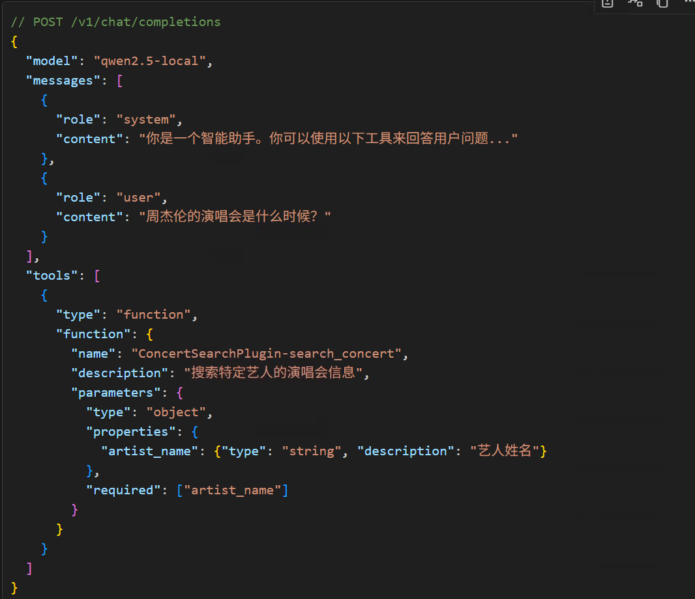

Response (LLM -> SK)

模型识别出需要搜索，返回一个结构化的 `tool_calls` 指令。注意此时 `content` 通常为空或为 null。

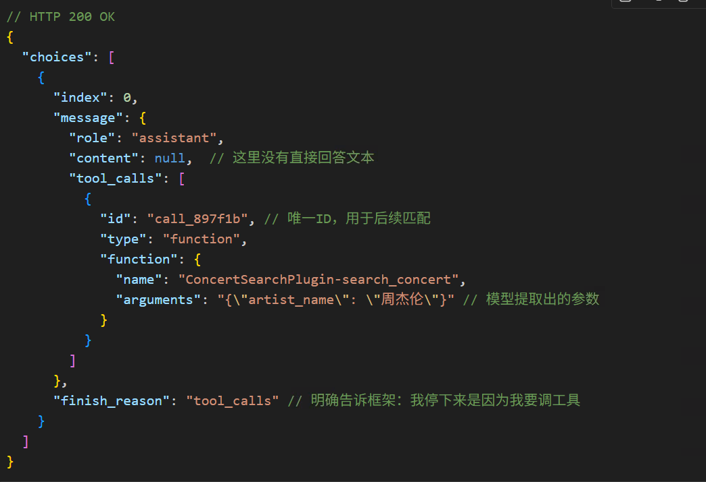

***

中间处理：本地执行 (SK 内部)

**这一步不产生网络流量**。

1. SK 收到 `finish_reason: tool_calls`。

2. SK 解析 `function.name` 找到本地 Python 函数 `search_concert`。

3. SK 执行函数：`search_concert(artist_name="周杰伦")`。

4. **函数返回结果**：`"周杰伦《嘉年华》世界巡回演唱会-海口站，时间：2025年3月2日。"`

***

第二轮交互：提交结果与生成回答

**目的**：将工具查到的结果喂回给模型，让模型生成最终给用户的自然语言回复。

Request (SK -> LLM)

SK 构造一个新的请求，包含**完整的历史上下文**：

1. 用户的原始问题。

2. 模型上一轮的“我想调工具”的请求（Assistant Message）。

3. 工具实际运行的结果（Tool Message）。

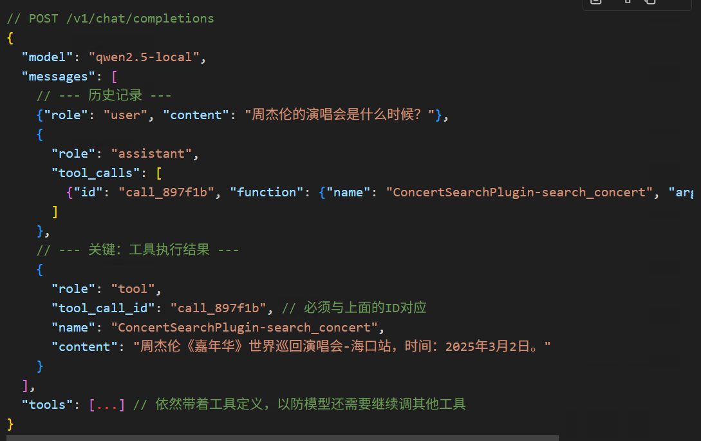

Response (LLM -> SK)

模型结合工具返回的事实，生成最终回答。

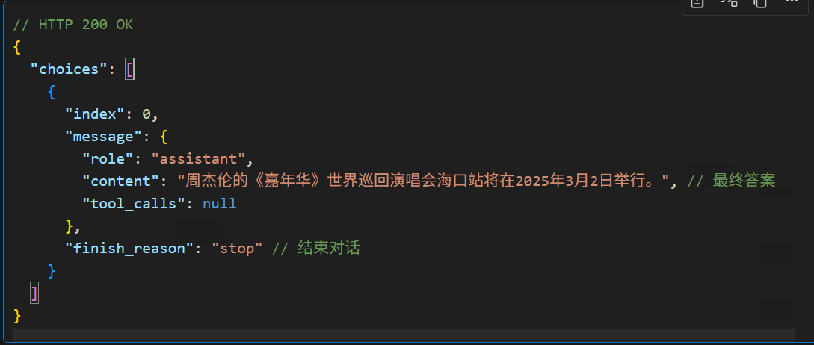

&#x20;4\. GPT在2025年出了一个叫Response的API，你大概了解吗？

&#x20; （关于GPT 的Response API, 其实是在25年3月份OPENAI 就提出了，希望将llm的工具调用，多轮对话等功能整合到api 中，减少Agent开发者的负担。 网上资料不多，面试也几乎从未出现。他都推出了大半年了，但是看上去这个思想没有火起来，估计可能也不会火起来了。我是第一次被问到。所以针对于这个知识点，我的建议是：大致了解下，不用花太多功夫。 所以我尝试用下面的回答大概简单概括下它的思想，理解这个回答，下次万一真被问到，能说道几句就好了，并且我严重怀疑这个基本面试不会问到）

Response API 是Openai设计LLM调用接口的**从 Completions → Chat Completions → Responses 的过渡**：早期的 *Completions* 只面向纯文本续写；随后 *Chat Completions* 围绕 `messages` 支持对话与函数调用，但状态与工具编排仍主要在客户端；如今 **Responses** 用一个 **有状态的统一端点**把多轮上下文与多步工具调用纳入服务端协议。

**设计思想与理念**：以 **“一次请求里的智能体循环”** 为核心，把 **状态、工具、事件流与结构化输出** 写进端点契约（而非让客户端手工拼装），让模型在单次响应生命周期中 **按需调用托管/外部工具、跟踪步骤并输出可验证结果**，从而**标准化智能体能力、降低工程胶水、提升可观测与可扩展性**。

&#x20;5\. 你用LoRa做了本地微调，这里面你是怎么做的？

&#x20;   （LoRa怎么做的，是我们精心准备的答案，包括怎么回答这个答案，对应的方法论和参考资料，我总结的都有，直接看笔记）

参考笔记  1.4 你是怎么做的微调

&#x20;6\.  你里面提到的对性能做测评，里面有一些bool类型指标，也有一些过程指标，这分别是怎么评判的？

&#x20;    （同学们，这个问题不清楚的话，会去看一下八股部分：Agent开发框架，我给大家推荐的这一章的参考资料Agentic Design Pattern，里面就讲了这个问题，Agent评估问题，我推荐的两个资料，都是很有用的哈，这里也验证了，希望你能回到八股部分，看看我的笔记和推荐的资料，以下回答几乎来自于我的参考资料。）

对于bool类型的结果评估，我们可以使用直接比较，要求智能体响应**完全匹配预期输出**时才会成功。

但是对于一些过程指标，则需要使用**更先进的自然语言处理技术**来辨别句子之间的意义。通常的一些手段是计算**字符串的相似度（如Levenshtein（编辑距离） 和 Jaccard(集合重合度））， 关键词分析，使用嵌入模型的预测相似性进行语义分析，LLM作为Judge，**&#x4EE5;及**RAG 特定指标（如忠实性和相关性） 来进行评估。**

&#x20;    （上面的内容其实回答这个问题已经完整了，但是请你思考一个问题，面试官很可能追问，那你的项目是怎么做的呢？ 这个希望大家也能准备，如果你答不上这个问题，面试官会觉得你只懂理论，但是实践不行。所以相应的，你需要自己准备这个你的项目怎么做的问题。以下是对针对我的项目，结合这一问题的答案参考。）

在我的项目中，核心功能 `email_to_event` 需要从非结构化的邮件文本中提取结构化的日程信息。针对不同的字段类型，我采用了分层的混合评估策略：

1. **确定性字段：**

   * **针对字段：** date, time, participants,needs\_calendar\_events 。

   * **评估方法：** 对于日期和时间，我先将其标准化为 ISO 格式（如 `YYYY-MM-DD`），然后进行**直接比较**。对于参会人列表，我将其视为集合，计算 **Jaccard 相似度**（交集除以并集），确保所有关键人员都被识别且没有遗漏。

2. **短文本语义字段：**

   * **针对字段：** location, subject。

   * **评估方法：** 这些字段允许一定的表达差异（例如 "Room 302" 和 "Conference Room 302"）。我使用 **Levenshtein 距离（编辑距离）** 来允许字符级的微小差异。对于差异较大的表达，可以使用轻量级的 **Embedding 模型**（如 text-embedding-3-small）计算余弦相似度，设定阈值（如 >0.85）判定为通过。

3. **长文本与意图字段：**

   * **针对字段：** description (日程描述/备注)。

   * **评估方法：** 描述字段通常包含会议议程或特殊要求，很难用关键词完全覆盖。我采用了 **LLM-as-a-Judge** 的模式，构建一个专门的评估 Prompt，让更强的模型（如 GPT-4o）作为裁判。

   * **具体做法：** 我会问裁判模型："提取的描述是否准确包含了邮件中的‘Q1目标’和‘资源分配’这两个关键议题？"。这种基于关键事实点的评估比单纯的文本相似度更能反映业务价值。

&#x20;7\. 你认为多Agent系统和单Agent系统最大的区别是什么？彼此有什么优势？

&#x20;（朋友们，问题7和问题8其实也都是在我给大家总结的Multi-agent的架构的 1个论文 + 书本的某一章中，这两个参考资料很有用，请大家仔细阅读另外这个问题看上去也是比较有通用性的，因此我直接将这一问题收录到八股Multi-Agent部分。）

参考八股 6.3 单Agent和多Agent对比

&#x20;8\. 你讲到的你这两个项目，两个项目最大的区别是啥？你刚才只是结合了一些概念上的东西讲的，你能否具体结合你的项目讲？

（在你理解了我整理的参考资料后，这个问题其实很好回答。我给出的参考论文列举了不同任务 使用不同Agent框架的效果和性能，并总结了什么项目适合什么Agent框架，如果你能理解的话，这个题其实是把这个相关的内容，运用到你自己的实际项目中，针对你的项目谈谈回答。还是这句话： **笔记八股Multi-agent部分的内容值得大家好好会去阅读**。以下的答案其实基本就是可以套用我给大家总结的参考资料部分，**金融分析适合用中心化架构**，**网页导航适合去中心化， 工作流适合单Agent的架构的原因**，然后往你的项目一套，就完了）

在我的邮箱项目中，因为本身它是**严格线性进行的，每一步依赖于上一步状态，无法并行，并且任务不复杂，单Agent的基线收益已经很高**，所以天然适合使用单Agent项目，使用任何一个多Agent架构都会导致性能下降。

而在按摩房预约系统中，任务天然具有"分而治之"的特性，**中心化架构让编排者将任务拆解成"预约", "支付","咨询"的子任务**，分配给不同任务并行处理，最终整合。在此种场景下，使用中心化架构是最好的选择。

**算法题：**

给定一个由 DAG 定义的 agent workflow，判断图是否成环，若不成环输出 yes，成环输出 no。

### 视频讲解

我用夸克网盘分享了「字节（豆包）一面.mp4」，点击链接即可保存。打开「夸克APP」，无需下载在线播放视频，畅享原画5倍速，支持电视投屏。

链接：https://pan.quark.cn/s/e871659e57d1

## 2025.11 Deepwisdom

### 岗位介绍

**公司产品**

国内 Coding Agent 赛道龙头，以多智能体协作技术为核心，推出 Atoms（原 MetaGPT-X，简称 MGX）AI 原生创业平台，可通过 “自然语言输入→AI 虚拟团队分工→5 分钟交付可运营商业项目” 实现全流程闭环。开源框架（MetaGPT、OpenManus 等）累计超 15 万 GitHub Star，全球注册用户超 50 万，上线首月 0 投放即达成 100 万美元年化收入（ARR），连续四周霸榜 Product Hunt 全球榜首；累计完成 3100 万美元融资，Xbench 测试成绩远超 OpenAI o3 等竞品，通过 SOC 2 认证与 GDPR 合规。

**技术实现**

* 底层是**多 Agent 架构**，通过 Agent 协作来实现功能

* 不是简单的拖拉拽形式，而是智能生成

* 涉及 Agent 之间的通信、工具调用、站外文管理等

**公司规模**

* 公司有 **100 多号人**

* 只有这一个产品，所有人都为这个产品服务

* 已经做了**大约一年**

* 目前是**创业公司**，资源有限

**岗位要求**

* 全栈工程师：前端、后端、算法都要做

* 包括模型调优

* 不区分前端后端测试，什么都要做

### **反思**

这个公司是一个创业公司。根据和面试官的交流，确实是和创业公司的典型画像很匹配。面试官说，什么都要要做： **前端，后端，算法，测试，模型调优**都是要做的。一般创业公司还是很看重匹配度以及技能的全面性的。

从考察的角度，本次考察内容其实中规中矩。基本上是结合项目去考察，结合着项目也会扩充到一些相关的基础知识，比如架构，量化，DPO，提示词工程。 总的来说本次的面试内容基本都在我们的掌控之中，八股内容里基本覆盖，都在我们总结之中。 我也结合着这一次复盘，去优化调整了一些知识。八股部分，结合这一次内容，在模型八股中：加入了模型和硬件相关的知识：怎么判断模型能不能跑？跑的有多快？这一点对于使用本地模型的同学，需要了解。

从本次面试流程来看，本次我是主动放弃了二面，因为当时其实就准备等千问C端开奖然后去了，也无心面试了。主动放弃了二面，猎头还一直说好可惜好可惜，他说你被分到了什么xx组，这是很好的组呢。从面试流程上来看，一面结束后，会给一个笔试题，这个笔试题是一个链接，点开后需要使用6\~8小时，去完成一个小的项目。好像使用他们的编程工具和平台去做。因为我放弃了面试，所以发了链接我也没有点开。

&#x20;      我倒是认可这是一个挺好的，可以反映候选人素质的考察方式。 这样考察的公司不多。我是第二次遇到。第一次遇到其实就是我面试现司，是给了一个项目，让我60个小时内完成。这种考察就是挺折磨人的，感觉要在一个很短时间封闭开发，需要在短时间高度集中，还考验人的。

### **一面**

1.自我介绍。

2\. 你的AI日历助手是写的客户端的代码逻辑吗？用什么语言写的？

&#x20;  2.1 模型也是跑在本地吗？模型能跑起来吗？用的多大的规格和尺寸？

（这个问题夸克千问一面也有对吧。 为什么会问，想让大家知道的是如果你用本地模型，甚至是cpu，就是会问啊，面试官会有疑问。 所以如果是说你的模型是远端的，其实一般应用岗这个问题倒是不会太问到，但是你用了本地模型，那么你需要知道这个问题。这个问题我也在八股部分 模型和硬件，总结了模型能不能跑，跑的多快，我相信这一节我讲清楚了，**大家去看一下**，有了这个基础，这个问题其实非常好回答，结合你具体的模型，硬件和公式，给面试官算就好啦！）

完全可以跑起来。我的电脑是64GB内存。

&#x20;     qwen7b-INT4 的要求是： 7B \* 1字节   =  7,000,000,000 字节 - 7GB。&#x20;

&#x20;     加上一些额外的开销，大概需要多1.2\~1.3倍的空间，所以内存要求是8\~9GB，所以我的电脑完全能跑。

结合我的从工程/任务层面的优化 + 选择专门的推理框架最大利用cpu的并行计算能力，也可以调推理速度。

（上面回答应该是很具体和专业，具体公式计算，怎么来的，原理，请看我的八股 部分 模型与硬件）

&#x20;  2.2 他具体做了哪些功能？

3\. 我看你简历写了MCP协议，上面注册了多少个工具？

&#x20;  3.1 你提到整个工具动态加入，怎么动态加入，他怎么知道每一步要用哪些工具？

（这涉及两个问题，一个分阶段注入工具，你怎么知道每个阶段注入什么工具。 第二个是如何动态注入的，第二点就和具体的Agent框架，langchain 等有关系，我这里以Semantic kernel 为例回答，因为这是我项目中用的）

整个流程被划分为多个阶段（邮件获取，创建行程，通知等），每个阶段只向 Agent 注入该阶段所需的工具集，这个是业务逻辑规定的。&#x20;

Semantic Kernel 的架构是 **Kernel（内核）+ Plugin（插件）** 的模式，每个 Plugin 包含若干个具体的工具函数。动态注入的思路是：所有 Plugin 预先注册到 Kernel 中，但在每次调用 LLM 时，通过**过滤器机制**指定当前允许使用哪些 Plugin。这样，虽然 Kernel 中存在全部工具，但 LLM 在该次调用中只能感知和使用被筛选出来的工具子集

（后面一部分SK的机制我认为对大家没啥帮助哈，这个Semantic kernel我看也就微软在用，大家看看就好）

&#x20;  3.2 你提到会存储一些数据，会存储一些什么数据呢？

（这个问题，我在 八股 长期记忆的常见应用场景 中总结了常见的一些场景会要存储的长期记忆。包括这个例子，也是根据我的业务场景下长期记忆的一个参考。 整个回答和你的业务相关，整个东西也不难，但是要能说出来，展示你的一些思维的发散性。 比如夸克千问2面面试官就追着我扩展，天马行空问，你的场景下要存一些什么？为啥，大家根据这些例子做参考，然后想想你的Agent项目要存点啥）

&#x20;   在我的智能日历助手中，我们需要根据用户喜好，来智能调整规划冲突的策略，这时我们会存:

&#x20;   1.用户偏好相关：时间偏好：喜欢早睡/晚睡？工作>个人？ 家庭>社交？等方面喜好

&#x20;   2.历史行程模式： 过去的选择倾向，倾向推迟还是提前，喜欢合并还是分散。这可以让我们在做决策时参考以前现有选择，直接复用。

&#x20;   3\. 社交关系：重要的一些联系人，比如老板，家人，重要客户。这样在涉及到重要人群的时候，会提高优先级。

4\. 你的项目整体使用了一个什么架构？

（架构这里其实讲了挺多的，包括很多面经有一些深入架构的讨论，我们的八股也总结的很多了，这里的面试其实就是问了最基本的问题。 那么大家回答的时候，就是结合我们八股部分总结的那几种架构，看看你的架构是属于多Agent的哪一个，结合着讲一讲，以及为什么选这个架构等等，大概讲一下。以下我的回答其实理论知识都来自于我们八股部分架构的相关内容。单Agent vs 多Agent，如何选型，八股部分都总结的很好了。）

我的系统采用的是一个典型的单Agent 的Prompt chaining的架构，具体来讲就是将任务分为多个阶段，然后单个Agent在这个Chaining的流程中去填空，完成子步骤。选择这个架构的原因是因为，我的任务并不支持子任务的并行，而且单Agent的基线收益比较高。这种情况下使用多Agent，反而会引入协调税，分散token，引入沟通开销，性能反而下降。所以在这种情况下，单Agent的效果是最好的。

5\. 你的Agent是如何进行效果评估的？

（这是一个必考题，从Agent评估的理论到结合自己项目，Agent是怎么做的，在八股部分都写了，大家自己参考一下吧）

&#x20; 参考八股：3.3 你的项目中是如何对Agent进行性能评估的

6\. 你讲一下你是如何做的量化？

&#x20; 看我的笔记吧： 8. 你的项目是如何做推理加速的？

这块我是专门总结了量化，微调，推理加速的知识，结合项目讲了怎么做，有具体的方法。我的理论依然是，对于应用，我们把流程走一遍，我这个方法我是让AI写了脚本跑了一遍，确定是可行。然后记录下来大概的结果，用的什么库，怎么完成的，总结好，整理好。 量化，推理，加速就到这里。因为算法不是应用的主战场，我没有深入去做（不过确实应用岗也不会深入问），所以做到我八股整理的这一步，就够了。我没有再深入，面试也没深入问过。

7\. 你这边也会做LoRa微调吗？数据怎么来的？什么是DPO啊？

&#x20;一样的，都是我们八股总结过了的。 LoRA怎么做的，这个问题我专门总结了，也有一套方法论：如果以科学实验方式做LoRA。 相信这里总结的很好了，包括数据怎么来的。以及什么是DPO，这都概念，我们八股都总结了。参考笔记1.3 你是怎么做的微调的?

所以大家虽然是应用岗，但是不要怕算法，我们都准备了。 而且算法岗问多深，我们就准备的多深。我没有深入总结什么公式啊，就是因为现在面试官不会深入问。万一有一天他深入问的多了，我笔记也会相应深入总结的，我帮大家兜着底呢。

8\. 大模型肯定要组装一堆Prompt，你这个Prompt是提前备好固化然后直接打包在电脑中吗？有没有什么Prompt优化方法？

8.1 除了变量之外，那些固定的部分，能不能用用户的数据来优化咱们整个Prompt？

(关于提示词的优化，这个问题让我想到了夸克千问二面 面试官的问题 在项目过程中，怎么去做提示词的压缩和裁剪？ 这个问题其实面试官想问的是数据飞轮来优化提示词的策略。算是另外一种对于提示词的处理，我们可以结合夸克千问这个面试问题，这两点来综合学习一下在项目中有哪些对于提示词的处理技巧）

（数据飞轮指的是：把数据比成一个飞轮，一开始很难转动，但是随着开始启动，会越来越快。 类比到Prompt中，指的是一开始数据是固定的，但是随着上限采集到一些数据，通过数据来优化提示词，达到更好的动态调整，更好的效果的概念）

是的，在我们的项目中也可以使用数据飞轮来优化提示词。

比如我们在提示词中，预置一个用户历史对于冲突检测的选择的倾向和一些历史决策。然后在提示词中表明，会参考用户历史的倾向和选择，来调整智能规划的建议。 一开始上线，可能并没有一些历史数据，飞轮没有转起来。随着上线，收集了用户对于历史建议的选择：忽略，直接接受，修改以后采纳 等选择，来维护用户的选择信息，动态调整加入到提示词中，让飞轮转起来。

9 你最近有使用过哪些AI工具，你觉得哪个模型使用的比较顺手？

（其实吧，这个问题看似是个闲聊问题，但是当我真正复盘的时候，这个问题背后其实体现着企业是否对你跟上这个AI潮流的考察。 因为现在这个时代，其实很多企业问你如何Vibe coding，有没有啥技巧，用那些vibe coding工具，用什么AI产品，这些都是看你是否跟上潮流，有一些思考。 所以其实这些题目最好也是能反思一下，总结几个常用的比较新的的AI工具，比如Skills出来以后，可以说使用**Skills Creator** 来生成Skill等。体现自己对最新产品的使用和思考）

10\. 你怎么去了解一些新的技术？

同样和上面一个问题一样，看着是闲聊，其实背后在考察你是否在主动学习，学习方法聪明吗？我以后给一些答案供大家参考

11\. 你在微软干的好好的，为什么要出来干这个？

12\. 你想去哪种类型的公司？

&#x20;（我能理解面试官问这个问题的初衷。因为这个公司也就100来号人，创业公司。而我之前都在上万人的大厂，面试官通常一定会有一些顾虑，你到底想不想去创业公司。所以如果大家面试创业公司的话，这个问题一定要顺着面试官说，表现出意向度）

算法题：

两数之和，三数之和

### 视频讲解

我用夸克网盘分享了「DeepWisdom大模型全栈一面.mp4」，点击链接即可保存。打开「夸克APP」，无需下载在线播放视频，畅享原画5倍速，支持电视投屏。

链接：https://pan.quark.cn/s/f2f648a357e6

## 2025.11 象映技术

## 2025.11 易鑫技术

## 2025.11 深维智信

## 2025.12 加速进化

## 2025.12 SAP

一面大主管，二面+1面，三面中华区负责人。没错就是先主管面，再+1面，有点奇怪。

全程几乎没啥技术问题，不知道他们考察的逻辑是啥，感觉这种全程面下来都没有太问技术的，那更多只是理解为他们更多的是看背景选人了。

### 一面

### 二面

### 三面

## 2025.12 小红书

### 岗位介绍

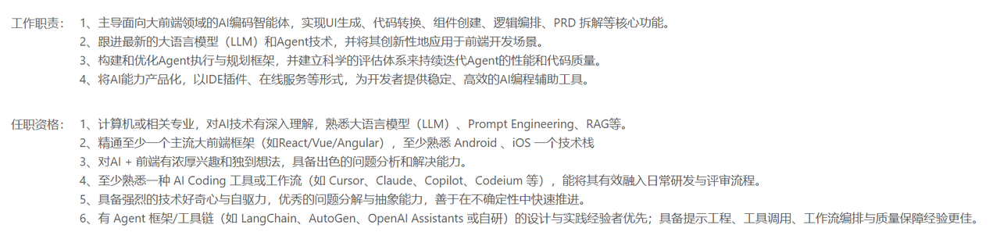

### 反思

整个面试基本上围绕： **量化  +  Multi-agent框架 + RAG数据库 + 模型选型**上四个方面展开。

面评：对量化模型和结构有一定了解，但应用比较简单，技术和方案设计能力单薄了些。

其实面试官说的也没有问题，不过对于方案设计的题，我没有答出最优解，好歹也和面试官在讨论，说了一些解决思路，但是面试官还是无情挂了我，甚至是写题的机会都不给（小红书的面试，写题的界面都准备好了，但是最后他不让我写），挂的很坚定，可以看出小红书的要求还是挺严格的。

反思：

1.我一直和大家说的是，做RAG系统的时候，你就要把你的文档弄得复杂一些，用上专业的数据，而不是像我一样，用了一个简单的文档，没有啥复杂的召回策略，都没有专业数据库，这也是面试官觉得我的项目很简单的原因，大家在设计项目上就应该避免。

2.方案设计这一块，之前面试官问方案/架构设计的比较少，这块确实薄弱了一些。不过最近面试几个大厂，多少还是在讨论方案和架构设计能力的，这块需要我们针对于面试题，整理提升下，如果有好的架构的资料，到时候我也会分享，总之这次面试是一个很好的机会，提升对于多Agent 架构设计的思维能力。

3.我可以看出来，面试官对量化/推理这一块并理解不深，你看他也都是问的一些概念性问题，相反应用模块，都是问的比较深入和细致。 这个其实反映了，对于现在市面上既要求应用，又要求算法的情况，大家不用太慌张，因为通常应用岗位的面试官，他就是问算法相关，他懂得也不深入。所以我们大胆复习，先把推理加速/训练的框补起来，面试的时候大概就够了。你看我对于量化这块也不是专家，不算懂得特别多，但是面试官的反馈还是说我对量化有一定理解。所以推理/微调这块不要怕，先按笔记资料学起来，把一套流程跑通，面试自信地讲就好了。

### 一面

1\. 自我介绍？

2.看机会的理由什么？

3.你的两个项目你觉得哪一个挑战更大呀？项目做了多久呀？

4.可以详细展开讲一下这个项目吗？

5.我停下来它的核心的功能还是比较简单的，但是你又跟上了做了微调/蒸馏/量化/推理加速的技巧，我理解目前主流的模型是都可以做到的？为什么你还有做微调呢？

（这个也是一个和项目相关的问题，不太涉及知识点，大家看看就好）

&#x20; 这个其实是因为虽然主流模型完全可以完成相关功能，但是由于我的项目是要在资源受限的设备上（CPU）上去跑，所以需要加速推理速度同时不损失太大的精度

6.最终用了多少B的模型？

7.你是怎么做的量化的？

（说实话，我不能说对量化精通，这里我就是准备了自己做推理加速的一套方案，把这里的东西搞懂，去讲就好了，比如我总结的方案，**采用Q4\_K\_M,Attention层保持5-bit精度，FFN层压缩到4-bit，输出层用6-bit确保质量&#x20;**&#x8FD9;几个关键地方弄清楚，一般其实应用的岗位面试官也不深入懂量化的，你回答到这里就差不多了，他也不会深入问和你问细节）

笔记部分  你的项目是如何做推理加速的？

8.量化的好处是什么，优缺点是什么？

（这个算是一个八股内容了，我总结在八股笔记量化部分。自己当时答确实可以答出来一些推理精度下降的问题，但是还是没有事后总结的答案好，因为现在我总结的答案，可以从**模型的结构，网络上深层次**地指出量化带来问题的原因，对于好处的总结也完整。所有有时问题虽然回答出来了，但是确实需要时候总结，反思，迭代出更好的答案，下次回答的更专业。）

&#x20; 8.1 你说到量化会降低精度，那么降低精度会有什么问题吗？

&#x20;  参考笔记  量化的好处和坏处

9.量化在KV - Cache中起到一个什么作用呢？

&#x20;（我觉得这两技术没啥太大联系，是两个不同的技术，我这么回答的，面试官也没反对。不过这两概念还是值得记一下，kv-cache和量化的定义，自己回答肯定答得没有这么专业。）

**KV-Cache&#x20;**&#x5728; Transformer 推理中缓存 Key 和 Value，避免重复计算，提升长序列推理速度。

**量化**：降低**权重或激活的精度**，减少显存占用和计算量。它们是两种不同的优化技术，但它们可以结合使用，目的都是为了**降低资源消耗、提高推理效率**。

10\. 说到模型，对模型来说，他会产生幻觉吗?

（这个问题用笔记部分如何减少模型的幻觉就够用了，这个笔记不光总结了幻觉如何解决，还总结了幻觉产生的本质）

参考笔记 如何减少模型的幻觉

11.多Agent 时，要怎么设计这个多Agent系统？

参考笔记 6.1 设计多Agent的原则

12.你的项目中使用的是什么多Agent的一个架构？

13.如果说你的子Agent膨胀变成20个，或者说是50个，你应该怎么去优化呢？

&#x20; （这个问题我不太确定面试官想要的最终的答案是什么？这个问题其实就是在 多Agent的主管模式下，如果子Agent不断膨胀，那么这个Supervisor的压力可能会很大，这时如何解决，如果不知道什么是多Agent的Supervisor模式，请看这里：https://github.com/ginobefun/agentic-design-patterns-cn/blob/main/13-Chapter-07-Multi-Agent-Collaboration.md。我的回答中，提出了使用Hierarchical的模式，但是面试官继续挑战这种模式如果一个分类错误，会导致后面都出错，然后我说可以分类的时候采用多Agent投票决策分类，加强分类准确性，面试官又挑战这样性能开销大，于是我说这个投票的策略可以是多个Agent并行的，但是面试官还是不满意，总之这题大家看到其实是面试官会不断和你探讨架构设计上的问题，需要有一些知识储备，才能像最优解靠近，我这个回答显然面试官并没有觉得最终探讨到了他最满意的解决方案。复习这个题请先掌握好八股部分多Agent相关资料，这是你回答这个问题的知识来源和储备。）

&#x20;  13.1如果说这个分类Agent，子Agent膨胀成20个，那么分类Agent需要分成20个，那么它的压力就会比较大了，这时该怎么办呢？

&#x20;  13.2举个例子，比如市面的元宝，豆包，它的咨询机器人，是会面向不同的行业的，每个行业的特性可能是不一样的，这样这个子Agent一下子就会膨胀的，这样怎么办？

&#x20;  （我这里回答了采用树型的结构，层级分类）

&#x20;   13.3 这是一个思路，这会导致一个问题，就是一旦第一层分错了，后面会全错，这怎么办？

&#x20;   （我这里又说了每一层采用投票机制，加强分类的准确性，导致每一层分类出错概率降低）

&#x20;    13.4 如果采用了这个方案，性能上开销很大，这怎么解决？

&#x20;     （我提到了说做一些并行化的优化）

（本题答案总结如下，需要多Agent八股部分的前置知识，比如中心化架构中，性能开销，优缺点，这些在八股部分都总结了）

在使用中心化多Agent架构时，系统复杂度会随着**r, n, k**增大。r表示主管和子Agent的回合数，n 是子Agent数量，k是子Agent迭代数，所以如您所说，子Agent 数量n增大时，系统复杂度增加，主管Agent确实会成为瓶颈，这也是这种架构的弊端。

为了解决这个问题，首先我们可以思考 是否一定要用**这个架构**：

比如**动态环境下（网络导航/检索）** 更适用去中心化，不会存在单点瓶颈。

&#x20;    **强推理，长推理链&#x20;**&#x4EFB;务更适用于 单Agent。

&#x20;     **1. 动态负载均衡**

主管不直接管理所有子 Agent，而是通过**调度池**或**任务队列。**&#x7B80;单来说主管只负责任务分类，将任务丢到调度池中，然后采用专门的**调度器来解决任务的分配问题**。调度器本身就是处理高并发，自动化调度的，所以可以很好处理子Agent膨胀导致分类/调度任务增大的情况。

&#x20;    **2. 采用分布式系统**：

&#x20;    **3. 可以采用混合型架构**

&#x20;    使用混合型架构，仍然保留了中心化的骨架，但是中心Agent管理的不是单独的Agent，而是若干小组，将顶层单点Agent压力从子Agent个数n下降到了小组数g，减缓顶层Agent压力。

&#x20;   **4. 控制k，r**

如上面所说，这种系统Agent压力和k,n,r相关，单点Agent可能会成为性能瓶颈是它的特点。因此我们设计的时候，就需要**尽量减少交互轮数 r 和 k**，缓解单点瓶颈问题。

14 你有提到小型的RAG,那么RAG的流程是怎样的？

（这个问题答案我不具体讲了，因为和我项目强相关，这个题主要有两个启示：

1. 我的项目用的sqlite做存储，因为我的文本简单。但是如我之前和大家说的，自己项目建议还是专门用专业向量数据库，做切块，用专业的召回策略去召回。&#x20;

2. 面试官其实问的非常的细致。之前很少面试官问这么细的，包括你存，存了什么表头，怎么query的，因为我写的代码我都有点忘了，我自己都没那么细致，答的不是很好。这块告诉大家你需要在这个RAG存储的地方，了解的非常非常细致，包括你如何存的，表头是啥，甚至是向量模型的参数（14.3），这些都要弄清楚）

14.1 你当前的数据是怎样的？

&#x20;     14.2 你具体存储的数据结构是怎样子的？

&#x20;         （存了表头吗）

&#x20;     14.3 你用什么向量模型，用的多大的size？

&#x20;     14.4 相当于说检索出来之后，用什么对他匹配的？你的query是什么来着？

15 这个项目为什么要用GPT4?

15.1你现在觉得你在这个过程中你应该选择什么模型？有更新的为啥不用更新的，而且mini的消耗还是比较低的？

&#x20; （这个问题我总结在了笔记 **不同模型的对比和选择，**&#x5BF9;应的笔记和复习思路请参考笔记。 这里我回答的不好，因为在我的项目中其实没有专门做模型对比然后选型，相信大家自己做项目，可能前期也不会有专门的选型，但是即使你的项目选模型没有精心考虑，但是在回答这个问题的时候，还是需要你对主要的模型有一个对比，不同模型能力区别有一个了解，然后结合你的项目自圆其说）

&#x20;    具体请参考笔记：8.不同模型的对比和选择

### 视频讲解

我用夸克网盘分享了「小红书大模型应用岗一面.mp4」，点击链接即可保存。打开「夸克APP」，无需下载在线播放视频，畅享原画5倍速，支持电视投屏。

链接：https://pan.quark.cn/s/e3c8fba128e6

## 2025.12 阿里夸克千问

### 岗位介绍

岗位描述

1、负责夸克千问、通义APP内的大模型应用研发,熟练利用大楼模型相关工具和平台,实现诸多AI应用的快速落地与持续迭代;

2、负责大模型产品的整体技术解决方案,基于对大模型架构和Agent框架的深入理解,合理技术选型,参与技术研发和效果优化等工作,推动产品持续增长;

3、保障大模型应用系统架构的稳定、高效运行,帮助业务优化性能和改善系统稳定性,持续提升用户体验;

4、持续跟踪前沿技术趋势,关注并探索AI新应用、适时引入新技术新方法,持续提升产品技术、工程架构上的先进性。

岗位要求

1、计算机或相关专业本科及以上学历,2年以上工作经验,熟练掌握C++/Java开发,熟悉Linux系统下程序性能分析及优化能力,有大型项目/系统负责经验者优先;

2、参与过大模型应用系统/业务研发经验者优先,熟悉RAG、Agert机制,了解包括langchain、vllm开源系统,有prompt工程业务优化经验、以及模型finetune者经验优先;

3、有优秀的架构设计能力,有相关大型系统设计、开发、优化经脸,了解检索引擎、kv存储、在线服务框架、批流处理等中间件系统;

4、具备良好的产品和业务sense,有大模型应用的深度使用用、开发落地经验优先;

5、有实时通信业务(IM文本、推送、语音通话)后端研发经验优先;有丰富搜推系统研发经验优先。

### 反思

一面：整体来说其实很简单，算法题很简单，当然我完成的也很快，但是阿里的面试官还是给了这个算法题30分钟时间，相比字节的算法题目，真的显得非常的友好了。整个一面其实涉及到知识考察的部分几乎没有，甚至可以感觉有点像是一个电话面。基本是和面试官在聊项目（并且停在功能层面，没有深入到技术层面）。面试官人也很好，他一直在肯定我，我回答完他经常说，挺好的这种话给我鼓励。整个时长也就44分钟（并且包括了写题和反问），在这次面试中其实确实没有一些特别干的知识方面的东西和大家总结。另外我觉得背景可能加了分，因为这个岗虽然是Agent开发，但是使用C++，面试官提到了C++国内就是你们公司的最好，所以我估计这点也加了分。因为本期几乎都是一些项目相关的问题，比较碎，文字不太好总结，要想更细致知道当时发生了啥，可以参考笔记后面的视频讲解链接。**我觉得唯一可以抽取出来的一个知识点是第3个问题**，如果项目使用了本地模型，可以了解一下不同参数量的模型在不同的硬件上的使用情况。

二面：二面其实还是挺有价值的。面试官对我说了一句话是你来了这里，会把工程做到极致。 回看面试官的问题，确实是从工程的角度上提出了挺多有价值的问题。虽然看上去这些问题是针对于我的具体的项目展开的，但其实这个**讨论是有通用性**的，具体的问题不重要，重要的是**这些工程的问题和思维**，在不同的项目上都会遇到。想要把这些问题回答的很好，需要：

1.一**些知识的积累**，比如我准备的Agent架构相关论文，相关书籍，需要你看进去了，并且真正理解了，会灵活运用。大家看后面的回答可以看出来，基本我的回答还是从我的八股里总结的参考资料下手去谈的，所以我们不光要记住总的最高频的八股，也需要看对应的参考资料，去理解，这样遇到这种发散性讨论的问题才可以侃侃而谈。

2.一些自己的思考，这个可以结合一些具体的面试问题，自己去思考，运用你的一些知识，比如面经部分包括**小红书，华林证券，字节豆包，**&#x90FD;有相关架构的设计，大家结合笔记和讲解，通过这些题目思考和复盘，也可以提升这块的能力。

最近也确实有一些公司喜欢考架构，考一些具体问题的探讨，这些东西稍微比纯八股，纯知识难一些，但是其实经过一些相关面经和相关资料，面试几次，这块也不会很难，并且这些问题通常也不会有完全标准的答案，有一些自己的思考，能够回答上来也不至于太差。这里我觉得还挺有价值的，我在讲解视频也会谈一下更多自己针对于这些问题的准备方法和思路，和技巧，笔记也会尽量写出思路，希望对大家有帮助。

HR面：HR面个人感觉没什么特别好总结复盘的。 面试之前有人提醒我说阿里的HR喜欢压力面试，我还专门咨询了一些阿里的朋友。不过后来觉得又不考技术，压力能压力到哪里去呢？自信表达，不踩阿里的红线就好。唯一一点我想说的是，别把姿态放太低了，这样HR觉得你接的意向大，就会压你工资。具体问题我还是整理出来大家看着参考一下就好。

### 一面（44min）

上来首先是手撕一道算法题目，并不难，很快就做出来了，题目如下，翻了一下记录，我大概是不到10分钟写完的，面试官的预期是给30分钟，确实是一道很简单的题目，如果要难度分类，应该是Leetcode esay 题目。

算法题：

Leetcode  792

1\. 自我介绍

2\. 按摩房预约系统是你现在在做的吗？

（这个面试官就是单纯的好奇，为啥的项目中会有一个很奇怪的和按摩房相关的项目，看上去就很奇怪，这也就是我在这个笔记第一章项目思路设计的时候就和大家说的，设计项目的时候就要尽可能往工作上靠，像我这个项目一开始设计就看着和工作无关。但无论如何，这就是走过的坑，希望大家尽量避免，话说回来，即使我这个项目立意就不好，但是这次面试还是挺尴尬的，但是如果现在让我重新再来一次，我不会设计一个这么奇怪的按摩房项目）

3\. 你这个智能日历系统是在本地运行的吗？那你们本地用的是哪个模型呀？

&#x20;  3.1 那你们本地跑的起来吗？

&#x20;  （这里最好是可以结合硬件和模型去答一下，因为使用的本地模型，大概讲一下本地什么样的硬件可以跑起来什么的模型，结合具体情况去聊）

是的，我们完全可以在本地跑起来。这主要得益于我们对硬件资源、模型选择以及任务复杂度的综合评估和优化：

**硬件与环境**：

我们使用的是标准的 8核 CPU 配备 16GB 内存的开发机，没有使用高端 GPU。我们在启动脚本中配置了纯 CPU 推理模式（n\_gpu\_layers=0），利用 CPU 的 AVX 指令集加速。

**量化技术**：

为了适应 16GB 内存，我们使用了 GGUF 格式 的 4-bit (Q4\_K\_M) 量化模型。这把 7B 模型的大小压缩到了 4.36 GB，不仅加载速度快，而且运行时内存占用很低，完全不会卡顿。

**推理加速**：

配合 llama.cpp 引擎，我们在 CPU 上也能达到很高的吞吐量（约 140 token/s），这对于实时性要求不是毫秒级的后台任务来说已经非常快了。

**任务适配性（关键点）**：

最重要的一点是，我们的业务场景并不需要“超级大脑”。

**任务类型简单**：我们的核心任务是文本分类和信息提取。这属于自然语言处理中的基础任务，Qwen2.5-7B 这种中等体量的模型在指令微调后，处理这类语义理解任务的准确率已经非常高了，不需要动用 70B 或 GPT-4 这种超大模型。

**工具链简单**：我们的 Agent 只需要做简单的决策，比如调用本地的 check\_conflict或 add\_event函数。它不需要复杂的代码解释器环境，也不需要多步联网搜索推理。

所以，对于这种特定领域的结构化提取任务，本地量化的 7B 模型是一个在速度、成本和效果上达到完美平衡的选择。

&#x20;  3.2 你们微软自己的模型可以打平千问是吗？

&#x20;  （看上去有一些是在纯聊天了）

&#x20;  3.3 那你在本地一个7b的模型能做啥呢？

&#x20;   （还是聊一些和千问模型相关的内容）

&#x20;  3.4 整个项目具体细节的澄清。

&#x20;   （xxx还是在和面试官讲我们的项目具体做了什么）

&#x20;  3.5 还是在问项目，而且是停留在了功能层，不是技术层，对大家其实帮助不大。

&#x20;  3.6 ...我觉得基本上已经扯得很远了，就是在讲公司的一些产品层面的东西，几乎纯聊天，几乎已经扯到其它产品上了。

4.扣项目，问了一个简历上写的和大模型无关的另一个项目的具体细节。

5.你上一段工作的离职原因，大致问了一下上一段工作内容。

### 二面（55min）

1.自我介绍

2\. 你为什么要换工作

3.你倾向的工作地点

4.挑一个项目讲解（自己任挑，甚至是说是Agent/非Agent项目都可以）

5.讲一个你在项目中遇到的最困难的问题，以及你是如何解决的？

&#x20; （这个问题我在总结字节豆包的面试中就总结过了，我认为大家需要针对这个问题，整理一个自己的答案，然后把这个问题解决的过程讲清楚，讲出深度，我暂时会讲我解决模型工具调用失败的这个问题，大家可以参考笔记）

&#x20;   参考 4.你在项目中遇到的最难的问题，如何解决的？

6\. 这个里面调用了多少个工具啊？

7\. 如果你在cpu上跑，选一个很小的模型，模型可能做不了很多事，这个怎么办？

&#x20; （这个问题的回答涉及：Infra层比如微调知识，工程学相关知识。我的回答更侧重于工程角度，因为这是一个工程岗。不过值得一提的是，如果是Infra背景的面试官，可能会更注重听Infra的优化的知识，这个还是视情况而定。

我的回答，第一个模型推理的难度，这个其实是在美团龙猫的论文中总结的，我们拿来用这个思想，这一个论文其实在整个笔记中涉及多次了，我就不赘述。

最后的总结部分，我也引用了UC Berkeley的论文做总结，丰富了回答，也侧面像面试官展示了我们在关注前沿知识/论文的能力，关于这个论文，可以参考：

https://36kr.com/p/3608851367871752）

对于这个问题，核心的思想是有两个：提升**模型的能力，**&#x548C;**降低任务的难度。**

首先**讲解提升模型的能力**，我们可以通过：

&#x20;     1.通过微调，强化学习让模型能够在指定任务上取得更好的效果。

&#x20;     2.降低任务的复杂性。Agent系统中任务的难度主要体现在3个方面：

&#x20;**接下讲降低任务的难度**，通常来说，Agent系统中LLM的难度主要体现在：

**推理维度**：Agent是否可以在部分可观测，信息不完整的环境，将线索整合并做出正确抉择。

&#x20;     **工具维度**：在众多工具依赖图中，Agent是否可以选择正确工具，使用正确参数。

&#x20;     **交互维度**：在多轮对话中，是否能够主动识别意图，主动澄清问题，维持上下文一致。

&#x20; 针对于小模型，我们可以通过任务设计的角度，比如拆分成任务，限制步骤，减少工具推理难度等方法，去避免这三个维度的难度，让任务复杂性下降，使得使用小模 型也能够取得很好的效果。

值得一提的是，我看过UC Berkeley 25年12月发表的一篇论文，结论是即使在目前生产级别的Agent项目中，也通常将Agent步骤限制在10步以内，也会使用比如添加抽象层的方法降低工具推理难度，所以这些方法其实不止在小模型上需要使用，在大模型的项目中一样需要。

&#x20;&#x20;

8\. 时空冲突这个事情，假设不局限在当前的状态，未来理想的状态下，你认为还需要做哪些事情啊？

（这个虽然是针对于具体任务：冲突检测讨论的。但其实面试官根本不在乎具体任务是啥，甚至也不在乎你做的多深，而是在和你讨论。 这个过程会把我们学到的一些知识串起来，这个过程是值得大家思考和借鉴的，有的面试官就是不喜欢问八股，喜欢发散性讨论，这个整个讨论过程还是希望大家感受一下的，因为有的面试官就喜欢这么和你聊，和你探讨，这个碰撞的过程本身就是一种能力，我们需要在这个些面试笔记以及这期的视频讲解中去提升自己这个探讨和碰撞的能力）

&#x20; 8.1 这个冲突怎么能让模型解决的很好，还是说你一股脑塞给模型，都让他来处理呢？怎么样能让模型整体的质量比较高呢？

&#x20;   (其实这个问题的思路和第7个问题有点像，还是可以从**Infra提升模型能力** 以**及 工程角度**，降低模型推理难度这两个角度去回答，另外加了一点提示词工程的回答，其实这问题也没有标准答案，就是思维要灵活，和面试官讨论）

首先，在不考虑性能，成本的角度，我们**先考虑提升模型的能力**：现在模型的能力越来越强，我们先去选择更强大，更合适的模型看是否能解决这个问题。或者通过**后训练的方式**，比如使用SFT，输入一些冲突检测相关的数据，强化模型对这个指定任务的回答准确性能力。

如果模型确实无法处理，从工程的角度，我们可以：

1.从LLM层解耦出一些具体的任务。模型任务处理的复杂度主要体现在**推理，任务调用，交互的维度。**&#x6211;们可以抽离出一些具体的任务，比如之前判断冲的时候，是让模型自己去调用距离计算api，然后做时间加减法。这时我们可以抽离这个任务，在语言层面调用工具计算好距离，然后以提示词形式填充进去。降低了模型理解工具的负担，另外模型不擅长做精确的时间加减法，我们也将这一任务交给了语言层面去做，不要把所有压力都给模型，而是让整个系统在人为定义好的 任务流程图 的格子里去填空。

&#x20;     2.从提示词工程角度，可以使用COT（Chain of thoughts)来完成，抽象出具体的任务，让模型一步一步思考。

&#x20; 8.2 如果这个冲突检测的逻辑结合一些个人的个性化情况来改变，比如有人比较注重生活，那么就会冲突检测更多让工作给生活让路，如果要实现这个功能，需要哪些数据，怎么实现?

&#x20;    （这个问题也有通用性，就是在你的Agent中，如何实现根据用户的行为，喜好来动态改变它的决策逻辑，这个如何能去实现呢？）

我们需要 维护一个**用户画像** 和 **历史决策库，**&#x5728;运行时rescheduled 'Team Sync' to keep。具体展开来讲：

我们可以**维护用户一些历史的数据**，比如过去冲突检测的行为，点了接受建议还是拒绝，过去一些手动修改冲突的例子，把这些数据维护起来。

然后在真正执行冲突检测的时候：1.先去看是否有历史完全匹配的相关冲突和解决方法，如果有，那么直接选择这个逻辑。2.如果没有，可以命中一些最相似2\~3条例子，然后作为历史相似案例，提取出用户的倾向，比如"User previously prefer to cancle work meeting to balance life "  然后作为提示词输入到冲突检测的提示词中。 让模型在选择时有一个倾向。

&#x20; 8.3 那如果冲突检测这一块使用多Agent去设计？你该如何去设计呢？

&#x20;（这又是一个经典问题了，最近其实面试被问到了很多，具体问法就是针对于某一个case，你如何设计这个单/多Agent架构。这块复习策略：

1.去看我的多Agent笔记的论文和问题，论文里讲了设计原则，思想，给了例子，在金融/网页规划等例子下用什么架构，为啥，这个就是现成的例子，把这篇论文和我的笔记弄透，包括在笔记中我也直接汇总了架构设计的典型例子，大家都能参考。

2\. 结合面经有更具体的问题，用这些问题再巩固，比如这个问题，小红书，华林的面试都有类似的架构设计，自己先别看答案，想一想怎么设计，然后再结合你自己的例子和场景，给自己出个题，看你会不会架构设计）

&#x20;    我已经将这个问题抽离到了八股的 架构设计小节，请参考：6.5.4 时空冲突检测任务

&#x20; 8.4 那什么时候用多Agent去做，什么时候用一个Agent去完成？举具体例子说明。

&#x20;  （这题在八股部分多Agent地方已经总结的很好了，甚至是很多次，我下面回答基于八股部分的知识，我这块不用参考任何资料就能直接回答，如果你觉得这个问题还回答不上来，那就是对应的八股笔记部分的多Agent部分和参考资料没理解好。以下这个回答都是基于我八股的笔记和参考资料。）

单Agent的优势在于**不需要承担Agent之间的协调**，通信开销和拓扑带来的误差传播，在**顺序调用，工具密集，单Agent的基线收益已经较高**（达到45%的时候）使用单Agent效果会更好，比如说典型的工作流的例子，这种情况下使用多Agent性能反而会下降。

多Agent的优势在于在复杂的任务中，特别是**需要分工和并行**的问题上，可以突破单Agent的**能力边界，提高效率和鲁棒性**，比如说金融推理的任务，更适合于中心化的多Agent架构。 网页搜索任务，更适合于去中心化的多Agent架构。

&#x20;8.5 单Agent有什么局限性吗？什么解决不了吗？

(聊着聊着也会聊到一些八股内容，参考这个笔记，虽然问题不是一模一样，但是这个笔记中多Agent的优势不就是单Agent解决不了的吗？另外我相信大家在八股笔记我总结了很多，这个最基本的问题应该是可以回答上来的。）

 参考笔记 单Agent和多Agent的对比

&#x20;8.6 你提到的根据用户的搜索记录，来分析用户的喜好，改进用户的行为，这个是怎么实现的呢？

是将用户的搜索行为当作信号，从这个信号中提取**特征，**&#x6700;后把这特征转换成用户画像/向量，最后在LLM推理时用这些**画像进行加权，重排，**&#x6839;据这个画像找到对应的个性化参考资料，或者直接将画像加入到提示词中做**提示词增强**。

&#x20;8.7 你提到了Agent会根据用户的历史行为，喜好来智能地改变这个监测冲突的行为，是要根据哪些数据来调整Agent行为，一开始刚上线的时候并没有一些用户数据，这时又要怎么做呢？

最开始没有用户数据，可以采用冷启动的方式先去上线，主要的核心思想是**降低打扰和风险，以稳妥和安全 替代 个性化的抉择，**&#x8BA9;Agent随着一边上线，一边收集数据，分析数据，逐步用户行为，给出更加定制的建议。

8.8 怎么避免一些极端不合理输出的corner case？

(我不能说这个是标准答案，这个答案是根据学习笔记中llm的参数 和 如何避免Agent出现幻觉  这两章内容总结的。我想说的是理解了这个笔记的很多内容，在遇到一些新问题时我们也能灵活应对）

模型的不合理输出，通常是因为模型生成的回答置信度比较低导致的。我们可以通过强化学习的方法，让模型在对于低置信度的时候来进行一个兜底的回答，而不是一个不靠谱的回答，或者是通过修改模型的生成参数，降低温度收紧topK, 减少模型输出极端Case的情况。

最后其实可以设置LLM生成后的检查，我们对LLM最后生成的结果再进行一次筛查，如果有比如极端言论或者完全不能接受的回答，直接拦截，给到用户一个提示，现在很多Agent 产品其实也都这么在做。

9\. 在项目过程中，怎么去做提示词的压缩和裁剪？

（这个我觉得挺好的，有哪一些工程手段减少提示词，有点像提示词工程，但基本上提示词工程都是讲如何写更有效的提示词而不是怎么压缩。 但这个问题说实话还是第一次见到，答案也不难，所以我认为没有很具备典型性，我就不把它抽象到八股笔记中，就把答案放在这里，大家阅读，理解一下就好）

从工程的角度来说，我们需要保持在描述清楚问题的前提下，尽量减少提示词/输入Token的消耗，可以使用以下策略：

1\. 可以使用一些结构化语言，比如Jason格式，编号格式来简洁分明地描述事实，规则和要求，避免冗长的自然语言赘述。

2\. 对于一些上下文内容，使用压缩，摘要地方式保留上下文，而不是保留原文。

3.我们在设计提示词的时候，尽量将静态内容放在最前面，将变量放在后面。这样可以让kv-cache的机制尽量命中缓存，复用KV块。

4.检查提示词是否有一些重复，冗余，噪音。

9.1 我提到了kv-cache 可以避免输入token的重复计算，面试官问那你从工程的角度上来说如何能让kv-cache更好的发挥作用？有没有一些可能，你的工程使用不当导致kv-cache并没有生效？

(因为我上面提到了Kv-cache，kv-cache其实有点像是Infra的知识，不过即使做工程，还是建议一下KV-cache是什么，有啥用，其实也不难。

通常聊到kv-cache，一般都会问kv-cache的机制，但是这个面试官问的是工程的角度怎么尽量利用上Kv-cache，可以看出这个面试官很浓的工程背景，这也是从另一个角度让我们了解一下kv-cache相关知识）

回答其实就是上面的第三点，面试官问这个问题原因是因为我提到使用kv-cache，但是没说Kv-cache 在工程层面怎么用。

10 Langsmith的基本原理。

（第一次被问，我先不总结了，大概就是问Langsmith的原理，模块，设计思路等，大家问一下AI都有答案，而且截至目前为止，也是第一次被问到，应该算比较低频）

11\. 你的Agent的性能评估是怎么做的？

（必考问题了，在Agent评估笔记中，我不但总结了相关理论知识，也结合我自己的项目告诉大家如何去准备，大家直接参考笔记就好了）

参考笔记 Agent性能评估

12\. 你之前一段经历做音频相关的工作能讲一下吗？

(这个问题不展开讲了，不过通过这问题可以看出的一点是，即使是Agent岗，偶尔也会问一下你之前经历，面试官可能会感兴趣，比如说这个面试官问我音频的东西，我推测是他们做千问的Chat，里面也有音频通话这块，所以啊看到音频经历，多少是感兴趣的，所以问了一下）

### HR面（30min)

1.自我介绍。

2\. 讲一讲你在公司主要做了什么项目吧？

3\. 在你们老板的眼中，他是怎么评价你的呢？

&#x20;  3.1 为啥他给你的反馈是正向的，但是你上次没晋级呢？

&#x20;  3.2 你自己觉得你有哪些缺点

4\. 你来评价一下一面二面的面试官吧？

（我说了他们技术很好之类的）

&#x20;   4.1除了技术方面，你觉得对他们还有哪些评价？

&#x20;   4.2整个面试过程，你的感受如何

5.你说你每天6点下班了，在我们这里可不是样哦，你来了阿里也会6点就下班吗？

6.我看你拿了好几个offer的，未来还有一些在聊的，你是怎么考虑的？

&#x20;  6.1 你自己预期薪资是多少？

&#x20;    （就是我说希望至少和另一个offer持平，这里面试官说他们给那么多是他们技术不好，你觉得我们的技术和他们能一样吗？我们有自己的考量标准的）

7.你为什么要离职呢？你的职业规划是啥？

### 视频讲解

我用夸克网盘分享了「夸克千问一面二面.mp4」，点击链接即可保存。打开「夸克APP」，无需下载在线播放视频，畅享原画5倍速，支持电视投屏。

链接：https://pan.quark.cn/s/732a02ccdbe4

## 2025.12 华林证券

（ 一共四面，没有HR面。4面应该是加了一面，因为我要的工资比较高，HR得专门申请。如果不是我这样的话，估计没有4面。1面是业务技术，2面是主管，3面试是他们合作的博士导师  4面是交叉面，找了做算法的同事来面。

### 一面

### 二面

### 三面

### 四面

## 2025.12 联想

（就一面，没后续，这个是我比较被碾压的面试，问的东西太广泛了）

## 2025.12 阿里国际站

### 岗位介绍

阿里巴巴国际栈，做跨境贸易的一个智能团队。公对公的国际贸易。

做一些支付，风控，收单，账目，结算之类的工作。

岗位是做风控，电商全流域风控，从商家发品到沟通到支付，整个过程都有风控。

这个岗位是算法工程师，大概算法70%，工程30%。

之前这个岗位更多是做Prompt 和 RAG，现在需要一些训练，来继续提高效果。

### 反思

这就是一个不用视频面试的一个电话筛选，基本上是对着简历，澄清细节。很多问题其实是针对于项目的。

其中有一些问题，比如你是如何做LoRA的，你看过的最新的一些论文等都是八股里精心准备好的，这些问题应该游刃有余，我也一直在继续迭代答案质量。

另一个启发是项目某个地方很简单的话，你不如你写在简历上，具体参考第10个问题

这是一个算法工程岗位，和那个京东算法工程一样。这次面试给我的启发是有些岗位算法和工程分的不是那么紧密，所以这一套路线虽然是应用出发，但我一直也没有忽略算法，按照这套路线，我们不但可以去投递纯工程岗，也完全可以尝试投递一些算法工程，对算法和工程都有一些要求的岗位。

### 一面

1\. 自我介绍

2\. 当时用的是哪个版本的Langchain？

&#x20;  （这个问题真的还翻车了，有两次面试官问我Langchain版本，我之前没关注到，我这里总结在八股部分，Langchain的版本号，以及Langchain最新的版本的特性，这里借助这个面试，把八股部分Langchain版本问题，新版本特性总结了，这也是围绕Langchain版本最常考的两个问题）

&#x20;这题直接参考笔记： **1.2.1 LangChain的版本 和  1.2.2 LangChain 1.0新版本**

3\. 你写的熟悉大模型微调，训练。这些是你项目实际做的还是了解的？

&#x20;（这块根据我的思路，大家应该不会说是只了解的对吧。我一直的思路是虽然咱们面向应用岗，但是微调，训练，量化，我都建议大家走一遍，不求精通，但求会，没有微调的建议都在项目里一遍，这里忌讳说我只是知道，了解没做过。做一个不难的，我是怎么做，怎么回答的，都在上面的笔记。可以参考思路，自己准备一套。或者直接照抄我的，你能自圆其说也行）

4\. 你能介绍一下简历写的这个全链路追踪和可观测性吗？

&#x20;（其实就是监控系统，AI帮我写的，其实就是讲一下我的项目里的评估方法+监控方法。这个也建议大家掌握，就是Agent的性能评测和监控。我这里说的一般是使用美团龙猫的测评方法 + 上传数据到远端实现监测的这一套逻辑。 所以具体我讲就是用美团龙猫论文这一套滑动窗口评测的方法，从xx维度评估，创建数据集 + 上传云端+监控。这是我的一套方法论哈，具体的知识在笔记里都有，大家看美团龙猫相关的笔记。 当然你这里可以使用你自己的方法，如果你没有更好的或者不会说，你找我这一套讲也行，前提是你要去看我笔记美团龙猫部分和那个论文以及对应的思路，这个总结在上面笔记了）

参考 3.Agent性能评估

5.你这个多Agent架构是一个什么形式的多Agent？

&#x20;（这题还是结合多Agent的架构去讲，八股部分总结的很全面了，结合这个只是告诉面试官你的项目用的啥多Agent架构而已）

&#x20;   5.1 你讲到的这个主管Agent去调用另一个Agent, 是怎么调用的，通过MCP方法吗？

&#x20;  （这里不知道大家理解这个题意吗？在我的笔记总结部&#x5206;**6.4 Agent之间通信和状态管理。&#x20;**&#x8BB2;到了Agent之间有2种通信方式：**移交**和**工具调用。**&#x8FD9;里他这么问，其实他已经认为了我的系统Agent的交互是使用的工具调用的思想，其实我Agent通信是使用的移交方式。这里对于我的项目，直接和他澄清这一事实和交互的方式就好。给大家的启发是，要去复习 6.4的笔记）

&#x20;

6\. 你这里项目里写的MCP，你有了解过吗？

7\. 你能介绍微软这个Semantic kernel框架吗？

&#x20; （强项目相关问题，这个还是说是我项目中使用的这个框架，所以面试官问，但是其实这个框架用的不多，在微软外部，所以其实你不用太懂这个框架）

8\. 讲一下你xx项目的架构。

9\. 你能解释一下你这个项目中使用LoRa具体是怎么做的吗？

&#x20;  （这个也是准备好的答案，有一套专门的总结好的答案。 你是怎么做项目中的LoRa，参考笔记部分，应该是总结的比较完整的回答，直接照着回答就行了）

10.你简历里面讲的本地远程模型切换怎么做的？

&#x20;   （我这里是一个本地设置在env里面的一个根据不同模型来做不同处理的一个逻辑，不是一个热切换，写在简历里是AI帮我润色了一下，看上去挺高级，但面试官一问其实说白了就是个if else逻辑，说白了这里还不如不写或者修改下，这是给大家的启发，某个地方如果特别简单，你干脆别写简历上了，写上去别人一问，一讲是这么简单，反而减分）

11\. 你这个预约系统，你这里有做模型的评估吗？

&#x20;  （模型评估这块，我的思路还是说从美团龙猫的方法，结合 《Agentic design pattern》的原则（从轨迹，工具调用）上来整理的一套逻辑来给面试官讲，可以看我的讲解视频，视频里会说大概我怎么讲的）

12.你有没有关心一些最新的论文？

（这也是早已准备在八股之中的，我一直说要准备几个最新技术。 我的笔记里整理了：**美团龙猫对于Agent评估**的论文， **Google的多Agent架构（**&#x516B;股Multi-agent）部分，**&#x20;Deepseek-R1训练的部分**，这几块都可以拿来讲，具体看上面八股）

13\. 你认为的完整的智能体，需要有哪些核心的能力？

（不难的一个问题，但是好像你不准备很难回答的全面且有条理，根据这个答案可以尝试自己多表述几次。每一个黑体字段就是一个Agent的要具备的一个核心能力，然后把这能力用逻辑性串起来就是一个不错的回答。）

&#x20;   简单来讲，我认为一个完整的智能体 = **能理解目标**，**会规划**，**有记忆**，**具有调用工具做出行动的能力**，**能自检和学习**的可以在**安全合规**和**可观测约束下交付稳定结果**的系统。

### 视频讲解

我用夸克网盘分享了「阿里国际站电话面.mp4」，点击链接即可保存。打开「夸克APP」，无需下载在线播放视频，畅享原画5倍速，支持电视投屏。

链接：https://pan.quark.cn/s/f071c278de8a

##

## 2025.12 盛大AI

### 岗位介绍

JD 我没有找到了，不过我从HR给我介绍的内容以及面试内容去分析，来带大家分析一下了解一下这个岗位。

盛大公司其实听着是一个大公司，给我们的印象可能是游戏公司，很早之前也许你玩过它的很火的游戏：泡泡堂，传奇世界等，之前还是挺有名的。现在盛大公司也再投入AI赛道，下面有两条AI产品线，大家可以去查一查：

1\. Tanka: 偏应用，做应用，做产品

&#x20;     2\. MiroMind ：偏研究，也就是我们这次面试的岗位。面试官明确说，他们是不做应用的，主要做的模型的前后训练，来提升模型的能力。虽然不做应用，训练模型后的效果要结合工程去评测，所以其实需要了解Agent的框架之类的东西。&#x20;

总结这个岗位： 整体偏研究，训练，推理，模型都做，但是也需要应用。虽然盛大听着也不是小公司，不过研究AI的产品线的人数确实没多少，这个部门可能就几十人，所以也确实和很多规模不大的公司类似，很多事情都要做，不是局限在一个方向。 很多大公司对于岗位的分类是非常界限分明的，比如千问C端，他们做工程就纯工程，不用太管算法，但是这其实也有一个显著的弊端就是做工程其实又苦又累，公司不高，还是慢慢转到算法更有前途。所以相比下，这个部门虽然不大，但好处真的是模型训练，部署，工程都能做，对自己的提升肯定更大。另外整体又背靠是一个相对来说的大公司，资金链还是比较充足。

### 反思

第一个感受： 这个行业很多岗位还是需要我们交叉的能力。虽然纯工程的岗位有，但精工程，善训练，懂部署的人一定更吃香且前景。

第二个感受：这其实也再次验证了我们的路线，从应用精通，带一点算法的学习。首先是最容易上手的，入行最快的，另外这么复习，还是有机会去面试算法岗，甚至是拿到offer的。从我们面试这么多家来看，很多岗位其实是算法岗，其实我都没有专门的训练，部署项目，但是他们还是有很多算法的机会。 所以我的思路更加觉得大家是按这个路线学，先精应用，带着算法去学。 学的差不多了，再深入算法，如果时间不够，先学好应用先入行，慢慢再向训练，算法这条路深入。

面试内容分析

1\. 其实可以从面试官的问题看出来，有些问题（离职原因，职业规划）这些其实是反映忠诚度和匹配度的，除了面试的知识的硬性技巧之外，有些内容比如问你想去什么样的公司，职业规划这些其实是 想考察忠诚度的。很多面试官其实在意忠诚度，如果他问你你的职业规划，但是你的回答和这个岗位不匹配，这些都是减分的。所以大家可以去思考一下怎么样展示自己的忠诚度，比如我在面试技巧，自我介绍中就提到了展示忠诚度的技巧，结合这次面试问题的回答，大家也可以自己感受一下。

2.环境准备问题。 面试的时候，有的时候让你在本地编译器中写代码（但我用的个人机，没有本地编译器），这次面试让你打开github链接（但我用的个人机没有梯子），有时网络信号断开了，信号差，麦克风不好等。这些其实都特别影响面试体验的。面试官有时候虽然嘴上所理解，但是根据我的经验，但最后都被减分，通过率降低。所以其实大家也要尽量避免一些这种问题的发生，把环境真的准备好。

### 一面

1.自我介绍

2.职业选择动机

3.当时为什么考虑从腾讯去微软呢，然后你现在的base是在北京，是在深圳吗？

4.项目介绍

&#x20;  4.1 在这个Agent项目当中，你觉得什么是比较难的？

&#x20;（其实这个问题是非常常考的，而且是完全给你机会让你去总结的。我在做之前的面经分析的过程中，就提到过。 有的时候，其实做完一个项目，其实我觉得好像没什么难的，甚至有面试官问的时候，我好像说过类似的话 "其实整个项目也没啥特困难的"，闭着眼睛想，这就不是一个好的回答。 我不知道大家有没有类似的困惑，但是这个问题是需要挖掘和思考的。你需要挖掘，思考，包装你的项目到底有哪些地方比较困难，你要提前想好，挖掘好，这个需要提前准备，我之前复盘我就说这个问题很重要，所以我总结了对应的知识在笔记

&#x20;    其他问题- 4你在项目中遇到的最难的问题

&#x20;    之前总结是工具调用失败问题的排查和解决。借助今天的机会，我再在第4部分再增加一个例子，就以我们笔记中的这个RAG项目在总结一个例子。这个问题的回答请直接跳转到上面笔记部分。另外在本期视频的讲解中，我其实讲了一下我是如何挖掘项目深度，总结出的这个答案的，感兴趣的小伙伴可以看一下本期视频讲解）

&#x20;  4.2 你的项目中Agents对于工具的处理是怎样的？

（这里其实是在聊如何把工具塞入到LLM中。我提到的是根据业务规则，每一步过滤指定的和业务阶段相关的工具，然后输入到大模型中。 然后面试官接着总结，以下是他的原话："相当于也是没有完全是一个agent的自己决定的workflow，就是你也是有一些固定的流"。

最开始我复盘的时候其实在想这是不是我做的太简单了，但是我做了一些调研，其实现在行业普遍没有说让AI达到一个完全自动筛选工具，自动定义生成工具的路径，特别是在生产项目中。这是我们的目标，是未来AI发展的趋势，但是在25年这个Agent元年生产项目并没有达到如此智能。所以如果有的面试官就想因为这个说你做的简单，其实你不妨和他深入聊一下下面我总结的行业现状，让他能够清醒一点。）

目前常见的大模型获取工具的方式有3种：

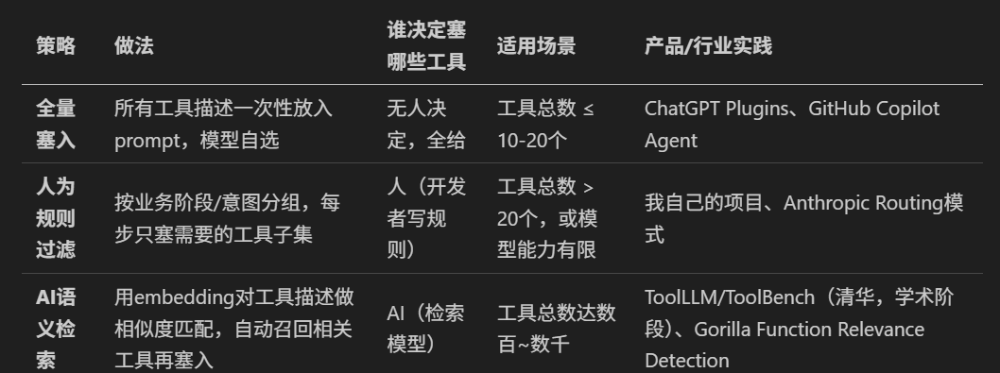

&#x20;      首先是**全量塞入**，很多聊天工具如Copilot都是这么做的。原因也很简单，因为这些产品其实用的是远端的模型，现在远端模型的上下文容量越来越大，所以他一次性塞入也并没有问题。

&#x20;      然后是**根据业务场景和规则，筛选对应项目加入的**。 原因也非常合理，因为我们用的本地模型，模型上下文本身有限。OpenAI官方文档都建议：单次API调用工具不超过20个，理想不超过10个。

最后是 让**AI动态决定工具。**&#x8FD9;个现在更多的其实是处于Demo，学术阶段才这么做，商业落地项目很少这么做。在25年12月份UC Berkeley 发布的论文

《Measuring Agents in Production》中明确调研了现在的商业化Agent，也证明了一点, 根据论文： "商业的生产级的Agent，一般都将执行步骤限制在10步以内，允许数十步的仅有 16.7%，无限制的仅 6.7%。并且还会专门通过给工具添加封装层，减少工具数量来简化模型的负担。

感兴趣的同学可以参考论文原文：https://arxiv.org/abs/2512.04123

&#x20;    （我说这么多是想要大家：

&#x20;      1：了解行业现状和相关知识

&#x20;      2：有的面试官可能也真的不太懂，拍脑袋就觉得你的项目某处简单的时   候，你可以拿出你的依据，告诉他行业现状和你使用这个策略的考虑来说服他，而不是被他带着跑）

5 然后我看你还有写写到一些推理加速的部分，那地方做的多吗？

（结合我们分析的这个岗位性质，面试官其实问推理加速这一块应该很符合预期，因为本身他们就是做训练的。我比较担心的是他问的很深，因为按照我们的学习路线，我们是把算法这里带着走一遍。我按照我的笔记里的路线。 速度慢->量化->选择合适的推理框架->微调->强化学习讲了一遍。面试官也并没有追问，具体答案还是请看我笔记 你的项目是如何做推理加速的？）

6\. 现在我给你一个我们在做的开源项目，请你现场阅读，然后告诉我大概这个项目在讲啥？然后如果我要添加一个工具，怎么做？

&#x20;     （我还是第一次遇到这样考察的，这个问题完全是相当于把问题引入到面试官最熟悉，而你完全陌生的场景，需要你现场发挥，现场快速学习。大家可以自己打开这个链接，看一下这个项目，自己能不能用5\~10分钟弄清出这个问题的答案。另外咱们也不白学，针对这个问题，我总结出以下这开源项目是在做啥的，感兴趣你可以深入学这个项目，到时候有其他面试官问你你最近看了什么开源项目，也可以把这个拿出来讲

我在真正复盘这个面试题的时候，觉得也不用把他想的特别难，这个项目是一个deep research agent, 如果你了解deep research 的概念，结合它的readme,可以快速了解这是一个什么项目。 第二个问题如果添加一个工具，怎么做？结合现有的一些工程经验，比如我们RAG项目怎么增加一个新的模块，或者就是和这个类似的Git项目，如果有相关经验了，那么其实你也能很快回答。 借助这个机会，我们学一下开源项目，学一下deep research（其实deep research面试还是挺多人问的，可能很多公司他们研究这个，所以需要了解一下）， 学一下工程知识，我觉得这是一个很好的问题）
