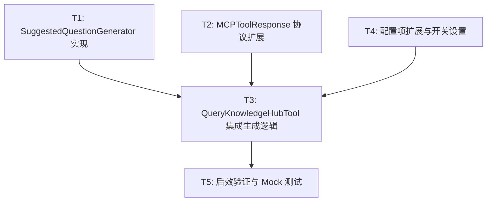

# TASK: Suggested Questions (追问推荐)

## 任务依赖图 (Mermaid)

## 原子任务清单

### [T1] SuggestedQuestionGenerator 生成逻辑实现
- **输入**: `query` (string), `answer` (string)。
- **输出**: `List[str]` (包含 3 个相关追问)。
- **要求**: 
  - 实现 LLM 调用 Prompt。
  - 使用 JSON 模式（如 Qwen3.5）解析结果。
  - 鲁棒性保护（解析失败、空列表返回）。

### [T2] MCPToolResponse 接口契约扩展
- **输入**: `src/core/response/response_builder.py`。
- **输出**: `MCPToolResponse.metadata["suggested_questions"]` 字段。
- **要求**: 在 `to_mcp_content()` 中可选追加追问文本。

### [T3] QueryKnowledgeHubTool 全链路集成
- **输入**: `src/mcp_server/tools/query_knowledge_hub.py`。
- **输出**: 工具执行完成后追加追问生成步。
- **要求**: 同步生成的超时控制与静默容错。

### [T4] 配置开关与 Settings 更新
- **输入**: `config/settings.yaml`。
- **输出**: `retrieval.enable_suggested_questions: true/false`。
- **要求**: 完成 `QueryKnowledgeHubConfig` 的字段映射。

### [T5] 系统级闭环验证
- **输入**: 单元测试 + 集成测试。
- **输出**: 成功观测到响应中包含追问列表。
- **要求**: Mock LLM 调用以验证解析与字段传递。
