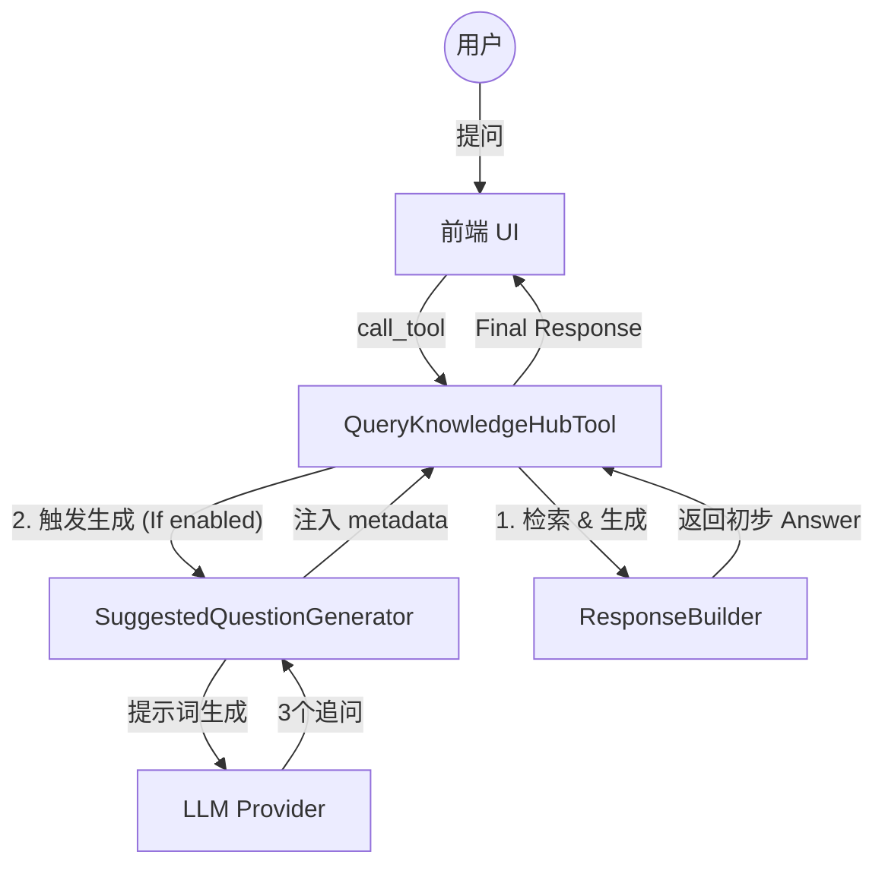

# DESIGN: Suggested Questions (追问推荐)

## 1. 架构概览 (Mermaid)



## 2. 核心组件设计

### 2.1 `SuggestedQuestionGenerator` (src/core/response/suggested_questions.py)
- **职责**：接收原始问题与模型回答，产出 3 个后续建议。
- **Prompt 策略**：
  ```text
  你是一个助手，基于以下用户提问和你的回答，生成 3 个用户接下来可能会感兴的追问。
  要求：
  1. 追问必须与上下文高度相关。
  2. 语言简练，适合点击。
  3. 仅返回 JSON 数组格式，例如 ["问题1", "问题2", "问题3"]。
  
  用户提问：{query}
  你的回答：{answer}
  ```
- **配置项**：在 `settings.yaml` 中新增 `retrieval.suggested_questions_enabled` 开关。

## 3. 接口契约变更

### `MCPToolResponse` (src/core/response/response_builder.py)
- 在 `metadata` 中增加 `suggested_questions` 字段。
- 优化 `to_mcp_content` 方法，在回答末尾以引用块或列表形式展示追问（提升对不支持元数据解析的前端的兼容性）。

### `QueryKnowledgeHubTool`
- 初始化时加载 `SuggestedQuestionGenerator`。
- 在 `execute` 方法末尾检测开关并追加推荐追问。

## 4. 异常处理
- 如果 LLM 生成追问失败或格式错误，静默处理（不返回推荐），确保主回答流程不受干扰。
- 设置生成追问的超时时间（如 3-5s），避免长尾延迟。
