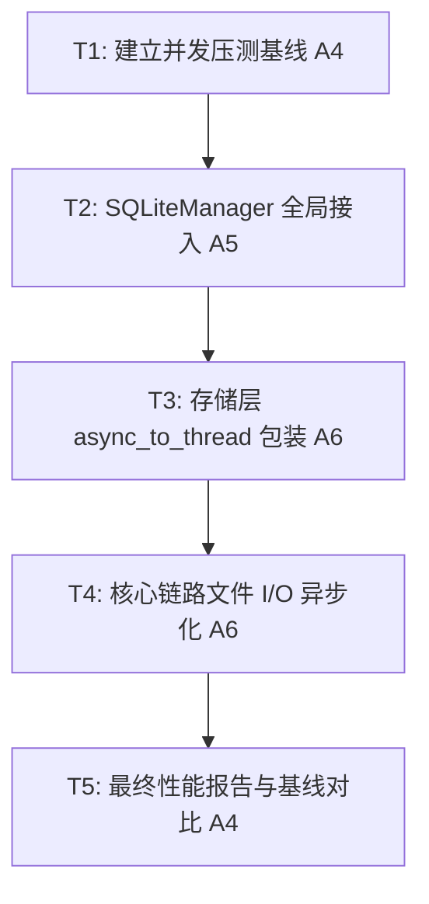

# TASK: System Optimization (A4-A6)

## 任务依赖图 (Mermaid)

## 原子任务清单

### [T1] 建立并发压测基线 (Benchmarking)
- **输入**: `src/mcp_server/server.py`。
- **目标**: 产出优化前的延迟与错误率快照。
- **任务**: 编写 `src/testing/benchmarker.py`，支持 1/3/5/10 并发 stdio 调用。

### [T2] SQLiteManager 全局接入 (SQLite Tuning)
- **输入**: `config/settings.yaml`。
- **目标**: 启用 WAL 模式，平衡多并发读写。
- **任务**: 
  - 实现 `SQLiteManager`。
  - 重构 `GraphStore`, `FeedbackStore`, `ParentStore` 初始化逻辑。

### [T3] 存储层异步委派重构 (DB Async)
- **输入**: 存储层代码。
- **目标**: 消除 DB 操作产生的协程阻塞。
- **任务**: 对 `upsert_feedback`, `add_entities` 等重负载 DB 方法使用 `asyncio.to_thread` 包装。

### [T4] 核心链路文件 I/O 异步化 (FS Async)
- **输入**: `HybridSearch.search`, `StrategyRouter`。
- **目标**: 清除路径扫描、文件读取产生的同步 I/O。
- **任务**: 引入 `anyio` 的文件系统辅助，替换 `os.path` 与 `builtins.open`。

### [T5] 最终性能报告生成
- **目标**: 确认优化效果。
- **任务**: 运行 T1 脚本，对比优化前后的 P95 延迟与成功率。
