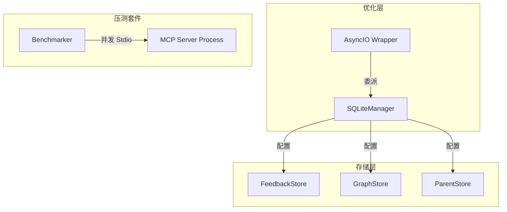

# DESIGN: System Optimization (A4-A6)

## 1. 架构变更概览



## 2. 核心组件设计

### 2.1 SQLiteManager (src/core/storage/sqlite_manager.py)
- **职责**：封装 `sqlite_utils.Database` 的创建逻辑。
- **默认配置**：
  - `journal_mode = WAL`: 允许读写并发。
  - `busy_timeout = 20000`: 解决 Windows 文件锁争用。
  - `synchronous = NORMAL`: 权衡持久性与性能。

### 2.2 异步委派 (A6 方案)
- 由于 `sqlite_utils` 是同步的，我们将核心写操作（Upsert/Add）通过 `asyncio.to_thread()` 包装在工具层或 Store 层内部。
- 示例：
  ```python
  async def async_upsert(self, data):
      return await asyncio.to_thread(self.db.upsert, data)
  ```

### 2.3 Stdio 压测工具 (src/testing/benchmarker.py)
- **原理**：启动 N 个 MCP Server 子进程，通过 stdin 并发发送 `query_knowledge_hub` 的 JSON-RPC 请求。
- **指标收集**：
  - `Latency`: 采样各并发数下的响应时间。
  - `Stability`: 检查是否有 `database is locked` 异常导致请求失败。

## 3. 压测基线与目标
| 指标 | 当前预估 (Baseline) | 优化目标 (Target) |
| :--- | :--- | :--- |
| 单次搜索延迟 (A1) | 5s - 8s | < 3s |
| 最大并发数 (A5) | 2-3 (易锁) | 10+ (无死锁) |
| 同步 I/O 占比 (A6) | ~30% | < 5% |

## 4. 实施顺序
1. **A4**: 建立基线测试脚本（确认目前痛点）。
2. **A5**: 实施 SQLite 并发参数调优。
3. **A6**: 重构 I/O 密集型代码段。
4. **Final**: 再次压测产出基线报告。
