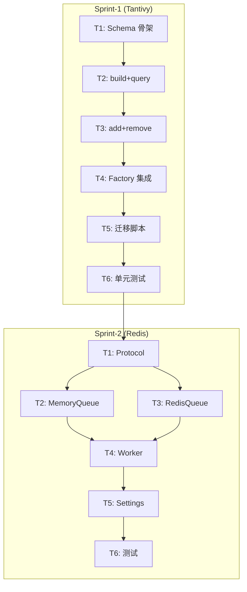

# TASK - Tantivy 稀疏检索 + Redis 异步摄取

> 日期：2026-03-23
> 6A 阶段：Atomize（原子化任务拆解）

---

## Sprint-1: Tantivy 稀疏检索 (A7)

### T1: TantivyIndexer 核心类骨架
- **输入契约**: `tantivy` PyPI 包已安装
- **输出契约**: `src/ingestion/storage/tantivy_indexer.py` 文件，包含 Schema 定义与类骨架
- **实现约束**: 遵循 `BM25Indexer` 相同的方法签名
- **验收标准**: 类可实例化，Schema 可构建

### T2: build() + query() 核心实现
- **输入契约**: T1 产出的骨架类
- **输出契约**: `build(term_stats)` 构建索引，`query(terms, top_k)` 返回 `[{chunk_id, score}]`
- **实现约束**: 使用 `tantivy.IndexWriter` 写入，`tantivy.Searcher` 查询
- **验收标准**: 构建 100 文档索引并查询返回正确排序结果

### T3: add_documents() + remove_document() 增量实现
- **输入契约**: T2 产出的可用索引
- **输出契约**: 支持增量添加与按 doc_id 前缀删除
- **实现约束**: 使用 `IndexWriter.delete_term()` 实现删除
- **验收标准**: 增量更新后查询结果正确反映变化

### T4: 工厂方法集成
- **输入契约**: T3 完成的 TantivyIndexer
- **输出契约**: `create_sparse_retriever()` 根据 `sparse_provider` 配置注入对应 Indexer
- **实现约束**: 修改 `sparse_retriever.py` 与 `settings.py`
- **验收标准**: `settings.yaml` 切换 `sparse_provider` 后，系统使用对应引擎

### T5: BM25 → Tantivy 迁移脚本
- **输入契约**: 已有 Pickle BM25 索引文件
- **输出契约**: `scripts/migrate_bm25_to_tantivy.py`，读取 Pickle 重建 Tantivy 索引
- **验收标准**: 迁移后查询返回与原 BM25 相同的 Top-K chunk_ids

### T6: 单元测试
- **输入契约**: T1-T5 全部完成
- **输出契约**: `tests/test_tantivy_indexer.py`
- **验收标准**: 覆盖 build/query/add/remove/migrate 全路径，pytest 全绿

---

## Sprint-2: Redis 异步摄取队列 (A8)

### T1: BaseQueue Protocol 定义
- **输入契约**: 无
- **输出契约**: `src/ingestion/queue/base_queue.py`，定义 `enqueue/dequeue/get_status/ack` 接口
- **验收标准**: Protocol 类型检查通过

### T2: MemoryQueue 内存队列实现
- **输入契约**: T1 Protocol
- **输出契约**: `src/ingestion/queue/memory_queue.py`，基于 `asyncio.Queue` 的轻量实现
- **验收标准**: 单进程内 enqueue → dequeue 闭环测试通过

### T3: RedisQueue 实现
- **输入契约**: T1 Protocol + `redis[hiredis]` 包
- **输出契约**: `src/ingestion/queue/redis_queue.py`，基于 Redis Streams
- **实现约束**: 使用 `XADD` / `XREADGROUP` / `XACK` API
- **验收标准**: 连接 Redis 后 enqueue → dequeue → ack 闭环通过

### T4: IngestionWorker 消费者进程
- **输入契约**: T2/T3 Queue 实现
- **输出契约**: `src/ingestion/worker.py`，独立 Worker 进程
- **实现约束**: 循环 dequeue → `IngestionPipeline.run()` → ack/nack
- **验收标准**: 通过 `python -m src.ingestion.worker` 启动，处理一条任务成功

### T5: Settings 集成与配置
- **输入契约**: T4 完成
- **输出契约**: `settings.yaml` 新增 `ingestion.queue_backend` 与 `ingestion.redis` 配置块
- **实现约束**: 修改 `settings.py` 新增 `RedisSettings` 与 `QueueSettings` 数据类
- **验收标准**: 通过 `load_settings()` 可正确加载 Redis 与队列配置

### T6: 单元测试
- **输入契约**: T1-T5 全部完成
- **输出契约**: `tests/test_ingestion_queue.py`
- **验收标准**: 覆盖 MemoryQueue 全路径 + RedisQueue Mock 测试，pytest 全绿

---

## 任务依赖图

## 执行顺序
先完成 Sprint-1 (Tantivy) 全部 6 个任务，再开始 Sprint-2 (Redis) 6 个任务。
总计 12 个原子任务，预计分 2 个迭代完成。
