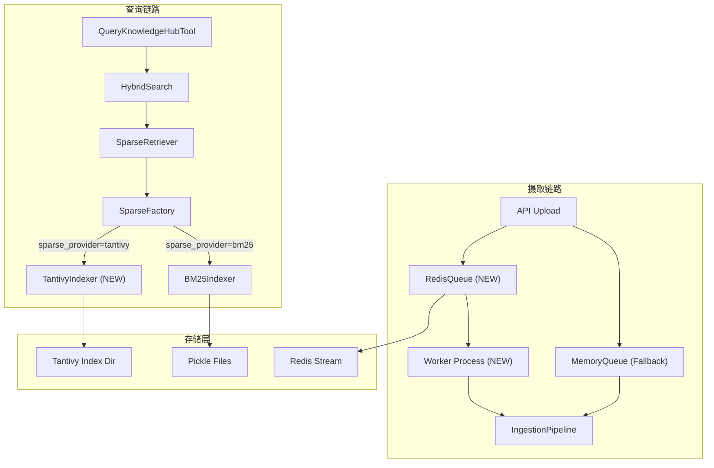
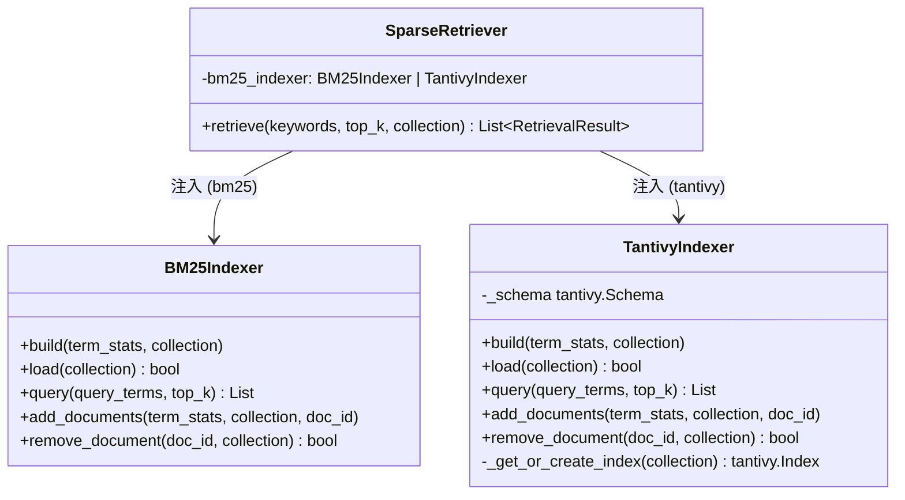
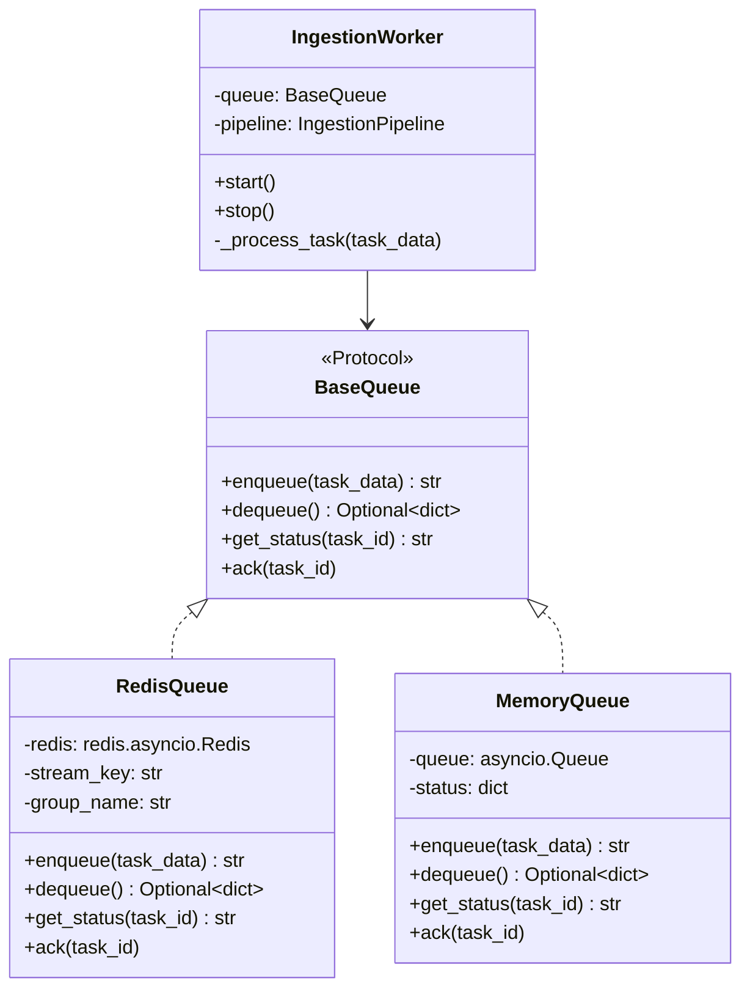
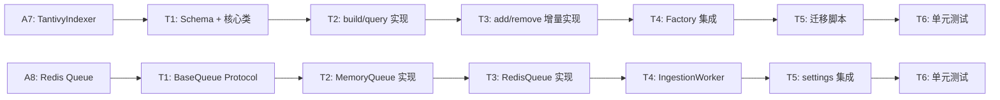

# DESIGN - Tantivy 稀疏检索 + Redis 异步摄取

> 日期：2026-03-23
> 6A 阶段：Architect（架构设计）

---

## 1. 整体架构图



## 2. A7 - TantivyIndexer 模块设计

### 2.1 核心组件



### 2.2 Tantivy Schema 设计
```python
schema_builder = tantivy.SchemaBuilder()
schema_builder.add_text_field("chunk_id", stored=True)
schema_builder.add_text_field("content", stored=False)  # 全文索引
schema_builder.add_unsigned_field("doc_length", stored=True)
schema = schema_builder.build()
```

### 2.3 数据流向
```
SparseEncoder.encode(chunks) → term_stats
    ↓
TantivyIndexer.add_documents(term_stats)
    ↓
tantivy.IndexWriter.add_document(chunk_id, content, doc_length)
    ↓
IndexWriter.commit()
    ↓
磁盘目录: data/db/tantivy/{collection}/
```

## 3. A8 - Redis 摄取队列设计

### 3.1 核心组件



### 3.2 Redis Stream 数据结构
```
Stream Key: rag:ingestion:tasks
Consumer Group: rag-workers

Entry Fields:
  task_id: str (UUID)
  file_path: str
  collection: str
  original_filename: str
  created_at: float (timestamp)
  status: pending | processing | done | failed
  retry_count: int
  error: str (optional)
```

### 3.3 异常处理策略
- **超时**: Worker 处理超过 10min 自动 NACK + 重入队
- **失败重试**: 最多 3 次，超过后标记为 `failed`
- **优雅关闭**: Worker 收到 SIGTERM 后完成当前任务再退出

## 4. settings.yaml 扩展

```yaml
retrieval:
  sparse_provider: "tantivy"  # NEW: tantivy | bm25

ingestion:
  queue_backend: "redis"  # NEW: redis | memory
  redis:                  # NEW section
    url: "redis://localhost:6379/0"
    stream_key: "rag:ingestion:tasks"
    consumer_group: "rag-workers"
    max_retries: 3
    task_timeout: 600  # seconds
```

## 5. 依赖关系图


