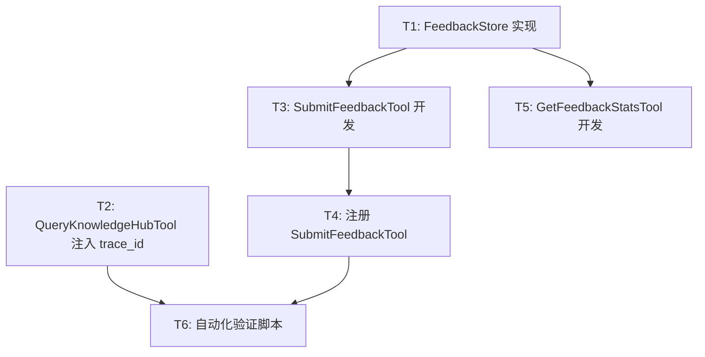

# TASK: 用户反馈闭环 (User Feedback Loop)

## 任务依赖图 (Mermaid)

## 原子任务清单

### [T1] FeedbackStore 持久化层实现
- **输入**: `data/feedback.db` 路径。
- **输出**: `src/ingestion/storage/feedback_store.py`。
- **要求**: 
  - 初始化 `feedback` 表。
  - 实现 `upsert_feedback(trace_id, rating, comment, query)`。
  - 实现 `get_summary() -> Dict`。

### [T2] QueryKnowledgeHubTool `trace_id` 透出
- **输入**: `QueryKnowledgeHubTool.execute` 方法。
- **输出**: 响应元数据中包含 `trace_id`。
- **要求**: 将 `trace.trace_id` 写入 `response.metadata["trace_id"]`。

### [T3] SubmitFeedbackTool 工具开发
- **输入**: MCP Tool 规范。
- **输出**: `src/mcp_server/tools/submit_feedback.py`。
- **要求**: 接收 `trace_id`, `rating`, `comment` 并调用 `T1`。

### [T4] MCP 协议处理注册
- **输入**: `src/mcp_server/protocol_handler.py`。
- **输出**: `submit_feedback` 工具在 MCP 列表中可见。

### [T5] GetFeedbackStatsTool 运营统计工具
- **输入**: `FeedbackStore` 统计接口。
- **输出**: `src/mcp_server/tools/get_feedback_stats.py`。
- **要求**: 返回正负反馈总数。

### [T6] 流程闭环验证
- **输入**: `pytest` 或脚本调用。
- **输出**: 成功运行反馈保存与查询流程。
