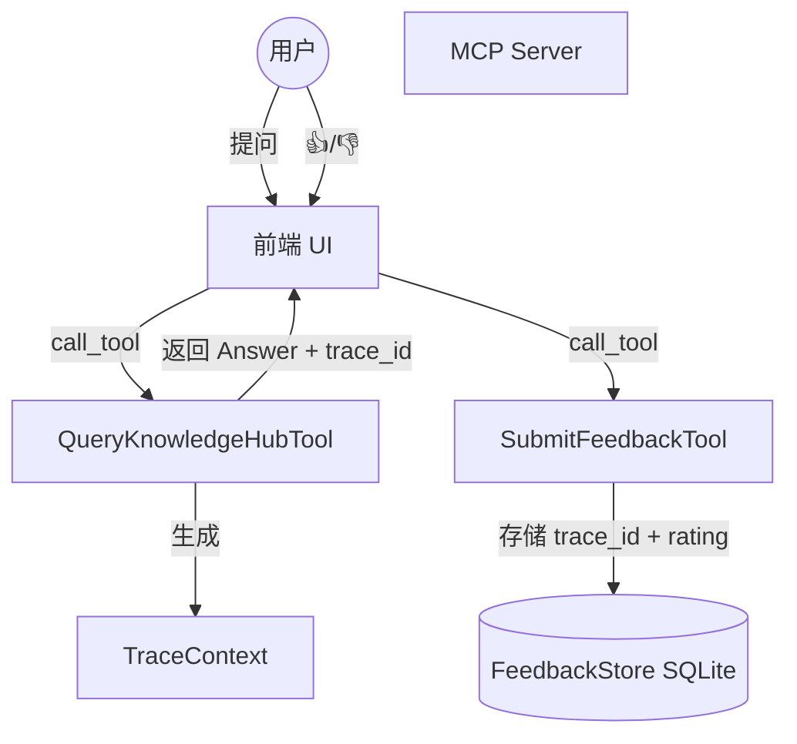

# DESIGN: 用户反馈闭环 (User Feedback Loop)

## 1. 架构概览 (Mermaid)

## 2. 数据库设计
使用 SQLite 存储反馈数据，文件路径：`data/feedback.db`。

### `feedback` 表
| 字段 | 类型 | 说明 |
| :--- | :--- | :--- |
| `id` | INTEGER | 主键，自增 |
| `trace_id` | TEXT | 关联 Trace ID (唯一约束) |
| `rating` | INTEGER | 推荐：1 (👍), -1 (👎) |
| `comment` | TEXT | 用户评语 (可选) |
| `query` | TEXT | 原始提问 (冗余存储以便统计) |
| `timestamp` | DATETIME | 反馈时间 (默认 CURRENT_TIMESTAMP) |

## 3. 组件定义

### 3.1 `FeedbackStore` (src/ingestion/storage/feedback_store.py)
任务：负责 SQLite 数据库的初始化和 CRUD 操作。
- `save_feedback(trace_id, rating, comment, query)`
- `get_stats() -> Dict[str, Any]` (返回好评率、负评数等)

### 3.2 `SubmitFeedbackTool` (src/mcp_server/tools/submit_feedback.py)
任务：提供 MCP Tool 接口。
- **输入**: `trace_id` (string), `rating` (int), `comment` (string, optional)
- **动作**: 调用 `FeedbackStore` 存入数据。

## 4. 数据契约变更

### `QueryKnowledgeHubTool`
- **Output**: 在 `MCPToolResponse.metadata` 中新增 `trace_id` 字段。
- **前端建议**: 提取返回结果中 `References (JSON)` 块里的 `metadata.trace_id`。

## 5. 异常处理
- 如果 `trace_id` 已存在（重复提交），则更新现有反馈而非报错（Upsert 逻辑）。
- 数据库连接失败应记录日志，不应阻塞主查询流程。
