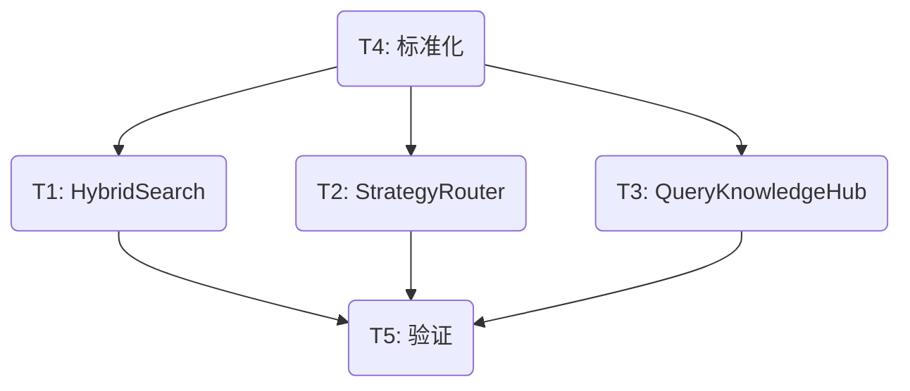

# TASK - 前端 Thinking 阶段化展示

> 日期：2026-03-22  
> 状态：任务拆解完成 (Atomized)

## 1. 原子任务列表

### [T1] HybridSearch 核心埋点
- **目标**：在 `HybridSearch.search` 中注入进度日志。
- **输入**：`src/core/query_engine/hybrid_search.py`
- **输出**：带有 `[Thinking] Retrieving`, `[Thinking] Reranking` 等日志。
- **验收**：通过 `stderr` 观察到日志按序输出。

### [T2] StrategyRouter 路由埋点
- **目标**：展示意图识别阶段。
- **输入**：`src/core/query_engine/strategy_router.py`
- **输出**：带有 `[Thinking] Routing: ...` 日志。

### [T3] QueryKnowledgeHub 调度埋点
- **目标**：展示初始化和扩展阶段。
- **输入**：`src/mcp_server/tools/query_knowledge_hub.py`
- **输出**：带有 `[Thinking] Initializing`, `[Thinking] Expanding` 等日志。

### [T4] 日志格式标准化
- **目标**：确保所有 "Thinking" 日志符合宿主解析规范。
- **验收**：前缀统一为 `[Thinking]`。

### [T5] 验证与演示
- **目标**：在真实的 MCP 宿主环境下观察 UI 表现。
- **输出**：`walkthrough.md` 更新。

## 2. 依赖关系图

## 3. 验收标准 (Acceptance Criteria)
1. 发起查询时，立即能看到 `[Thinking] Initializing`。
2. 约 500ms 后看到 `[Thinking] Routing`。
3. 随后看到 `[Thinking] Retrieving` 和 `[Thinking] Reranking`。
4. 如果触发扩展，看到 `[Thinking] Expanding`。
5. 最后返回结果。
