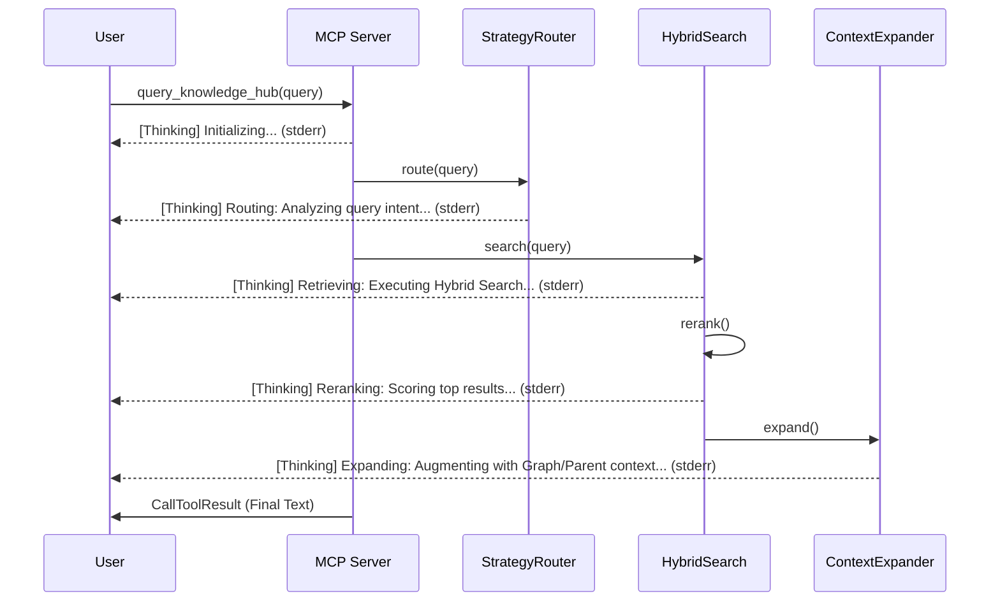

# DESIGN - 前端 Thinking 阶段化展示

> 日期：2026-03-22  
> 状态：设计完成 (Design Finished)

## 1. 整体架构图

## 2. 核心组件设计

### 2.1 日志枚举
- `INIT`: "Initializing retrieval components..."
- `ROUTING`: "Analyzing query intent and selecting strategy..."
- `RETRIEVING`: "Searching vector and keyword indexes..."
- `RERANKING`: "Reranking candidates for better precision..."
- `EXPANDING`: "Expanding context with Parent Retrieval or GraphRAG..."
- `FINALIZING`: "Assembling final response..."

### 2.2 注入点分析
1.  **`src/mcp_server/tools/query_knowledge_hub.py`**:
    - 在调用 `_ensure_initialized` 前后记录。
    - 在调用 `_perform_search` 前后记录。
2.  **`src/core/query_engine/hybrid_search.py`**:
    - 在 `search()` 方法内，调用 `strategy_router` 前后记录。
    - 在调用 `reranker` 前后记录。
    - 在执行 `_expand_with_parents` 或 `_expand_with_graph` 之前记录。

## 3. 接口契约
日志将通过 `sys.stderr` 直接输出。
格式：`%(asctime)s [Thinking] <Stage>: <Message>`
IDE 宿主会自动过滤非 Thinking 前缀的日志，或将其展示在 Thinking 终端中。

## 4. 异常处理
- 如果日志记录失败，不应影响搜索链路。
- 采用非阻塞式日志记录（默认实现即是）。
