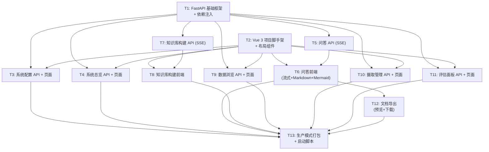

# TASK - 前端框架替换（原子化任务清单）

## 任务依赖图

---

## T1: FastAPI 基础框架 + 依赖注入

### 输入契约
- 现有 `src/core/settings.py` 配置加载
- 现有 `src/` 下全部业务模块

### 输出契约
- `api/main.py` — FastAPI 应用入口，CORS 配置，路由挂载
- `api/deps.py` — 单例依赖注入（settings, pipeline, hybrid_search）
- `api/models.py` — Pydantic 基础模型（ApiResponse, ErrorResponse）
- FastAPI 可启动，`GET /api/health` 返回 200

### 实现约束
- 使用 `uvicorn` 启动
- CORS 允许 `localhost:5173`（Vite dev server）
- 依赖项使用 `@lru_cache` 或模块级单例

### 验收标准
- `uvicorn api.main:app --port 8000` 启动成功
- `GET /api/health` 返回 `{"ok": true}`
- `GET /docs` 显示 Swagger UI

---

## T2: Vue 3 项目脚手架 + 布局组件

### 输入契约
- Node.js 18+

### 输出契约
- `web/` 完整 Vite + Vue 3 + TypeScript 项目
- Element Plus + TailwindCSS 集成
- Vue Router 配置（7 个路由）
- `AppSidebar.vue` 侧边栏导航
- `App.vue` 主布局（侧边栏 + 主内容区）
- Vite proxy 配置代理 `/api` 到 `:8000`

### 实现约束
- TypeScript strict 模式
- Element Plus 按需导入
- TailwindCSS 与 Element Plus 样式不冲突

### 验收标准
- `npm run dev` 启动成功
- 7 个路由均可切换，侧边栏高亮正确
- 页面切换无白屏

---

## T3: 系统配置 API + 页面

### 输入契约
- T1 (FastAPI 框架)
- T2 (Vue 脚手架)
- 现有 `config/settings.yaml` 和 `.env`

### 输出契约
- `api/routers/config.py` — GET/PUT /api/config, POST /api/config/test
- `web/src/views/SystemConfig.vue` — 配置表单页面
- `web/src/components/config/ProviderForm.vue` — Provider 预设选择

### 验收标准
- 页面加载显示当前配置
- 修改 LLM Provider 并保存，settings.yaml 更新
- 测试连接按钮可验证 API Key 有效性
- API Key 输入框为密码模式

---

## T4: 系统总览 API + 页面

### 输入契约
- T1 (FastAPI 框架)
- T2 (Vue 脚手架)

### 输出契约
- `api/routers/system.py` — GET /api/system/stats
- `web/src/views/Overview.vue` — 统计卡片 + 图表

### 验收标准
- 显示集合数、文档数、分块数、存储大小
- 数据从后端 API 实时获取

---

## T5: 问答 API (SSE 流式)

### 输入契约
- T1 (FastAPI 框架)
- 现有 `HybridSearch`, `LLM.chat_stream()`

### 输出契约
- `api/routers/chat.py` — POST /api/chat/stream (SSE)
- SSE 事件格式：token / references / done / error

### 实现约束
- 使用 `StreamingResponse` + `text/event-stream`
- 检索和生成分两个阶段推送
- 超时 120 秒

### 验收标准
- curl 测试 SSE 流式返回逐 token
- 检索结果以 references 事件推送
- 错误以 error 事件推送

---

## T6: 问答前端（流式 + Markdown + Mermaid）

### 输入契约
- T2 (Vue 脚手架)
- T5 (问答 API)

### 输出契约
- `web/src/views/ChatView.vue` — 主问答页面
- `web/src/components/chat/ChatMessage.vue` — 消息渲染（Markdown + Mermaid）
- `web/src/components/chat/ChatInput.vue` — 输入框 + 文件上传
- `web/src/composables/useSSE.ts` — SSE 连接管理
- `web/src/utils/markdown.ts` — markdown-it + mermaid 渲染
- `web/src/stores/chat.ts` — Pinia 状态管理

### 实现约束
- SSE 逐 token 追加，不触发整页重渲染
- Mermaid 代码块检测并异步渲染
- 历史记录从后端 API 加载
- 文件上传使用 Element Plus Upload 组件

### 验收标准
- 输入问题后逐 token 流式显示回答
- Markdown 标题/列表/表格/代码块正确渲染
- Mermaid 流程图正确渲染
- 历史记录刷新后保留
- 文件上传后可联合问答

---

## T7: 知识库构建 API (SSE 进度)

### 输入契约
- T1 (FastAPI 框架)
- 现有 `IngestionPipeline`

### 输出契约
- `api/routers/knowledge.py` — POST ingest, GET progress (SSE), POST stop
- `api/tasks.py` — 后台任务管理

### 实现约束
- 摄取在后台 asyncio.Task 中执行
- 进度通过 SSE 实时推送
- 停止信号通过共享 flag 传递

### 验收标准
- 发起摄取后返回 task_id
- SSE 流式推送每个文件的进度
- 停止请求后当前文件完成后停止

---

## T8: 知识库构建前端

### 输入契约
- T2 (Vue 脚手架)
- T7 (构建 API)

### 输出契约
- `web/src/views/KnowledgeBase.vue`
- `web/src/stores/knowledge.ts`

### 验收标准
- 输入文件夹路径，显示扫描到的文件列表
- 点击开始后实时显示进度条和文件状态
- 停止按钮可安全停止

---

## T9: 数据浏览 API + 页面

### 输入契约
- T1, T2
- 现有 `DataService`

### 输出契约
- `api/routers/data.py`
- `web/src/views/DataBrowser.vue`

### 验收标准
- 下拉选择集合，分页显示文档列表
- 点击文档展开显示分块内容

---

## T10: 摄取管理 API + 页面

### 输入契约
- T1, T2
- 现有 `IngestionPipeline`, `DocumentManager`

### 输出契约
- `api/routers/ingest.py`
- `web/src/views/IngestManager.vue`

### 验收标准
- 上传文件并触发摄取
- 文档列表支持删除操作

---

## T11: 评估面板 API + 页面

### 输入契约
- T1, T2
- 现有评估框架

### 输出契约
- `api/routers/evaluation.py`
- `web/src/views/EvalPanel.vue`

### 验收标准
- 输入测试查询，运行评估
- 显示评估指标结果

---

## T12: 文档导出（预览 + 下载）

### 输入契约
- T6 (问答前端已完成)

### 输出契约
- `api/routers/export.py` — POST preview, POST download
- `web/src/components/chat/DocPreview.vue` — 预览弹窗

### 实现约束
- 预览：后端渲染 Markdown → HTML，前端弹窗展示
- 下载：后端生成 .md 或 .docx 文件，前端 blob 下载

### 验收标准
- 点击预览按钮弹出渲染后的文档
- 点击下载按钮保存文件到本地
- 支持 Markdown 和 Word 两种格式

---

## T13: 生产模式打包 + 启动脚本

### 输入契约
- T1-T12 全部完成

### 输出契约
- `web/` 可 `npm run build` 编译到 `web/dist/`
- `api/main.py` 生产模式自动托管 `web/dist/`
- `start_vue.bat` / `start_vue.sh` 一键启动
- `pyproject.toml` 添加 `fastapi`, `uvicorn` 依赖

### 验收标准
- `npm run build` 成功
- `python -m uvicorn api.main:app --port 8000` 启动后访问 `localhost:8000` 显示完整前端
- API 和前端同端口无冲突

---

## 执行顺序

| 阶段 | 任务 | 并行关系 |
|------|------|----------|
| 第一批 | T1 + T2 | 可并行 |
| 第二批 | T3 + T4 + T5 + T7 | T1 完成后可并行 |
| 第三批 | T6 + T8 + T9 + T10 + T11 | 依赖第二批对应 API |
| 第四批 | T12 | 依赖 T6 |
| 第五批 | T13 | 全部完成后 |

## 复杂度评估

| 任务 | 复杂度 | 预计时间 |
|------|--------|----------|
| T1 | 低 | 0.5h |
| T2 | 中 | 1h |
| T3 | 中 | 1h |
| T4 | 低 | 0.5h |
| T5 | 中 | 1h |
| T6 | **高** | 2h |
| T7 | 中 | 1h |
| T8 | 中 | 1h |
| T9 | 低 | 0.5h |
| T10 | 低 | 0.5h |
| T11 | 中 | 1h |
| T12 | 中 | 1h |
| T13 | 低 | 0.5h |
| **总计** | | **~12h** |
