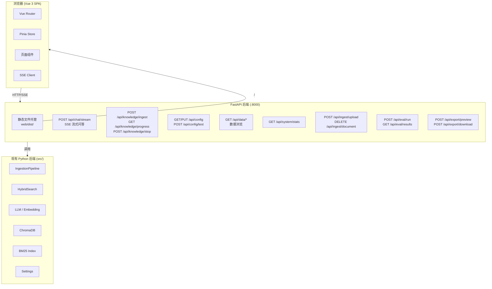
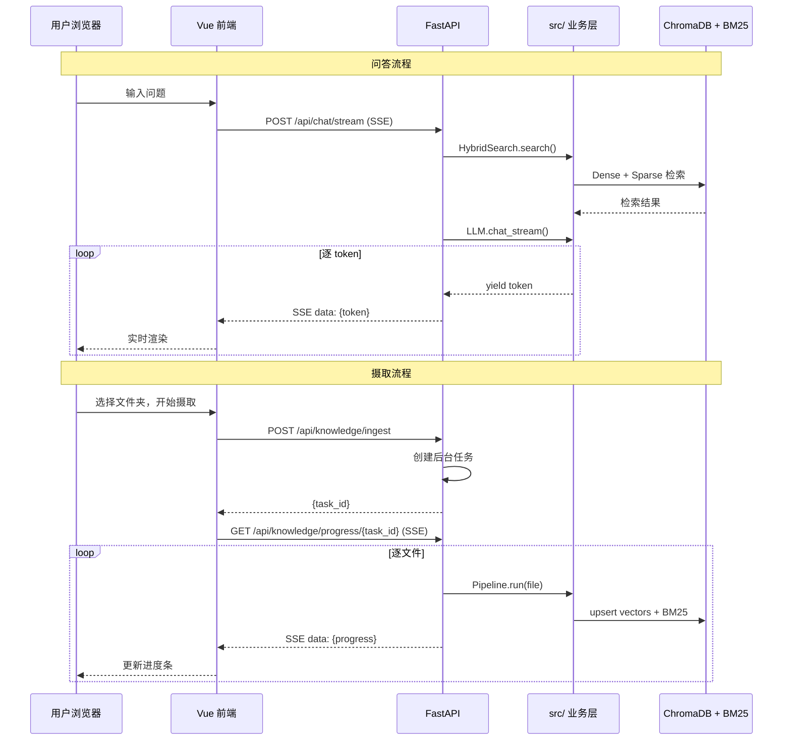
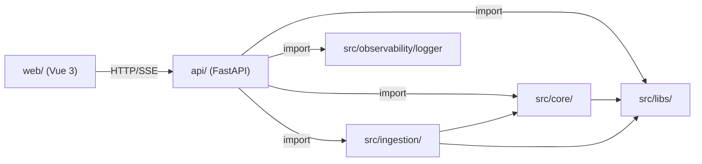

# DESIGN - 前端框架替换（FastAPI + Vue 3）

## 整体架构图



## 分层设计

```
┌────────────────────────────────────────────────────┐
│  Presentation Layer (Vue 3)                         │
│  - 7 个 View 组件                                   │
│  - 通用 UI 组件 (ChatMessage, ProgressBar, etc.)    │
│  - Pinia Store (chat, knowledge, config, system)    │
│  - Vue Router (客户端路由)                           │
├────────────────────────────────────────────────────┤
│  API Gateway Layer (FastAPI)                        │
│  - REST 路由 (api/routers/)                         │
│  - SSE 端点 (chat stream, ingest progress)          │
│  - 依赖注入 (api/deps.py)                           │
│  - 静态文件托管 (生产模式)                            │
│  - 后台任务管理                                      │
├────────────────────────────────────────────────────┤
│  Business Layer (现有 src/ - 不修改)                 │
│  - core/ (settings, query_engine, types)            │
│  - ingestion/ (pipeline, storage, transform)        │
│  - libs/ (llm, embedding, vector_store, loader)     │
│  - observability/ (logger)                          │
└────────────────────────────────────────────────────┘
```

## 核心组件设计

### 1. FastAPI API 层 (`api/`)

```
api/
├── main.py              # FastAPI 应用入口 + 静态文件托管
├── deps.py              # 依赖注入：settings, pipeline, search 单例
├── models.py            # Pydantic 请求/响应模型
├── routers/
│   ├── chat.py          # /api/chat/*     问答（SSE）
│   ├── knowledge.py     # /api/knowledge/* 知识库构建（SSE）
│   ├── config.py        # /api/config/*   系统配置
│   ├── data.py          # /api/data/*     数据浏览
│   ├── system.py        # /api/system/*   系统总览
│   ├── ingest.py        # /api/ingest/*   摄取管理
│   ├── evaluation.py    # /api/eval/*     评估面板
│   └── export.py        # /api/export/*   文档导出
└── tasks.py             # 后台任务管理（摄取进度）
```

### 2. Vue 3 前端 (`web/`)

```
web/
├── index.html
├── package.json
├── vite.config.ts
├── tailwind.config.js
├── tsconfig.json
├── src/
│   ├── main.ts
│   ├── App.vue
│   ├── router/
│   │   └── index.ts         # 路由定义
│   ├── stores/
│   │   ├── chat.ts          # 问答状态
│   │   ├── knowledge.ts     # 摄取状态
│   │   ├── config.ts        # 配置状态
│   │   └── system.ts        # 系统状态
│   ├── views/
│   │   ├── ChatView.vue         # 知识库问答
│   │   ├── KnowledgeBase.vue    # 知识库构建
│   │   ├── SystemConfig.vue     # 系统配置
│   │   ├── Overview.vue         # 系统总览
│   │   ├── DataBrowser.vue      # 数据浏览
│   │   ├── IngestManager.vue    # 摄取管理
│   │   └── EvalPanel.vue        # 评估面板
│   ├── components/
│   │   ├── layout/
│   │   │   ├── AppSidebar.vue   # 侧边栏导航
│   │   │   └── AppHeader.vue    # 顶部栏
│   │   ├── chat/
│   │   │   ├── ChatMessage.vue  # 消息气泡（Markdown+Mermaid）
│   │   │   ├── ChatInput.vue    # 输入框
│   │   │   └── DocPreview.vue   # 文档预览弹窗
│   │   ├── common/
│   │   │   ├── ProgressBar.vue  # 进度条
│   │   │   └── StatCard.vue     # 统计卡片
│   │   └── config/
│   │       └── ProviderForm.vue # Provider 配置表单
│   ├── composables/
│   │   ├── useSSE.ts            # SSE 流式连接
│   │   └── useApi.ts            # API 请求封装
│   └── utils/
│       ├── markdown.ts          # markdown-it + mermaid 渲染
│       └── export.ts            # 文档导出工具
└── public/
    └── favicon.ico
```

## 接口契约定义

### 问答 API

```
POST /api/chat/stream
Content-Type: application/json
Body: {
    "question": string,
    "collection": string,        // default: "default"
    "top_k": number,             // default: 5
    "max_tokens": number,        // default: 4096
    "uploaded_text": string      // 可选：上传文件的文本
}
Response: text/event-stream
    data: {"type": "token", "content": "..."}
    data: {"type": "references", "data": [...]}
    data: {"type": "done", "answer": "full text"}
    data: {"type": "error", "message": "..."}
```

### 知识库构建 API

```
POST /api/knowledge/ingest
Body: {"folder_path": string, "collection": string, "file_types": [".pdf",".pptx",...]}
Response: {"task_id": string}

GET /api/knowledge/progress/{task_id}
Response: text/event-stream
    data: {"type": "progress", "current": 3, "total": 10, "file": "xxx.pdf", "stage": "编码"}
    data: {"type": "file_done", "file": "xxx.pdf", "status": "success", "chunks": 83}
    data: {"type": "done", "success": 8, "failed": 1, "skipped": 1}

POST /api/knowledge/stop/{task_id}
Response: {"ok": true}
```

### 系统配置 API

```
GET /api/config
Response: {settings YAML 内容转 JSON}

PUT /api/config
Body: {完整配置 JSON}
Response: {"ok": true}

POST /api/config/test
Body: {"api_key": string, "base_url": string, "model": string}
Response: {"ok": true, "message": "连接成功"} | {"ok": false, "message": "错误详情"}
```

### 数据浏览 API

```
GET /api/data/collections
Response: [{"name": "default", "count": 3343}]

GET /api/data/documents?collection=default&page=1&size=20
Response: {"items": [...], "total": 150}

GET /api/data/chunks/{doc_id}
Response: [{"id": "...", "text": "...", "metadata": {...}}]
```

### 系统总览 API

```
GET /api/system/stats
Response: {
    "collections": [...],
    "total_documents": 150,
    "total_chunks": 3343,
    "total_images": 200,
    "storage_size": "180MB",
    "bm25_index_size": "50MB"
}
```

### 摄取管理 API

```
POST /api/ingest/upload
Content-Type: multipart/form-data
Body: file + collection
Response: {pipeline result}

DELETE /api/ingest/document
Body: {"source_path": string, "collection": string}
Response: {"ok": true, "deleted_chunks": 83}
```

### 评估 API

```
POST /api/eval/run
Body: {"queries": [...], "collection": string, "metrics": [...]}
Response: {"task_id": string}

GET /api/eval/results/{task_id}
Response: {评估结果}
```

### 文档导出 API

```
POST /api/export/preview
Body: {"content": string, "format": "markdown"}
Response: {"html": "渲染后的 HTML"}

POST /api/export/download
Body: {"content": string, "format": "markdown" | "docx", "filename": string}
Response: application/octet-stream (文件二进制)
```

## 数据流向图



## 异常处理策略

| 层 | 策略 |
|---|------|
| **Vue 前端** | Axios 拦截器统一处理 HTTP 错误，SSE 断连自动重试，组件级 error boundary |
| **FastAPI API** | 全局异常处理器返回标准化 JSON `{ok: false, message: "..."}` |
| **业务层** | 保持现有异常处理不变，FastAPI 层 try/catch 转为 HTTP 状态码 |

## 模块依赖关系



**关键约束**：`api/` 层只依赖 `src/`，不反向依赖。`web/` 只通过 HTTP 与 `api/` 通信。
