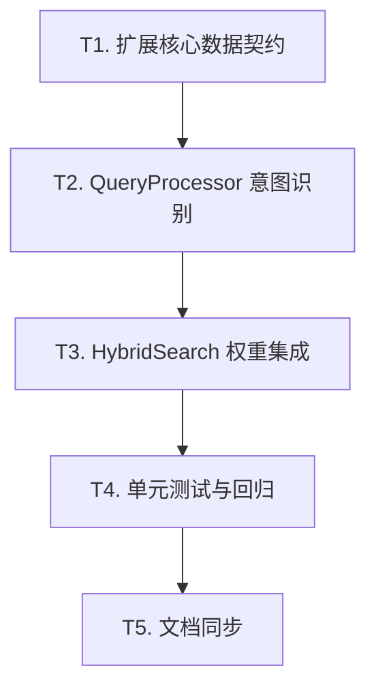

# TASK - 动态权重自适应混合检索 (Auto-Tuning Hybrid Search)

## 原子任务清单

### T1: 扩展核心数据契约 [x]
- [x] 在 `src/core/types.py` 的 `ProcessedQuery` 类中新增 `intent_weights: List[float]` 字段。
- [x] 默认值设置为 `[1.0, 1.0]` (Dense, Sparse)。
- [x] 更新 `to_dict` 与 `from_dict` 以支持序列化。

### T2: `QueryProcessor` 意图识别实现 [x]
- [x] 定义正则规则集 (VERSION_PATTERN, CODE_PATTERN, QUESTION_PATTERN)。
- [x] 实现私有方法 `_detect_intent_weights(query: str) -> List[float]`。
- [x] 在 `process()` 方法中调用该逻辑并填充到 `ProcessedQuery`。

### T3: `HybridSearch` 权重集成 [x]
- [x] 修改 `_fuse_results` 方法，使其接受 `weights` 参数。
- [x] 调用 `self.fusion.fuse_with_weights` 而非 `fuse`。
- [x] 增加日志记录，记录每次检索的意图权重分配。

### T4: 单元测试与回归 [x]
- [x] 编写 `tests/unit/test_auto_tuning.py`。
- [x] 测试用例 1: 包含版本号的查询应触发 Sparse 增强。
- [x] 测试用例 2: 包含“如何”的查询应触发 Dense 增强。
- [x] 测试用例 3: 普通查询应保持均衡。

### T5: 文档同步 [x]
- [x] 更新 `walkthrough.md`。
- [x] 标记 `TASK_动态权重自适应混合检索.md` 所有项目为完成。

## 任务依赖图

