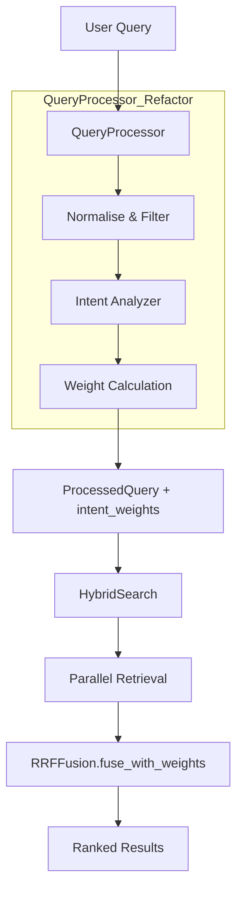

# DESIGN - 动态权重自适应混合检索 (Auto-Tuning Hybrid Search)

## 1. 系统架构与数据流
引入意图检测层，将原始查询转化为带有检索权重倾向的结构化查询。

## 2. 意图检测策略 (启发式引擎)

### 2.1 规则定义
通过正则表达式和词法特征识别查询倾向：

| 意图倾向 | 触发特征 | 示例 |
|:---:|:---|:---|
| **Sparse (BM25)** | 包含版本号、序列号、代码后缀、纯数字术语 | `v3.1`, `SN-880`, `main.py`, `404` |
| **Dense (Semantic)** | 包含疑问代词、描述性长句、高频感叹/问候 | `如何解决...`, `请归纳总结...`, `你好` |

### 2.2 权重计算逻辑
- **默认权重**: `[1.0, 1.0]` (Dense, Sparse)
- **BM25 增强**: `[0.3, 1.7]` (显著提升关键词匹配比重)
- **Dense 增强**: `[1.7, 0.3]` (显著提升语义向量比重)
- **冲突处理**: 若双重特征均存在，则回退至均衡权重 `[1.0, 1.0]`。

## 3. 核心抽象扩展

### 3.1 `ProcessedQuery` (types.py)
新增 `intent_weights: List[float]` 字段，默认值为 `[1.0, 1.0]`。

### 3.2 `QueryProcessor` (query_processor.py)
新增 `_detect_intent(query: str) -> List[float]` 私有方法。

### 3.3 `HybridSearch` (hybrid_search.py)
在 `search()` 方法中，将 `self.fusion.fuse()` 替换为 `self.fusion.fuse_with_weights()`。

## 4. 异常处理
- 若意图检测抛出异常，必须平滑降级至均衡权重。
- 日志系统记录：`"query_intent": "sparse", "weights": [0.3, 1.7]`。
