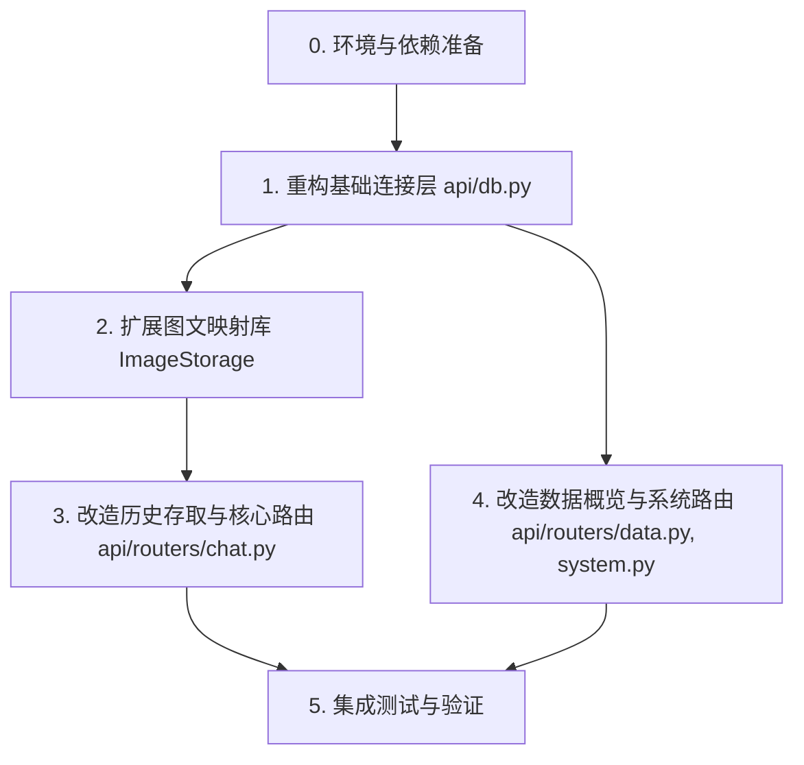

# TASK - 数据库异步化重构

- [x] 任务 0: 环境与依赖准备
- [x] 任务 1: 重构基础连接层 api/db.py
- [x] 任务 2: 扩展图文映射库 ImageStorage
- [x] 任务 3: 改造历史存取与核心路由 api/routers/chat.py
- [x] 任务 4: 改造数据概览与系统路由 api/routers/data.py, system.py
- [x] 任务 5: 集成测试与验证

## 原子任务拆解

### 任务 0. 环境与依赖准备 [x]
- **输入**：`pyproject.toml`
- **执行**：检查并确保 `aiosqlite` 已被引入为依赖（若无则安装）。
- **验收**：`import aiosqlite` 在 python 环境中成功。

### 任务 1. 重构基础连接层 (`api/db.py`) [x]
- **实现约束**：保留原 `get_connection`。新增 `get_async_connection`。
- **验收**：能够通过 `async with get_async_connection(path) as conn:` 获取并执行 `await conn.execute(...)`。

### 任务 2. 扩展图文映射库 (`ImageStorage`) [x]
- **执行**：在 `src/ingestion/storage/image_storage.py` 中，封装 `aget_image_path(self, image_id)` 异步方法。
- **验收**：通过异步测试调用，成功返回对应路径。

### 任务 3. 改造历史存取与核心路由 (`api/routers/chat.py`) [x]
- **执行**：
  - 将 `_init_history_db()` 转化为异步 `_ainit_history_db()` 并在 `startup` 事件（或初次调用）中加载。
  - 将 `_save_history()` 改为异步 `_asave_history()`。
  - 修改 `chat_stream` 下相关图片处理，调用 `aget_image_path`。注意 `event_stream` 本身是 async generator，内部可以使用 `await`。
  - 修改 `get_history` 和 `clear_history` 路由，使用 `get_async_connection`。
- **验收**：问答接口能够正常流式输出，`/api/chat/history` 可以通过。

### 任务 4. 改造数据概览与系统路由 (`data.py`, `system.py`) [x]
- **执行**：查找所有使用 `sqlite3.connect` 的接口（如 `/stats`, `/collections`），替换为异步读取。
- **验收**：仪表盘的数据看板能正常刷新统计信息。

### 任务 5. 集成测试与验证 [x]
- **执行**：运行 `pytest`（如有），或者通过启动 `uvicorn` 及客户端手动验证聊天、查询历史、清空历史等功能。
- **验收**：后台不报任何 Synchronous Warning，且无 `database is locked`。
