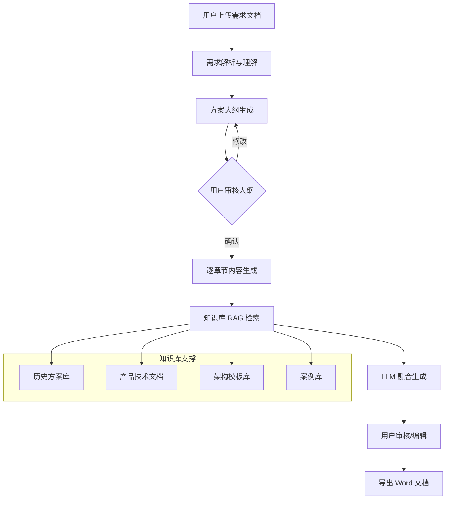

# 方案助手 — 需求设计文档

> 基于九洲 RAG 管理平台的知识库检索能力和标书助手的文档处理架构，构建技术方案自动生成助手。

---

## 一、需求概述

### 1.1 业务背景

在技术投标和项目交付过程中，技术方案编写是高频且高成本的工作。典型场景包括：

- 收到**招标技术需求**后，需编写完整的技术解决方案
- 收到**方案描述/任务书**后，需输出结构化的实施方案
- 客户提出**功能需求清单**后，需产出匹配的技术架构和详细方案

这些工作高度依赖已有的技术积累，包括历史方案、产品文档、技术架构模板等，恰好可以被 RAG 知识库所加速。

### 1.2 核心定位

| 维度 | 标书助手 | 方案助手 |
|---|---|---|
| **输入** | 招标文件（PDF/Word） | 技术需求描述 / 技术标书 |
| **输出** | 商务文件 / 审查报告 | 技术方案文档（Word） |
| **知识库作用** | 查证照、模板、填充公司信息 | **核心引擎**：检索历史方案、产品文档、技术架构作为方案素材 |
| **LLM 作用** | 条款提取、逐项核查 | **核心引擎**：基于检索素材生成结构化技术方案 |

### 1.3 功能简述

> **输入**：一份技术标需求文档（PDF/Word/文本粘贴）
>
> **输出**：一份结构完整的技术方案文档（Word 下载）

---

## 二、核心功能模块

### 2.1 功能流程图



### 2.2 四大核心功能

#### F1: 需求解析

- **输入**：技术标文件（PDF/DOCX）或文本粘贴
- **处理**：
  - 解析文件，提取技术需求条目
  - LLM 识别关键需求分类（功能需求、非功能需求、技术约束、交付要求）
  - 提取关键词用于知识库检索
- **输出**：结构化的需求清单（JSON）
- **复用**：`bid_review.py` 的文档解析流程 + `clause_extractor.py` 的条款提取模式

#### F2: 智能大纲生成

- **输入**：需求清单 + 知识库中匹配的历史方案大纲
- **处理**：
  - RAG 检索知识库中相似场景的历史方案，提取大纲结构
  - LLM 结合需求清单和历史大纲，生成适配的方案大纲
  - 用户可手动调整章节标题、顺序和层级
- **输出**：分层的方案目录结构
- **复用**：`outline_generator.py` 的大纲生成 + `enrich_outline_with_matches` 的知识库匹配模式

#### F3: 逐章节 RAG 内容生成（核心）

- **输入**：方案大纲 + 每章对应的需求条目
- **处理**：
  - 对每个章节，基于标题+需求组合检索查询
  - 从知识库检索相关素材（历史方案段落、产品文档、架构描述）
  - LLM 融合检索素材 + 需求条目 → 生成章节内容
  - SSE 流式输出每个章节的生成进度
- **输出**：每章节的 Markdown 内容
- **复用**：`content_filler.py` 的 `fill_outline_stream` 流式填充模式 + `chat.py` 的 RAG 问答检索逻辑

#### F4: 方案导出

- **输入**：完整的大纲 + 各章内容
- **处理**：
  - 套用方案文档模板（封面、目录、页眉页脚）
  - Markdown → Word 排版转换
  - 插入图表（如果知识库中有匹配的架构图）
- **输出**：格式化的 Word 文档
- **复用**：`docx_exporter.py` 的 Word 导出能力

---

## 三、系统架构

### 3.1 架构图

```
┌────────────────────────────────────────────────────────────┐
│                  Vue 前端 — 方案助手页面                      │
│  ┌──────────┐ ┌──────────┐ ┌──────────┐ ┌──────────────┐  │
│  │ 需求上传  │ │ 大纲编辑  │ │ 章节生成  │ │ 预览/导出    │  │
│  └────┬─────┘ └────┬─────┘ └────┬─────┘ └──────┬───────┘  │
└───────┼────────────┼────────────┼───────────────┼──────────┘
        │ HTTP       │ HTTP       │ SSE           │ HTTP
┌───────┼────────────┼────────────┼───────────────┼──────────┐
│       ▼            ▼            ▼               ▼          │
│  ┌─────────────────────────────────────────────────────┐   │
│  │           api/routers/solution.py                   │   │
│  │  POST /parse    → 需求解析                          │   │
│  │  POST /outline  → 大纲生成                          │   │
│  │  PUT  /outline  → 大纲更新                          │   │
│  │  POST /generate → 内容生成 (SSE)                     │   │
│  │  POST /export   → Word 导出                         │   │
│  │  GET/POST/DELETE /sessions → 会话管理                │   │
│  └─────────────────────────────────────────────────────┘   │
│                         │                                   │
│  ┌──────────────────────┼──────────────────────────────┐   │
│  │     src/solution/    │    (新增核心模块)              │   │
│  │  ┌──────────────┐    │    ┌─────────────────────┐   │   │
│  │  │ requirement_ │    │    │ outline_generator.py │   │   │
│  │  │ parser.py    │    │    └─────────────────────┘   │   │
│  │  └──────────────┘    │    ┌─────────────────────┐   │   │
│  │  ┌──────────────┐    │    │ content_generator.py │   │   │
│  │  │ solution_db  │    │    │ (RAG + LLM 融合)     │   │   │
│  │  │ .py          │    │    └─────────────────────┘   │   │
│  │  └──────────────┘    │    ┌─────────────────────┐   │   │
│  │                      │    │ solution_exporter.py │   │   │
│  │                      │    └─────────────────────┘   │   │
│  └──────────────────────┼──────────────────────────────┘   │
│                         │                                   │
│  ┌──────────────────────┼──────────────────────────────┐   │
│  │           现有基础设施 (复用)                          │   │
│  │  ┌───────────┐ ┌────────────┐ ┌────────────────┐   │   │
│  │  │ RAG 检索   │ │ LLM 调用   │ │ 文档解析器     │   │   │
│  │  │ (Hybrid    │ │ (OpenAI    │ │ (LayoutPDF     │   │   │
│  │  │  Search)   │ │  Stream)   │ │  MarkItDown)   │   │   │
│  │  └───────────┘ └────────────┘ └────────────────┘   │   │
│  └─────────────────────────────────────────────────────┘   │
└────────────────────────────────────────────────────────────┘
```

### 3.2 数据模型

```python
# solution_db.py

@dataclass
class SolutionSession:
    """方案生成会话"""
    id: int = 0
    source_file_path: str = ""       # 上传的需求文件路径
    requirements: list = field(default_factory=list)  # 结构化需求清单
    outline: list = field(default_factory=list)       # 方案大纲
    content: dict = field(default_factory=dict)       # 章节内容 {section_id: markdown}
    project_name: str = ""           # 项目名称
    project_type: str = ""           # 项目类型 (系统集成/软件开发/网络安全/...)
    collection: str = "default"      # 检索的知识库集合名
    status: str = "draft"            # draft | outlining | generating | completed
    created_at: str = ""
    updated_at: str = ""

@dataclass
class Requirement:
    """结构化需求条目"""
    id: str = ""                     # 自动生成
    category: str = ""               # functional | non_functional | constraint | deliverable
    title: str = ""                  # 需求标题
    description: str = ""            # 需求详细描述
    priority: str = "normal"         # high | normal | low
    keywords: list = field(default_factory=list)  # 用于知识库检索的关键词
```

### 3.3 API 接口设计

| 方法 | 路径 | 功能 | 响应方式 |
|---|---|---|---|
| `POST` | `/api/solution/parse` | 上传需求文件并解析 | JSON |
| `POST` | `/api/solution/outline` | 基于需求生成方案大纲 | JSON |
| `PUT` | `/api/solution/outline` | 更新大纲（用户编辑） | JSON |
| `POST` | `/api/solution/generate` | 逐章节生成内容 | **SSE 流** |
| `POST` | `/api/solution/export` | 导出 Word 文档 | FileResponse |
| `GET` | `/api/solution/sessions` | 列出历史会话 | JSON |
| `GET` | `/api/solution/sessions/{id}` | 获取会话详情 | JSON |
| `DELETE` | `/api/solution/sessions/{id}` | 删除会话 | JSON |

---

## 四、与现有系统的集成方式

### 4.1 复用现有模块

| 现有模块 | 在方案助手中的用途 |
|---|---|
| `src/libs/loader/` | 解析上传的需求文件（PDF/DOCX） |
| `src/core/query_engine/` | 混合检索知识库中的历史方案和技术文档 |
| `src/libs/llm/` | 需求理解、大纲生成、内容生成 |
| `src/bid/docx_exporter.py` | Word 文档导出（可扩展或新写） |
| `src/bid/document_db.py` | 会话管理模式（Session + SQLite） |
| `api/deps.py` | `get_llm()`, `get_hybrid_search()` 等依赖注入 |

### 4.2 新增模块清单

| 文件 | 职责 |
|---|---|
| `src/solution/__init__.py` | 包初始化 |
| `src/solution/requirement_parser.py` | 需求文件解析 + LLM 理解 |
| `src/solution/outline_generator.py` | RAG 辅助的大纲生成 |
| `src/solution/content_generator.py` | 逐章节 RAG + LLM 融合内容生成 |
| `src/solution/solution_db.py` | 会话持久化（SQLite） |
| `src/solution/solution_exporter.py` | Word 导出 |
| `api/routers/solution.py` | API 路由层 |
| `web/src/views/SolutionAssistant.vue` | 前端页面 |
| `web/src/components/solution/` | 前端子组件 |

---

## 五、交互流程详细设计

### Step 1: 上传需求文档

```
用户 → 上传 PDF/DOCX 或粘贴文本
      → [POST /api/solution/parse]
      → 返回结构化需求清单
      → 用户可编辑/补充需求条目
```

### Step 2: 生成方案大纲

```
用户 → 选择项目类型 + 检索集合
      → [POST /api/solution/outline]
      → RAG 检索相似历史方案的大纲结构
      → LLM 综合生成适配的大纲
      → 返回可编辑的树形大纲
      → 用户可拖拽调整章节层级和顺序
```

### Step 3: 逐章节内容生成

```
用户 → 确认大纲后点击"开始生成"
      → [POST /api/solution/generate] (SSE)
      → 对每个章节:
         1. 组合 (章节标题 + 对应需求) 构建检索 query
         2. RAG 检索知识库匹配素材 (top_k=5)
         3. LLM 基于 (需求 + 素材 + 上下文) 生成内容
         4. SSE 推送: {section_id, content, progress}
      → 前端实时渲染各章节内容
      → 用户可对任意章节"重新生成"或手动编辑
```

### Step 4: 预览与导出

```
用户 → 选择导出格式 (Word)
      → [POST /api/solution/export]
      → 服务端套用文档模板生成
      → 返回 FileResponse 下载
```

---

## 六、LLM Prompt 设计要点

### 6.1 需求解析 Prompt

```
你是技术方案专家。请分析以下技术标/需求文档的内容，
提取所有技术需求条目，为每个条目标注类型和关键词。

分类规则：
- functional: 功能性需求
- non_functional: 性能/安全/可靠性等非功能需求
- constraint: 技术约束条件（指定平台、协议等）
- deliverable: 交付物要求

输出 JSON 格式...
```

### 6.2 章节内容生成 Prompt

```
你是资深技术方案编写专家。
请根据以下信息编写技术方案的「{章节标题}」章节：

【客户需求】
{该章节对应的需求条目}

【参考素材】（来自知识库检索）
{RAG 检索结果，标注来源}

【编写要求】
1. 内容必须针对客户需求进行定制化回应
2. 可参考素材中的已有方案但不能照搬
3. 使用专业但易懂的技术语言
4. 包含必要的架构图/表格/流程描述
5. 字数控制在 800-1500 字
```

---

## 七、验收标准

| 编号 | 验收项 | 期望结果 |
|---|---|---|
| AC1 | 支持 PDF/DOCX/文本粘贴三种输入方式 | 三种方式均能正确解析 |
| AC2 | 需求解析准确提取功能/非功能/约束需求 | LLM 分类准确率 > 80% |
| AC3 | 大纲生成基于知识库历史方案 | 大纲结构符合行业规范 |
| AC4 | 大纲支持用户手动编辑 | 增删改查章节流畅 |
| AC5 | 逐章内容生成使用 RAG 检索 | 内容引用知识库中相关素材 |
| AC6 | SSE 流式输出，前端实时显示 | 无卡顿，进度可见 |
| AC7 | 导出 Word 格式正确 | 封面/目录/页码/排版完整 |
| AC8 | 会话持久化，支持历史查看 | 刷新后状态不丢失 |

---

## 八、知识库建设建议

为了让方案助手有效工作，知识库中应摄取以下类型文档：

| 文档类型 | 用途 | 建议集合名 |
|---|---|---|
| 历史技术方案 | 提供方案结构和内容参考 | `default` |
| 产品技术白皮书 | 提供产品能力描述 | `products` |
| 技术架构文档 | 提供架构设计参考 | `default` |
| 行业标准/规范 | 提供合规性引用 | `default` |
| 项目案例/业绩 | 提供案例和经验佐证 | `default` |

---

## 九、实施计划

| 阶段 | 任务 | 预估工时 |
|---|---|---|
| P1 | 后端核心模块（`src/solution/` 全部 5 文件） | 2-3 天 |
| P2 | API 路由层（`api/routers/solution.py`） | 0.5 天 |
| P3 | 前端页面（Vue 组件 + 路由 + 交互） | 2-3 天 |
| P4 | 集成测试 + Prompt 调优 | 1-2 天 |
| **总计** | | **6-9 天** |

---

## 十、风险与依赖

| 风险 | 影响 | 缓解措施 |
|---|---|---|
| 知识库内容不足 | 生成的方案质量低 | 先摄取 5-10 份高质量历史方案 |
| LLM 生成质量波动 | 章节内容不够专业 | 精细化 Prompt + 用户可编辑 |
| 长文档生成超 LLM 上下文窗口 | 章节间缺乏连贯性 | 逐章生成 + 传入前文摘要作为上下文 |
