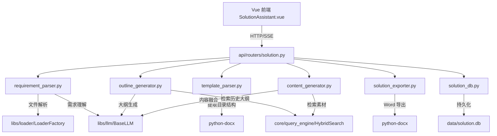
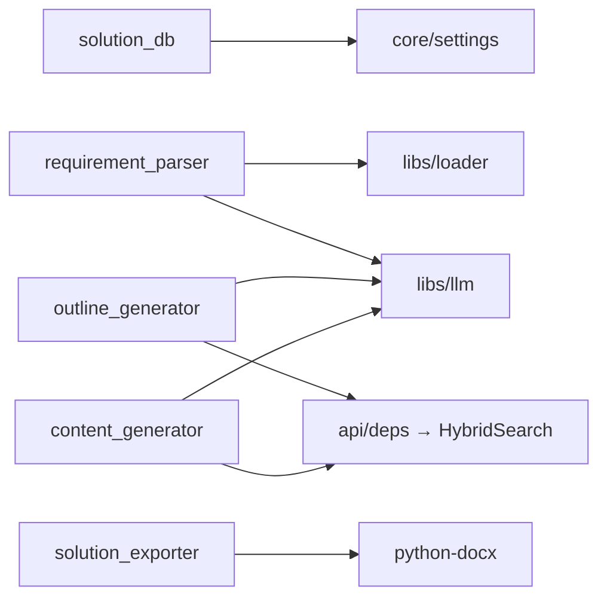

# 方案助手 — 系统设计文档

## 整体架构



## 模块依赖关系



## 数据流

```
需求文件 → [requirement_parser] → 结构化需求 JSON
                                        ↓
                              [outline_generator] ← RAG 检索历史大纲
                                        ↓
                              方案大纲 JSON（用户可编辑）
                                        ↓
                            [content_generator] ← RAG 检索每章素材
                                        ↓
                              章节内容 {section_id: markdown}
                                        ↓
                            [solution_exporter] → Word 文档
```

## 接口契约

### SolutionSession 数据模型

```python
@dataclass
class SolutionSession:
    id: int = 0
    project_name: str = ""
    project_type: str = ""        # 系统集成/软件开发/网络安全/...
    source_file_path: str = ""
    source_text: str = ""         # 粘贴的文本（无文件时）
    template_file_path: str = ""  # 可选：方案模板 Word 路径
    template_outline: str = "[]"  # 从模板提取的大纲结构
    requirements_json: str = "[]" # 结构化需求
    outline_json: str = "[]"      # 方案大纲（可能基于模板）
    content_json: str = "{}"      # {section_id: markdown}
    collection: str = "default"   # 知识库集合
    status: str = "draft"         # draft/outlining/generating/completed
    created_at: float = 0.0
    updated_at: float = 0.0
```

### API 接口

| 端点 | 方法 | 请求体 | 响应 |
|---|---|---|---|
| `/parse` | POST | `{text}` 或 `UploadFile` | `{ok, requirements}` |
| `/upload-template` | POST | `UploadFile (Word)` | `{ok, session_id, template_outline}` |
| `/outline` | POST | `{session_id}` | `{ok, outline}` |
| `/outline` | PUT | `{session_id, outline}` | `{ok}` |
| `/generate` | POST | `{session_id}` | SSE stream |
| `/export` | POST | `{session_id}` | FileResponse |
| `/sessions` | GET | query params | `{ok, records, total}` |
| `/sessions/{id}` | GET | - | `{ok, data}` |
| `/sessions/{id}` | DELETE | - | `{ok}` |

## 异常处理策略

- 文件解析失败 → 返回友好错误信息
- LLM 调用失败 → 章节标记为 `[生成失败]`，不中断整体流程
- RAG 检索无结果 → LLM 仅基于需求描述生成（降级模式）
