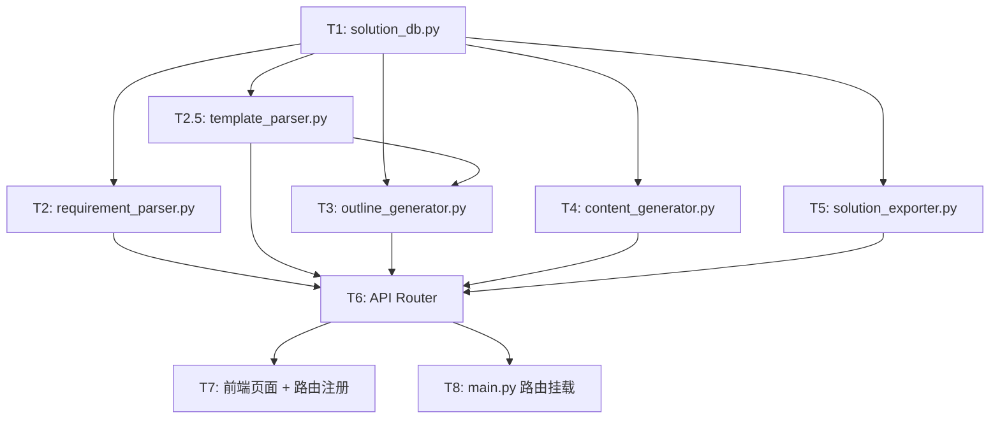

# 方案助手 — 子任务拆分

## 任务依赖图

---

## T1: solution_db.py（会话持久化）

- **输入**：无前置依赖
- **输出**：SolutionSession CRUD 函数
- **实现**：
  - SQLite 表 `solution_sessions`
  - dataclass `SolutionSession` + `to_dict()`
  - 函数：`create_session`, `update_session`, `get_session`, `list_sessions`, `delete_session`
- **复用**：照搬 `src/bid/document_db.py` 的 Session CRUD 模式
- **验收**：可独立运行 CRUD 测试

## T2: requirement_parser.py（需求解析）

- **输入**：T1
- **输出**：`parse_requirements(file_path, llm)` → 结构化需求列表
- **实现**：
  - 调用 `LoaderFactory.create()` 解析 PDF/DOCX
  - LLM Prompt 提取需求条目（functional/non_functional/constraint/deliverable）
  - 返回 `List[Dict]` 含 id/category/title/description/keywords
- **验收**：输入一个 PDF，返回正确分类的需求列表

## T2.5: template_parser.py（模板解析 · 新增）

- **输入**：T1
- **输出**：`parse_template(file_path)` → 大纲结构 JSON
- **实现**：
  - 使用 python-docx 读取 Word 文件
  - 遍历 `document.paragraphs`，按 `Heading 1/2/3` 样式提取标题层级
  - 构建 `[{id, title, level, children}]` 树形结构
  - 保存模板大纲到 session 的 `template_outline` 字段
- **验收**：输入一个带标题的 Word 模板，正确提取出层级大纲

## T3: outline_generator.py（大纲生成）

- **输入**：T1
- **输出**：`generate_outline(requirements, llm, hybrid_search)` → 大纲 JSON
- **实现**：
  - **有模板时**：以 `template_outline` 为骨架，LLM 将需求分配到对应章节
  - **无模板时**：从需求中提取关键词，RAG 检索知识库中相似方案，LLM 生成大纲
  - 大纲结构：`[{id, title, level, requirement_ids, keywords}]`
- **验收**：有模板时大纲与模板目录一致；无模板时自动生成合理大纲

## T4: content_generator.py（逐章内容生成）

- **输入**：T1
- **输出**：`generate_content_stream(session, llm, hybrid_search)` → AsyncGenerator
- **实现**：
  - 遍历大纲每个章节
  - 组合（章节标题 + 对应需求）→ 构建 RAG 检索 query
  - 检索 top_k=5 素材 → LLM 融合生成内容
  - SSE 流式推送 `{type: progress/section/done}`
- **复用**：照搬 `src/bid/content_filler.py` 的 `fill_outline_stream` 模式
- **验收**：SSE 流正常推送各章节内容

## T5: solution_exporter.py（Word 导出）

- **输入**：T1
- **输出**：`export_to_docx(session, output_path)` → Word 文件路径
- **实现**：
  - python-docx 创建文档
  - 封面页（项目名称、日期）
  - 目录（基于大纲层级）
  - 按章节写入 Markdown → Word 段落
- **复用**：参考 `src/bid/docx_exporter.py`
- **验收**：导出的 Word 文件格式正确可打开

## T6: API Router（api/routers/solution.py）

- **输入**：T2-T5
- **输出**：FastAPI 路由
- **实现**：
  - 8 个端点（parse/outline/generate/export/sessions CRUD）
  - SSE StreamingResponse for generate
  - 文件上传 for parse
- **复用**：照搬 `api/routers/bid_document.py` 的模式
- **验收**：cURL/API docs 可调用全部端点

## T7: 前端页面

- **输入**：T6
- **输出**：Vue 组件 + 路由
- **实现**：
  - `web/src/views/SolutionAssistant.vue` 主页面
  - 四步向导式 UI（上传 → 大纲 → 生成 → 导出）
  - Element Plus 组件 + 暗黑毛玻璃风格
- **验收**：前端流程可走通

## T8: main.py 路由挂载

- **输入**：T6
- **输出**：`api/main.py` 中新增 `include_router` 行
- **实现**：一行代码
- **验收**：后端启动能访问 `/api/solution/`
