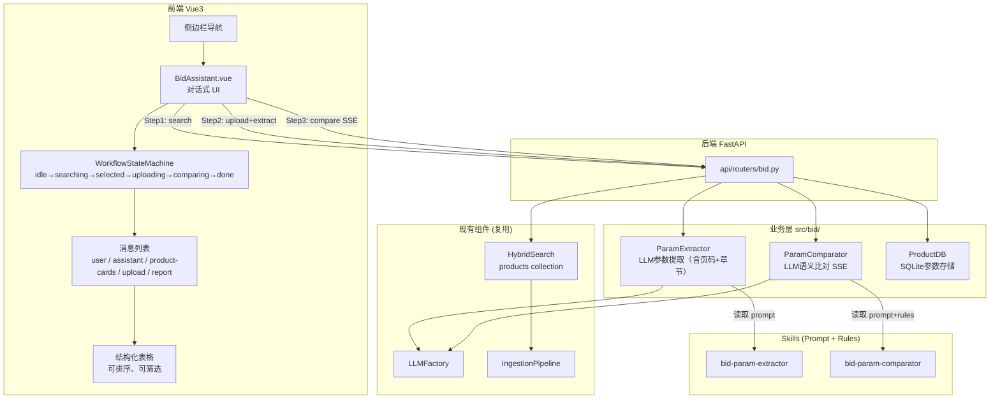
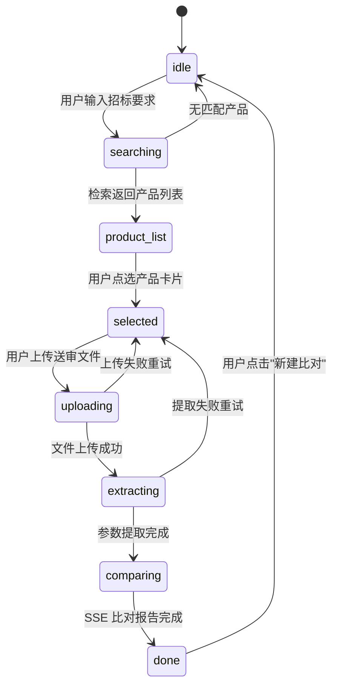
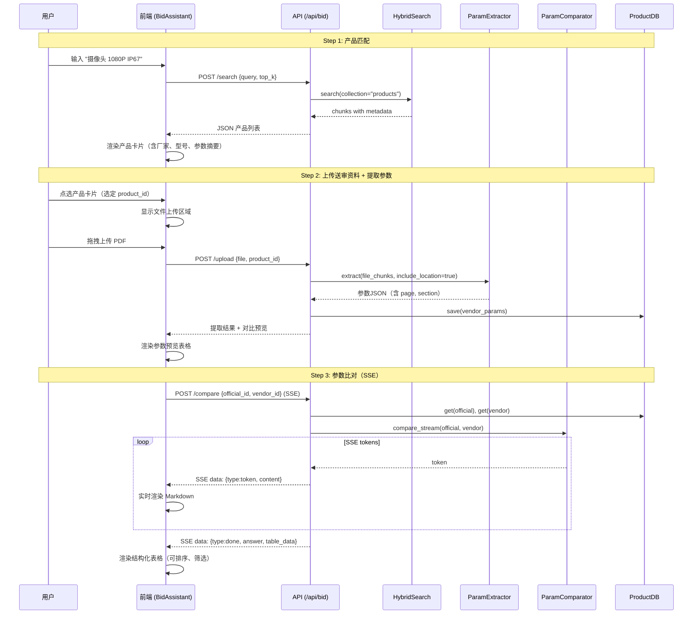

# DESIGN — 需求1：产品技术资料真伪性辨别助手

## 整体架构



## 对话式顺序工作流 — 状态机



## 对话消息类型

前端消息列表不只是纯文本，而是多种类型混合的富消息流：

| 消息类型 | role | 渲染方式 | 触发时机 |
|----------|------|----------|----------|
| `text` | user | 普通对话气泡 | 用户输入招标要求 |
| `product-cards` | assistant | 产品卡片网格（可点选） | Step1 检索结果返回 |
| `upload-prompt` | assistant | 文字 + 文件拖拽区 | 用户选定产品后 |
| `upload-status` | system | 进度条 | 文件上传中 |
| `extract-result` | assistant | 参数预览表格 | 参数提取完成 |
| `compare-stream` | assistant | Markdown 流式渲染 + 光标 | Step3 比对进行中 |
| `compare-report` | assistant | Markdown + 结构化表格（双视图） | 比对完成 |

## 数据流（顺序）



## API 接口定义

### POST /api/bid/search
产品匹配检索。

```jsonc
// Request
{ "query": "摄像头 分辨率1080P IP67", "top_k": 10 }

// Response
{ "ok": true, "data": [
    { "id": "chunk_xxx",
      "product_name": "DS-2CD2T47G2-L",
      "vendor": "海康威视",
      "model": "DS-2CD2T47G2-L",
      "score": 0.95,
      "summary": "400万像素 1/3\" CMOS 2688×1520 IP67 ...",
      "source": "海康威视_DS-2CD2T47G2-L_白皮书.pdf",
      "param_id": 3
    }
]}
```

### POST /api/bid/upload
上传送审资料 + 自动提取参数。

```jsonc
// Request: multipart/form-data
// - file: PDF/DOCX
// - product_id: 选定的官方产品param记录ID（可选）

// Response
{ "ok": true,
  "vendor_param_id": 5,
  "data": {
    "product_name": "...", "vendor": "...", "model": "...",
    "params": [
      { "name": "分辨率", "value": "400万像素", "unit": "",
        "page": 2, "section": "技术规格" }
    ]
  }
}
```

### POST /api/bid/compare
参数比对（SSE 流式）。

```jsonc
// Request
{ "official_id": 3, "vendor_id": 5 }

// Response: SSE stream
data: {"type":"token","content":"## 比对结果\n"}
data: {"type":"token","content":"| 参数项 | ..."}
...
data: {"type":"done","answer":"完整Markdown","table_data":[
  {"param":"分辨率","official":"400万","vendor":"500万",
   "status":"deviation","risk":"high","page":2,"section":"技术规格",
   "note":"送审值优于官方值，疑似虚标"}
]}
```

`table_data` 字段供前端渲染结构化表格（可排序、可筛选）。

### GET /api/bid/params
获取已提取的参数列表。

### DELETE /api/bid/params/{id}
删除参数记录。

## 前端页面布局

```
┌──────────┬──────────────────────────────────────────────────┐
│ 侧边栏   │  标书助手 — 产品技术资料真伪性辨别               │
│          │                                                   │
│ 知识问答 │  ┌─────────────────────────────────────────────┐  │
│ 标书助手◀│  │  [系统] 请输入招标文件中的技术要求...        │  │
│ 知识库构建│  │                                              │  │
│ 数据浏览 │  │  [用户] 摄像头 分辨率1080P IP67               │  │
│ ...      │  │                                              │  │
│          │  │  [系统] 为您找到以下匹配产品：               │  │
│          │  │  ┌──────┐ ┌──────┐ ┌──────┐               │  │
│          │  │  │海康.. │ │大华.. │ │宇视.. │  ← 可点选   │  │
│          │  │  └──────┘ └──────┘ └──────┘               │  │
│          │  │                                              │  │
│          │  │  [系统] 已选定海康DS-xxx，请上传送审资料     │  │
│          │  │  ┌─────────────────────┐                    │  │
│          │  │  │  📄 拖拽上传 PDF    │                    │  │
│          │  │  └─────────────────────┘                    │  │
│          │  │                                              │  │
│          │  │  [系统] 比对报告（流式输出中...▌）           │  │
│          │  │  | 参数 | 官方 | 送审 | 状态 | 风险 |       │  │
│          │  │  |------|------|------|------|------|       │  │
│          │  │                                              │  │
│          │  │  ── 结构化表格 ─────────────────            │  │
│          │  │  [可排序/筛选的 el-table]                    │  │
│          │  └─────────────────────────────────────────────┘  │
│          │  ┌───────────────────────────────────┐ [发送]    │
│          │  │  输入招标技术要求...                │           │
│          │  └───────────────────────────────────┘           │
└──────────┴──────────────────────────────────────────────────┘
```

## 异常处理

| 异常场景 | 处理方式 |
|----------|----------|
| 产品知识库为空 | 系统消息提示"产品知识库暂无数据，请先通过摄取管理上传产品资料" |
| 无匹配产品 | 系统消息"未找到匹配产品，请调整技术要求重试" |
| 文件上传失败 | 错误消息 + 保持在 selected 状态可重试 |
| LLM 提取失败 | 系统消息"参数提取失败" + 保持在 selected 状态 |
| SSE 断连 | 前端自动重连 |
| 文件类型不支持 | 上传前校验，只允许 PDF/DOCX |
