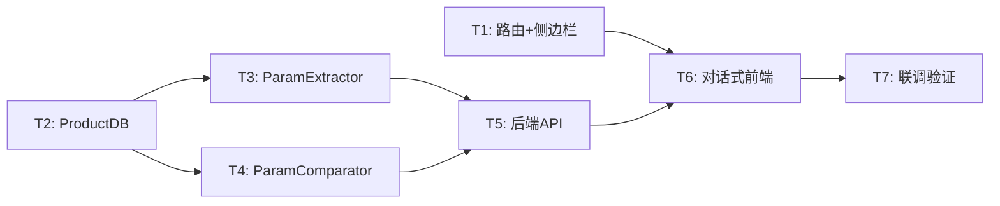

# TASK — 需求1：产品技术资料真伪性辨别助手

## 任务依赖图

---

## T1: 前端路由 + 侧边栏入口

- **输入**：现有 `router/index.ts`、`AppSidebar.vue`
- **输出**：新增 `/bid` 路由，侧边栏"标书助手"入口
- **验收**：点击"标书助手"能跳转到占位页面
- **约束**：排在"知识问答"之后；不影响其他路由
- **状态**：✅ 已完成（前次实现，路由和侧边栏改动正确）

## T2: 产品参数 SQLite 存储

- **输入**：无外部依赖
- **输出**：`src/bid/product_db.py`
- **验收**：CRUD 产品参数记录，支持按 doc_type 筛选
- **约束**：DB 文件 `data/bid_params.db`；参数含 `page`、`section` 字段
- **状态**：⚠️ 需改造（前次实现不含 page/section 字段）

## T3: 参数提取器（含页码+章节）

- **输入**：T2，Skill `bid-param-extractor`
- **输出**：`src/bid/param_extractor.py`
- **验收**：传入 chunk 文本及 chunk 元数据（页码），返回参数 JSON（含 page、section）
- **约束**：读取 Skill prompt 模板；prompt 需要求 LLM 输出 page 和 section
- **状态**：⚠️ 需改造（前次实现不提取页码/章节）

## T4: 参数比对器（含 table_data）

- **输入**：T2，Skill `bid-param-comparator`
- **输出**：`src/bid/param_comparator.py`
- **验收**：流式输出 Markdown 偏差报告；结束时输出结构化 `table_data` JSON
- **约束**：table_data 包含 param/official/vendor/status/risk/page/section/note
- **状态**：⚠️ 需改造（前次实现缺少 table_data 结构化输出）

## T5: 后端 API 路由

- **输入**：T3，T4
- **输出**：`api/routers/bid.py`
- **接口**：
  - `POST /api/bid/search` — 产品检索
  - `POST /api/bid/upload` — **文件上传 + 参数提取**（multipart/form-data）
  - `POST /api/bid/compare` — SSE 流式比对（done 事件含 table_data）
  - `GET /api/bid/params` — 参数列表
  - `DELETE /api/bid/params/{id}` — 删除记录
- **验收**：所有端点可调通，upload 支持 PDF/DOCX
- **状态**：⚠️ 需重写（前次是表单式 API，现需支持 file upload + 对话工作流）

## T6: 对话式前端页面

- **输入**：T1，T5 的 API
- **输出**：`web/src/views/BidAssistant.vue`
- **验收**：
  - 对话式 UI（类似 ChatView），暗黑毛玻璃风格
  - 状态机驱动：idle → searching → product_list → selected → uploading → comparing → done
  - 富消息类型：文本、产品卡片（可点选）、文件上传区、参数预览表、Markdown 流式、结构化表格
  - 底部输入框 + 发送按钮
- **约束**：参考 ChatView.vue 的 UI 模式；复用设计 token
- **状态**：❌ 需重写（前次是 Tab 表单式，不符合需求）

## T7: 联调验证

- **输入**：T5，T6
- **验收**：完整走通顺序工作流（输入需求→选产品→上传→比对报告）
- **状态**：待实施
