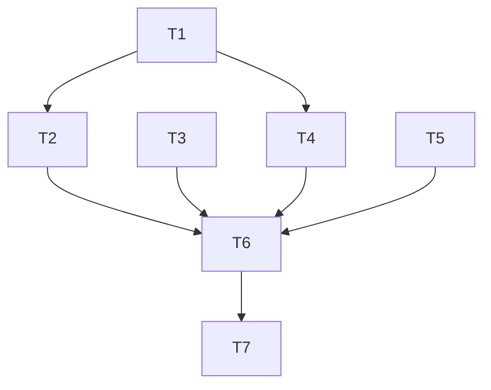

# TASK: 检索增强优化 (Parent Retrieval & GraphRAG)

## 任务分解

### T1: 配置与基础契约扩展 [READY]
- **输入**: `DESIGN_检索增强优化.md`
- **主要工作**:
  - 修改 `src/core/settings.py`: 增加 `parent_retrieval` 与 `graph_rag` 的配置项。
  - 修改 `src/core/types.py`: 确保 `Chunk` metadata 支持 `parent_id`, `graph_context` 等。
- **输出**: 更新后的配置与数据契约。

### T2: HierarchicalChunker 实现 [READY]
- **输入**: T1 完成
- **主要工作**:
  - 新建 `src/ingestion/chunking/hierarchical_chunker.py`。
  - 实现二级切分逻辑，并自动为子块打上 `parent_id` 标签。
- **输出**: 可并发生成的层级分块器。

### T3: ParentStorage 实现 [READY]
- **主要工作**:
  - 新建 `src/ingestion/storage/parent_store.py`。
  - 基于 SQLite 实现对 Parent Chunk 文本的高性能持久化。
- **输出**: 支持 ID 索引的文本存储器。

### T4: GraphExtractor 提取器实现 [DEPENDS: T1]
- **主要工作**:
  - 新建 `src/ingestion/transform/graph_extractor.py`。
  - 利用 LLM 实现对文本 Chunk 中实体与关系的三元组提取逻辑。
- **输出**: LLM 驱动的关系提取组件。

### T5: GraphStore 实现 [READY]
- **主要工作**:
  - 新建 `src/ingestion/storage/graph_store.py`。
  - 实现基于 SQLite 的简单图数据库（Entities & Relationships 表）。
- **输出**: 具备 1-2 跳邻居查询能力的图存储器。

### T6: IngestionPipeline 集成 [DEPENDS: T2, T3, T4, T5]
- **主要工作**:
  - 修改 `src/ingestion/pipeline.py`。
  - 串联上述所有新组件，实现全自动的“图谱提取 + 父块存储”入库。
- **输出**: 升级后的数据摄取引擎。

### T7: HybridSearch 检索逻辑升级 [READY]
- **主要工作**:
  - 修改 `src/core/query_engine/hybrid_search.py`。
  - 集成 GraphSearch 结果。
  - 集成 Parent Retrieval 的 Context 扩展逻辑。
- **输出**: 支持深度关联的混合检索引擎。

## 依赖图

