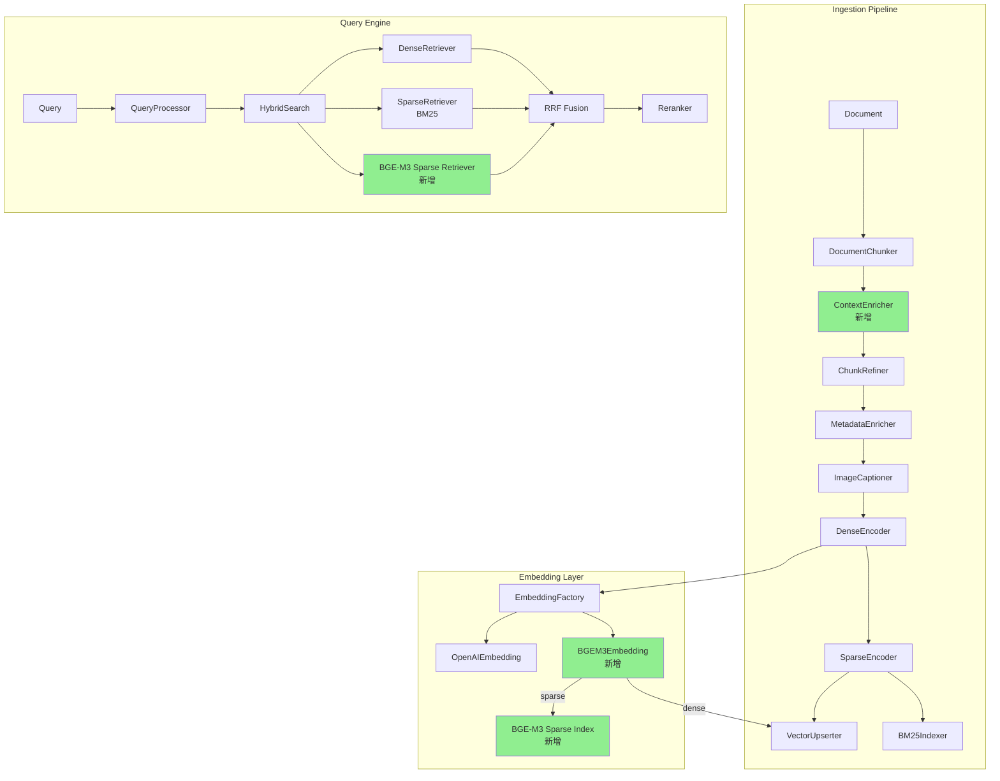
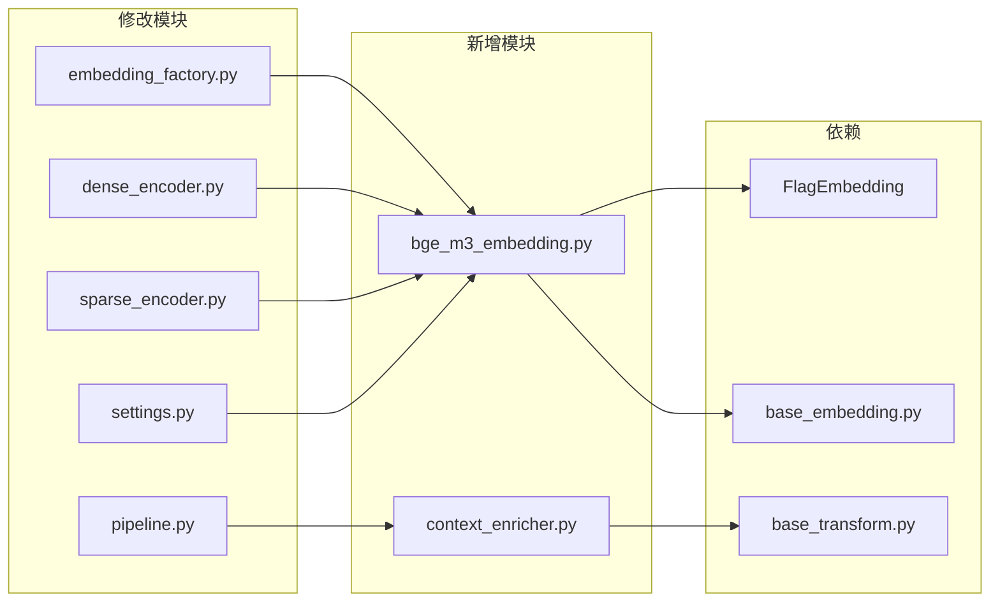
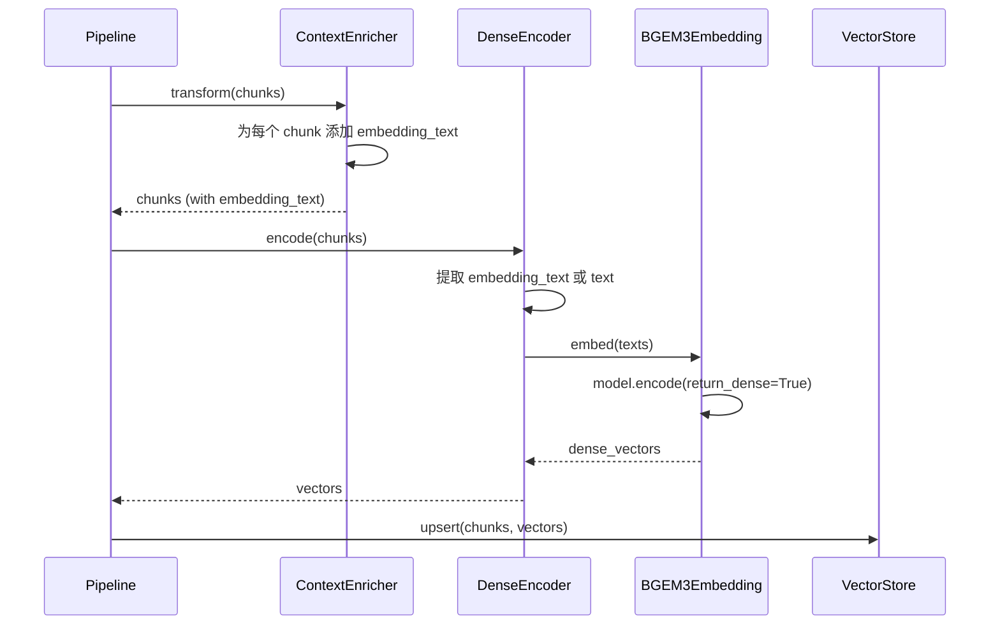

# DESIGN: 检索增强优化

> 6A 工作流 - Phase 2: Architect（架构阶段）
> 创建时间：2026-03-17

---

## 1. 整体架构图



---

## 2. 分层设计

### 2.1 Libs 层（可插拔工具）

```
src/libs/embedding/
├── base_embedding.py          # 抽象基类（现有）
├── embedding_factory.py       # 工厂（现有，需注册新 provider）
├── openai_embedding.py        # OpenAI Provider（现有）
└── bge_m3_embedding.py        # 【新增】BGE-M3 Provider
```

### 2.2 Ingestion 层（入库流程）

```
src/ingestion/
├── transform/
│   ├── base_transform.py      # 抽象基类（现有）
│   ├── context_enricher.py    # 【新增】上下文注入
│   └── ...
├── embedding/
│   ├── dense_encoder.py       # 【修改】支持 embedding_text
│   └── sparse_encoder.py      # 【修改】支持 BGE-M3 sparse
└── pipeline.py                # 【修改】添加 ContextEnricher
```

### 2.3 Core 层（查询引擎）

```
src/core/query_engine/
├── hybrid_search.py           # 【修改】支持三路融合
└── ...
```

---

## 3. 核心组件设计

### 3.1 BGEM3Embedding

```python
# src/libs/embedding/bge_m3_embedding.py

class BGEM3Embedding(BaseEmbedding):
    """BGE-M3 Embedding Provider - Dense + Learned Sparse 双输出"""
    
    def __init__(self, settings: Settings, **kwargs):
        """
        配置项:
        - settings.embedding.bge_m3.model: str = "BAAI/bge-m3"
        - settings.embedding.bge_m3.use_fp16: bool = True
        - settings.embedding.bge_m3.device: str = "auto"
        """
        self._model: Optional[BGEM3FlagModel] = None
        self._config = settings.embedding.bge_m3
    
    def embed(self, texts: List[str], **kwargs) -> List[List[float]]:
        """返回 dense 向量（兼容 BaseEmbedding 接口）"""
        output = self._get_model().encode(texts, return_dense=True, return_sparse=False)
        return output["dense_vecs"].tolist()
    
    def embed_with_sparse(
        self, texts: List[str], **kwargs
    ) -> Tuple[List[List[float]], List[Dict[int, float]]]:
        """同时返回 dense + sparse"""
        output = self._get_model().encode(texts, return_dense=True, return_sparse=True)
        return output["dense_vecs"].tolist(), output["lexical_weights"]
    
    def get_dimension(self) -> int:
        return 1024
    
    def _get_model(self) -> BGEM3FlagModel:
        """懒加载模型"""
        if self._model is None:
            self._model = BGEM3FlagModel(
                self._config.model,
                use_fp16=self._config.use_fp16,
                device=self._config.device,
            )
        return self._model
```

### 3.2 ContextEnricher

```python
# src/ingestion/transform/context_enricher.py

class ContextEnricher(BaseTransform):
    """在 chunk 嵌入前注入文档上下文前缀"""
    
    def __init__(self, settings: Settings):
        self.enabled = getattr(
            getattr(settings, 'ingestion', None),
            'context_enricher', {}
        ).get('enabled', True)
    
    def transform(
        self, chunks: List[Chunk], trace: Optional[TraceContext] = None
    ) -> List[Chunk]:
        if not self.enabled:
            return chunks
        
        for chunk in chunks:
            prefix = self._build_prefix(chunk)
            chunk.metadata["embedding_text"] = prefix + chunk.text
        
        return chunks
    
    def _build_prefix(self, chunk: Chunk) -> str:
        """构建上下文前缀"""
        source_path = chunk.metadata.get("source_path", "")
        if source_path:
            filename = Path(source_path).stem
            return f"[文档: {filename}] "
        return ""
```

### 3.3 DenseEncoder 修改

```python
# src/ingestion/embedding/dense_encoder.py

def encode(self, chunks: List[Chunk], trace=None) -> List[List[float]]:
    # 优先使用 embedding_text，fallback 到 text
    texts = [
        chunk.metadata.get("embedding_text", chunk.text)
        for chunk in chunks
    ]
    return self.embedding.embed(texts)
```

---

## 4. 模块依赖关系图



---

## 5. 接口契约定义

### 5.1 BGEM3Embedding 接口

```python
class BGEM3Embedding(BaseEmbedding):
    def embed(self, texts: List[str], **kwargs) -> List[List[float]]:
        """
        输入: texts - 文本列表
        输出: List[List[float]] - dense 向量列表，每个 1024 维
        异常: RuntimeError - 模型加载或推理失败
        """
    
    def embed_with_sparse(
        self, texts: List[str], **kwargs
    ) -> Tuple[List[List[float]], List[Dict[int, float]]]:
        """
        输入: texts - 文本列表
        输出: 
          - dense: List[List[float]] - dense 向量
          - sparse: List[Dict[int, float]] - token_id → weight 映射
        异常: RuntimeError - 模型加载或推理失败
        """
    
    def get_dimension(self) -> int:
        """返回 1024"""
```

### 5.2 ContextEnricher 接口

```python
class ContextEnricher(BaseTransform):
    def transform(
        self, chunks: List[Chunk], trace: Optional[TraceContext] = None
    ) -> List[Chunk]:
        """
        输入: chunks - Chunk 列表
        输出: chunks - 同一列表，metadata 中添加 embedding_text
        副作用: chunk.metadata["embedding_text"] = prefix + chunk.text
        """
```

### 5.3 配置接口

```yaml
# config/settings.yaml

embedding:
  provider: "bge-m3"  # 或 "openai"
  bge_m3:
    model: "BAAI/bge-m3"
    use_fp16: true
    device: "auto"  # auto/cpu/cuda

ingestion:
  context_enricher:
    enabled: true
```

---

## 6. 数据流向图



---

## 7. 异常处理策略

| 场景 | 处理方式 |
|------|---------|
| FlagEmbedding 未安装 | 工厂创建时抛出 ImportError，提示安装 |
| 模型下载失败 | 懒加载时抛出 RuntimeError，记录详细错误 |
| GPU 不可用 | 自动 fallback 到 CPU（device="auto"） |
| 空文本输入 | BaseEmbedding.validate_texts() 抛出 ValueError |
| embedding_text 缺失 | DenseEncoder fallback 到 chunk.text |
| ContextEnricher 禁用 | 直接返回原 chunks，不做任何修改 |

---

## 8. 与现有系统的兼容性

| 组件 | 兼容性说明 |
|------|-----------|
| ChromaDB | BGE-M3 输出 1024 维，与现有 text-embedding-v3 一致 |
| BM25Indexer | 保持不变，BGE-M3 sparse 独立存储 |
| HybridSearch | 可选启用 BGE-M3 sparse 通道 |
| Reranker | 无影响，输入仍是 RetrievalResult |
| 现有测试 | 保持 openai provider 为默认，现有测试不受影响 |

---

**架构设计完成**，进入原子化任务拆分阶段。
