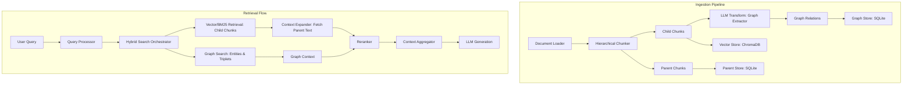

# DESIGN: 检索增强优化 (Parent Retrieval & GraphRAG)

## 1. 整体架构图



## 2. 详细设计

### 2.1 Parent Document Retriever
- **HierarchicalChunker**: 负责二级切分。先切大的（Parent），再在每个大的里面切小的（Child）。
- **ParentStore**: 实现一个本地 KV 存储，以 `doc_id:parent_seq` 为键，保存父块的纯文本。
- **ContextExpander**: 检索后处理逻辑。如果检索结果中的 `score > threshold`，则通过其 `parent_id` 替换为父块文本，确保给 LLM 的 context 逻辑完整。

### 2.2 GraphRAG
- **GraphTransformer**: Transform 阶段的新阶段。并行调用 LLM 提取当前 Chunk 的关键实体和关系（Subject-Predicate-Object）。
- **GraphStore (SQLite)**:
  - `entities` 表: id, name, type, metadata
  - `relationships` 表: source_id, target_id, relation_type, weight, doc_id
- **GraphSearch**: 提取 Query 关键词，在图中查找邻接节点。

## 3. 配置扩展 (settings.yaml)
```yaml
retrieval:
  parent_retrieval:
    enabled: true
    parent_chunk_size: 2000
    child_chunk_size: 400
  graph_rag:
    enabled: true
    extraction_model: "qwen-plus" # 使用更强的模型进行提取
    max_hops: 1
```

## 4. 后期集成
- 修改 `IngestionPipeline` 以串联 Hierarchy 分块和 Graph 提取。
- 修改 `HybridSearch` 以在 Rerank 前/后执行上下文扩展。
