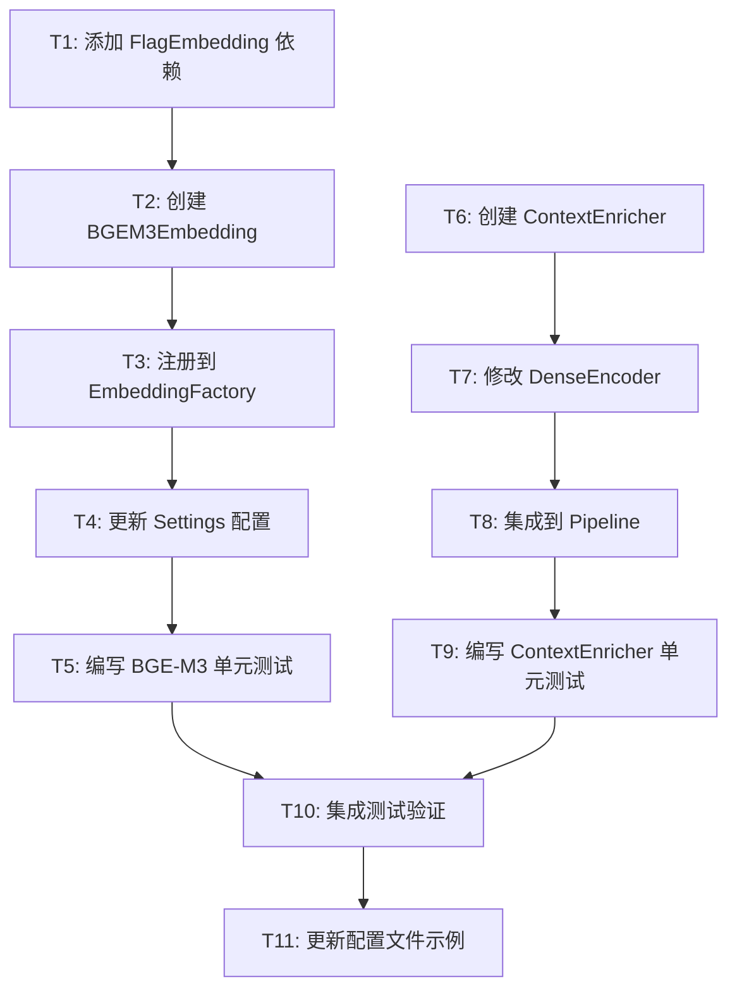

# TASK: 检索增强优化

> 6A 工作流 - Phase 3: Atomize（原子化阶段）
> 创建时间：2026-03-17

---

## 任务依赖图



---

## T1: 添加 FlagEmbedding 依赖

### 输入契约
- 前置依赖：无
- 输入数据：`pyproject.toml`
- 环境依赖：Python 3.10+

### 输出契约
- 输出数据：更新后的 `pyproject.toml`
- 交付物：依赖声明
- 验收标准：`pip install -e .` 可安装 FlagEmbedding

### 实现约束
- 添加到 `[project.optional-dependencies]` 的 `ml` 组
- 版本约束：`FlagEmbedding>=1.2.0`

### 依赖关系
- 后置任务：T2
- 并行任务：T6

---

## T2: 创建 BGEM3Embedding

### 输入契约
- 前置依赖：T1 完成
- 输入数据：`base_embedding.py` 接口定义
- 环境依赖：FlagEmbedding 已安装

### 输出契约
- 输出数据：`src/libs/embedding/bge_m3_embedding.py`
- 交付物：完整的 BGEM3Embedding 类
- 验收标准：
  - 继承 BaseEmbedding
  - 实现 `embed()` 返回 dense 向量
  - 实现 `embed_with_sparse()` 返回 dense + sparse
  - 实现 `get_dimension()` 返回 1024
  - 懒加载模型

### 实现约束
- 遵循现有 OpenAIEmbedding 代码风格
- 支持 device 配置（auto/cpu/cuda）
- 支持 use_fp16 配置
- 使用 hf-mirror.com 镜像

### 依赖关系
- 后置任务：T3
- 并行任务：无

---

## T3: 注册到 EmbeddingFactory

### 输入契约
- 前置依赖：T2 完成
- 输入数据：`embedding_factory.py`
- 环境依赖：无

### 输出契约
- 输出数据：更新后的 `embedding_factory.py`
- 交付物：`bge-m3` provider 注册
- 验收标准：`EmbeddingFactory.list_providers()` 包含 `bge-m3`

### 实现约束
- 在 `_register_builtin_providers()` 中添加
- 使用 try/except 处理 ImportError

### 依赖关系
- 后置任务：T4
- 并行任务：无

---

## T4: 更新 Settings 配置

### 输入契约
- 前置依赖：T3 完成
- 输入数据：`src/core/settings.py`
- 环境依赖：无

### 输出契约
- 输出数据：更新后的 `settings.py`
- 交付物：`BGEM3Config` dataclass
- 验收标准：`settings.embedding.bge_m3` 可访问

### 实现约束
- 添加 `BGEM3Config` dataclass
- 字段：model, use_fp16, device
- 默认值合理

### 依赖关系
- 后置任务：T5
- 并行任务：无

---

## T5: 编写 BGE-M3 单元测试

### 输入契约
- 前置依赖：T4 完成
- 输入数据：BGEM3Embedding 类
- 环境依赖：pytest

### 输出契约
- 输出数据：`tests/unit/test_bge_m3_embedding.py`
- 交付物：完整测试用例
- 验收标准：
  - 测试 embed() 返回正确维度
  - 测试 embed_with_sparse() 返回 tuple
  - 测试 get_dimension() 返回 1024
  - 测试空输入异常
  - 测试工厂创建

### 实现约束
- 使用 mock 避免实际加载模型
- 遵循现有测试风格

### 依赖关系
- 后置任务：T10
- 并行任务：T9

---

## T6: 创建 ContextEnricher

### 输入契约
- 前置依赖：无
- 输入数据：`base_transform.py` 接口定义
- 环境依赖：无

### 输出契约
- 输出数据：`src/ingestion/transform/context_enricher.py`
- 交付物：完整的 ContextEnricher 类
- 验收标准：
  - 继承 BaseTransform
  - 实现 `transform()` 方法
  - 为 chunk 添加 `embedding_text` metadata
  - 支持 enabled 配置

### 实现约束
- 遵循现有 ChunkRefiner 代码风格
- 前缀格式：`[文档: {filename}] `
- 从 source_path 提取文件名

### 依赖关系
- 后置任务：T7
- 并行任务：T1, T2, T3, T4

---

## T7: 修改 DenseEncoder

### 输入契约
- 前置依赖：T6 完成
- 输入数据：`dense_encoder.py`
- 环境依赖：无

### 输出契约
- 输出数据：更新后的 `dense_encoder.py`
- 交付物：支持 embedding_text 的 encode 方法
- 验收标准：优先使用 `chunk.metadata["embedding_text"]`

### 实现约束
- 最小改动原则
- fallback 到 chunk.text

### 依赖关系
- 后置任务：T8
- 并行任务：无

---

## T8: 集成到 Pipeline

### 输入契约
- 前置依赖：T7 完成
- 输入数据：`pipeline.py`
- 环境依赖：无

### 输出契约
- 输出数据：更新后的 `pipeline.py`
- 交付物：ContextEnricher 集成
- 验收标准：Pipeline 执行时调用 ContextEnricher

### 实现约束
- 在 ChunkRefiner 之前调用
- 支持配置禁用

### 依赖关系
- 后置任务：T9
- 并行任务：无

---

## T9: 编写 ContextEnricher 单元测试

### 输入契约
- 前置依赖：T8 完成
- 输入数据：ContextEnricher 类
- 环境依赖：pytest

### 输出契约
- 输出数据：`tests/unit/test_context_enricher.py`
- 交付物：完整测试用例
- 验收标准：
  - 测试前缀注入
  - 测试 embedding_text 生成
  - 测试空 source_path 处理
  - 测试 enabled=False 跳过

### 实现约束
- 遵循现有测试风格

### 依赖关系
- 后置任务：T10
- 并行任务：T5

---

## T10: 集成测试验证

### 输入契约
- 前置依赖：T5, T9 完成
- 输入数据：所有新增/修改代码
- 环境依赖：pytest

### 输出契约
- 输出数据：测试报告
- 交付物：所有测试通过
- 验收标准：
  - 新增测试全部通过
  - 现有测试不受影响
  - ruff lint 通过

### 实现约束
- 运行完整测试套件

### 依赖关系
- 后置任务：T11
- 并行任务：无

---

## T11: 更新配置文件示例

### 输入契约
- 前置依赖：T10 完成
- 输入数据：`config/settings.yaml`
- 环境依赖：无

### 输出契约
- 输出数据：更新后的 `settings.yaml`
- 交付物：BGE-M3 和 ContextEnricher 配置示例
- 验收标准：配置注释清晰

### 实现约束
- 保持 openai 为默认 provider
- 添加 bge-m3 配置注释

### 依赖关系
- 后置任务：无
- 并行任务：无

---

## 任务复杂度评估

| 任务 | 复杂度 | 预估时间 | 风险 |
|------|--------|---------|------|
| T1 | 低 | 5min | 低 |
| T2 | 高 | 30min | 中（模型加载） |
| T3 | 低 | 5min | 低 |
| T4 | 中 | 15min | 低 |
| T5 | 中 | 20min | 低 |
| T6 | 中 | 15min | 低 |
| T7 | 低 | 10min | 低 |
| T8 | 低 | 10min | 低 |
| T9 | 中 | 15min | 低 |
| T10 | 中 | 15min | 中（集成问题） |
| T11 | 低 | 5min | 低 |

**总计**：约 2.5 小时

---

## 执行顺序

```
批次1（并行）: T1, T6
批次2（串行）: T2 → T3 → T4 → T5
批次3（串行）: T7 → T8 → T9
批次4（串行）: T10 → T11
```

---

**任务拆分完成**，进入审批阶段。
