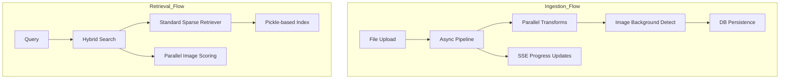

# DESIGN - 检索性能综合优化

## 1. 整体架构设计
本次优化聚焦于“数据摄取(Ingestion)”与“检索执行(Retrieval)”两个核心链路的提速。

## 2. 核心组件设计

### 2.1 BM25 接口标准化
- **协议**: `BaseSparseRetriever` (src/core/query_engine/sparse/base.py)
- **实现**: `SparseRetriever` (src/core/query_engine/sparse/sparse_retriever.py)
- **持久化**: 使用 `pickle` 协议，配合临时文件 + `os.replace` 实现原子写入。

### 2.2 Ingestion 异步流水线
- **模式**: 生产者-消费者模型（内部使用 `asyncio.gather` 对不同块的 Transform 进行扇出）。
- **进度通知**: 注入 `on_progress_async` 回调，适配 SSE 队列。

### 2.3 图像预处理
- **下沉**: 背景检测逻辑从 `chat.py` 移动至 `ImageStorage`。
- **字段**: 在 `image_index` 表中增加 `is_background` 整数/布尔字段。

## 3. 异常处理策略
- BM25 加载失败时自动退回至空索引并记录 Warning。
- Ingestion 子任务失败时标记该片段错误但不中断整体 Pipeline。
- 持久化过程采用事务或原子替换，避免损坏现有数据。
